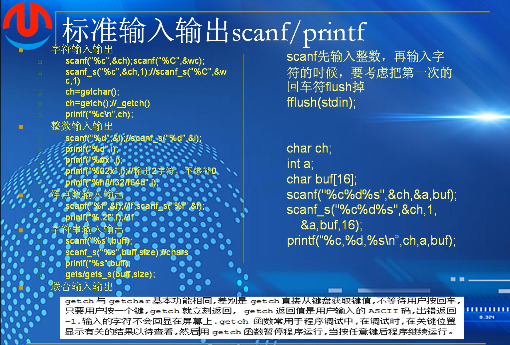

# 第六个：输入输出  stdio



scanf 输入  printf  输出

```
#pragma warning(disable : 4996)

int main(int argc, _TCHAR* argv[])
{
	char c;
	wchar_t wc;

	short s;
	int i;
	long 1;

	//float f;
	//double d;

	//char buf[80] = {0};

	printf("Please input a character:\n");
	//scanf("%c", &c);
	scanf_s("%c", &c, 1);  //只能用在windos平台
	printf("%c\n", c);

	fflush(stdin); //清空回车键

	printf("Please input a another character:\n");
	scanf("%C", &wc);  //宽字符，大写的C,或者wc也可以
	printf("%wc\n", wc);  

	scanf_s("%c", &c, 1);

	fflush(stdin);

	   printf("please input a char\n");
	char c1 = getch();//不会显示在屏幕上 ,a
	prindf("plesse int input a char\m");
	char c2 = getchar();

	printf("c1:%c,c2:%c\n",233,c2);
	fflush(stdin);

	return 0;
}

```

其中scanf会提示4996的错误，调用scanf可能会导致数据溢出带来的安全风险。


输出16进制前缀的整数

%#x\n 即可，如果想用0补充位数不够显示的，比如15转化为16进制为f，想要显示0f就"%02x\n"

输出64位整数

`__int64 value=100I64`

`printf("%I64d\n",value)`

hd，短整型。d，标准整形。ld，长整型

无符号：%u 来打印

%f 单精度浮点数   %lf 双精度浮点数  %.7lf  保留到7位双精度浮点数

```
#include <stdio.h>
#pragma warning(disable : 4996)

int main(int argc)
{
	//char c;
	//wchar_t wc;
	//float f;
	//double d;

	char buf[80] = {0};

	printf("Please input a string:\n");
		scanf("%s", buf);    //数组名称代表了内存地址，之前的所有数都需要取内存地址输入
		printf("%s\n", buf); //scanf函数遇到空格即退出函数，


	return 0;
}

```

浮点数和整数可以不设定长度，因为长度固定且已知

字符，字符串等都需要设定长度，如果输入超过设定长度的数，那么多出来的数会破坏原本存储在内存空间里的其他的数据，导致其他破坏

scanf_s("%s,buf,80")

gets_s("%s,buf,80")

```
#include <stdio.h>
#pragma warning(disable : 4996)

int main(int argc)
{
	char c;
	wchar_t C;

	short s;
	int i;
	long l;
	__int64 value = 100I64;

	float f;
	double d;

	char buf[80] = {0};

	printf("Please input the data:\n");
	scanf("%c%hd%d%ld%I64d%f%lf%s",&c,&s,&i,&l,&value,&f,&d,buf);
	printf("c:%c s:%hd i:%d l:%ld value:%I64d f:%f lf:%lf buf:%s\n",
		c, s, i, l, value, f, d, buf);

	return 0;
}

```

多重输出，加宽字节会出bug导致无法输出。


fd，文件描述符表，每个进程独立拥有的指向任何一打开的文件，管道，设备等任何资源的引用或句柄，一种资源调配的数字编号


1.输入一个变量需要用取值符&获取其内存地址，字符串不需要，字符串的数组存储在计算机

2.scanf函数调用"%ws"或"%S",用w加s或者大写s来输入，printf("%S")同样用%S来表示输出

3.scanf不检测缓存区，只将输入值原封不动导入，如果大于其原本设置的内存长度，会挤压其内存空间中其他数据，导致数据错误等安全问题。scanf_s能够检测缓存区，比scanf更安全

溢出检测

4.scanf遇到空格即会退出函数，gets会包括空格一起输入

5.gets与gets_s和scanf与scanf_s一样，是否检测缓存区的问题

6.getch不显示输入字符，按下任意一个键即返回.

getchar显示输入字符，需要按下回车键才返回

7._getch是新的安全的函数,安全在哪：1.函数内部对线程的调动上锁，防止字符或者字节在调用的过程中被不同线程影响。2.两次不同的调用，来增加安全

8.代码中某些函数过时，有安全风险，没有安全检测，容易产生安全漏洞
