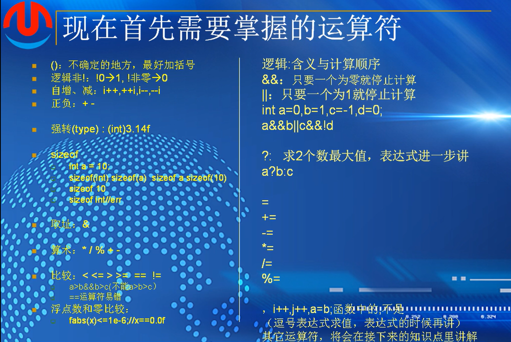
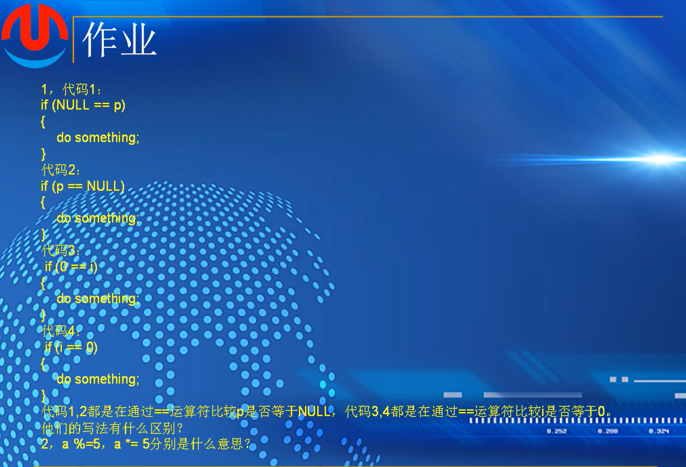

# 第七课  (1):运算符

运算符是指对特定类型的变量或者常量要进行的操作，在运算符中被操作的变量或者常量叫做操作数。只有一个操作数的运算符叫单目运算符，只有两个操作数的叫双目运算符，有三个操作数的叫三目运算符。

举例：

```
&，++，！，~ 都是单目运算符
sizeof也是单目运算符
+ - * / 就是一种二目运算符
？： 唯一的三目运算符
```



### 逻辑非

!false  !FALSE   !0

true

!-1,!1,!2

false

自增，自减：I++,++i,i--,--i

### i++和i--

1,c语言的内建型别：

i++；

++i；是没有任何区别的，单独形成语句，都是把i进行+1操作

2.c++里

如果i是一个对象，不是内建型别，++i的效率要比i++要高

3.在复合表达式或者赋值语句里：

int i=0;

int a = i++;  先把i的值赋值给a，然后再对i进行相加// a = i ; i = i + 1  ---.  a = 0 , i = 1

int i=0; 

int b = ++i;  // i = i + 1  ; b = i ;   --->  b == 1,i == 1

4.函数中：

int i=0;

printf("i:%d\n",i++);

i = 0;

printf("i:%d\n",++i);

i = 0;

printf("%d %d\n",i++,++i);  // 不同的编译器产生的结果不一样

### 强转

(int)3.14f  -->浮点转整数

### sizeof  用来计算类型，变量，常量的长度

如图，类型必须加括号，常量、变量可以不加括号


/ 取商  %取余数

### 比较运算符

< <= > >= == !=

写a>b>c，需要写成 a>b && b>c 必须单独比较 

可以用常量 == 变量的相等方式来验证是否赋值 （常量与变量比较）

a == 1  a = 1   1 = a  1 == a

0和整数进行比较直接用== 即可

如果是和浮点数和零比较  ,不能直接进行比较，浮点数不精确 fabs是math.h中的绝对值

fabs(x)<=1e-6   ---> 

### 逻辑运算符：含义与计算顺序

&&：只要一个为0就停止计算    和

||：只要一个为1就停止运算    或

与的优先级大于或的优先级

### 三目

？：  常量变量都可以，也可以是一个符合要求的表达式

a?b:c  -->如果a为真，则取b的值为这个式子的表达式

​                如果a为假，则取c的值为运算符的值

### 复合运算符

= 

+=                   a = a+50      a += 50

*=                    a=a *100          a *= 100

-=                   a = a -20      a   -= 20

/=

%=

a <<= 2;    a = a<<2         a左移两位

###   逗号运算符

, i++,j++,(逗号表达式的求值，非常容易错)


## 运算符的结合律与优先

运算符的优先级和结合律决定操作数的结合方式，当复合表达式中的运算符的优先级不同时操作数的结合方式是由优先级决定。当符合表达式中的运算符的优先级相同时，操作数的结合方式由结合律决定。不过，我们也可以使用扩号强制把操作数结合在一起。


作业



1.

代码中的比较 NULL == p ,p ==NULL ,0 == i 与 i == 0 比较意义上是等效的，不过反写成0 == i ,NULL == p可以防止，如果在少打了一个等号的情况下，代码打成 0 = i 这样的代码会报错，能够有效的检查出代码错误

2.

a %= 5     等效为  a = a % 5

a *= 5   等效为  a = a * 5


表达式由运算符、常量及变量构成。每一个表达式，都有对应的一个值。该值与表达式中操作符的优先级和结合律有关


逗号表达式：先算a的值，再算b的值，从左往右依次计算，f的值，就是整个式子最终的值

```
#include <stdio.h>

int main()
{
	int a, b, c;

	a = b = 1;
	printf("%d\n", (c = a++, b++, ++b);

	printf("a:%d\n", a);
	printf("b:%d\n", b);
	printf("c:%d\n", c);

	return 0;
}
```

输出结果为

3
a:2
b:3
c:1

```
int get_max(int a,int b,int c)
{
return (a>b?a:b)>c?(a>b?a:b):c;
}
```


()(a++)++)+b会报错，a++之后是常量，常量不能再进行++

作业


1.

i++和++i  单独成语句的时候，都是对i进行加1操作，无区别

但是在赋值语句中

a = i++ 意为，先把i的值赋给a，在对其进行加1操作

a = ++i 意为，先对i进行加1操作，在赋值给a

2.

c=a++,b++,++b

先算"=",即c=a++ 结果是c = 1 ，a = 2

然后是逗号运算符，b++和++b，取++b的值为逗号运算符的结果，即为2

算完++b，最后算b++，即b=3

分析结果为 a=2,c=1,b=3

输入代码查看结果：

```
#include <stdio.h>
#include <stdlib.h>

int main()
{   
	int a, b, c;
	a = b = 1;
		c = a++, b++, ++b;
	printf("a:%d\n,b:%d\n,c:%d\n", a, b, c);


	return 0;
}

```

结果正确

3.分析，

逗号运算符，从右往左开始运算，--i,先减1再取i，第四个值取9，也就是整个逗号运算的值取9

然后是i--，先取i再减1，第三个值为9，i=8，

之后++i，先加后取，i=9

最后i++，先取后加，取9，i = 10

表达式求值顺序结果应该为 9,9,9,9


从编译器角度，从左到右编译，即

i++, 取10,i=11

++i,取12，i=12

i--,取12，i=11

--i,取10，i=10

从左到右编译器取值应该为 10,12,12,10


导入c语言程序中，取值为9.10.9.10。询问ai得知：

//为了得到 `9,10,9,10`，我们需要一个更“激进”的假设：编译器在处理前置操作时，**考虑到了所有排队中的后置操作**。

1. **初始状态**：`i = 10`
2. **编译器发现**：有两次后置操作（`i++` 和 `i--`）在排队。它们的效果是 `+1` 和 `-1`，**净效果为0**。所以编译器“聪明地”认为，在计算前置操作时，可以忽略这些后置操作的影响，因为它们会相互抵消。
3. **计算前置操作**：
   - `++i`：基于 `i=10`，`10 + 1 = 11`。
   - `--i`：基于 `i=10`，`10 - 1 = 9`。
   - **注意**：这里 `--i` 的结果变成了 `9`。
4. **计算后置操作**：
   - `i++`：取当前 `i` 的值。如果编译器在计算完所有前置操作后，将 `i` 的最终值（基于所有修改）临时设定为 `9`（来自 `--i` 的效果），那么 `i++` 取到的值就是 `9`。
   - `i--`：同样，如果此时 `i` 被认为是 `10`（比如 `++i` 的效果也应用了），那么 `i--` 取到的值就是 `10`。

通过这种极其混乱且不符合常规逻辑的中间状态计算，理论上编译器**可能**产生 `9,10,9,10` 这样的输出。//

```
#include <stdio.h>
#include <stdlib.h>

int main()
{   
	int i = 10;
	printf("%d,%d,%d,%d\n", i++, ++i, i--, --i);
	return 0;
}
```


4.可以之间让两个数相减或者相除，然后进行if判定，是否大于0，或者大于1，或者余数大于0等

```
int main()
{
	int a,b;
	printf("Please input two shuzi");
	if(a/b>0):
		printf("%d,a");
	else:
	    printf("%d,b");
}
```
