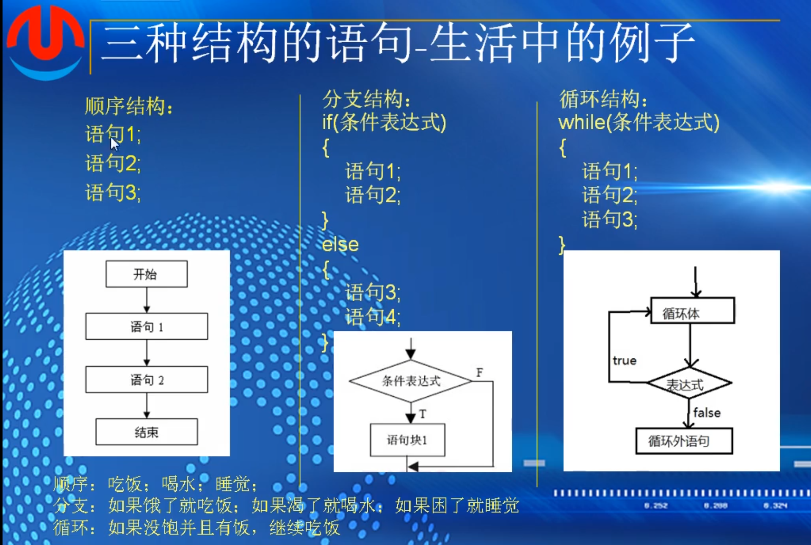
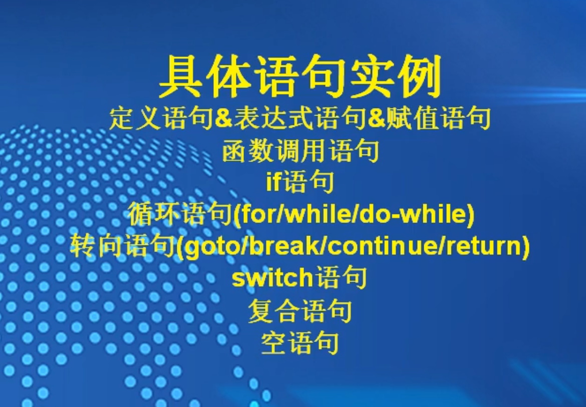
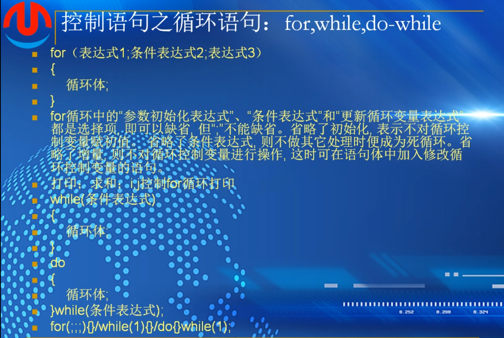
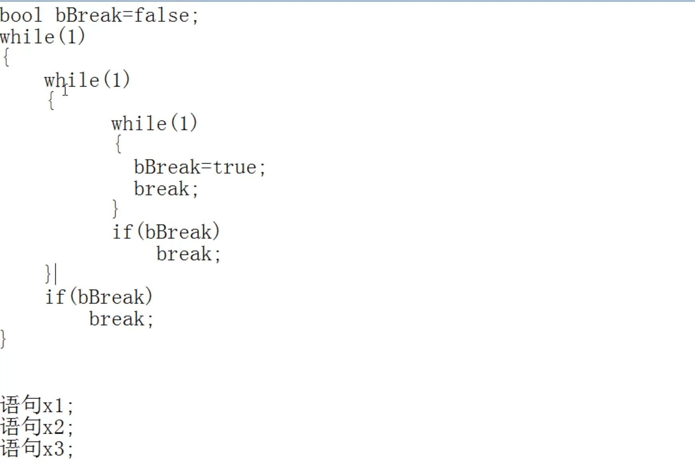
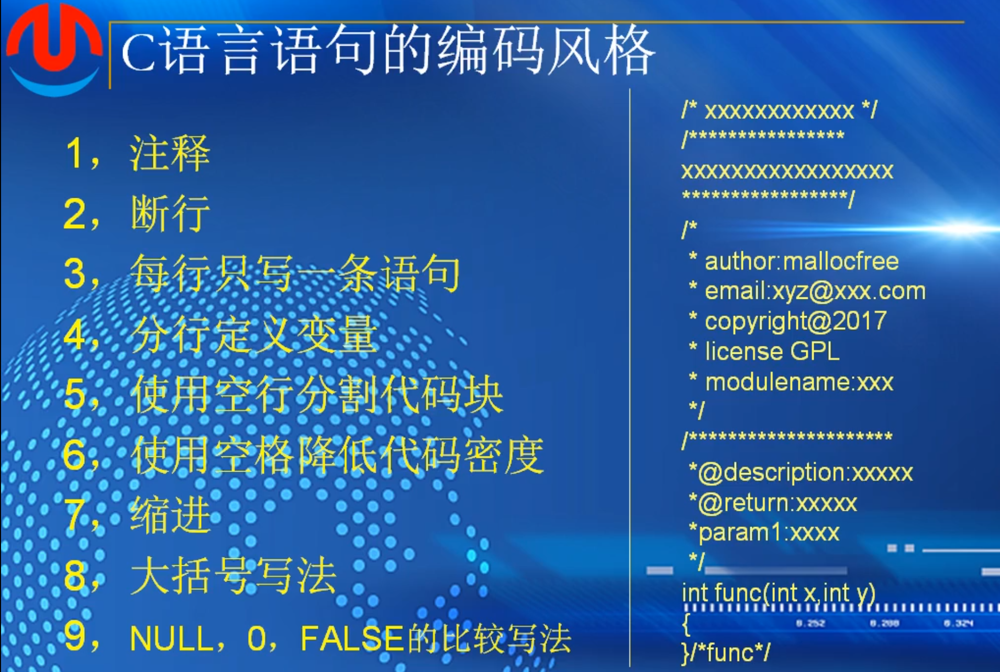
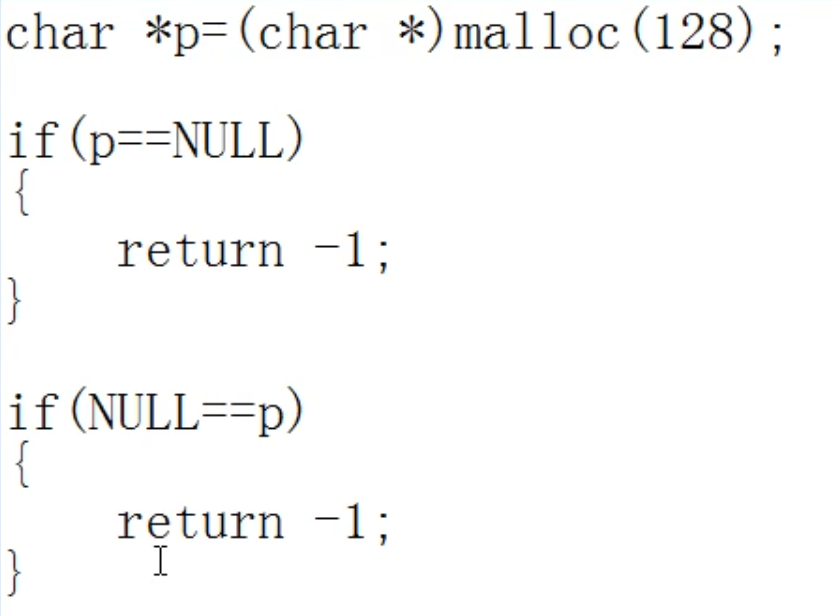
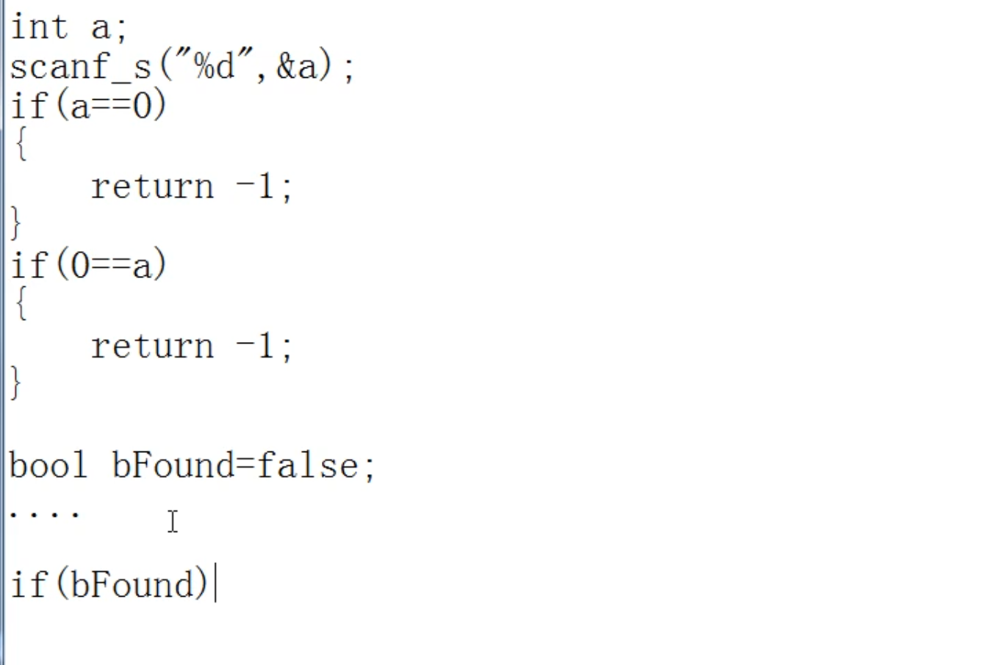

# 第八课：程序的语句


三种结构






## 定义语句&表达式语句&赋值语句

定义语句，在使用变量之前必须要对去其进行定义

int i=1;  -->定义一个整型变量i，它的值为1，值为1相当于初始化，也可以不初始化，不初始化i的值就是一个垃圾值，尽量不要不初始化，定义一个值

表达式语句

i++;  自增

i+1;   无意义

i;    无意义

5； 无意义

a=5;

函数调用语句

#include<stdlib.h>

srand((int)time(0));      srand生成随机数的种子，一般是以当前时间作为随机数的种子

rand() ; 生成一个随机整数  必须包含上述stdlib的头文件

```
#include <stdio.h>
#include <stdlib.h>

int main()
{	
	srand((unsigned int)time(0));
	for (int i = 0; i < 10; i++)
	{
		printf("%d", rand()%100);


	}

	printf("\n");

	return 0;
}
```

控制语句之分支语句：

1.if{}

2.if{}

else{}

3.if{}else if 可以有多个else if

{}

else  //else部分可以省略

{}

### 判断函数奇偶性

```
#include <stdio.h>
#include <stdlib.h>

int main()
{	
	int value = 0;
	printf("Please input an integer:\n");
	scanf_s("%d", &value);

	if (value % 2 == 0)
	{
		printf("%d is an even number\n", value);
	}
	else
	{
		printf("%d is an odd number\n", value);
	}

	return 0;
}
```

语句里只有一句话可以不加大括号，否则需要

### 大写转换小写

```
#include <stdio.h>
#include <stdlib.h>

int main()
{	
	char ch;

	printf("Please input an character:\n");

	scanf_s("%c",&ch,1);

	if(ch>='A'&&ch<='Z')
	{
		ch+='a'-'A';
	}
	printf("%c\n",ch);

	return 0;
}

```

条件判断必不可少，否则如果输入了其他数字会导致输出出错

### 控制语句之分支语句：switch语句

switch语句是一种多路判定语句，它测试表达式是否与一些常量整数值中的某一个值匹配，并执行相应的分值动作。所以switch语句也是一种分支语句，可以和if语句互相转换。

switch(a) // a只能为整数(char,short,int,long等)，不能为指针，浮点数

```
#include <stdio.h>
#include <stdlib.h>

int main()
{
	char ch;

	printf("Please unput the score level:\n");
	scanf_s("%c", &ch, 1);

	switch (ch)
	{
	case 'A':
		printf("your score >=90\n");
		break;
	case 'B':
		printf("your score >=80\n");
		break;


	default:
		printf("your score <=60\n");

	}


	return 0;
}
```

### 控制语句之循环语句：for,while,do-while



表达式1，可以进行初始化

条件表达式，用来控制循环是否开始或退出的

表达式3，更新，比如i++，用来更新循环里的值

```
循环求和
#include <stdio.h>
#include <stdlib.h>

int main()
{   
	int sum = 0;
	for (int i = 0; i < 10; i++)
	{
		sum += i;
	}
	printf("sum:%d\n",sum);
	return 0;
}
```

do while循环后有分号，

先执行循环体，再执行是否符合条件

```
#include <stdio.h>
#include <stdlib.h>

int main()
{   
	int i = 0;
	do
	{
		printf("i:%d\n",i);
		i++;
	} while (i > 100);

	return 0；
}
```

会输出一个i = 0，因为是先执行循环体语句，再执行while语句，不符合条件即停止。

### 控制语句之转向语句

goto

**慎用goto**

出错处理（2内存，1文件打开失败）；

跳出多重循环


循环中的转向语句

break  退出循环

continue // 吃饭看到头发？break；吃饭筷子夹肉掉地上了？continue

即忽略之后的语句，重新开始下一次的循环


return：返回语句，后面是返回值，一般存储在寄存器中，32位放在eax中，64位放在rax中

未定返回值可以直接return，定了就必须返回一个值

return不仅退出循环，退出的是整个函数，执行return后，后续的代码将不再被执行

return 0；

return；



break跳出多重循环

goto out 

可以直接跳到out的语句，一部能跳出多重循环

### 复合语句&空语句

复合语句-{}；

空语句-；


# 第九课：编码风格



### 断行

一般按照运算符切断


每一行只写一条语句方便进行调试

```
a += 5;
b -= 10;
```


分行定义变量

```
int a=10;
int b=20;
int c=30;
```


空行分割代码块

功能相近的代码块之间可以用空行

```
int a=10;
int b=20;
int c=30;

a += 5;
b -= 10;

printf("a:%d\n",a);
printf("b:%d\n",b);

```

未缩进示例：


判断比较







补作业代码4

```
用while来写
#include <stdio.h>
#include <stdlib.h>

int main()
{
	int a=0,b=0;
	printf("Please input two shuzi:\n");
	scanf_s("%d,%d", &a, &b);
	
	while (a / b > 0)
	{
		printf("%d",a);
		goto out;
	}

	printf("%d",b);

	out:
	return 0;
}
```

用一个while和goto来写。

if除了报错就是程序运行不完善，还在重写。

 除了goto不知道如何在循环执行完了之后忽略后续printf直接到return


思路缺陷：

1.怎么将第二次相除之后的结果是否为0和除数代入下一次运算的被除数

2.循环中如何使用，应该使用几个变量来写入代码

以下是网络搜索思路：

```
#include <stdio.h>
#include <stdlib.h>

int main()
{
	int a, b, t;
	printf("请输入两个数字:\n");
	scanf_s("%d,%d", &a, &b);

	while (a % b != 0)
	{
		t = b;//存上一轮的除数
		b = a % b;//这一轮的余数做下一轮的除数
		a = t;//做下一轮的被除数
	}
	printf("%d", b);//最后剩下的除数就是答案
	return 0;

}
```

多设置了一个变量在循环体内赋值，更改算式的值，用的是while循环语句


```
#include <stdio.h>

int main(void)
{
    int x, y, gcd;
    printf("请输入两个正整数：");
    scanf("%d%d", &x, &y);
    if(x < y)
        gcd = x;
    else
        gcd = y;
    while(x % gcd ||y % gcd)
        gcd--;
    printf("gcd = %d\n", gcd);

    return 0;
}
```

用if和while语句并且加上逻辑判断符，先判断大小，
