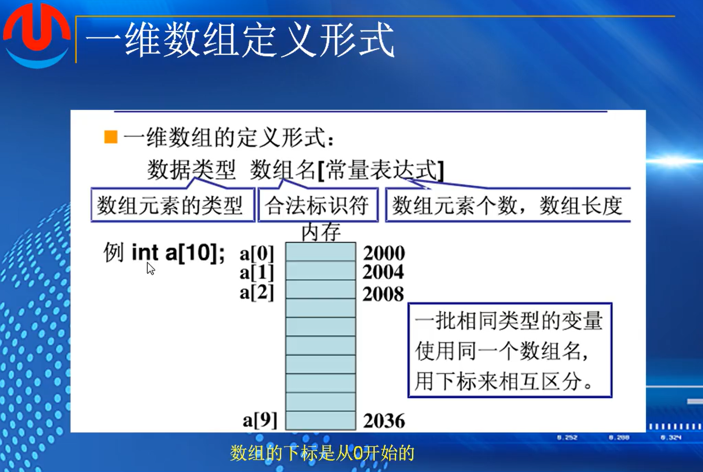
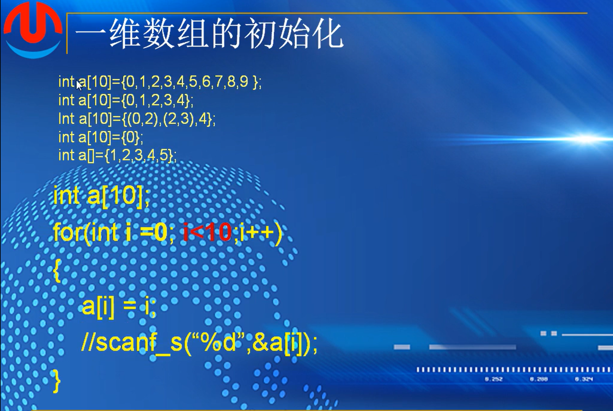

# 第十课-数组

## （1）：一维数组

统计多个人的平均成绩，引入数组

数组，一组相同类型的变量连续的存储在一段内存上，并共用一个名字（数组名）。

每个变量使用下标来区别，并被称作数组的元素。数组的下标是从0开始的

由定义看出，每个元素的类型相同，因此各个元素在内存中存放的长度也一样，即他们占用的空间等长的，而数组名，就是这段内存的首地址。存放数组的内存也是连续的

数组根据存放的数据的类型，可分为数值数组，字符数组，指针数组，结构数组等各种类别；而按照数组的维度，又可以分为一维数组，二维数组，三维数组等

***最容易出错，很容易溢出***



数组名，跟表示名一样，必须使用字母，数字，下划线，且数字不开头

a[10]中有0-9，没有10，如果访问a[10]会导致数组溢出，但是程序依然会编译成功，如果溢出之后访问内存，程序会崩溃，读出垃圾数据，或者影响到存储的其他数据。**编译器不检测**


“7”的位置可以是表达式，但是必须是常量表达式

使用a[i]可以直接访问到某个元素（随机访问，通过固定长度乘以下标，能够直接算出地址并对其进行访问*连续，加偏移，加固定长度*）

链表不可以，每一个元素不是连续的，每一次找节点必须要从开头开始一个一个寻找

定义实例：


*a表示指针

#define SIZE 宏定义

初始化：



已定义了的数组的值可以改变

如果只定义了一些，没有定义完，那么剩下未定义的值默认为0

3.是逗号表达式，等价于 int a[10]={1,3,4}

5.未指定个数，通过后续定义的值来定义数组的长度


程序赋值，i<10，满足有效元素

或者通过键盘来输入一个数


**一维数组的初始化与遍历**


键盘为数组赋值例子

```
#include <stdio.h>

int main()

{
	int a[10] = {0};

	for (int i = 0; i < 10; i++)
	{
		printf("Please input the value for %d\n");
		scanf_s("%d", &a[i]);
	}


	for (int i = 0; i < 10; i++)
	{

		printf("%d", a[i]);

	}

	printf("\n");

	return 0;
}

```

定义函数用来打印数组

```
boid print_array(int a[],int len)
{
	for(int i=0;i<len;i++)
	{
		printf("%d",a[i]);
	}
	printf("\n")
}


print_array(a,number)
```

sizeof(a)   a数组所占的长度

sizeof(a[0])  a数组中第一个元素所占的长度

因为数组中每一个元素所占长度相同，所以用总长度除以每一个元素所占长度，就能够计算出数组中元素个数

即sizeof(a)/sizeof(a[0])

### 字符数组


strlen(str1)是非法的，str1不是一个字符串

strlen会从左到右遍历所有元素直到找到最后的0为止，然后减去0，用来计算str1会导致内存溢出

字符串的规定就是最后一位是0


a必须是实参，如果是形参的话会导致计算出错，形参的a会退化成指针，一个指针的长度是四个字节或者说是八个字节

作业：


1.随机访问：指能通过  a[下标值]  直接访问到数组中这个下标所在的值   原因：数组的存储方式是按照顺序一个一个字节数相同，连续排列的组合，通过长度乘以下标值能够直接找到对应的内存地址，所以数组能够支持随机访问

2.在C语言中，数组的长度是固定的，因此无法直接删除数组中的某一项。通常通过**覆盖法**或**辅助数组法**来实现删除操作。

1) 覆盖法

确定需要删除元素的下标位置，然后从此位置开始将后续元素全部往前移动一位，而后更新数组长度或者将最后一位换为0

代码示例：(百度复制)

```
#include <stdio.h>
void removeElement(int arr[], int *size, int index) {
   if (index < 0 || index >= *size) {
       printf("索引超出范围\n");
       return;
   }
   for (int i = index; i < *size - 1; i++) {
       arr[i] = arr[i + 1];
   }
   (*size)--; // 更新数组长度
}
int main() {
   int arr[] = {1, 2, 3, 4, 5};
   int size = 5;
   int index = 2; // 要删除的元素索引
   removeElement(arr, &size, index);
   for (int i = 0; i < size; i++) {
       printf("%d ", arr[i]);
   }
   return 0;
}
```

2) 辅助数组

创建一个新的数组，然后将除了删除元素的其他元素复制到新数组，再复制回去

代码示例：

```
#include <stdio.h>
void removeElement(int arr[], int *size, int index) {
   if (index < 0 || index >= *size) {
       printf("索引超出范围\n");
       return;
   }
   int temp[*size - 1];
   int j = 0;
   for (int i = 0; i < *size; i++) {
       if (i != index) {
           temp[j++] = arr[i];
       }
   }
   for (int i = 0; i < j; i++) {
       arr[i] = temp[i];
   }
   (*size)--; // 更新数组长度
}
int main() {
   int arr[] = {1, 2, 3, 4, 5};
   int size = 5;
   int index = 2; // 要删除的元素索引
   removeElement(arr, &size, index);
   for (int i = 0; i < size; i++) {
       printf("%d ", arr[i]);
   }
   return 0;
}
```


3.

```
#define array_number[int a[],int len]
	len = sizeof(a)/sizeof(a[]);
	return 0;
```

4.数组溢出：访问到数组未定义的内存地址

现象：如果是内存中未定义的地址，进入非法区域，会导致程序崩溃

或者是访问到其他数据所在的地址，导致数据破坏影响程序运行

或者是得到一些未定义的垃圾值

c语言并不检测数组溢出，所以这算是一个隐性的bug


注意事项


 右边，在定义时候打了；   也就是没有进行初始化，用循环进行遍历初始化
