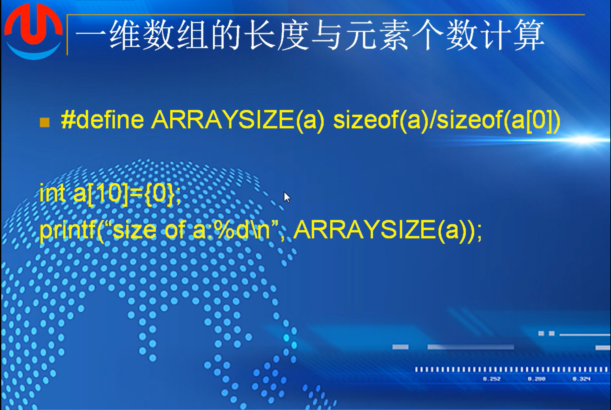
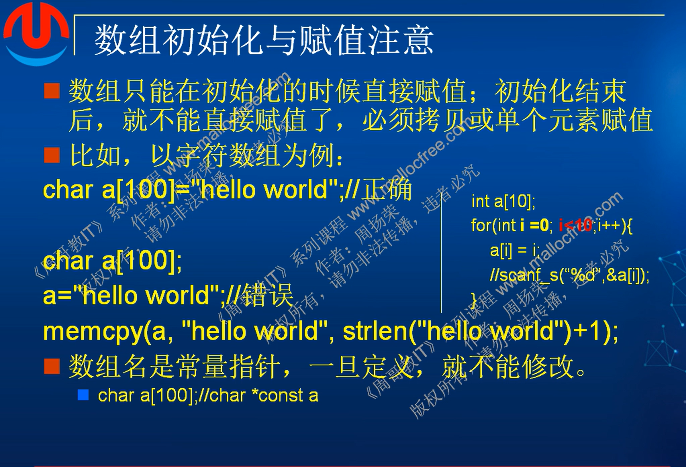
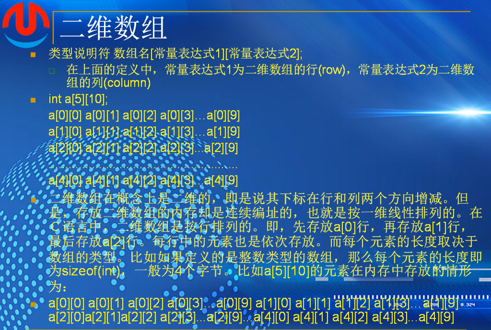
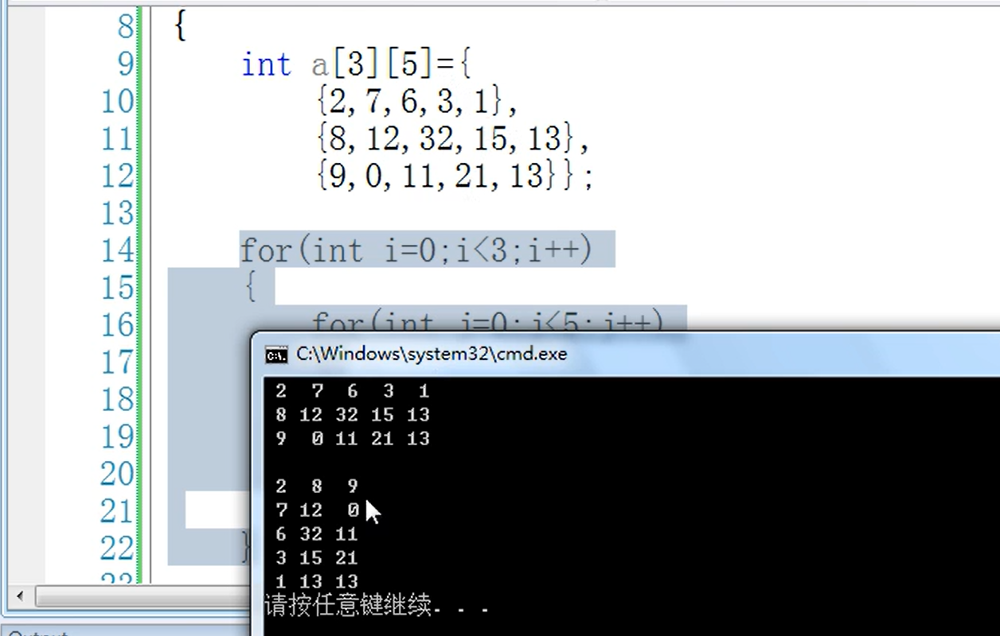
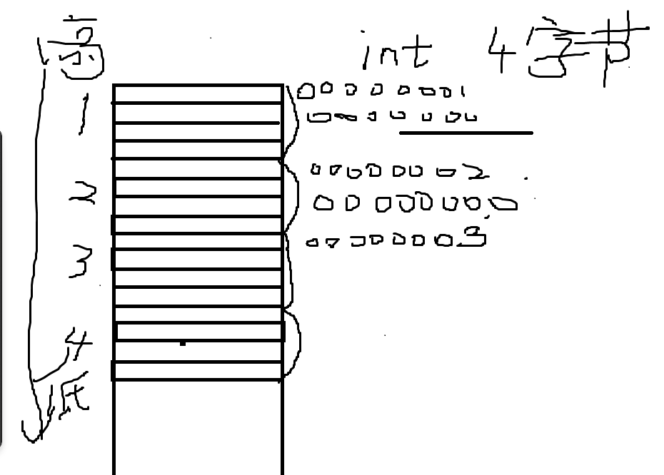
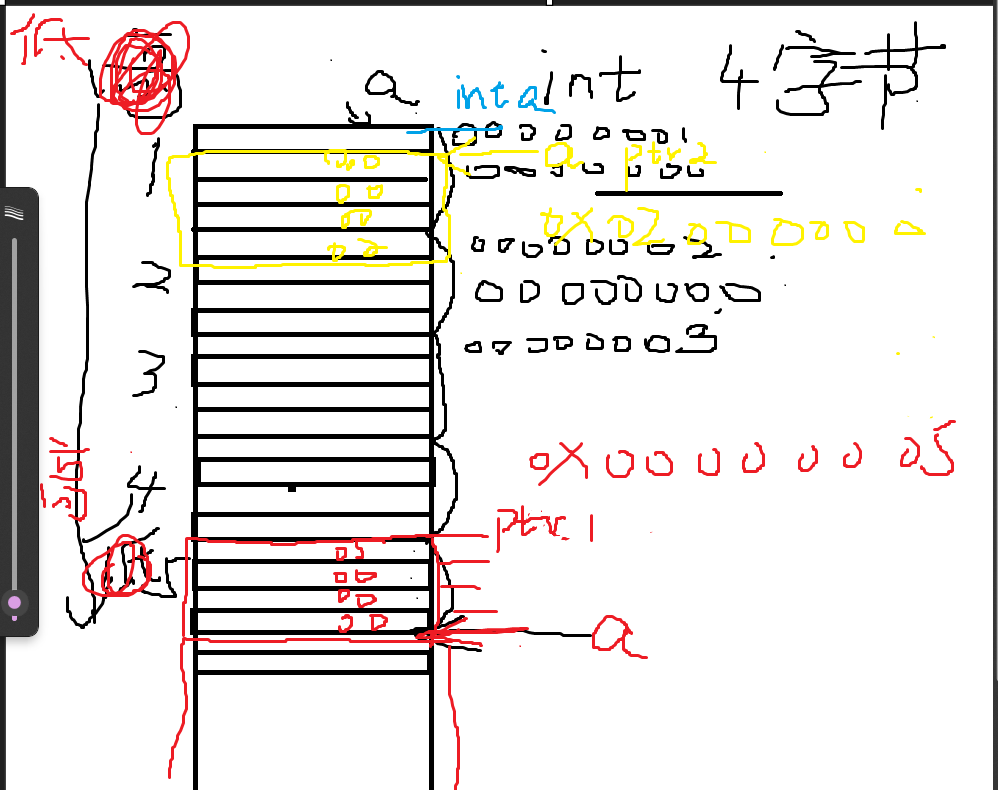
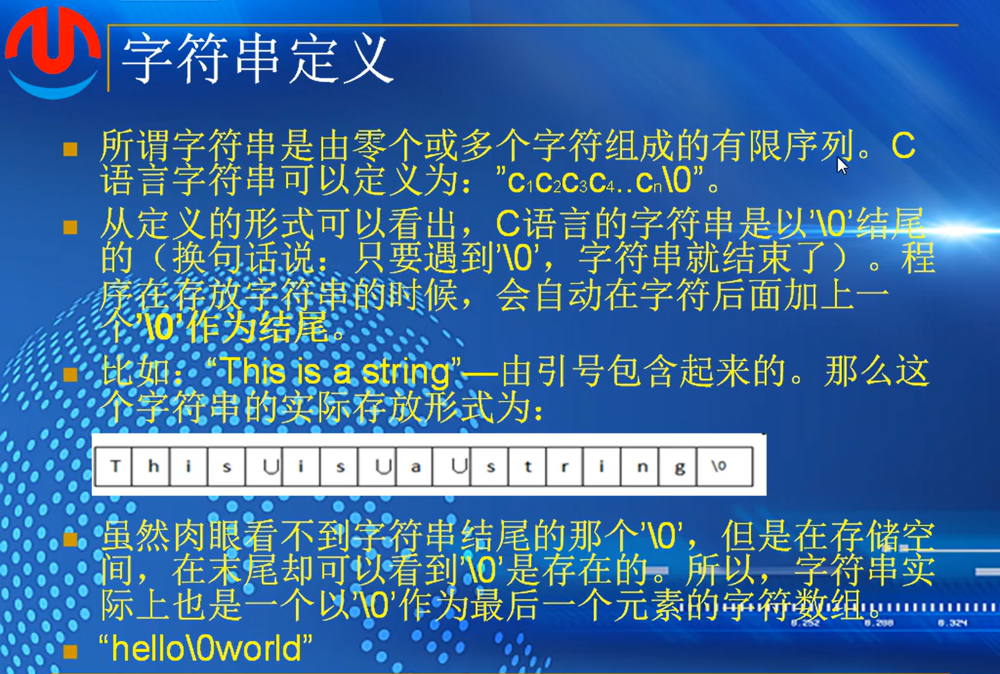
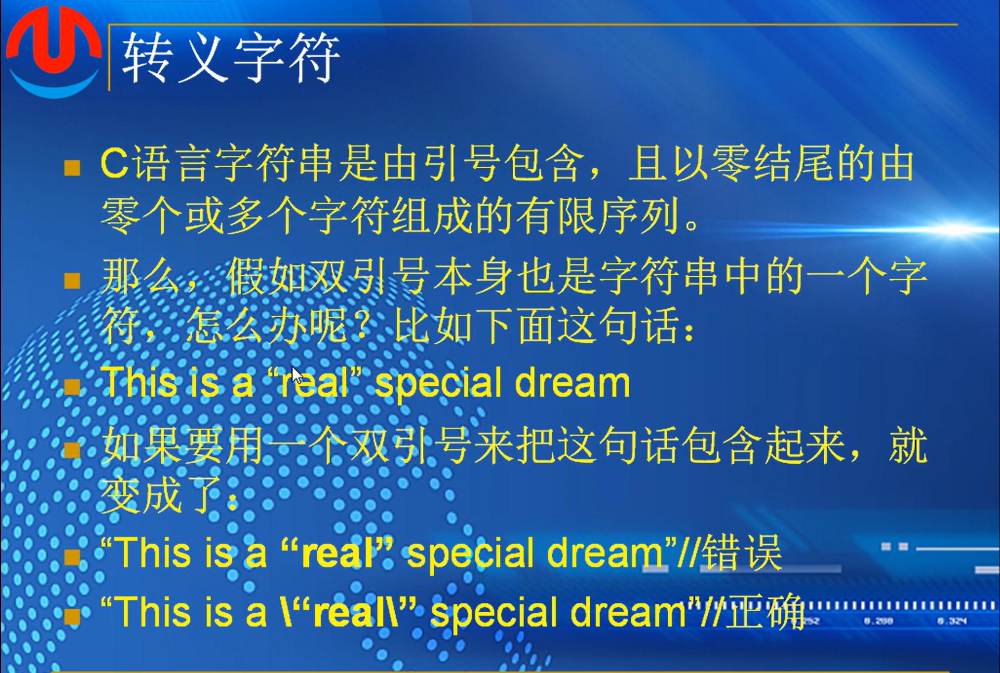
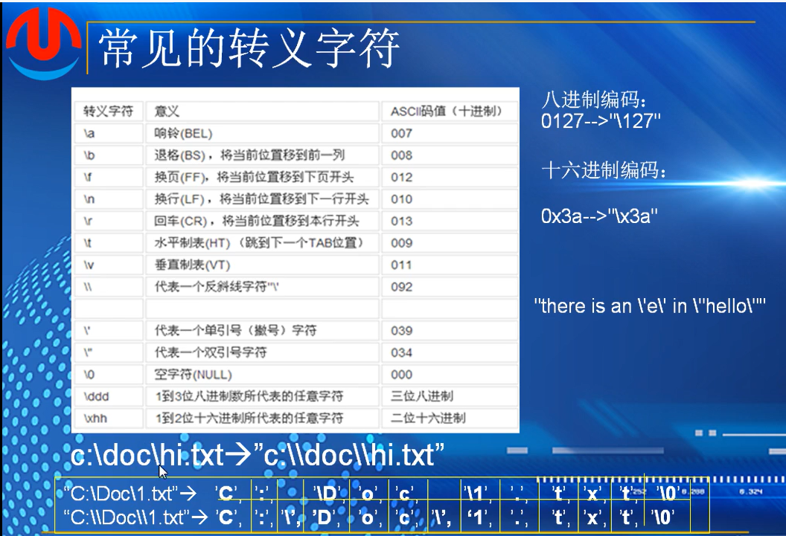
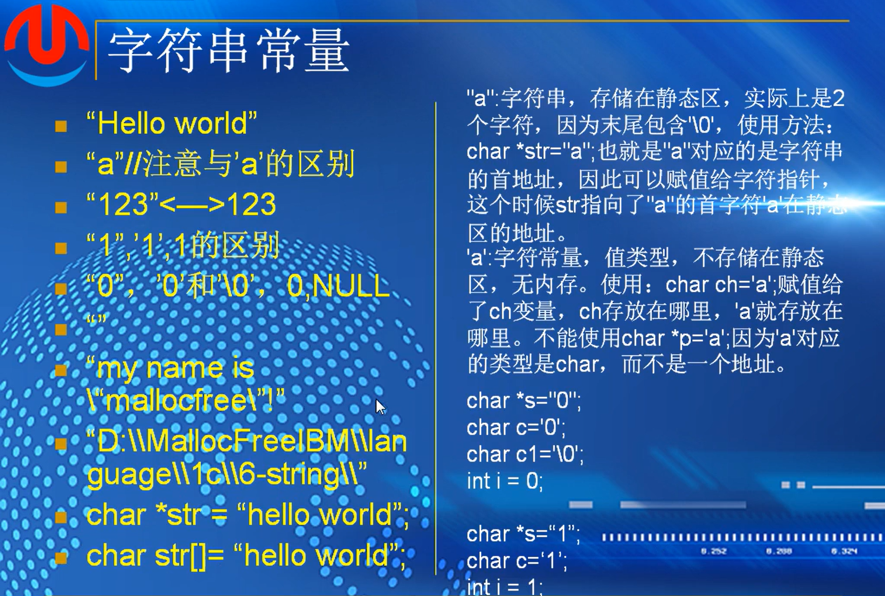

### 字符数组


strlen(str1)是非法的，str1不是一个字符串

strlen会从左到右遍历所有元素直到找到最后的0为止，然后减去0，用来计算str1会导致内存溢出

字符串的规定就是最后一位是0



a必须是实参，如果是形参的话会导致计算出错，形参的a会退化成指针，一个指针的长度是四个字节或者说是八个字节

作业：


1.随机访问：指能通过  a[下标值]  直接访问到数组中这个下标所在的值   原因：数组的存储方式是按照顺序一个一个字节数相同，连续排列的组合，通过长度乘以下标值能够直接找到对应的内存地址，所以数组能够支持随机访问

2.在C语言中，数组的长度是固定的，因此无法直接删除数组中的某一项。通常通过**覆盖法**或**辅助数组法**来实现删除操作。

1) 覆盖法

确定需要删除元素的下标位置，然后从此位置开始将后续元素全部往前移动一位，而后更新数组长度或者将最后一位换为0

代码示例：(百度复制)

```
#include <stdio.h>
void removeElement(int arr[], int *size, int index) {
   if (index < 0 || index >= *size) {
       printf("索引超出范围\n");
       return;
   }
   for (int i = index; i < *size - 1; i++) {
       arr[i] = arr[i + 1];
   }
   (*size)--; // 更新数组长度
}
int main() {
   int arr[] = {1, 2, 3, 4, 5};
   int size = 5;
   int index = 2; // 要删除的元素索引
   removeElement(arr, &size, index);
   for (int i = 0; i < size; i++) {
       printf("%d ", arr[i]);
   }
   return 0;
}
```

2) 辅助数组

创建一个新的数组，然后将除了删除元素的其他元素复制到新数组，再复制回去

代码示例：

```
#include <stdio.h>
void removeElement(int arr[], int *size, int index) {
   if (index < 0 || index >= *size) {
       printf("索引超出范围\n");
       return;
   }
   int temp[*size - 1];
   int j = 0;
   for (int i = 0; i < *size; i++) {
       if (i != index) {
           temp[j++] = arr[i];
       }
   }
   for (int i = 0; i < j; i++) {
       arr[i] = temp[i];
   }
   (*size)--; // 更新数组长度
}
int main() {
   int arr[] = {1, 2, 3, 4, 5};
   int size = 5;
   int index = 2; // 要删除的元素索引
   removeElement(arr, &size, index);
   for (int i = 0; i < size; i++) {
       printf("%d ", arr[i]);
   }
   return 0;
}
```


3.

```
#define array_number[int a[],int len]
	len = sizeof(a)/sizeof(a[]);
	return 0;
```

4.数组溢出：访问到数组未定义的内存地址

现象：如果是内存中未定义的地址，进入非法区域，会导致程序崩溃

或者是访问到其他数据所在的地址，导致数据破坏影响程序运行

或者是得到一些未定义的垃圾值

c语言并不检测数组溢出，所以这算是一个隐性的bug


注意事项



 右边，在定义时候打了；   也就是没有进行初始化，用循环进行遍历初始化

# 第十课-数组

## （2）：二维数组



在内存中依然是线性编址


内存页：

两种遍历的实例：



思考：


数组中用（）括起来的是逗号表达式，需要计算其中的值，此数组中的值{2，4，3，0，0，0}，因为是二维数组，所以写为

```
{2,4
 3,0
 0,0}
```


作业2：


1.

1）直接赋值

```
int a[1][1]={{1,2},{1,2}}
```

2）循环遍历输入：

```
int a[6][6]={0};
for(int i;i<6;i++)
{
	for(int j;j<6;j++)
		{
			a[i][j] = rand // 固定数值，或者随机数生成
		}
}


//*还可以通过键盘输入来往数组里面输入值 参考
for(int i=0;i<10;i++)
{
	for(int j=0;j<5;j++)
		{
			printf("Please input the score for %d\n",o)
	         scanf_s("%d",&score[i][j]);
	         
		}
}
//*
//个人想法，未搜索


//*以下是网络搜索

#include <stdio.h>
 
int main() {
    int rows = 3;       // 定义二维数组的行数
    int cols = 4;       // 定义二维数组的列数
    int matrix[3][4];    // 定义一个3行4列的二维数组
 
    // 为二维数组的每个元素赋值
    for(int i=0; i<rows; ++i) { // 外层循环遍历行
        for(int j=0; j<cols; ++j) { // 内层循环遍历列
            // 赋值操作
            matrix[i][j] = i * cols + j; // 赋值逻辑，这里只是示例，可以根据需要修改
        }
    }
 
    // 打印二维数组以验证赋值是否成功
    for(int i=0; i<rows; ++i) {
        for(int j=0; j<cols; ++j) {
            printf("%d ", matrix[i][j]); // 打印矩阵元素
        }
        printf("\n"); // 每行结束后换行
    }
 
    return 0;
}
————————————————
版权声明：本文为CSDN博主「凭栏落花侧」的原创文章，遵循CC 4.0 BY-SA版权协议，转载请附上原文出处链接及本声明。
原文链接：https://blog.csdn.net/m0_67484548/article/details/140399701
```

2.

存储方式：

线性存储方式，按照a[0]行，a[1]行的方式，一行一行一个数据一个数据的方式存储，每个元素的长度根据定义长度来

3.按行遍历的效率高

因为涉及内存页存储

*内存页是操作系统分配内存的最小单位，通常大小为4KB，用于实现虚拟内存和内存管理。*

*内存页的定义:内存页（Memory Page）是操作系统在内存管理中使用的基本单位。它将物理内存划分为固定大小的块，通常为4KB（4096字节）。操作系统通过页表来管理这些内存页，记录虚拟地址与物理地址之间的映射关系*

如果存储数据过多，二维数组的数据存放在不同的内存页，那么按列遍历的方式 就是在内存中频繁跳转，容易导致缓存未命中，预取的命中率不高的问题

现代cpu可以做到提前加载数据，按行遍历的方式能够完全利用这个机制快速遍历，而按列方式预取器难以预测


## （3）：数组重要注意事项

首地址


a1，代表的int *类型的指针   

&a1，代表的是整个的一维数组

a2，代表二维数组中的一行

&a2，代表一整个数组

地址相同，类型不一样，指向的内存也不一样，a1代表的指针就指向了4个字节的内存，而&a1代表十个元素也就是指向了40个字节

a1+1,&a1+1                   

a2+1,&a2+1                   意思是，当前数组所在内存地址，向前移动所属类型的字节数的地址，比如int类型4个字节，这个意思就是a1所在内存地址，向前移动4个字节。&a1+1代表了移动40个字节


代码：

```
int a1[10]={0};
int a2[4][5]={0};

printf("a1:%d,&a1:%d\n",a1,&a1);
printf("a2:%d,&a2:%d\n",a2,&a2);

printf("a1+1:%d,^a1+1:%d\n",a1+1,&a1+1);
printf("a2+1:%d,^a2+1:%d\n",a2+1,&a2+1);

return 0;
```


数组做参数

 


外部计算长度为40个字节，传入函数内部计算长度退化为指针，长度为4个字节，但是依然可以通过这个指针来访问数组中的每一个元素的

数组的溢出


内存溢出，如果访问的该内存地址不存在，导致非法访问，会造成程序崩溃，如果访问的内存地址存在，有可能访问到其他数据，有可能访问到一个垃圾值，对其进行修改可能会破坏程序中其他有用的值，引起整个程序出现异常

程序1：for循环中i<=16，但是定义的a[16]只有0-15号元素，会导致数组溢出

程序2：第一个循环遍历里面设定了i<10，也就是说i会遍历0-9号元素，第二个函数定义里面定义a[9]，只包含了0-8号元素，第九号没有定义，也会导致数组溢出

程序3：i = i+1，a[i]是不存在的，也会导致数组的溢出


1.代码输出：

printf("sizeof(a)=%d\n",sizeof(a))  输入应是 40 字节长度     int是整型，代表四字节长度，a数组里有10个元素，共40字节的长度

func(a,10）输入应该4字节长度，因为数组导入函数之后，缩成指针，函数中输出int a 应是int对应的指针长度为4

2.

如图，在内存区高到低存储的内存地址分布，      ！！！！**低到高**！！！！

ptr1  int *  &a+1   取整个数组a的内存长度往前移动一位  移动之后如图中红色部分所示

ptr2 int) a+1    将数组指针a强制转化为整型并且移动一位

printf()      ptr1[-1]   往前移动一位之后，再往后取一位，也就是如图中蓝色部分

​                ptr2         a所处的地址被转化为int型，然后移动一位就是移动一个字节，ptr2所输出是图中黄色部分




## （4）：数组应用

1.斐波那契数列求和（前20项）

```
int a[20]={0};

a[0]=1;
1[1]=1;

for(int o=2;i<20;i++)
{
	a[i]=a[i-1]+a[i-2];
}

for(int i=0li<20;i++)
{
	printf("%d",a[i]);
}

printf("\n");
return 0;
```

字符串变大小写：

```;
 char str[]="Hello World, 12345678";
 
 
 //*从键盘上输入
 
 char str[128]={0};
 
 printf("Please input a str:\n");
 gets_s(str,128);
 
 //*
 
 int len = sizeof(str)/sizeof(str[0]);
 
 for(int i=0;i<len;i++)
 {
 	if(str[i]>='A'&& str[i]<='Z')
 	{
 		str[i] += 'a'-'A';
 	}
 }
 
 printf("%s\n",str);
 
 return 0;
```

计算平均值：

```
int score[10]={0};

for(int i=0;i<10;i++)
{
	pruintf("Please input the score for %d\n",o)
	scanf_s("%d",&score[i]);
}

for(int i=0;i<10;i++)
{
	total += score[i];
}

float average_score = (float)total/10;

printf("average score is:%f\n",average_score);

return 0;

```

求数组中的最大值：

```
int a[]={98,123,7,2,77,95,23,999,1001,273};
int max_num=a[0];

for (int i=0;i<sizeof(a)/sizeof(a[0]);i++)
{
	if(max_num<a[i])
	{
		max_num=a[i];
	}
}
printf("%d\n",max_num);

return 0;
```

剪刀石头布：     0,1,2

result=(man-computer+4)%3-1

```
#include<stdlib.h>
%include<time.h>


char name[3][20]={"剪刀"，"石头"，"布"};
int computer=0;
int man=0;
srand((unsigned int)time(0));

computer=rand()%3

printf("0:剪刀\n1：石头\n2：布3:退出\n请输入一个数字与计算机一起玩石头剪刀布:\n");
scanf("%d",&man);


if(man<0&&man>2)
{
	printf("非法输入\n");
	return -1;
}
else if(man==3)
{
	break
}

printf("computer:%s,man:%s\n",name[computer],name[man]);

int res=(man-computer+4)%3-1;

if(res>0)
{
	printf("man win\n");
}
else if(res==0)
{
	printf("draw\n");
}
else(res<0)
{
	printf("computer win\n");
}

return 0;


//*
while(1)
{
computer=rand()%3

printf("0:剪刀\n1：石头\n2：布\n");
scanf("%d",&man);

if(man<0&&man>2)
{
	printf("非法输入\n");
	return -1;
}

printf("computer:%s,man:%s\n",name[computer],name[man]);

int res=(man-computer+4)%3-1;

if(res>0)
{
	printf("man win\n");
}
else if(res==0)
{
	printf("draw\n");
}
else(res<0)
{
	printf("computer win\n");
}

return 0;
}

```

求五位同学三个科目每一个科目的平均成绩：

```
char name[3][20]={"Math","C","Foxpro"};

int score[3][5]={
{80,61,59,85,76},
{75,65,63,87,77},
{92,71,70,90,85}

};

for(int i=0;i<3;i++)
{
	int total=0;
	float average=0.0f;
	
	for(int j=0;j<5;j++)
	{
		total+=score[i][j];
	}
	average=(float)total/5;
	printf("%s' s average score is:%.2f\n",name[i],average);
	
}

return 0;

```

作业：


# 第十一课-字符串

## （1）：字符串定义


定义：



'0'-->48

'\0'-->0

遇到\0字符串即结束 

转义字符：



c语言中字符串是用双引号包裹起来的，需要用转移字符表示此处双引号只是一个引号



 单引号包裹起来的字符叫字符常量

字符串常量：



“hello world”  字符常量

‘a’是一个字符，"a"是一个字符串

“123”是一个字符串，123是一个整数值   可以调用函数互相切换

“1”.‘1’,1   字符串，字符，整数    

“0”，‘0’，‘\0’，0，NULL    字符串，字符，字符，整数，指针

“”  空字符串，仍然有看不见的0字节

char *str = "hello world"      字符指针  ，字符串存放在静态常量区，赋值给了字符指针，指向了常量区

char str[]= "hello world"      字符常量区的字符赋值给了这个字符数组，并且有0字节，一共12个字节


str1指向静态常量区，静态常量区不能更改   (str1+1)='a' 会报错

str2[1]='1';

**字符不可以赋值给指针，地址可以赋值给指针**


L'a'  占两个字节   unicode编码

'a' 占一个字节

作业：


1.   0:一个整数，数值    '0'一个字符常量，值类型   "0"  一个表示0的字符串    '\0' 一个字符变量
2.  “123” 一个字符串  123 一个整数数值
3. 用\转义符，表示此引号不具有特殊含义
4. 用双引号括起来,然后内部再用两个斜杠来表示
5. 9，1-8八个字符再加上\0的末尾不可见字符
6. 区别在于每一个元素所占字节数，未标注L 所用是ASCII编码，每一个元素占一个字节，标注L所用UNICODE编码，每一个元素占两个字节