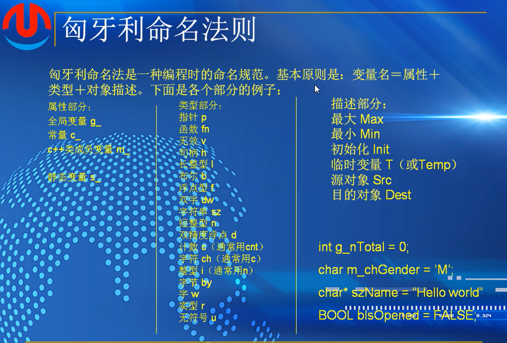
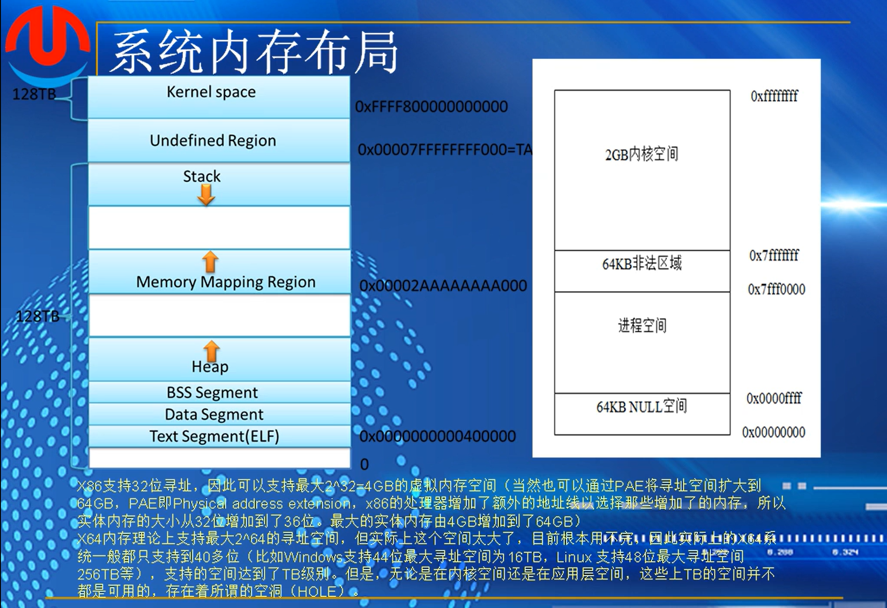
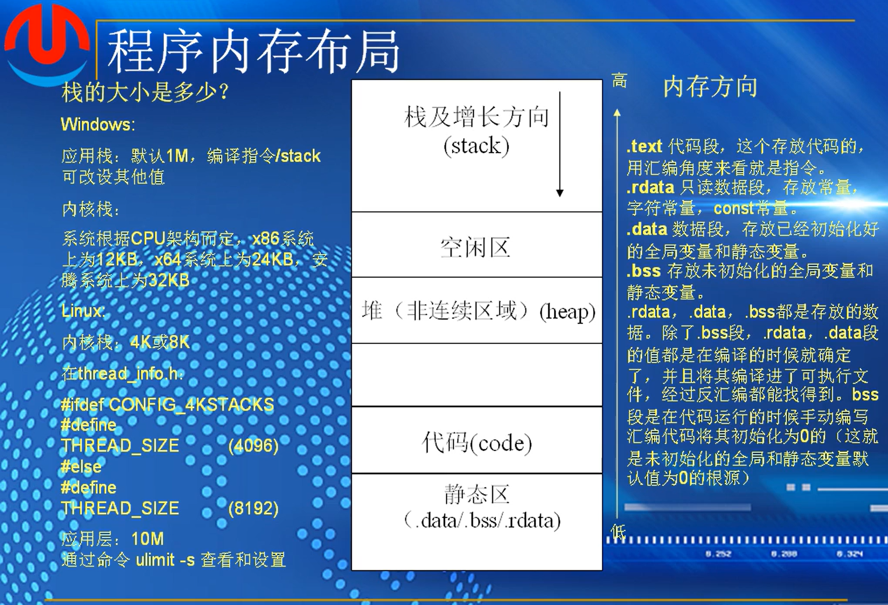
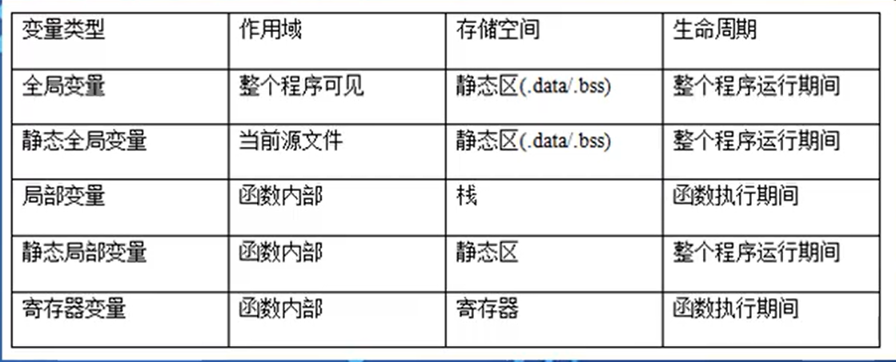
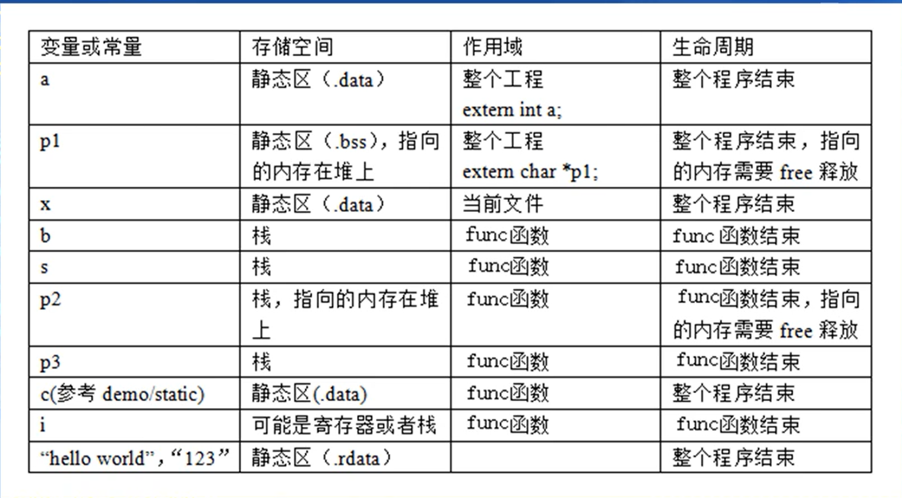
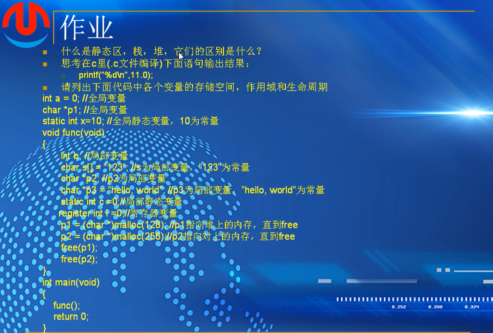

# 第五课-变量

## c语言变量定义与命名

### 常量:固定不变的量

100    //int   整数

‘a’       //character    字符

"hello world"    //string     字符串

3.1415926        //double    双精度浮点数

1.732f               //float      单精度浮点数

#define PI 3.1415926  定义一个PI，宏定义

### 变量

变量是内存或寄存器中用一个标识符命名的存储单元，可以用来存储一个特定类型的数据，并且数据的值在程序运行的过程中可以进行修改

变量就至少可为我们提供两个信息：

一是变量的地址，也就是操作系统为变量在内存中分配的若干内存的首地址

二是变量的值，也就是，变量在内存中所分配的那些内存单元中所存放的数据

int a = 10   常量赋值整型a

a = 100   修改a的值

&a   &：取值符，获得变量a在内存中的地址，***常量是没有内存的，不能在常量前加***

printf("addr.%p,value:%d\n",&a,a);

#### 变量命名原则

***变量名由字母，下划线和数字组成，但第一个字符必须为字母，下划线也被看做是字母。***大写字母与小写字母是有区别的，比如a与A是两个不同的变量名。一般大写字母组成的名字用作符号常量。

变量名不能与C编译系统中哥已经预定义的，具有特殊用途的关键字同名。比如float,auto,break等

一个变量的名字，一般说来，变量名与函数名应该足够长，以有效地描述所命名的变量或函数。应该避免使用短而模糊的名字，因为它们在别人理解你的程序时会带来麻烦。大多数ANSI编译程序允许有至少31个有效字符，即只有变量或函数名的钱31个字符的唯一性会被检查。一种较好的经验是使函数名的前31个字符的唯一性会被检查。一种较好的经验是使函数名或变量名读起来符合英语习惯。代码的自解释性。

一般来说，一个局部变量的名字，建议使用比较短的名，而全局变量，使用比较长的名字。比如，一个用于循环的局部变量，一般用一个i来作为名字就足够了

在windows平台，变量的命名一般遵循匈牙利法则，unix和linux不推荐

  *基本原则：变量名=属性+类型+对象描述*

  *linux：不推荐大小写混用，一般标识符或者函数名只有小写字母和数字和下划线构成* 

##### 匈牙利命名法则

图中helloworld改成人名更贴切

***其他变量法则***

linux也可以叫做下划线命名法

**作业**

## 变量作用域，存储空间，生命周期

***重点***  **绝对重点**

---

**系统内存布局**

内核空间，只能有最高权限的内核代码才能访问

进程空间，

NULL空间是无法访问的

非法区域隔离内核和进程，所有的进程进入内核空间，对所有进程共享，每个进程在进程空间中是互相隔离的，不能互相访问，传递；或者使用专门的通信

**程序内存布局** 

一个进程空间的布局

代码区存放代码，静态区存放数据

堆区，可以在堆区上手动分配内存

栈是从上往下增长，*空间有限，不能无限增长*

内核空间严禁使用递归算法，不断调用自己的时候会吞空间

未初始化的全局变量和静态变量（没有被定义）的值默认为零

汇编代码会在程序运行时将没有定义的变量全部设为0，变量需要经过初始化才能使用

---

变量分类：全局变量，局部变量，静态变量（静态全局变量和静态局部变量），寄存器变量

全局变量：全局变量的说明的位置在所有函数之外，整个程序可见，生命周期为整个程序运行期间，存储位置为静态存储区

全局静态变量：与全局变量唯一不同的地方是作用域：当前源文件，别的文件不饿能访问该变量-demo

局部变量：在函数内部说明的变量为局部变量，只有在函数执行时，局部变量才存在，当函数执行完推出后，局部变量随之消失。作用域为函数内部，存储空间为栈

局部静态变量：与局部变量的区别是，存储在静态区，整个程序运行期间有效，具有记忆功能，值初始化一次，下次调用函数，保留着上次函数运行之后的值-demo

寄存器变量：不像其他变量那样在内存中存放数据，而是在cpu的寄存器中暂存数据，使用寄存器变量比使用内存变量的操作速度快得多，只有整形和字符型变量可定义为寄存器变量，由于cpu中寄存器有限，尽量减少使用数量和占用时间，用完马上释放；不能定义为全局变量，也不能定义在结构或者类中

*举例*

初始化的全局变量，存放在.data区，未初始化的全局变量存放在.bss区。例如例子中的0和p1，一个是初始化了存放在data区，一个没有初始化存放在bss区

生命周期：变量的有效期，从创建到消亡到失去作用。全局变量，即从程序开始运行到结束运行，都有意义

在不同源文件中定义的全局变量，他们的初始化是不分先后的。如果在同意文件中给，先定义的就先初始化。

全局静态变量，存储空间和生命周期都与全局变量一样，但是作用域不一样，只能在当前源文件可以访问使用，别的源文件无法访问和使用，用来防止命令冲突（一个项目中不能同时出现两个一样的变量名 ）

用extern 来声明，导入其他源文件的全局变量

函数的调用，数据的传递，内存的分配都是在栈上

作业

