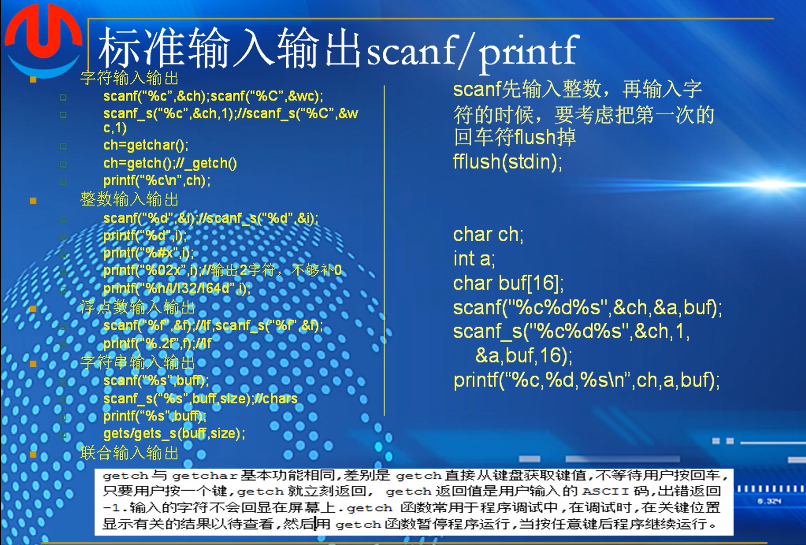

栈增长，高地址到低地址

数据存入，低地址到高地址

esp  ding ebp di

eip 保存吓一跳要执行的指令的地址

leave指令相当于

rip64 eip32 

# 第六个：输入输出  stdio



scanf 输入  printf  输出

```
#pragma warning(disable : 4996)

int main(int argc, _TCHAR* argv[])
{
	char c;
	wchar_t wc;

	short s;
	int i;
	long 1;

	//float f;
	//double d;

	//char buf[80] = {0};

	printf("Please input a character:\n");
	//scanf("%c", &c);
	scanf_s("%c", &c, 1);  //只能用在windos平台
	printf("%c\n", c);

	fflush(stdin); //清空回车键

	printf("Please input a another character:\n");
	scanf("%C", &wc);  //宽字符，大写的C,或者wc也可以
	printf("%wc\n", wc);  

	scanf_s("%c", &c, 1);

	fflush(stdin);

	   printf("please input a char\n");
	char c1 = getch();//buhui xianshizi pingmushang ,a
	prindf("plesse int input a char\m");
	char c2 = getchar();

	printf("c1:%c,c2:%c\n",233,c2);
	fflush(stdin);

	return 0;
}

```

其中scanf会提示4996的错误，调用scanf可能会导致数据溢出带来的安全风险。
