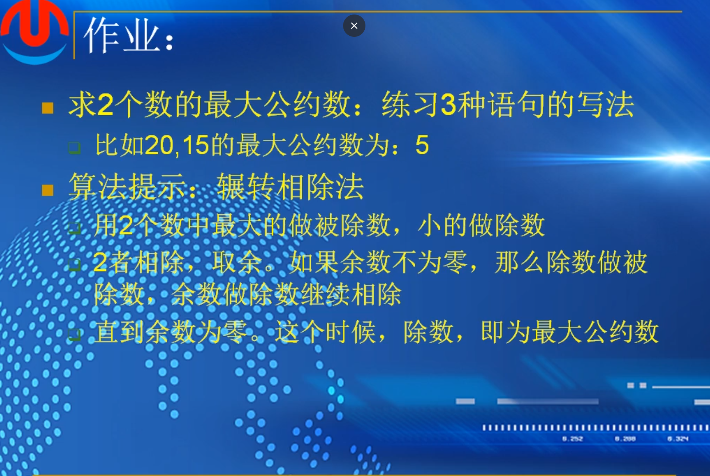

# 第七课（2）：表达式 

表达式由运算符、常量及变量构成。每一个表达式，都有对应的一个值。该值与表达式中操作符的优先级和结合律有关


逗号表达式：先算a的值，再算b的值，从左往右依次计算，f的值，就是整个式子最终的值

```
#include <stdio.h>

int main()
{
	int a, b, c;

	a = b = 1;
	printf("%d\n", (c = a++, b++, ++b));

	printf("a:%d\n", a);
	printf("b:%d\n", b);
	printf("c:%d\n", c);

	return 0;
}
```

输出结果为

3
a:2
b:3
c:1

```
int get_max(int a,intb,int c)
{
return (a>b?a:b)>c?(a>b?a:b):c;
}
```


()(a++)++)+b会报错，a++之后是常量，常量不能再进行++

作业


1.

i++和++i  单独成语句的时候，都是对i进行加1操作，无区别

但是在赋值语句中

a = i++ 意为，先把i的值赋给a，在对其进行加1操作

a = ++i 意为，先对i进行加1操作，在赋值给a

2.

c=a++,b++,++b

先算"=",即c=a++ 结果是c = 1 ，a = 2

然后是逗号运算符，b++和++b，取++b的值为逗号运算符的结果，即为2

算完++b，最后算b++，即b=3

分析结果为 a=2,c=1,b=3

输入代码查看结果：

```
#include <stdio.h>
#include <stdlib.h>

int main()
{   
	int a, b, c;
	a = b = 1;
		c = a++, b++, ++b;
	printf("a:%d\n,b:%d\n,c:%d\n", a, b, c);


	return 0;
}

```

结果正确

3.分析，

逗号运算符，从右往左开始运算，--i,先减1再取i，第四个值取9，也就是整个逗号运算的值取9

然后是i--，先取i再减1，第三个值为9，i=8，

之后++i，先加后取，i=9

最后i++，先取后加，取9，i = 10

表达式求值顺序结果应该为 9,9,9,9


从编译器角度，从左到右编译，即

i++, 取10,i=11

++i,取12，i=12

i--,取12，i=11

--i,取10，i=10

从左到右编译器取值应该为 10,12,12,10


导入c语言程序中，取值为9.10.9.10。询问ai得知：

//为了得到 `9,10,9,10`，我们需要一个更“激进”的假设：编译器在处理前置操作时，**考虑到了所有排队中的后置操作**。

1. **初始状态**：`i = 10`
2. **编译器发现**：有两次后置操作（`i++` 和 `i--`）在排队。它们的效果是 `+1` 和 `-1`，**净效果为0**。所以编译器“聪明地”认为，在计算前置操作时，可以忽略这些后置操作的影响，因为它们会相互抵消。
3. **计算前置操作**：
   - `++i`：基于 `i=10`，`10 + 1 = 11`。
   - `--i`：基于 `i=10`，`10 - 1 = 9`。
   - **注意**：这里 `--i` 的结果变成了 `9`。
4. **计算后置操作**：
   - `i++`：取当前 `i` 的值。如果编译器在计算完所有前置操作后，将 `i` 的最终值（基于所有修改）临时设定为 `9`（来自 `--i` 的效果），那么 `i++` 取到的值就是 `9`。
   - `i--`：同样，如果此时 `i` 被认为是 `10`（比如 `++i` 的效果也应用了），那么 `i--` 取到的值就是 `10`。

通过这种极其混乱且不符合常规逻辑的中间状态计算，理论上编译器**可能**产生 `9,10,9,10` 这样的输出。//

```
#include <stdio.h>
#include <stdlib.h>

int main()
{   
	int i = 10;
	printf("%d,%d,%d,%d\n", i++, ++i, i--, --i);
	return 0;
}
```


4.可以之间让两个数相减或者相除，然后进行if判定，是否大于0，或者大于1，或者余数大于0等

```
int main()
{
	int a,b;
	printf("Please input two shuzi");
	if(a/b>0):
		printf("%d,a");
	else:
	    printf("%d,b");
}
```


# 第八课：程序的语句


三种结构


## 定义语句&表达式语句&赋值语句

定义语句，在使用变量之前必须要对去其进行定义

int i=1;  -->定义一个整型变量i，它的值为1，值为1相当于初始化，也可以不初始化，不初始化i的值就是一个垃圾值，尽量不要不初始化，定义一个值

表达式语句

i++;  自增

i+1;   无意义

i;    无意义

5； 无意义

a=5;

函数调用语句

#include<stdlib.h>

srand((int)time(0));      srand生成随机数的种子，一般是以当前时间作为随机数的种子

rand() ; 生成一个随机整数  必须包含上述stdlib的头文件

```
#include <stdio.h>
#include <stdlib.h>

int main()
{	
	srand((unsigned int)time(0));
	for (int i = 0; i < 10; i++)
	{
		printf("%d", rand()%100);


	}

	printf("\n");

	return 0;
}
```

控制语句之分支语句：

1.if{}

2.if{}

else{}

3.if{}else if 可以有多个else if

{}

else  //else部分可以省略

{}

### 判断函数奇偶性

```
#include <stdio.h>
#include <stdlib.h>

int main()
{	
	int value = 0;
	printf("Please input an integer:\n");
	scanf_s("%d", &value);

	if (value % 2 == 0)
	{
		printf("%d is an even number\n", value);
	}
	else
	{
		printf("%d is an odd number\n", value);
	}

	return 0;
}
```

语句里只有一句话可以不加大括号，否则需要

### 大写转换小写

```
#include <stdio.h>
#include <stdlib.h>

int main()
{	
	char ch;

	printf("Please input an character:\n");

	scanf_s("%c",&ch,1);

	if(ch>='A'&&ch<='Z')
	{
		ch+='a'-'A';
	}
	printf("%c\n",ch);

	return 0;
}

```

条件判断必不可少，否则如果输入了其他数字会导致输出出错

### 控制语句之分支语句：switch语句

switch语句是一种多路判定语句，它测试表达式是否与一些常量整数值中的某一个值匹配，并执行相应的分值动作。所以switch语句也是一种分支语句，可以和if语句互相转换。

switch(a) // a之恶能为整数(char,short,int,long等)，不能为指针，浮点数

```
#include <stdio.h>
#include <stdlib.h>

int main()
{
	char ch;

	printf("Please unput the score level:\n");
	scanf_s("%c", &ch, 1);

	switch (ch)
	{
	case 'A':
		printf("your score >=90\n");
		break;
	case 'B':
		printf("your score >=80\n");
		break;


	default:
		printf("your score <=60\n");

	}


	return 0;
}
```

### 控制语句之循环语句：for,while,do-while


表达式1，可以进行初始化

条件表达式，用来控制循环是否开始或退出的

表达式3，更新，比如i++，用来更新循环里的值

```
循环求和
#include <stdio.h>
#include <stdlib.h>

int main()
{   
	int sum = 0;
	for (int i = 0; i < 10; i++)
	{
		sum += i;
	}
	printf("sum:%d\n",sum);
	return 0;
}
```

do while循环后有分号，

先执行循环体，再执行是否符合条件

```
#include <stdio.h>
#include <stdlib.h>

int main()
{   
	int i = 0;
	do
	{
		printf("i:%d\n",i);
		i++;
	} while (i > 100);

	return 0；
}
```

会输出一个i = 0，因为是先执行循环体语句，再执行while语句，不符合条件即停止。

### 控制语句之转向语句

goto

**慎用goto**

出错处理（2内存，1文件打开失败）；

跳出多重循环


循环中的转向语句

break  退出循环

continue // 吃饭看到头发？break；吃饭筷子夹肉掉地上了？continue

即忽略之后的语句，重新开始下一次的循环


return：返回语句，后面是返回值，一般存储在寄存器中，32位放在eax中，64位放在rax中

未定返回值可以直接return，定了就必须返回一个值

return不仅退出循环，退出的是整个函数，执行return后，后续的代码将不再被执行

return 0；

return；


break跳出多重循环

goto out 

可以直接跳到out的语句，一部能跳出多重循环

### 复合语句&空语句

复合语句-{}；

空语句-；




# 第九课：编码风格


### 断行

一般按照运算符切断


每一行只写一条语句方便进行调试

```
a += 5;
b -= 10;
```


分行定义变量

```
int a=10;
int b=20;
int c=30;
```


空行分割代码块

功能相近的代码块之间可以用空行

```
int a=10;
int b=20;
int c=30;

a += 5;
b -= 10;

printf("a:%d\n",a);
printf("b:%d\n",b);

```

未缩进示例：


判断比较


