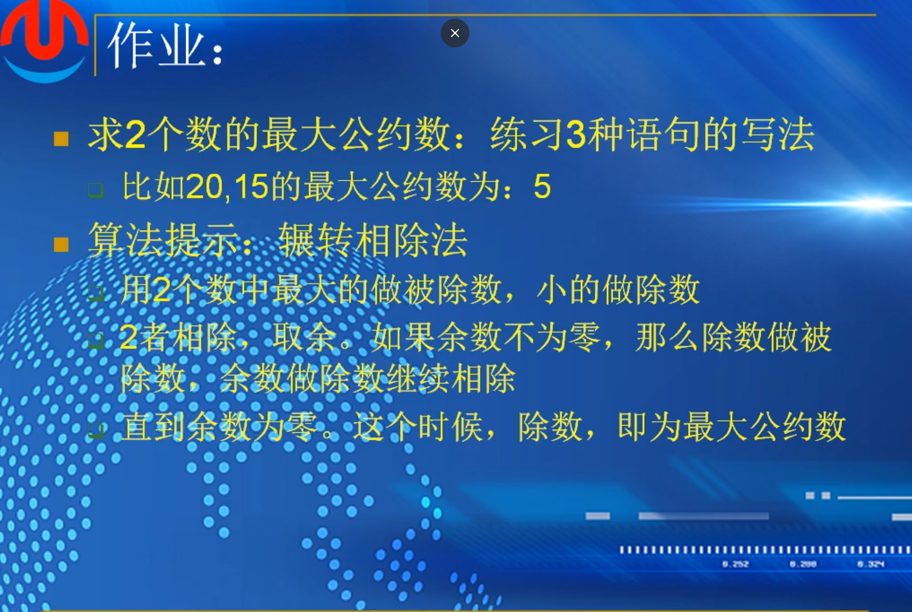
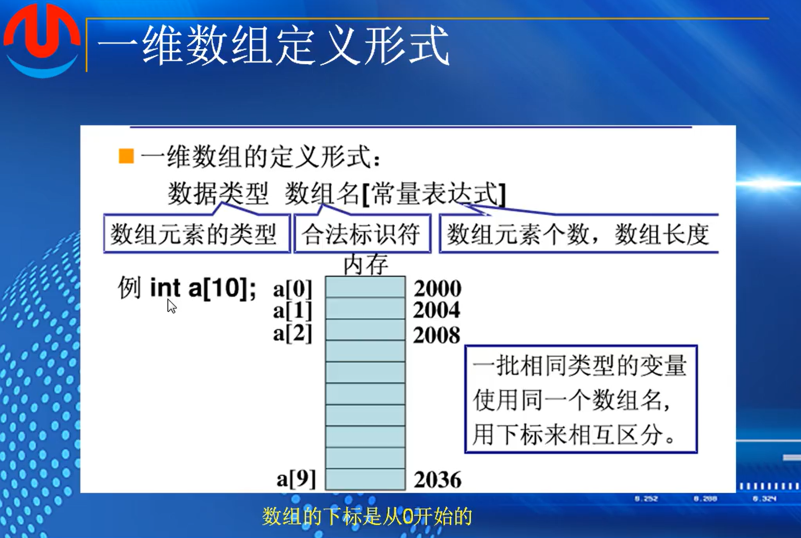
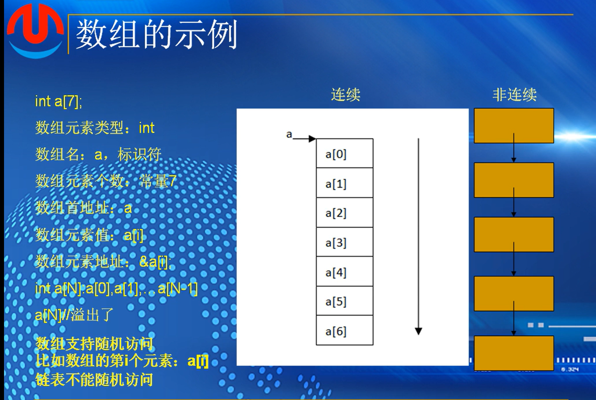
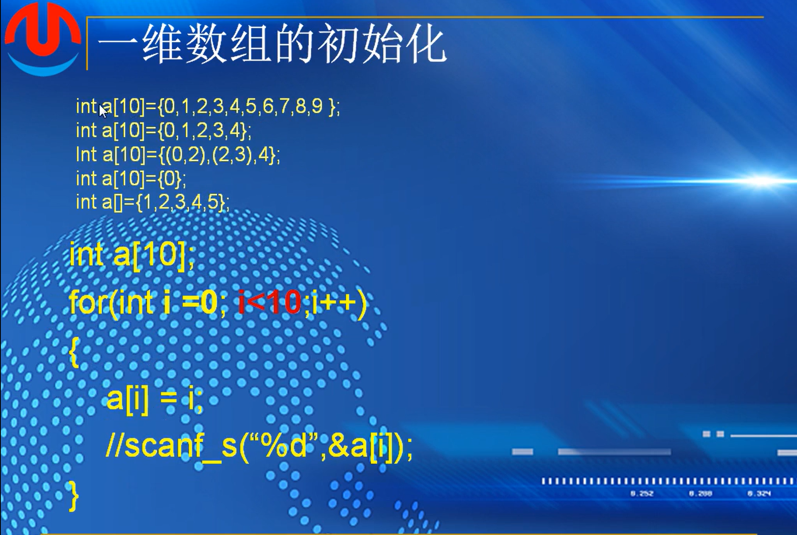
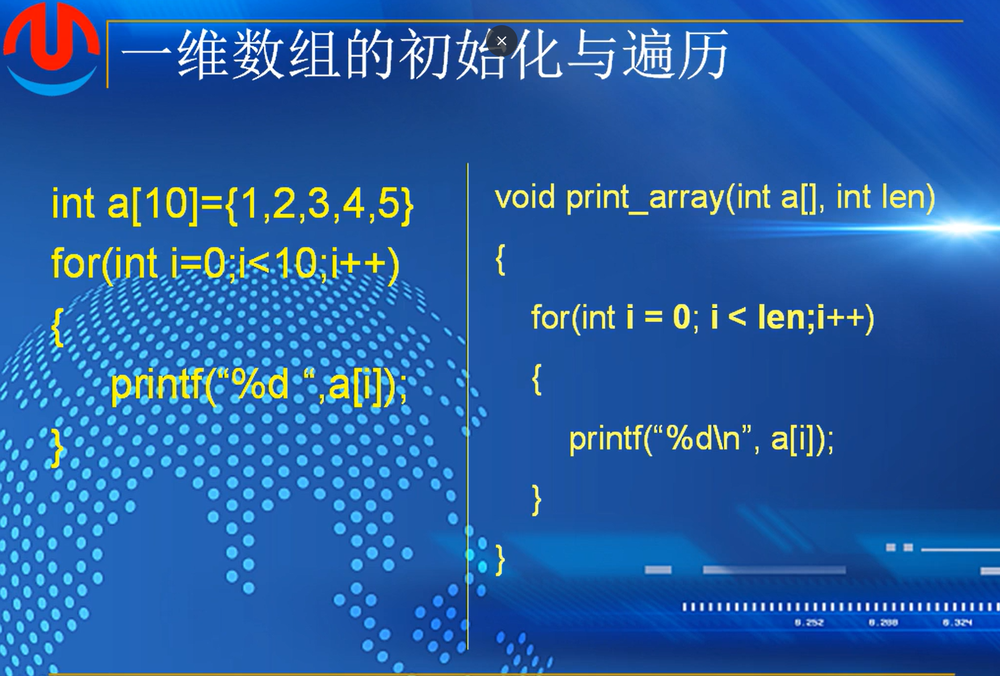

补作业代码4

```
用while来写
#include <stdio.h>
#include <stdlib.h>

int main()
{
	int a=0,b=0;
	printf("Please input two shuzi:\n");
	scanf_s("%d,%d", &a, &b);
	
	while (a / b > 0)
	{
		printf("%d",a);
		goto out;
	}

	printf("%d",b);

	out:
	return 0;
}
```

用一个while和goto来写。

if除了报错就是程序运行不完善，还在重写。

 除了goto不知道如何在循环执行完了之后忽略后续printf直接到return




思路缺陷：

1.怎么将第二次相除之后的结果是否为0和除数代入下一次运算的被除数

2.循环中如何使用，应该使用几个变量来写入代码

以下是网络搜索思路：

```
#include <stdio.h>
#include <stdlib.h>

int main()
{
	int a, b, t;
	printf("请输入两个数字:\n");
	scanf_s("%d,%d", &a, &b);

	while (a % b != 0)
	{
		t = b;//存上一轮的除数
		b = a % b;//这一轮的余数做下一轮的除数
		a = t;//做下一轮的被除数
	}
	printf("%d", b);//最后剩下的除数就是答案
	return 0;

}
```

多设置了一个变量在循环体内赋值，更改算式的值，用的是while循环语句


```
#include <stdio.h>

int main(void)
{
    int x, y, gcd;
    printf("请输入两个正整数：");
    scanf("%d%d", &x, &y);
    if(x < y)
        gcd = x;
    else
        gcd = y;
    while(x % gcd ||y % gcd)
        gcd--;
    printf("gcd = %d\n", gcd);

    return 0;
}
```

用if和while语句并且加上逻辑判断符，先判断大小，


# 第十课-数组

## （1）：一维数组

统计多个人的平均成绩，引入数组

数组，一组相同类型的变量连续的存储再一段内存，并共用一个名字（数组名）。

每个变量使用下标来区别，并被称作数组的元素。数组的下标是从0开始的

由定义看出，每个元素的类型相同，因此各个元素在内存中存放的长度也一样，即他们占用的空间等长的，而数组名，就是这段内存的首地址。存放数组的内存也是连续的

数组根据存放的数据的类型，可分为数值数组，字符数组，指针数组，结构数组等各种类别；而按照数组的维度，又可以分为一维数组，二维数组，三维数组等

***最容易出错，很容易溢出***



数组名，跟表示名一样，必须使用字母，数字，下划线，且数字不开头

a[10]中有0-9，没有10，如果访问a[10]会导致数组溢出，但是程序依然会编译成功，如果溢出之后访问内存，程序会崩溃，读出垃圾数据，或者影响到存储的其他数据。**编译器不检测**



“7”的位置可以是表达式，但是必须是常量表达式

使用a[i]可以直接访问到某个元素（随机访问，通过固定长度乘以下标，能够直接算出地址并对其进行访问*连续，加偏移，加固定长度*）

链表不可以，每一个元素不是连续的，每一次找节点必须要从开头开始一个一个寻找

定义实例：


*a表示指针

#define SIZE 宏定义

初始化：



已定义了的数组的值可以改变

如果只定义了一些，没有定义完，那么剩下未定义的值默认为0

3.是逗号表达式，等价于 int a[10]={1,3,4}

5.未指定个数，通过后续定义的值来定义数组的长度


程序赋值，i<10，满足有效元素

或者通过键盘来输入一个数


**一维数组的初始化与遍历**



键盘为数组赋值例子

```
#include <stdio.h>

int main()

{
	int a[10] = {0};

	for (int i = 0; i < 10; i++)
	{
		printf("Please input the value for %d\n");
		scanf_s("%d", &a[i]);
	}


	for (int i = 0; i < 10; i++)
	{

		printf("%d", a[i]);

	}

	printf("\n");

	return 0;
}

```

定义函数用来打印数组

```
boid print_array(int a[],int len)
{
	for(int i=0;i<len;i++)
	{
		printf("%d",a[i]);
	}
	printf("\n")
}


print_array(a,number)
```


sizeof(a)   a数组所占的长度

sizeof(a[0])  a数组中第一个元素所占的长度

因为数组中每一个元素所占长度相同，所以用总长度除以每一个元素所占长度，就能够计算出数组中元素个数

即sizeof(a)/sizeof(a[0])

