### 字符数组

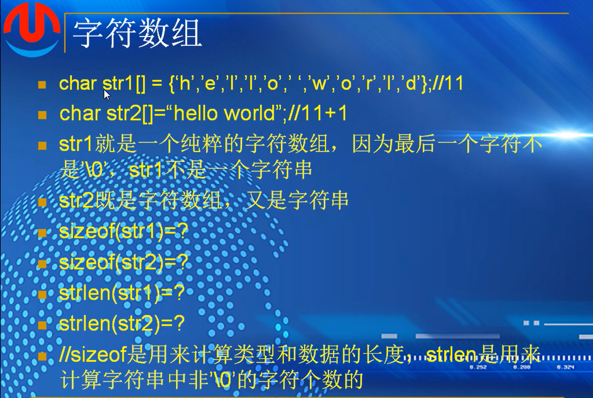

strlen(str1)是非法的，str1不是一个字符串

strlen会从左到右遍历所有元素直到找到最后的0为止，然后减去0，用来计算str1会导致内存溢出

字符串的规定就是最后一位是0

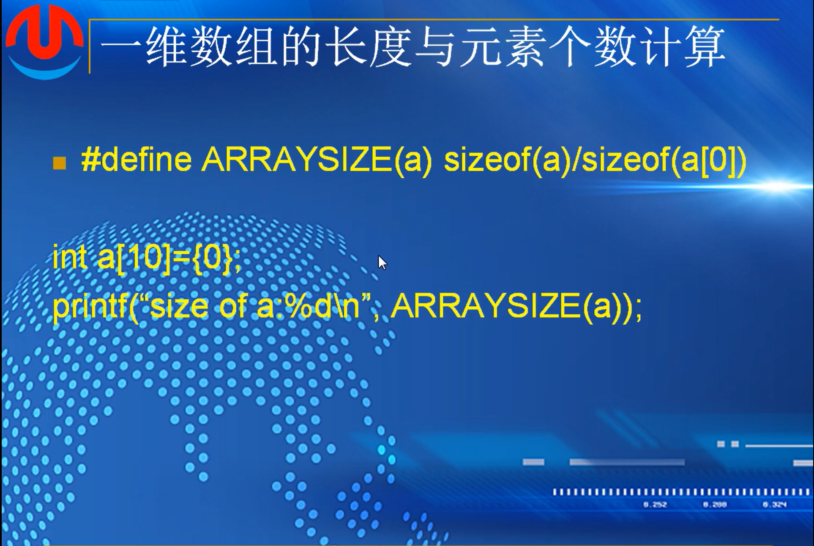

a必须是实参，如果是形参的话会导致计算出错，形参的a会退化成指针，一个指针的长度是四个字节或者说是八个字节

作业：


注意事项


 右边，在定义时候打了；   也就是没有进行初始化，用循环进行遍历初始化

# 第十课-数组

## （2）：二维数组

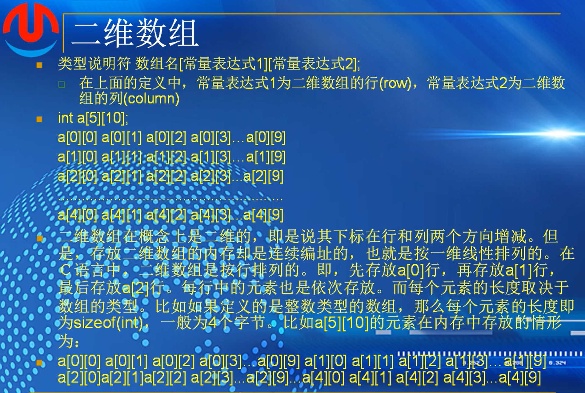

在内存中依然是线性编址

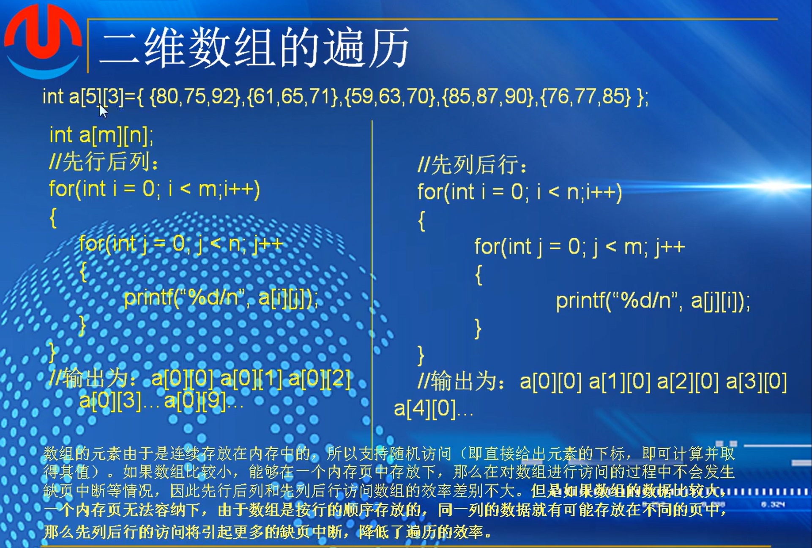

内存页：

两种遍历的实例：

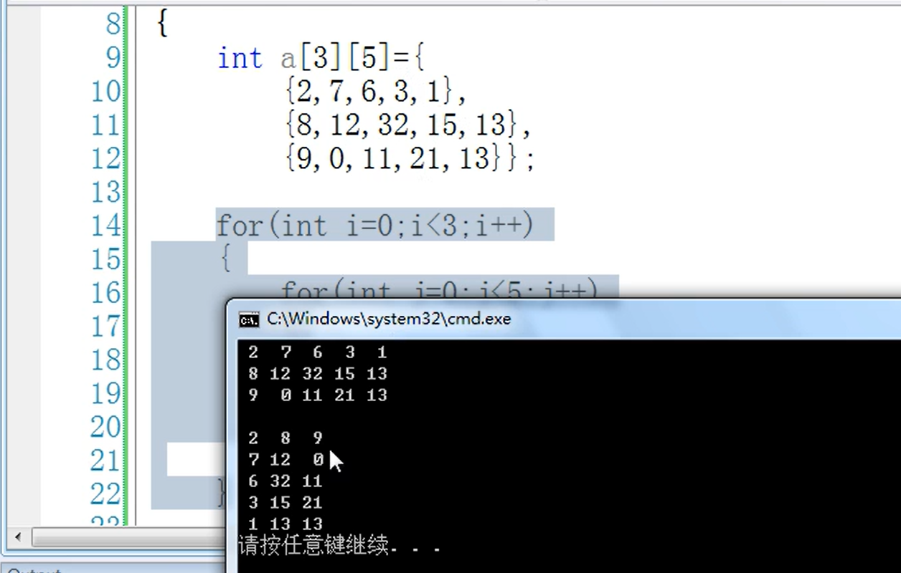

思考：

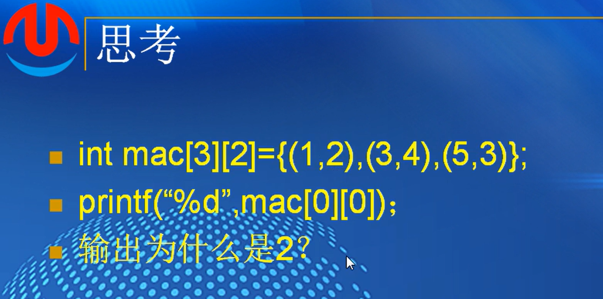

作业2：

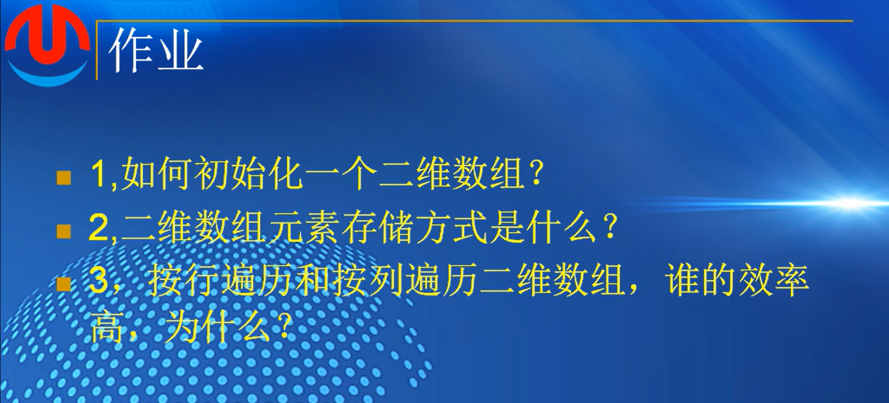

## （3）：数组重要注意事项

首地址

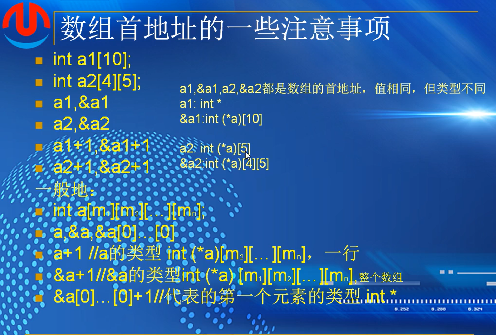

a1，代表的int *类型的指针   

&a1，代表的是整个的一维数组

a2，代表二维数组中的一行

&a2，代表一整个数组

地址相同，类型不一样，指向的内存也不一样，a1代表的指针就指向了4个字节的内存，而&a1代表十个元素也就是指向了40个字节

a1+1,&a1+1                   

a2+1,&a2+1                   意思是，当前数组所在内存地址，向前移动所属类型的字节数的地址，比如int类型4个字节，这个意思就是a1所在内存地址，向前移动4个字节。&a1+1代表了移动40个字节

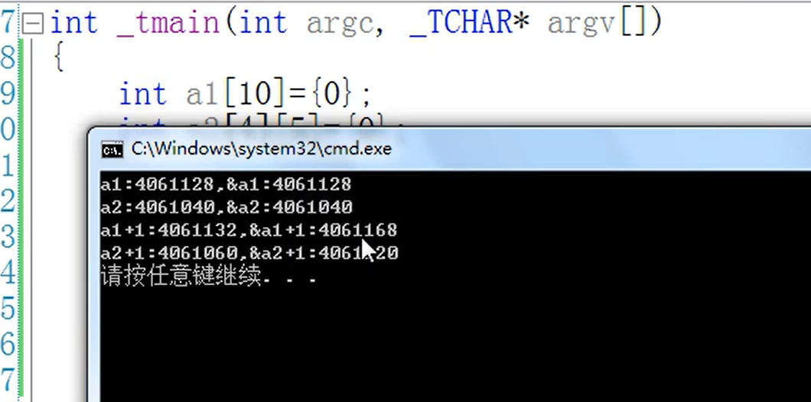

代码：

```
int a1[10]={0};
int a2[4][5]={0};

printf("a1:%d,&a1:%d\n",a1,&a1);
printf("a2:%d,&a2:%d\n",a2,&a2);

printf("a1+1:%d,^a1+1:%d\n",a1+1,&a1+1);
printf("a2+1:%d,^a2+1:%d\n",a2+1,&a2+1);

return 0;
```


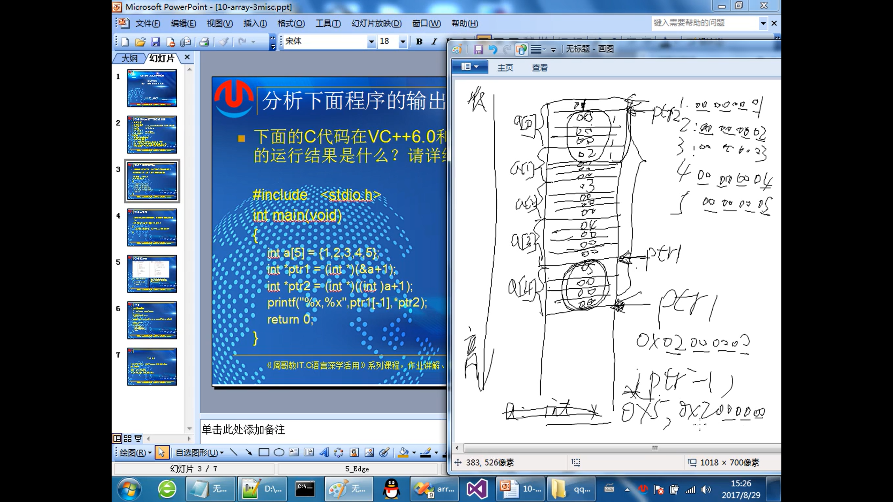

数组做参数

 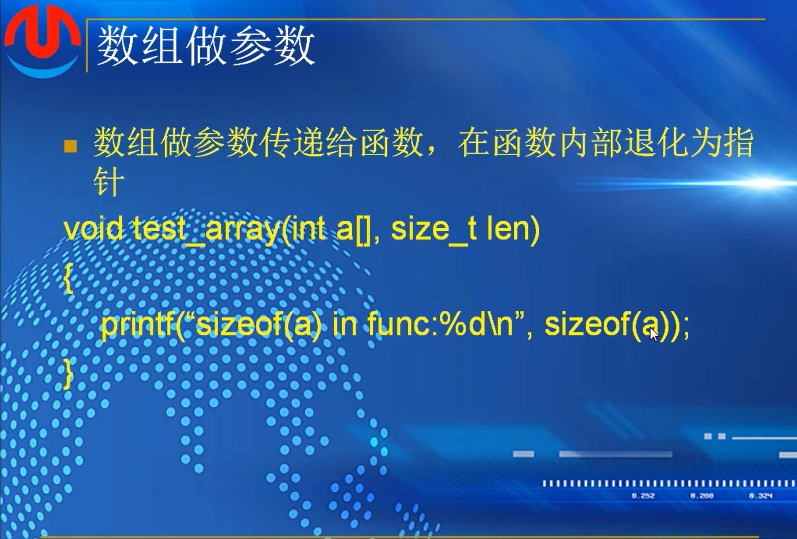


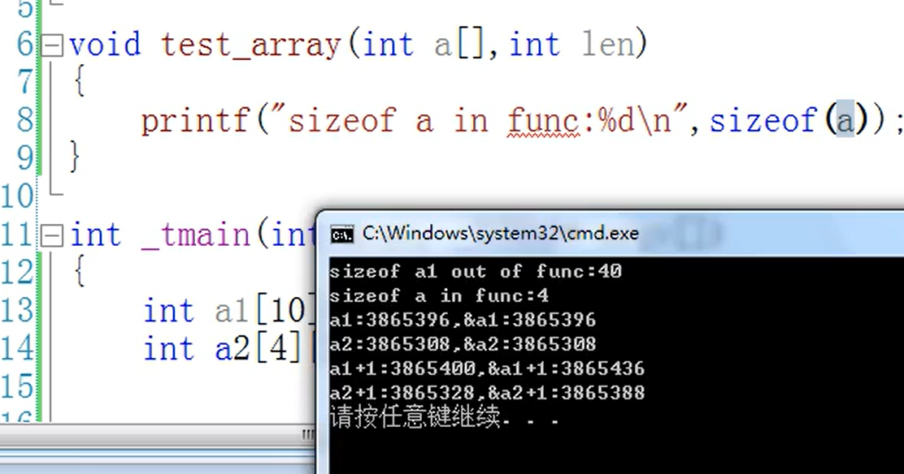

外部计算长度为40个字节，传入函数内部计算长度退化为指针，长度为4个字节，但是依然可以通过这个指针来访问数组中的每一个元素的

数组的溢出

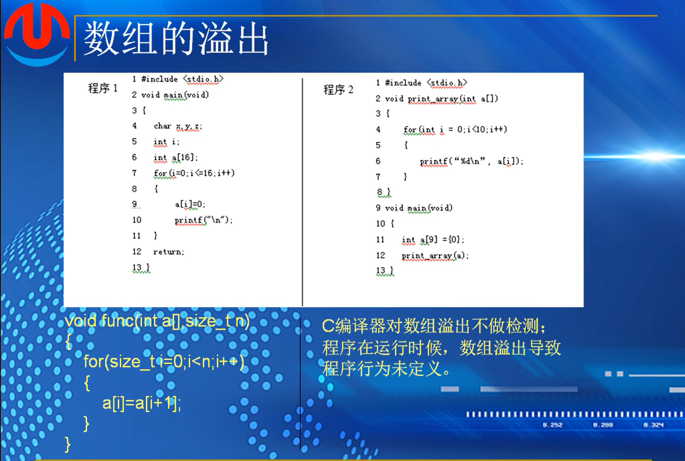

内存溢出，如果访问的该内存地址不存在，导致非法访问，会造成程序崩溃，如果访问的内存地址存在，有可能访问到其他数据，有可能访问到一个垃圾值，对其进行修改可能会破坏程序中其他有用的值，引起整个程序出现异常

程序1：for循环中i<=16，但是定义的a[16]只有0-15号元素，会导致数组溢出

程序2：第一个循环遍历里面设定了i<10，也就是说i会遍历0-9号元素，第二个函数定义里面定义a[9]，只包含了0-8号元素，第九号没有定义，也会导致数组溢出

程序3：i = i+1，a[i]是不存在的，也会导致数组的溢出

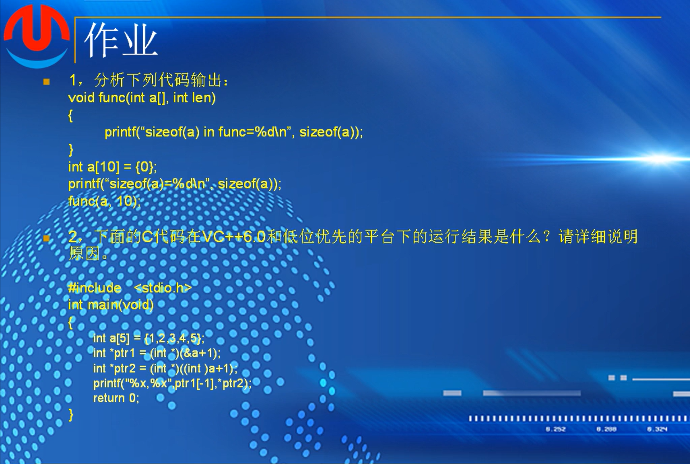


## （4）：数组应用

1.斐波那契数列求和（前20项）

```
int a[20]={0};

a[0]=1;
1[1]=1;

for(int o=2;i<20;i++)
{
	a[i]=a[i-1]+a[i-2];
}

for(int i=0li<20;i++)
{
	printf("%d",a[i]);
}

printf("\n");
return 0;
```

字符串变大小写：

```;
 char str[]="Hello World, 12345678";
 
 
 //*从键盘上输入
 
 char str[128]={0};
 
 printf("Please input a str:\n");
 gets_s(str,128);
 
 //*
 
 int len = sizeof(str)/sizeof(str[0]);
 
 for(int i=0;i<len;i++)
 {
 	if(str[i]>='A'&& str[i]<='Z')
 	{
 		str[i] += 'a'-'A';
 	}
 }
 
 printf("%s\n",str);
 
 return 0;
```

计算平均值：

```
int score[10]={0};

for(int i=0;i<10;i++)
{
	pruintf("Please input the score for %d\n",o)
	scanf_s("%d",&score[i]);
}

for(int i=0;i<10;i++)
{
	total += score[i];
}

float average_score = (float)total/10;

printf("average score is:%f\n",average_score);

return 0;

```

求数组中的最大值：

```
int a[]={98,123,7,2,77,95,23,999,1001,273};
int max_num=a[0];

for (int i=0;i<sizeof(a)/sizeof(a[0]);i++)
{
	if(max_num<a[i])
	{
		max_num=a[i];
	}
}
printf("%d\n",max_num);

return 0;
```

剪刀石头布：     0,1,2

result=(man-computer+4)%3-1

```
#include<stdlib.h>
%include<time.h>


char name[3][20]={"剪刀"，"石头"，"布"};
int computer=0;
int man=0;
srand((unsigned int)time(0));

computer=rand()%3

printf("0:剪刀\n1：石头\n2：布3:退出\n请输入一个数字与计算机一起玩石头剪刀布:\n");
scanf("%d",&man);


if(man<0&&man>2)
{
	printf("非法输入\n");
	return -1;
}
else if(man==3)
{
	break
}

printf("computer:%s,man:%s\n",name[computer],name[man]);

int res=(man-computer+4)%3-1;

if(res>0)
{
	printf("man win\n");
}
else if(res==0)
{
	printf("draw\n");
}
else(res<0)
{
	printf("computer win\n");
}

return 0;


//*
while(1)
{
computer=rand()%3

printf("0:剪刀\n1：石头\n2：布\n");
scanf("%d",&man);

if(man<0&&man>2)
{
	printf("非法输入\n");
	return -1;
}

printf("computer:%s,man:%s\n",name[computer],name[man]);

int res=(man-computer+4)%3-1;

if(res>0)
{
	printf("man win\n");
}
else if(res==0)
{
	printf("draw\n");
}
else(res<0)
{
	printf("computer win\n");
}

return 0;
}

```

求五位同学三个科目每一个科目的平均成绩：

```
char name[3][20]={"Math","C","Foxpro"};

int score[3][5]={
{80,61,59,85,76},
{75,65,63,87,77},
{92,71,70,90,85}

};

for(int i=0;i<3;i++)
{
	int total=0;
	float average=0.0f;
	
	for(int j=0;j<5;j++)
	{
		total+=score[i][j];
	}
	average=(float)total/5;
	printf("%s' s average score is:%.2f\n",name[i],average);
	
}

return 0;

```

作业：

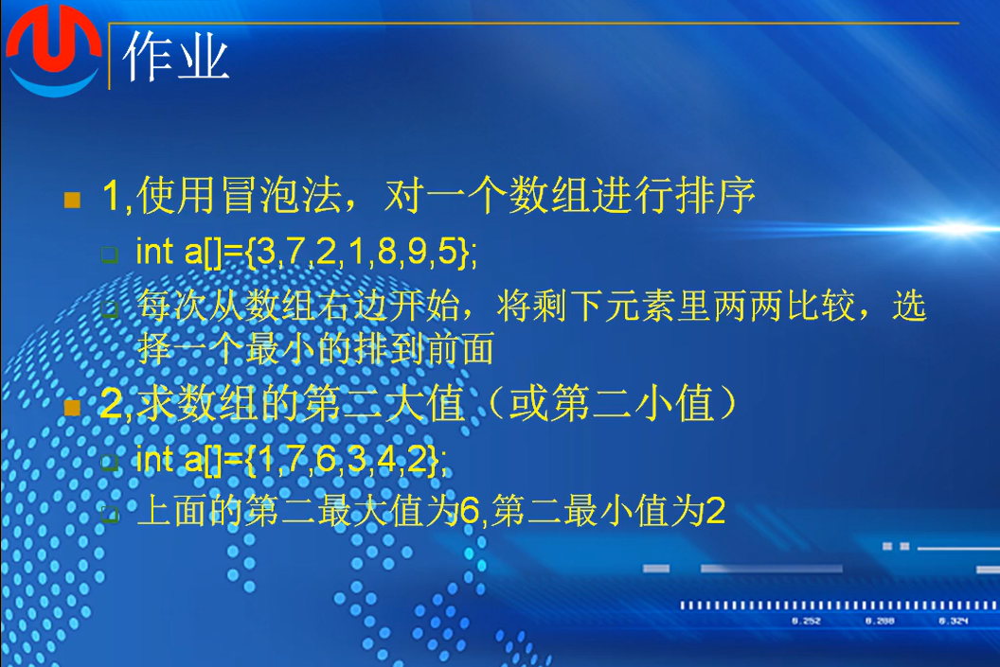


# 第十一课-字符串

## （1）：字符串定义


定义：

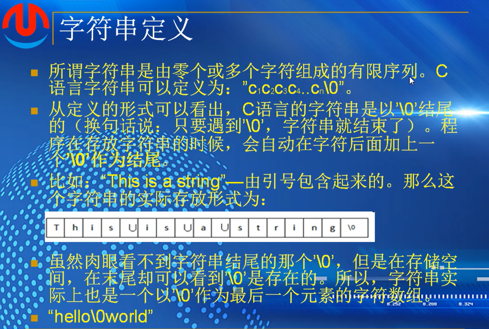

'0'-->48

'\0'-->0

遇到\0字符串即结束 

转义字符：

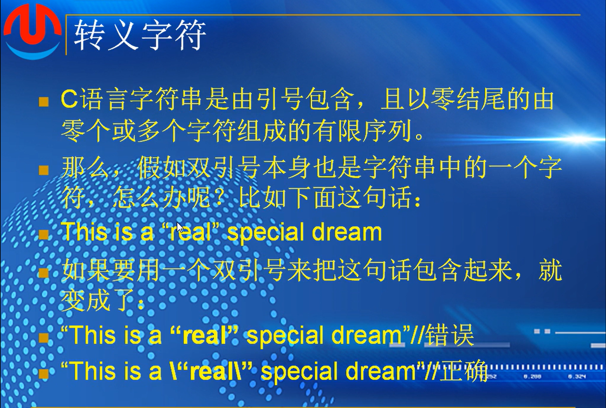

c语言中字符串是用双引号包裹起来的，需要用转移字符表示此处双引号只是一个引号

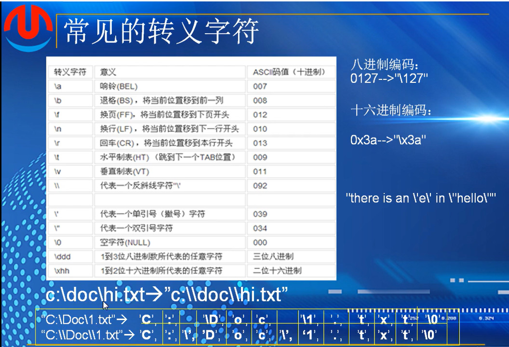

 单引号包裹起来的字符叫字符常量

字符串常量：


“hello world”  字符常量

‘a’是一个字符，"a"是一个字符串

“123”是一个字符串，123是一个整数值   可以调用函数互相切换

“1”.‘1’,1   字符串，字符，整数    

“0”，‘0’，‘\0’，0，NULL    字符串，字符，字符，整数，指针

“”  空字符串，仍然有看不见的0字节

char *str = "hello world"      字符指针  ，字符串存放在静态常量区，赋值给了字符指针，指向了常量区

char str[]= "hello world"      字符常量区的字符赋值给了这个字符数组，并且有0字节，一共12个字节


str1指向静态常量区，静态常量区不能更改   (str1+1)='a' 会报错

str2[1]='1';

**字符不可以赋值给指针，地址可以赋值给指针**

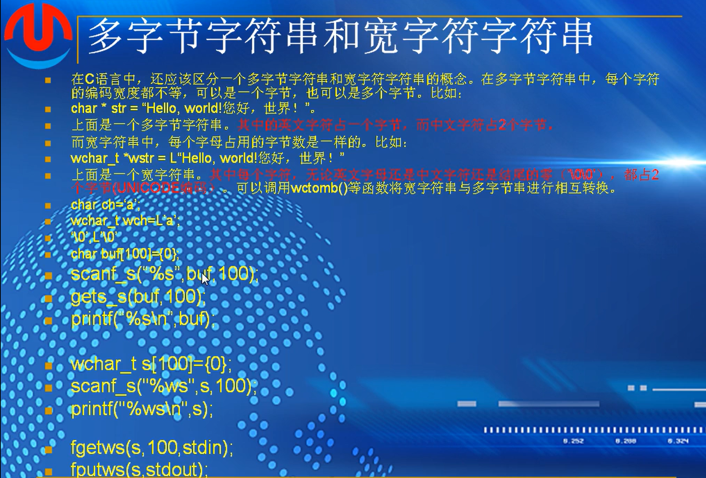

L'a'  占两个字节   unicode编码

'a' 占一个字节

作业：

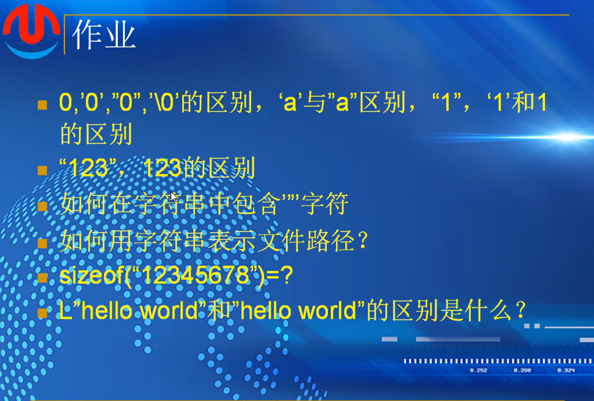