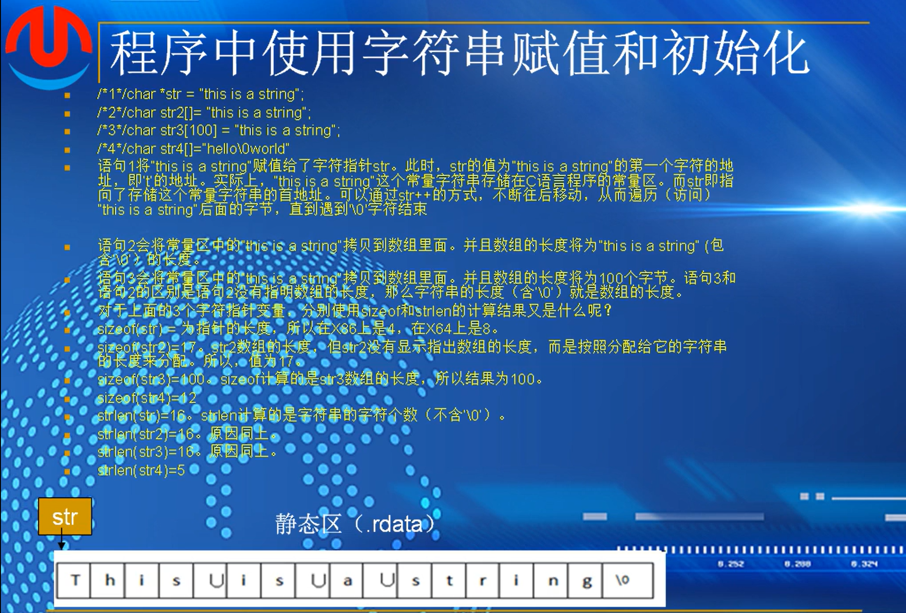
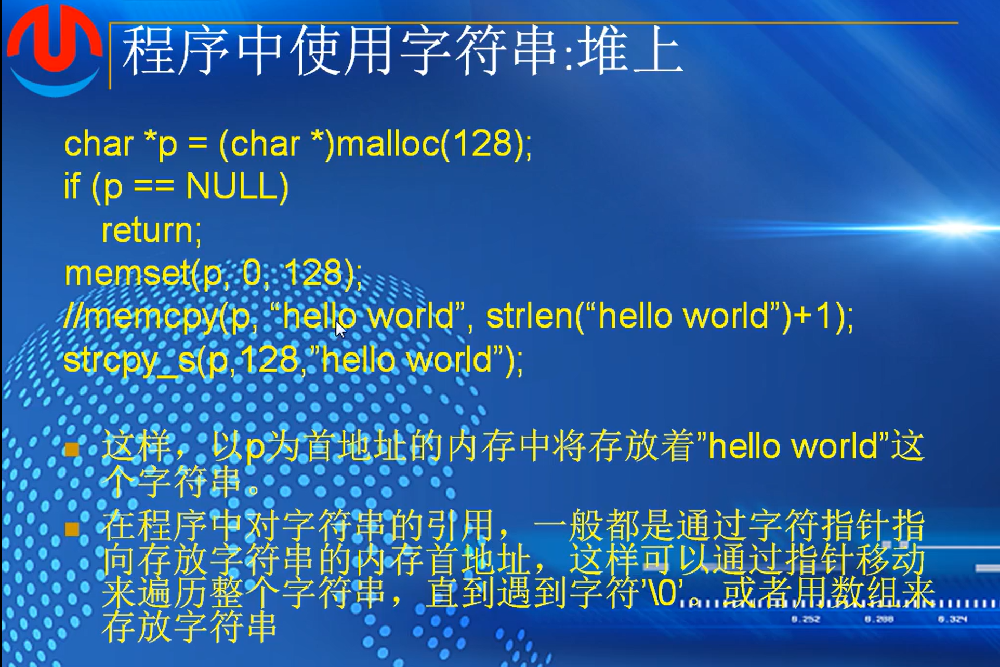
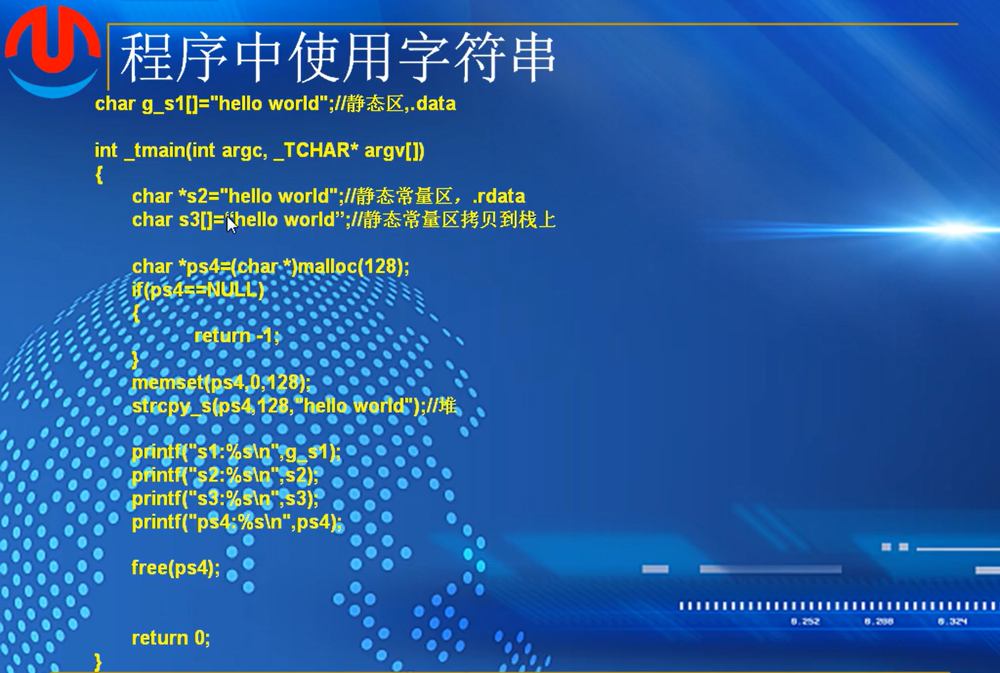
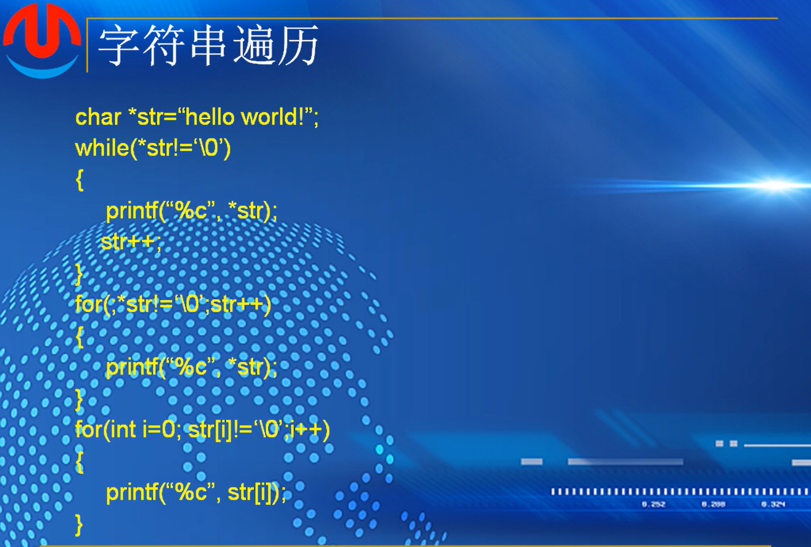
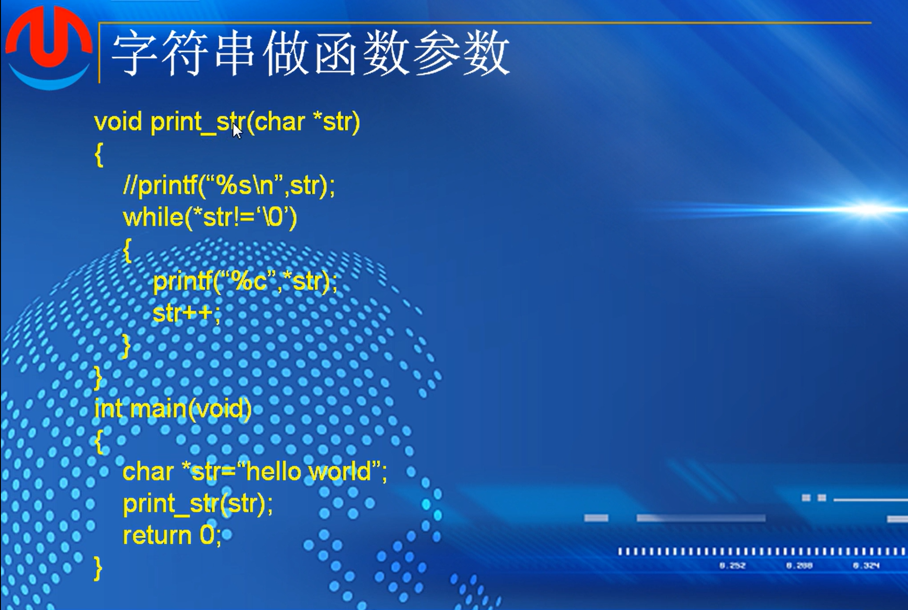
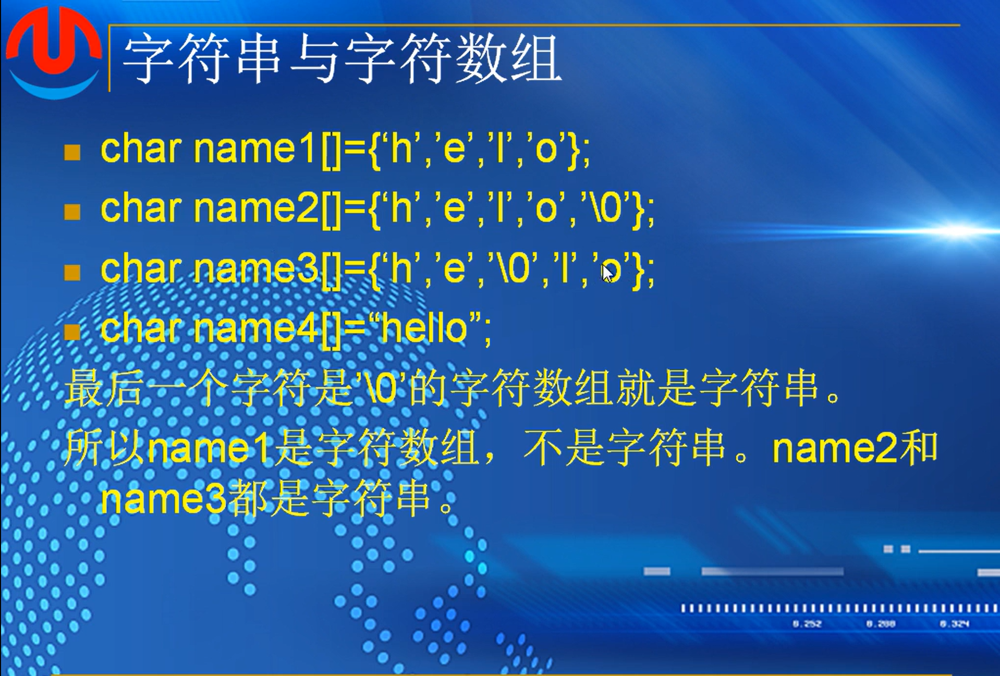
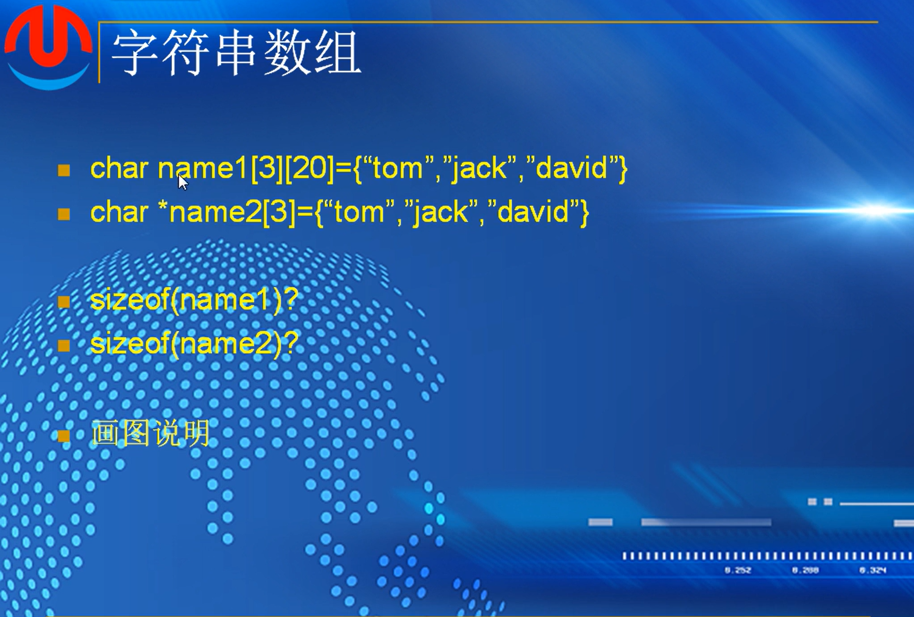
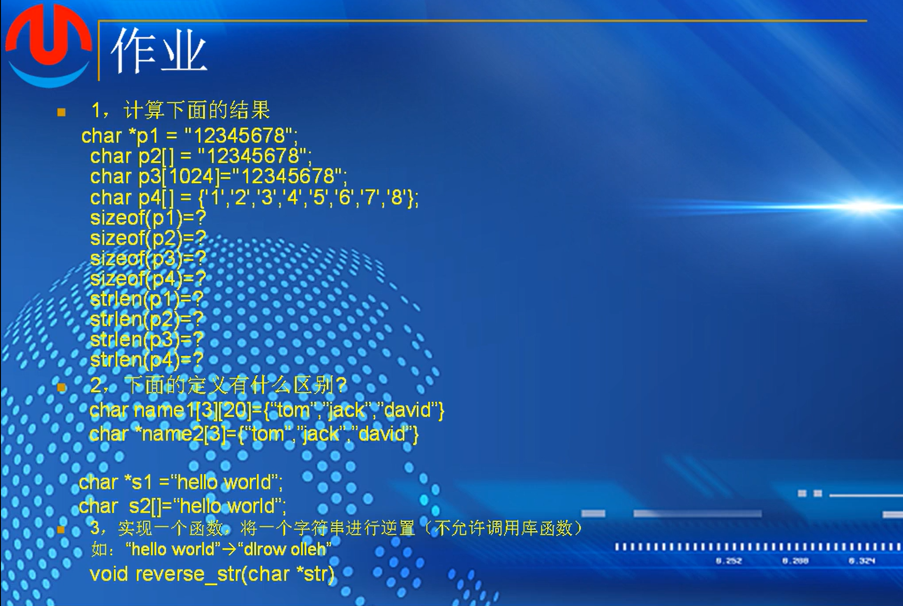

考核1

```
#include <stdio.h>

int main()
{
	char array_1;

	printf("请输入字符串：");
	gets_s("%s", array_1);
	int len=strlen(array_1);
	printf("%d", len);

	return 0;
}

//上述自打，搜索得问题

1.未引入头文件，使用gets语法需要引用string.h头文件
2.gets语法使用错误，正确使用方式gets_s(数组名, 数组大小);
3.使用了未定义字符串array，会警告，应在定义时初始化。
这是用strlen函数方法

或许不是通过键盘输入字符串的方式来取得字符串长度
因为输入之前需要定义字符串长度，而用sizeof直接是输出定义长度，strlen输出除\0长度
//*
#include <stdio.h>
#include <string.h>

int lens(char str[])
{
	char *p = str;
	int counts = 0;
		while(*p++ != '\0')
		{
			counts++ ;
		}
	return counts+1;
}
	

int main()
{
	char str[] = "10d2n821 ma&@&@ 93cdw1!";
	int res = lens(str);
	printf("%d", res);

	return 0;
}
*//代码来源 https://blog.csdn.net/st66688/article/details/108356361

//自打

#include <stdio.h>
#include <string.h>

int lens(char str[])
{
	int j = 0;
	for (int i=0; str[i] != "\0"; i++)
	{
		j++;
	}
	
	return j+1;
}

int main()
{
	char str[] = "10d2n821 ma&@&@ 93cdw1!";
	int res = lens(str);
	printf("%d", res);
	
	return 0;


}

!!!  注意"\0"   '\0'   应该是for遍历到'\0' 而不是字符串"\0"  !!!

```

考核2：

```
#include <stdio.h>
#include <string.h>

int main()
{
	int a[4][4] = {
  {0x16,0x99,0xae,0xc3},
  {0xf8,0xab,0x8f,0x19},
  {0x4d,0xe7,0x65,0x3d},
  {0x30,0x91,0xb1,0xb9}
	};

	int b[4][4] = {0};
	int x = 0;

	for (int i= 0;i<4;i++)
	{
		for (int j = 0; j < 4; j++)
		{
			if (i == 0)
			{
				b[i][j] = a[i][j];
			}
			else if (i == 1&&j+1<4)
			{
				b[i][j] = a[i][j+1];
			}
			else if (i == 1 && j == 3)
			{
				b[1][3] = a[i][j - 3];
			}
			else if (i == 2&&j+2<4 )
			{
				b[2][j] = a[i][j + 2];
			}
			else if (i == 2)
			{
				b[i][2] = a[i][0];
				b[i][3] = a[i][1];
			}
			else if (i == 3)
			{
				b[i][0] = a[i][3];
				b[i][1] = a[i][0];
				b[i][2] = a[i][1];
				b[i][3] = a[i][2];
			}
				printf("%02x ", b[i][j]);
		}
		
		printf("\n");

	}

	
	return 0;
}


//ai

#include <stdio.h>

// 用for循环行移位
void shiftbytes(int arr[4][4]) {
    int temp;
    
    for(int i = 0; i < 4; i++) {
        // 第0行不移位，第1行左移1位，第2行左移2位，第3行左移3位
        int shift = i;
        
        for(int s = 0; s < shift; s++) {
            // 左移一位
            temp = arr[i][0];
            for(int j = 0; j < 3; j++) {
                arr[i][j] = arr[i][j+1];
            }
            arr[i][3] = temp;
        }
    }
}

int main() {
    int a[4][4] = {
        {0x16,0x99,0xae,0xc3},
        {0xf8,0xab,0x8f,0x19},
        {0x4d,0xe7,0x65,0x3d},
        {0x30,0x91,0xb1,0xb9}
    };
    
    printf("原始数组:\n");
    for(int i = 0; i < 4; i++) {
        for(int j = 0; j < 4; j++) {
            printf("%02x ", a[i][j]);
        }
        printf("\n");
    }
    
    shiftbytes(a);
    
    printf("\n变换后数组:\n");
    for(int i = 0; i < 4; i++) {
        for(int j = 0; j < 4; j++) {
            printf("%02x ", a[i][j]);
        }
        printf("\n");
    }
    
    return 0;
}
```

补作业4代码

```
2.

#include <stdio.h>


int main()
{
	int a[] = { 1,7,6,3,4,2 };
	int max_num = a[0];
	int second_num = 0;
	for (int i=0; i < sizeof(a)/sizeof(a[0]); i++)
	{
		if (max_num < a[i])
		{
			max_num == a[i];
			
			if (second_num < max_num && second_num < a[i])
			{
				second_num == a[i];
			}
		}

		printf("该数组最大值是%d，第二大的值是%d\n", max_num, second_num);
	}

	

	return 0;
}


问题：
1.赋值符号，=  == 不对
2.第二大值的赋值逻辑不对
应该是有两条逻辑
  1）second 比max小，max比a[i]小的时候，second更新到max，max更新到更大值
  2）second 比max小，但是a[i]值大于second小于max
  
ai修正后
#include <stdio.h>

int main()
{
    int a[] = { 1,7,6,3,4,2 };
    int max_num = a[0];
    int second_num = a[0];
    
    for(int i = 1; i < sizeof(a)/sizeof(a[0]); i++)
    {
        if(a[i] > max_num) {
            second_num = max_num;  // 旧最大值变成第二大
            max_num = a[i];        // 更新最大值
        }
        else if(a[i] > second_num && a[i] != max_num) {
            second_num = a[i];     // 更新第二大值
        }
    }
    
    printf("该数组最大值是%d，第二大的值是%d\n", max_num, second_num);
    return 0;
}
```

```
作业1：

思路，
int 一个数组
从右边开始，也就是从 a[sizeof(a)/sizeof(a[0]) -1]
int一个整数 int x = sizeof(a)/sizeof(a[0])
每一次比较a[x-1]与a[x]的大小
if a[x-1]>a[x]
将a[x]填入新数组的从0开始的顺序
else  a[x-1]  填入
用i--来表达 限制x的大小，需要使得x-1>0
最后再将所形成的新数组拷贝到原来的a数组

代码：
#include <stdio.h>

int main()
{
    int a[] = {3,7,2,1,8,9,5};
    int b[] = {0,0,0,0,0,0,0};
    int x = sizeof(a) / sizeof(a[0]);
    for (int i=x; i - 2 >= 0; i--)
    {
        if (a[i-2] < a[i-1])
        {
                  for (int y = 0; y < sizeof(a) / sizeof(a[0]); y++)
            {
                   b[y] = a[i - 1];
            }
        }
        else(a[i - 2] > a[i-1]);

        {
                  for (int y = 0; y < sizeof(a) / sizeof(a[0]); y++)
             {
                   b[y] = a[i];
             }

        }

    }
    
    for (int i = 0; i < sizeof(a) / sizeof(a[0]); i++)
    {
        a[i] = b[i];
    }
    
    printf("数组a:%p,数组b:%p", a, b);
    
    return 0;
}


ai修复：
#include <stdio.h>

int main()
{
    int a[] = {3,7,2,1,8,9,5};
    int b[] = {0,0,0,0,0,0,0};
    int x = sizeof(a) / sizeof(a[0]);
    
    for (int i = x-1; i - 2 >= 0; i--)  // 从最后一个有效索引开始
    {
        if (a[i-2] < a[i-1])
        {
            for (int y = 0; y < sizeof(a) / sizeof(a[0]); y++)
            {
                b[y] = a[i - 1];
            }
        }
        else  // 去掉括号和条件
        {
            for (int y = 0; y < sizeof(a) / sizeof(a[0]); y++)
            {
                b[y] = a[i - 2];
            }
        }
    }
    
    for (int i = 0; i < sizeof(a) / sizeof(a[0]); i++)
    {
        a[i] = b[i];
    }
    
    printf("数组a:%p,数组b:%p", a, b);
    return 0;
}

//错误：
1.else后面不跟条件以及；
2.第一次索引a[7]访问未定义内存导致程序崩溃
3.逻辑漏洞
for (int y = 0; y < sizeof(a) / sizeof(a[0]); y++)
            {
                b[y] = a[i - 2];
            }
此内层循环中，没有设置条件，导致每次都是循环遍历b数组每一个值

#include <stdio.h>
int main()
{
    int a[] = { 3,7,2,1,8,9,5 };
    int b[] = { 0,0,0,0,0,0,0 };
    int x = sizeof(a) / sizeof(a[0]);

    for (int i = x - 1; i - 2 >= 0; i--)
    {
        if (a[i - 2] < a[i - 1])
        {
            for (int i = x - 1; i - 2 >= 0; i--)
            {
                if (a[i - 2] < a[i - 1])
                {
                    b[i] = a[i - 1];  
                }
                else
                {
                    b[i] = a[i - 2];  
                }
            }


            for (int i = 0; i < sizeof(a) / sizeof(a[0]); i++)
            {
                a[i] = b[i];
            }

            printf("数组a: ");
            for (int i = 0; i < sizeof(a) / sizeof(a[0]); i++) {
                printf("%d ", a[i]);
            }

            printf("\n数组b: ");
            for (int i = 0; i < sizeof(b) / sizeof(b[0]); i++) {
                printf("%d ", b[i]);
            }
            printf("\n");

            return 0;

        }
    }
}

主要问题
1. 循环嵌套混乱

c
for (int i = x - 1; i - 2 >= 0; i--) {
    if (...) {
        for (int i = x - 1; i - 2 >= 0; i--) {  // 重复的循环
内外层循环都用同一个变量名 i，造成混乱。

2. 逻辑不完整

只处理了 a[i-2] < a[i-1] 的情况

else 分支没有对应的内层循环

3. 提前返回
return 0 在第一次满足条件时就结束程序。


正确的冒泡思路：
#include <stdio.h>

int main() {
    int a[] = {3,7,2,1,8,9,5};
    int n = sizeof(a) / sizeof(a[0]);
    
    // 冒泡排序
    for(int i = 0; i < n-1; i++) {
        for(int j = 0; j < n-1-i; j++) {
            if(a[j] > a[j+1]) {
                // 交换相邻元素
                int temp = a[j];
                a[j] = a[j+1];
                a[j+1] = temp;
            }
        }
    }
    
    // 输出结果
    printf("排序后: ");
    for(int i = 0; i < n; i++) {
        printf("%d ", a[i]);
    }
    return 0;
}
```

## (2):程序中的字符串



1.赋值给了字符指针，其字符存放在静态常量区，赋值是将字符内存的首地址赋给了该指针

通过指针++，可以不断的扫描该字符，直到遇到\0字符为止

2.赋值给了字符数组 str2   ，与上面不同，是将静态区的字符拷贝到str2数组里面，而且字符数组的内存是可以修改的，元素个数，即包含0字符在内的所有字符

3.该字符数组包含了100个元素，赋值的字符串没有100个元素，多余的部分默认为0

4.该字符数组占12个字符，相当于整体的字符串赋值进入，sizeof(str4)=12,但是如果用strlen来计算字符串的值的话，会在第一个\0截断

#### 程序中使用字符串 堆上





可以存在全局数组里面，可以用指针指向，可以拷贝到栈上，可以从堆里分配字节来存放

堆上用了之后需要free，否则会造成内存的泄露

s2指向了hello world的地址，不能通过s2来更改数组里元素的值   **编译发现不了，但是程序会崩溃**

静态常量区是不可以修改的

#### 字符串的遍历



#### 字符串做参数



#### 字符串与字符数组



1.纯粹的字符数组

2.可以当作一个字符串

3.作为字符数组有5个元素，作为字符串有前面三个元素

4.即是数组也是字符串

### 字符串数组



作业

