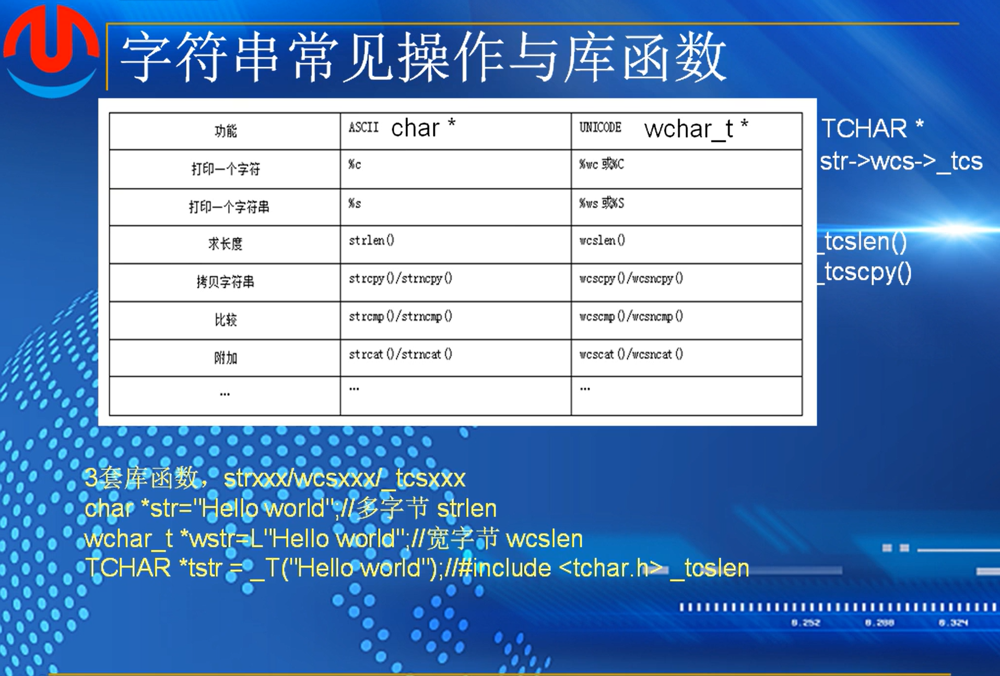
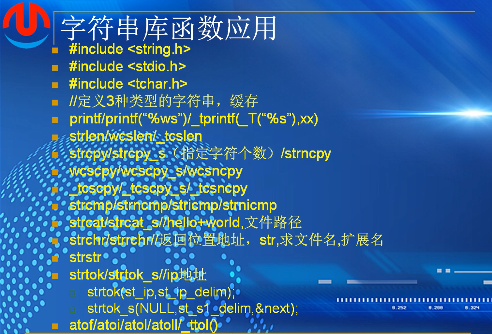
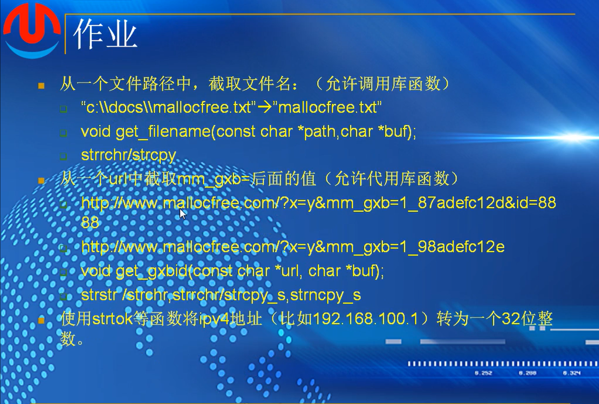

## （3）：字符串API

#### 常见操作和库函数

定义了标准的用来操作字符串的库函数，叫做api



第一套：str  操作多字节字符串

第二套：wcs   计算宽字节字符串

第三套：_tcs     #include <tchar.h>    既可以是多字节也可以是宽字节

**建议统一使用第三种方式来定义字符串**   比较灵活，可以自动切换

 #### 字符串库函数应用



###### 示例代码

```
#include <stdio.h>
#include <tchar.h>
#include <string.h>
#include <stdlib.h>
#pragma warning(disable:4996)


int main()
{
	char *s1 = "hello world 1";
	wchar_t *s2 = L"hello world 2";
	TCHAR *s3 = _T("hello world 3");

	char buf1[128] = { 0 };
	wchar_t buf2[128] = { 0 };
	TCHAR buf3[128] = { 0 };

	printf("s1:%s\n", s1);
	printf("s2:%ws\n", s2);
	_tprintf(_T("s3:%s\n"), s3);

	//计算字符串的长度

	size_t len1 = strlen(s1);
	size_t len2 = wcslen(s3);
	size_t len3 = _tcslen(s3);

	//拷贝字符串
	//不安全的,只是可以使用	strcpy(buf1, s1);    
	// strcpy_s(buf1, 128, s1);   会将拷贝字符串与限定字节大小作比较，如果大于则不会拷贝
	// printf("buf1:%d\n", buf1);

	//  linux平台拷贝
	// 	需要定义长度，计算实际拷贝大小，防止内存溢出
	//  int min_len = sizeof(buf1) > len1 ? len1 : sizeof(buf1) - 1
	//	strncpy(buf1, s1,min_len);
	//  printf("buf1:%s\n",buf1);

	//宽字符的处理
	//wcscpy(buf2, s2);
	//wcscpy_s(buf2,123, s2);
	//int min_len2 = sizeof(buf2) / sizeof(wchar_t) > len2 ? len2 : sizeof(wchar_t) - 1;
	//wcsncpy(buf2, s2,min_len2);
	//printf("buf2:%ws\n", buf2);

	//tcs 处理方法
	//_tcscpy(buf3,s3);
	// int min_len3 = 128 > len3 ? len3 : 127;
	//_tcscpy_s(buf3, 128, s3);
	//_tprintf(_T("buf3:%s\n"), buf3);
	
	// printf("%d,%d,%d\n", len1, len2, len3);


	// 两个字符串进行比较
	char* st1 = "hello world";
	char* st2 = "hello china";

	//if (strcmp(st1, st2) == 0)
	//{
	//	printf("%s==%s\n", st1, st2);
	//}
	//else
	//{
	//	printf("%s!=%s\n", st1, st2);
	//}

	//if (strnicmp(st1, st2,5) == 0)
	//{
	//	printf("%s==%s\n", st1, st2);
	//}
	//else
	//{
	//	printf("%s!=%s\n", st1, st2);
	//}

	//字符串拼接
	char path[260] = "c:\\doc\\test\\";
	char* filename = "mallocfree.txt";

	//对path来说，filename过长会超出范围，导致缓存区溢出，strcat不检查

	strcat(path, filename);
	printf("path:%s\n", path);


	//返回位置地址
	//strchr从左往右找strrchr从右往左找
	//比如在上述的path路径中找冒号
	//path:c:\doc\test\mallocfree.txt

	//strchr(path, ':');//该函数返回的是path中冒号的指针值，所以应该是:
	char *p=strchr(path, ':');
	if (p != NULL)
	{
		printf("found it:%s\n", p);
	}
	else
	{
		printf("not found it\n");
	}

	//对于单独找出文件名部分，从右往左找，找斜线位置，再斜线加一

	printf("filename:%s\n", strrchr(path, '\\') + 1);
	printf("filename:%s\n", strrchr(path, '.') );//求拓展名

	//strstr  从一个字符串中找到子串

	char* p1 = strstr(s1, "orl");
	if (p1 != NULL)
	{
		printf("p1:%s\n", p1);
	}
	else
	{
		printf("not found it\n");
	}

	//strtok   拆分字符串

	char ip[] = "192.168.100.1";
	const char *delim = ".";//分隔符可以多设定几个，比如"._ "
	char* next = NULL;

	char* p2 = strtok_s(ip, delim,&next);//char *p2 = strtok(ip, delim);
	while (p2 != NULL)
	{
		printf("%s\n", p2);
		p2 = strtok_s(NULL, delim,&next);//拆分之后会记住地址，不用传参到null位置
	}

	//字符串，整数，浮点数转换方法
	
	char *value = "3.1415";
	float f = atof(value);
	printf("f:%f\n", f);

	char* v1 = "123";
	int i = atoi(v1);
	printf("i:%d\n", i);

	TCHAR *v2 = _T("678");
	int v = _ttol(v2);
	printf("v:%d\n", v);

	return 0;
}
```

strcmp 两个字符串进行整体的比较，有一个字符不对就不相等，相等返回0，如果第一个大于第二个返回正数，小则负数

strncmp表示前n个字符，只要前n个字符相同返回0

stricmp 比较大小时候忽略大小写

strnicmp 比较前面n个字符是否一样并且忽略大小写


###### 作业：

###### 


