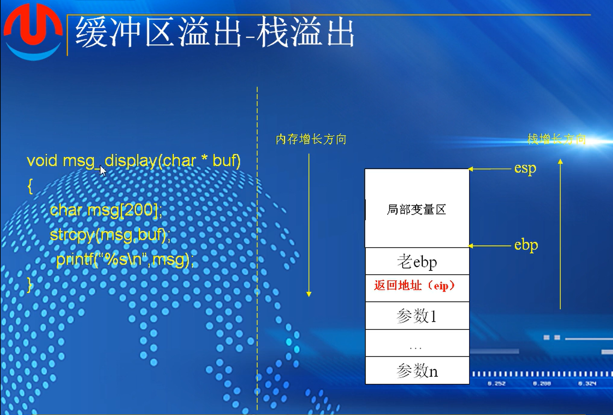
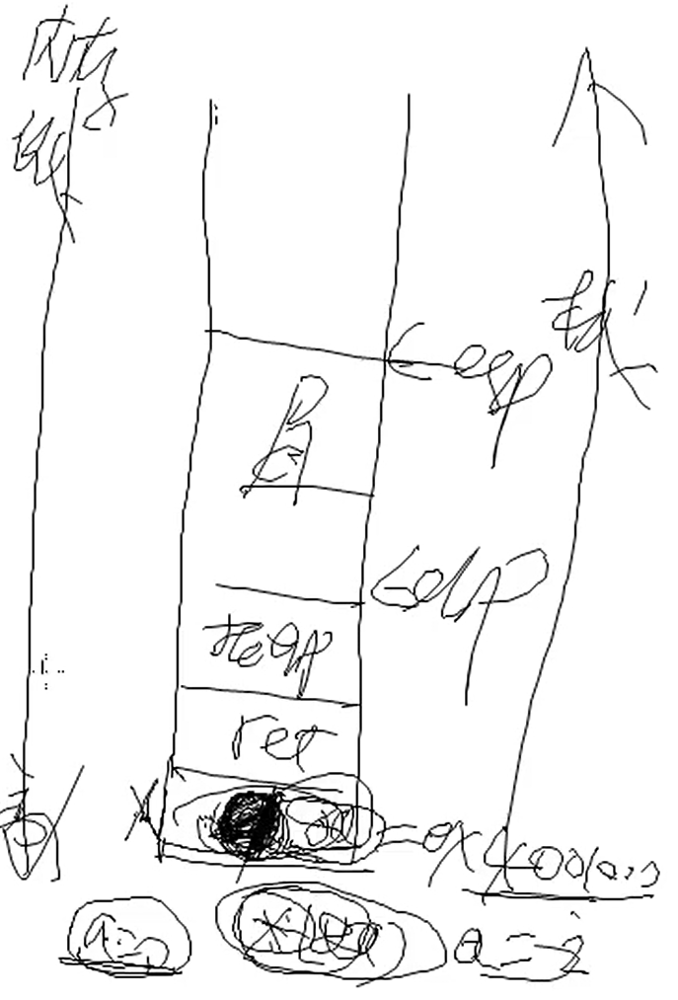
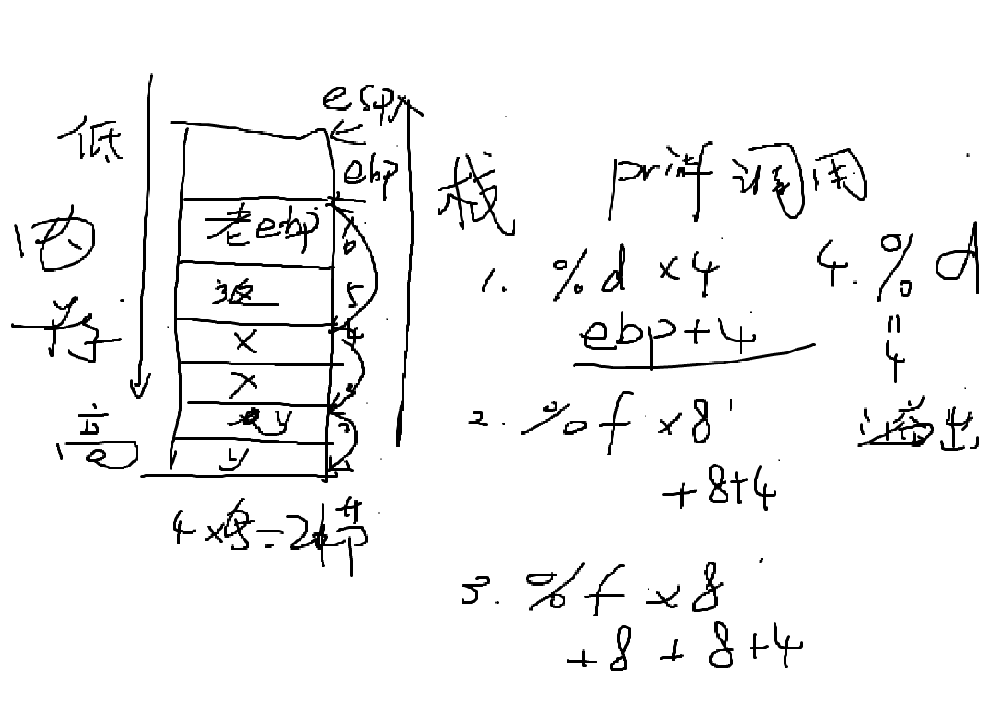
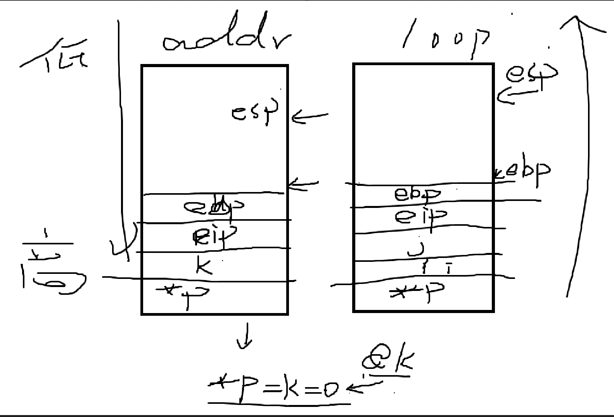
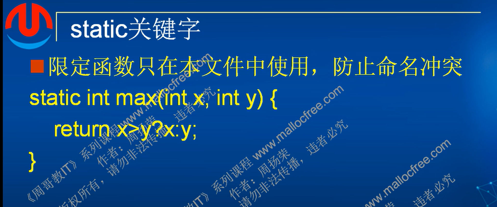
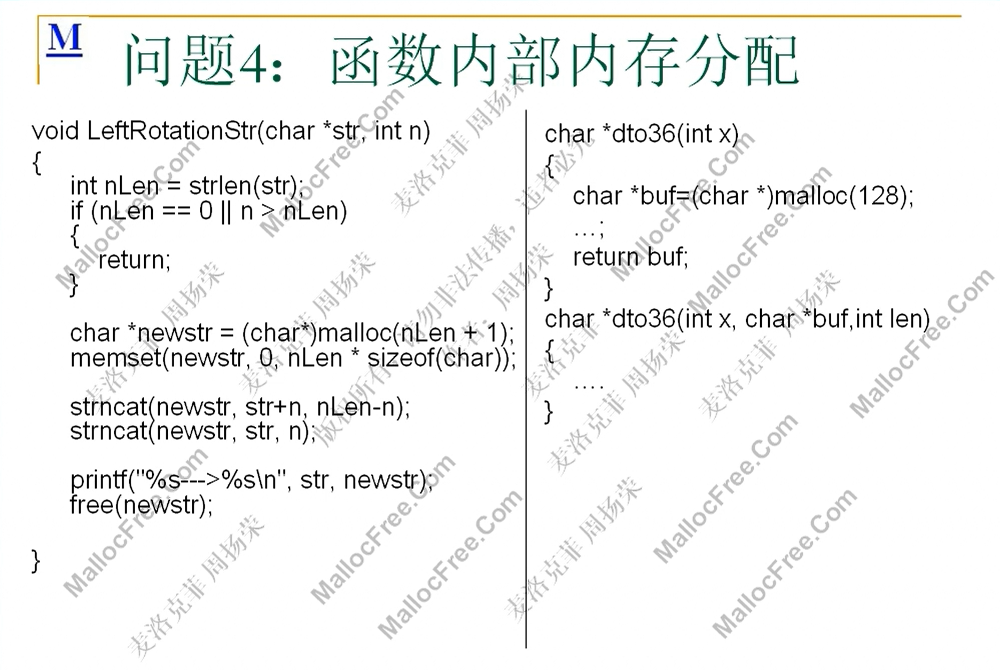
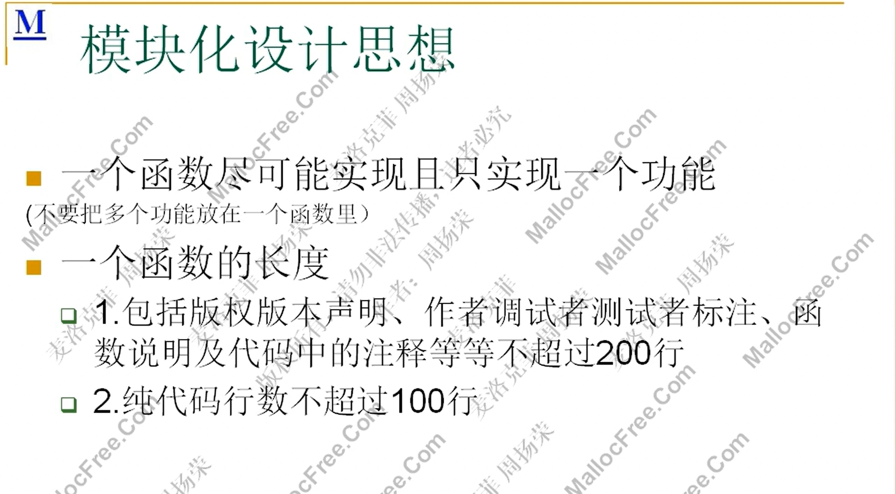
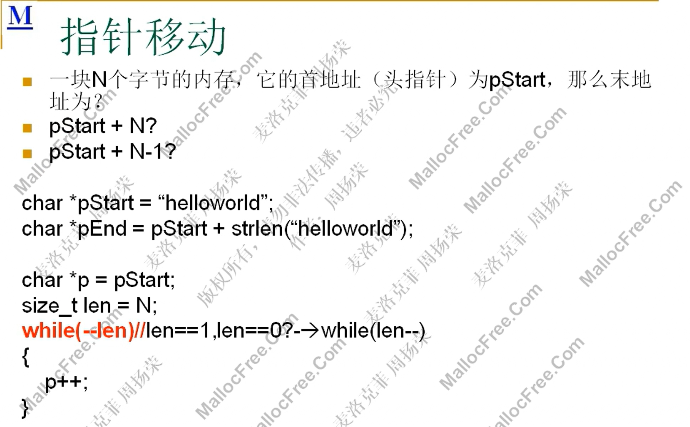
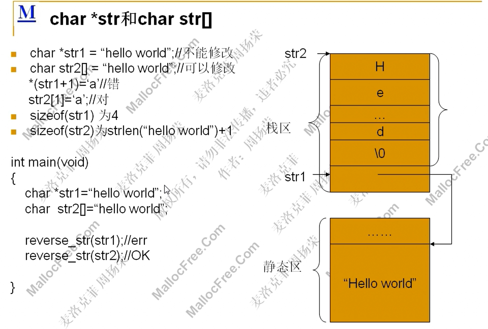

# 第十二课-函数

## （1）：函数定义与应用

### 定义


### 定义形式与调用，调试


输入参数：外部传递给函数

输出参数：函数计算的结果，可以通过输出方式传递给调用值；也能用return方式返回给调用值

有的函数即做了输出参数也做了输入参数

变参函数：函数的参数个数可以变化，比如printf函数在打印的时候，可以打印多个

### 函数应用，头文件写法（导出函数和变量）


```
#include <stdio.h>
#include <stdbool.h>

int myadd(int x, int y)//声明的时候可以不用形参，只加两个类型也可以
{
	int res;
	res = x + y;
	return x + y;
}

int getmax(int x, int y)
{
	return x > y ? x : y;
}

bool leep_year(int year)
{
	(year % 4 == 0) && (year % 100 || year % 400 == 0);
}

char mytolower(char ch)
{
	if (ch >= 'A' && ch <= 'Z')
	{
		ch += 'a' - 'A';
	}

	return ch;
}

void swap(int x, int y)//整数进行交换就不需要返回值
{
	int tmp = x;
	x = y;
	y = tmp;
}

暂时如此，后续实验出现问题有更改
1.使用bool类型需要包含头文件
这是在myfunc.c里面打的函数，跟main函数不在同一个源文件里
```

#### 写头文件

~~~
#pragma once
#include <stdbool.h>

int myadd(int x, int y);        //保证头文件项目在编译的时候只被包含一次
int getmax(int x, int y);       //然后将刚刚写的函数全部放在里面声明
bool leep_year(int year);       //再到源文件里写包含
char mytolower(char ch);        //自己写的源文件用""。引号是从当前目录开始查找
void swap(int x, int y);        //而<>是从系统目录开始查找
~~~

预编译

```
#ifndef _MYFUNC_H_
#define _MYFUNC_H_

int myadd(int x, int y);        
int getmax(int x, int y);      
bool leep_year(int year);       
char mytolower(char ch);       
void swap(int x, int y);        

#endif
```

swap运行之后函数的值没有发生交换

**形参和实参的区别**

在函数内部完成了形参的交换，但实际上设定的函数实参没有发生改变

采用的传参方法叫传值，传值是不能改变实参的，传值是将实参的值拷贝到了形参的位置，改变形参并不会改变实参，上述定义的函数都是采用传值的方法运行的

### main函数参数的使用


例子:


```
#include <stdio.h>
#include <string.h>
#include <tchar.h>

int _tmain(int argc, _TCHAR* argv[])
{

	if (argc != 2)
	{
		printf("Invalid parameters\n");
		return 0;
	}
	
	for (int i = 0; i < argc; i++)
	{
		_tprintf(_T("%s\n"), argv[i]);
	}
	
	return 0;
}

exe中-->属性-->调试-->命令参数
```

argv中，argv[0]永远是我们程序自身，此程序中拿两个参数，即自身和在调试中输入的命令行参数，两个

### 函数定义注意事项


*功能单一*   方便维护，可模块化


输入输出，设计函数的接口

局部变量要进行初始化

严进宽出：严格判断是否合法，长度是否合理，类型是否匹配

assert  断严

复杂度  时间短  尽量不分配内存

边界考虑：特殊情况，考虑所有的情况，大于小于，多了少了，内存是否重叠

功能测试：调用，测试，不同的测试用语

return不可以返回指向栈内存，栈内存在结束时会被释放

#### 逆置字符串

定义了函数

~~~
#include <stdio.h>
#include <string.h>
#include <tchar.h>

void reverse_str(char* str)
{

	int len = 0;
	char* s = str;
	while (*s != '\0')
	{
		s++;
		len++;
	}

	for (int i=0; i < len / 2; i++)
	{
		char ch = str[i];
		str[i] = str[len - 1 - i];
		str[len - 1 - i] = ch;
	}

	return str;
}

int main()
{
	char* str = "hello world";

	printf("str before:%s\n", str);
	reverse_str(str);
	printf("str after:%s\n", str);
	return 0;
}


改为char str[] = "hello world";
就不会崩溃，这样是在栈上分配的地址，栈上的地址是可读可写的
~~~

在进行逆置字符串的操作，这一段内存必须是可读可写的，上述代码会崩溃

用指针指向的 “hello world”  是存储在静态常量区是不能读写的

该函数设计上问题：

1.没有模块化

也就是需要把计算字符串长度这一段代码单独弄出来形成一个函数

```
#include <stdio.h>
#include <string.h>
#include <tchar.h>

int mystrlen(const char* str)
{
	int len = 0;
	char* s =(char *) str;
	while (*s != '\0')
	{
		s++;
		len++;
	}

	return len;
}


void reverse_str(char* str)
{
	int len = mystrlen(str);

	for (int i=0; i < len / 2; i++)
	{
		char ch = str[i];
		str[i] = str[len - 1 - i];
		str[len - 1 - i] = ch;
	}

	return str;
}

int main()
{
	char str[] = "hello world";

	printf("str before:%s\n", str);
	reverse_str(str);
	printf("str after:%s\n", str);
	return 0;
}

```

### 库函数


```
#include <stdio.h>
#include <Windows.h>

int main()
{
	char *filename="d:\\docs\\1.doc";   //1.txt 可行，改成1.doc不行，所以打错误代码
	int res =remove(filename);
	if(res==0)
	{
		printf("delted!\n");
	}
	else
	{
		printf("failed\n");
	}
	
	errno_t err=GetLastError();
	printf("err:%d\n",err)
	//通过错误码32，tool中搜索得知是因为文件正在运行
	
	
	return 0;
}
```

### 面向对象和面向过程


面向过程：抽象出解决问题的步骤，然后用函数表达步骤，解决的时候一一调用

面向对象：抽象出问题里面的对象，然后分析对象的行为，解决问题是对象发生了什么样的行为，调用对象的行为

##### 作业


1.

```
#include <stdio.h>
#include <string.h>
#include <stdlib.h> 

int main()
{
	char str[] = "hello world";
	int len = sizeof(str) / 2 - 1;
	char* p1 = str[0];
	char* p2 = str[len];

	for (int i = 0; i <len; )
	{
		for (int j = len+1 ; j < strlen(str); )
		{
			char tep = str[i];
			str[i] = str[j];
			str[j] = tep;
			++i;
			++j;

		}
	}

	for (int i = 0; i < sizeof(str); i++)
	{
		printf("%c", str[i]);
	}
	return 0;
}

```

2.

```

```


## （2）：函数传参


传引用是c++里面的

c语言里面有两种，函数里面传参有三种

#### 传值

拷贝实参的值，无法改变实参

func1  形参x是a的值的拷贝，x与a独立

#### 传指针

拷贝实参的地址，可以改变实参

func2 形参*x是a的地址的拷贝，x就是a     引用中取用了a的地址

#### 传引用

void func3(int &x)

传过来引用的地址，可以改变实参，x就是a 

如果一个函数有多个参数，每一个参数可以有不同的传值方法

**指针可能会指向错误的内存的地址，难以驾驭，可能破坏程序**


在传引用的情况下，形参就是实参的别名，代表的就是实参

### 传值还是传指针


并非函数设定的指针，在传参的时候就是在传指针，而是看传的实参，是否是传的指针

func2(&c2)  //传c2的地址，是传指针，传指针的指针，二级指针

~~~
void func1(char *c);
void func2(char **c);

int main(void)
{
	char c1;
	char *c2;

	func1(&c1);
	func1(c2);
	
	//func1(&c2)错误,func1本身是一级指针，&c2取地址就二级指针了，就是语法错误
	
	func(&c2);
	return 0;
	
	
	
}
~~~

 #### swap-交换


 ```
#include <stdio.h>
#include <string.h>
#include <tchar.h>

void swap1(int x,int y)
{
	int tep = x;
	x = y;
	y = tep;
}

void swap2(int *x, int *y)
{
	int tep = *x;
	*x = *y;
	*y = tep;
}

void swap3(int &x, int &y)
{
	int tep = x;
	x = y;
	y = tep;
}
int main()
{
	int x = 10;
	int y = 20;


	swap1(x,y);
	printf("x:%d,y:%d\n", x,y);

	swap2(&x,&y);
	printf("x:%d,y:%d\n", x, y);

	x = 10;
	y = 20;


	swap3(x,y);
	printf("x:%d,y:%d\n", x, y);


	return 0;
}

 ```

### 函数用参数作为返回值


做输出参数的时候，必须使用传指针或者传引用，因为传值无法改变实参

```
#include <stdio.h>
#include <string.h>

int add1(int x, int y)
{
	return x + y;
}

void add2(int x, int y, int* sum)
{
	if (sum == NULL)
		return;
	*sum = x + y;
}

void add3(int x, int y, int& sum)
{
	sum = x + y;
}

void add4(int* x, int y)
{
	*x = *x + y;
}

void add5(int &x, int y)
{
	x = x + y;
}


int main()
{
	int a = 10;
	int b = 20;
	int sum = 0;

	sum = add1(a, b);
	printf("sum:%d\n", sum);

	add2(a, b,&sum);
	printf("sum:%d\n", sum);

	add3(a, b,sum);
	printf("sum:%d\n", sum);

	add4(&a, b);
	printf("sum:%d\n", sum);
	
	a= 10;
		add5(a,b);
	printf("sum:%d\n", sum);
	return 0;
}
```


### 数组做函数参数 ，防溢出


右边程序，函数设定中<10，但是main函数引用函数时设定了9个元素也就是0-8的数组，会导致内存溢出

```
第一种，多设置一个参数
#include <stdio.h>
#include <string.h>

void print_array(int a[],size_t len)
{
	for (int i = 0; i < len; i++)
	{
		printf("%d ", a[i]);
	}
	printf("\n");
}

int main()
{
	int a[9] = { 3,7,2,3,4,5,1,5,6};

	print_array(a,9);


	return 0;
}
```

~~~
第二种
#include <stdio.h>
#include <string.h>

void print_array(int (&a)[10])
{
	for (int i = 0; i <10; i++)
	{
		printf("%d ", a[i]);
	}
	printf("\n");
}

int main()
{
	int a[9] = { 3,7,2,3,4,5,1,5,6};

	print_array(a);


	return 0;
}

取值10个元素的一维数组，在编译阶段就无法将九个元素的数组传参过去。
只接收十个数组的函数
~~~

分析问题


```
#include <stdio.h>
#include <string.h>
#include <stdlib.h> 

void GetMemory(char **p)
{
	*p = (char*)malloc(100);
}
void Test(char* s)
{
	char* str = NULL;
	GetMemory(&str);
	strcpy_s(str,100,s);
	printf(str);

}

malloc 需要头文件
```

##### 作业


1.

```
fun(c)   输出  9   fun函数设定c[]，忽略了函数长度的影响，但是此题没有涉及函数长度的语句，结果不变
fun2(c)  输出  9   fun2函数设定&c，也就是传递指针，c数组指针传递过去，计算元素个数为9
fun3(c)  输出  报错  fun3中，（&c）[9]限制了输入数组的长度必须为9，但是原数组是1-8八个元素，所以报错

解析： 8 1 9
第一个，数组参数退化为指针，char c[]在函数参数中等价于char *c 即sizeof(char*)，与数组内容无关，只与指针类型有关
第二个，
第三个，(&c)[9]限定的九个元素里是包含了'\0'这个元素的，所以实际上对于a[8]来说元素个数是符合条件的
```

2.

~~~
1.传递空指针，会导致程序崩溃
2.手动分配内存，可能会出现导入字节数大于100的情况

ai解答：
getmemory函数定义指针值，test传递值应该二级指针
或者get函数定义数组，返回指针

1.
void GetMemory(char** p)  // 传指针的地址
{
    *p = (char*)malloc(100);
}

void Test(char* s)
{
    char* str = NULL;
    GetMemory(&str);  // 传str的地址
    if(str != NULL) {
        strcpy(str, s);
        printf("%s", str);
        free(str);
    }
}

2.
char* GetMemory()
{
    return (char*)malloc(100);
}

void Test(char* s)
{
    char* str = GetMemory();
    if(str != NULL) {
        strcpy(str, s);
        printf("%s", str);
        free(str);
    }
}
~~~


## （3）：函数调用约定

#### 调用约定：


cdecl 调用者还原栈

stdcall 被调用函数自身修改栈

fastcall 被调用者修改栈


short y 在入栈的时候，会将两个字节提升为四个字节（x86每一个都会对齐到4个字节）

上面是内存的低地址，下面是内存的高地址。内存增长和栈增长方向相反

首先是参数入栈，然后是返回地址入栈，这个过程中esp一直在往上走

eip 返回地址：调用完函数之后，下一条要执行的命令

*在程序运行期间，程序访问参数是用过[ebp+8]来访问的，访问局部变量通过[ebp-4]。加是高地址，减是低地址。*

返回地址过了就是老ebp入栈，形成老ebp和ebp指针，然后esp往上走一部分，形成局部变量空间

函数走完了，退出时，发生esp往下走的过程

首先是esp往下走，走到ebp，然后老ebp出栈，放到ebp寄存器中，然后ebp往下走

紧接着返回地址出栈，重新放到eip寄存器中，这是esp指到参数1上面

清理参数空间，也就是所谓的栈平衡，对cdecl来说是调用者完成这个过程

将esp向下移动（只有栈顶指针指向的内存区域才是有效的，向下走，之前的区域都会无效掉 

其他调用约定是被调用者清理，在函数结束的时候会有return 12；就是rsp向下移动12位来清理参数空间。而fastcal更快，因为1.2个参数存放在寄存器中，只需要返回四个字节即可


分析：


。


死循环问题：当i=16的时候,a[16]读取到的内存地址是i的内存地址，也就是说会把i赋值为0，重新开始循环，循环一直不会结束

#### 缓冲区溢出-栈溢出




超出200个字节后，多余的数据占用高位空间，假设有208个字节，会占用到老ebp和返回地址，而函数执行完之后的返回地址被占用了，就会去执行被修改之后的恶意代码

思考：




#### x64调用约定


x64 fastcall 变为调用者来维持栈平衡，统一采用fastcall

栈的整体大小要能被16整除

##### 作业：


1.



如图所示，根据x86的调用约定，printf默认使用edecl约定，参数从右往左压入栈中，形成xxyy这种样式

而后printf开始调用，在存储的时候，int和float都是4字节，压入栈中参数也是4字节，但是在读取是，%f是读取8字节的double，就导致了第一个调用edp+8调用在x上，第二个应该是edp+c却变成edp+10，变到y取值之上，第四个直接取到栈外的垃圾值

2.



如图所示，在第一次函数addr调用时，去了k所在的内存地址赋值给\*p指针，而后弹出栈，然后第二次调用loop函数，i可能存储的地址与k一模一样，所以在循环中的 (*p)-- 实际上针对的是k所在的地址，也就是现在的i的-1，导致i的值始终满足情况，造成死循环。

而short，因为 `(*p)--` 只修改 2 字节，破坏了i或j的值，使其变成一个很大的正数或特定的值，导致循环条件立即不成立。

## （4）：inline和static关键字


使用inline的效果

未使用时在printf里使用get函数，会将参数导入函数而计算取返回值再输出，

使用inline之后直接就将函数里的语句拷贝，对原函数的替换，到此处计算

```
#include <stdio.h>
#include <string.h>
#include <stdlib.h> 

inline int mygetmax(int x, int y)
{
	return x > y ? x : y;
}

int main()
{
	int a = 5;
	int b = 13;

	int res = mygetmax(a, b);
	printf("max:%d\n", res);

	return 0;
	  
}

```


##### stastic



全局变量，当然源文件有效

局部变量，记忆作用，生命周期是程序运行时

只能在当前源文件中有效

## 函数设计常见问题与注意事项

### 问题1：接口设计问题

#### 利用printf打印结果代替返回值


1.凡是在算法中通过printf打印出来，不合格。需要将结果提供给调用者，需要去使用这个结果

2.十进制转换成36进制，输出无法调用

### 问题2：逻辑全部或者部分放在了main函数


main主要用来测试函数功能，不要把逻辑写在main中


### 问题3：调用了库函数


自己写算法必须是用纯c来实现

### 代码缺少封装



两端重复代码，可以封装成一段单独的函数，然后在此直接调用即可

### 问题4：函数内部内存分配


算法中，严禁调用内存分配函数

让调用者自己去分配内存

### 问题5：硬编码


考虑代码的可移植性

在x64和x86中int为4没问题，但是以后计算机的发展可能会出现问题，而用sizeof来代替可以提高代码的可移植性

代码中使用可读性的代码更适合

### 模块化设计思想



### 变量都必须初始化


### 变量命名原则


自解释性代码

### 指针移动



### char*str和char str[]



### 写算法 strstr为例子

1.明确的知道算法的输入和输出:输出的应该是字串名  即 char 

2.严进宽出，检测算法中每一个值

```
#include <stdio.h>
#include <string.h>
#include <stdlib.h> 

char *_strstr(const char* str, const char* substr)
{
	if (str == NULL || substr == NULL)
	{
		return NULL;
	}

	if (*substr == '\0')
	{
		return (char *)str;
	}

	char* p1 = (char *)str;

	while (*p1!='\0')
	{
		char* p2 = p1;
		char* p3 = (char*)substr;
		while (*p2 && *p3 && (*p2 == *p3))
		{
			p2++;
			p3++;
		}
		if (*p3 == '\0')
		{
			return p1;
		}

		p1++;
	}

	return NULL;

}

int main()
{

	printf("strstr:%s\n", _strstr("hello world", "orl"));
	printf("strstr:%s\n", _strstr("hello world", "xyz"));
	printf("strstr:%s\n", _strstr("hello world", NULL));
	
	return 0;
}

```
