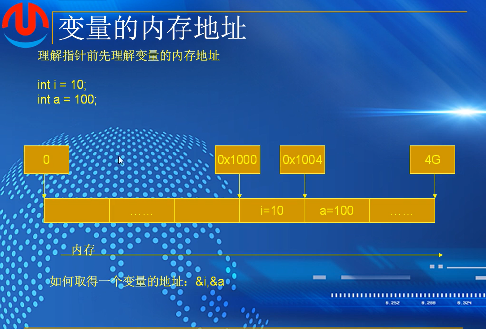
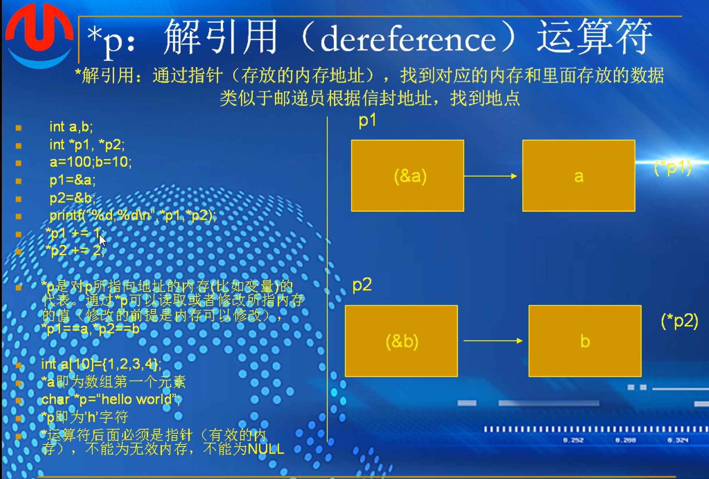
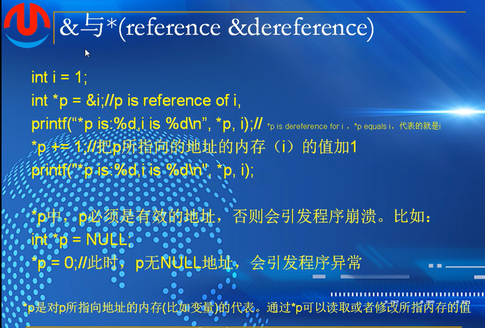
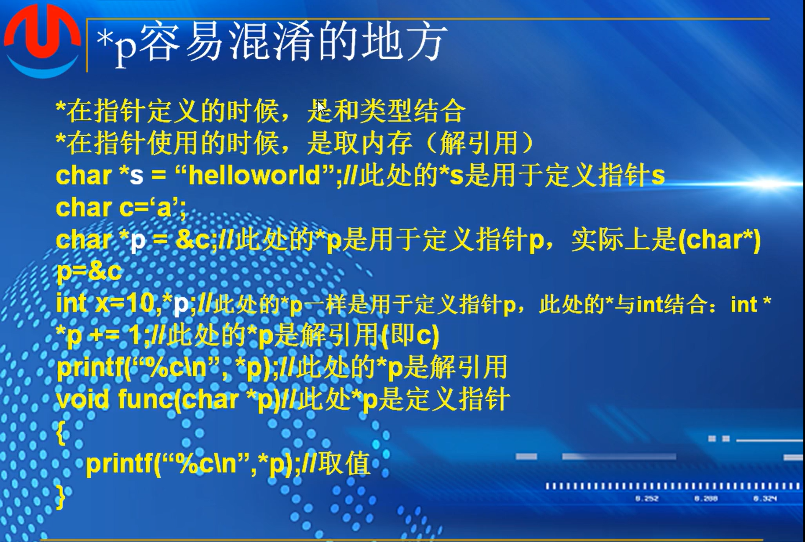
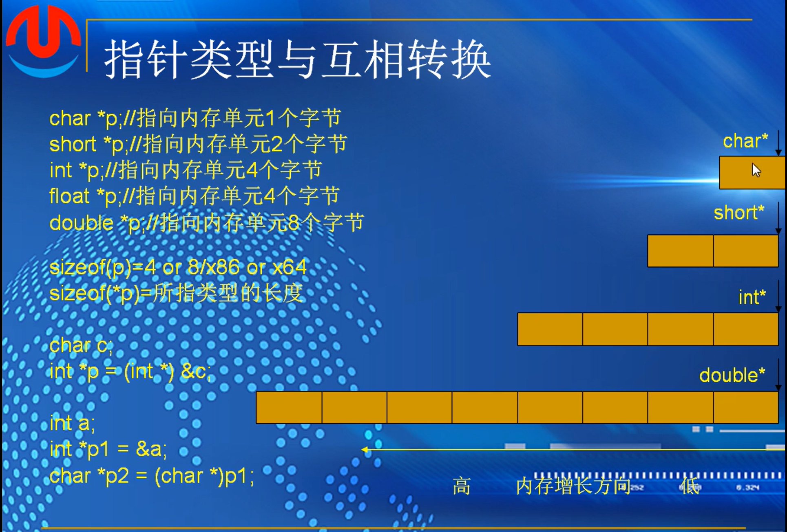
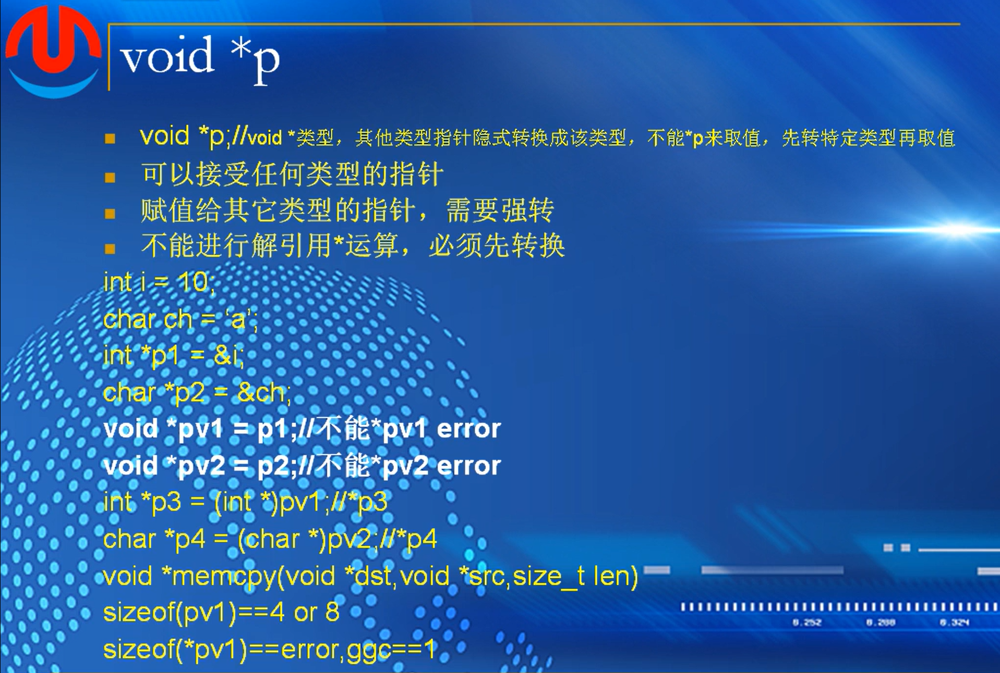
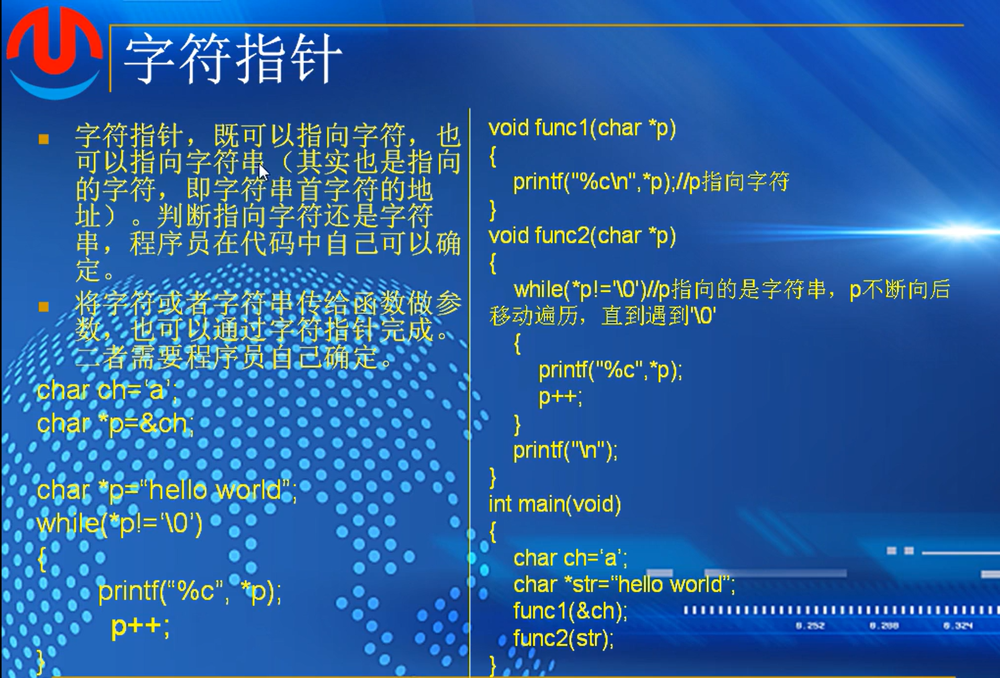

## （3）：函数调用约定

#### 调用约定：


cdecl 调用者还原栈

stdcall 被调用函数自身修改栈

fastcall 被调用者修改栈


short y 在入栈的时候，会将两个字节提升为四个字节（x86每一个都会对齐到4个字节）

上面是内存的低地址，下面是内存的高地址。内存增长和栈增长方向相反

首先是参数入栈，然后是返回地址入栈，这个过程中esp一直在往上走

eip 返回地址：调用完函数之后，下一条要执行的命令

*在程序运行期间，程序访问参数是用过[ebp+8]来访问的，访问局部变量通过[ebp-4]。加是高地址，减是低地址。*

返回地址过了就是老ebp入栈，形成老ebp和ebp指针，然后esp往上走一部分，形成局部变量空间

函数走完了，退出时，发生esp往下走的过程

首先是esp往下走，走到ebp，然后老ebp出栈，放到ebp寄存器中，然后ebp往下走

紧接着返回地址出栈，重新放到eip寄存器中，这是esp指到参数1上面

清理参数空间，也就是所谓的栈平衡，对cdecl来说是调用者完成这个过程

将esp向下移动（只有栈顶指针指向的内存区域才是有效的，向下走，之前的区域都会无效掉 

其他调用约定是被调用者清理，在函数结束的时候会有return 12；就是rsp向下移动12位来清理参数空间。而fastcal更快，因为1.2个参数存放在寄存器中，只需要返回四个字节即可


分析：


。


死循环问题：当i=16的时候,a[16]读取到的内存地址是i的内存地址，也就是说会把i赋值为0，重新开始循环，循环一直不会结束

#### 缓冲区溢出-栈溢出


超出200个字节后，多余的数据占用高位空间，假设有208个字节，会占用到老ebp和返回地址，而函数执行完之后的返回地址被占用了，就会去执行被修改之后的恶意代码

思考：


#### x64调用约定


x64 fastcall 变为调用者来维持栈平衡，统一采用fastcall

栈的整体大小要能被16整除

##### 作业：


1.


如图所示，根据x86的调用约定，printf默认使用edecl约定，参数从右往左压入栈中，形成xxyy这种样式

而后printf开始调用，在存储的时候，int和float都是4字节，压入栈中参数也是4字节，但是在读取是，%f是读取8字节的double，就导致了第一个调用edp+8调用在x上，第二个应该是edp+c却变成edp+10，变到y取值之上，第四个直接取到栈外的垃圾值

2.


如图所示，在第一次函数addr调用时，去了k所在的内存地址赋值给\*p指针，而后弹出栈，然后第二次调用loop函数，i可能存储的地址与k一模一样，所以在循环中的 (*p)-- 实际上针对的是k所在的地址，也就是现在的i的-1，导致i的值始终满足情况，造成死循环。

而short，因为 `(*p)--` 只修改 2 字节，破坏了i或j的值，使其变成一个很大的正数或特定的值，导致循环条件立即不成立。

## （4）：inline和static关键字


使用inline的效果

未使用时在printf里使用get函数，会将参数导入函数而计算取返回值再输出，

使用inline之后直接就将函数里的语句拷贝，对原函数的替换，到此处计算

```
#include <stdio.h>
#include <string.h>
#include <stdlib.h> 

inline int mygetmax(int x, int y)
{
	return x > y ? x : y;
}

int main()
{
	int a = 5;
	int b = 13;

	int res = mygetmax(a, b);
	printf("max:%d\n", res);

	return 0;
	  
}

```


##### stastic


全局变量，当然源文件有效

局部变量，记忆作用，生命周期是程序运行时

只能在当前源文件中有效

## 函数设计常见问题与注意事项

### 问题1：接口设计问题

#### 利用printf打印结果代替返回值


1.凡是在算法中通过printf打印出来，不合格。需要将结果提供给调用者，需要去使用这个结果

2.十进制转换成36进制，输出无法调用

### 问题2：逻辑全部或者部分放在了main函数


main主要用来测试函数功能，不要把逻辑写在main中


### 问题3：调用了库函数


自己写算法必须是用纯c来实现

### 代码缺少封装


两端重复代码，可以封装成一段单独的函数，然后在此直接调用即可

### 问题4：函数内部内存分配


算法中，严禁调用内存分配函数

让调用者自己去分配内存

### 问题5：硬编码


考虑代码的可移植性

在x64和x86中int为4没问题，但是以后计算机的发展可能会出现问题，而用sizeof来代替可以提高代码的可移植性

代码中使用可读性的代码更适合

### 模块化设计思想


### 变量都必须初始化


### 变量命名原则


自解释性代码

### 指针移动


### char*str和char str[]


### 写算法 strstr为例子

1.明确的知道算法的输入和输出:输出的应该是字串名  即 char 

2.严进宽出，检测算法中每一个值

```
#include <stdio.h>
#include <string.h>
#include <stdlib.h> 

char *_strstr(const char* str, const char* substr)
{
	if (str == NULL || substr == NULL)
	{
		return NULL;
	}

	if (*substr == '\0')
	{
		return (char *)str;
	}

	char* p1 = (char *)str;

	while (*p1!='\0')
	{
		char* p2 = p1;
		char* p3 = (char*)substr;
		while (*p2 && *p3 && (*p2 == *p3))
		{
			p2++;
			p3++;
		}
		if (*p3 == '\0')
		{
			return p1;
		}

		p1++;
	}

	return NULL;

}

int main()
{

	printf("strstr:%s\n", _strstr("hello world", "orl"));
	printf("strstr:%s\n", _strstr("hello world", "xyz"));
	printf("strstr:%s\n", _strstr("hello world", NULL));
	
	return 0;
}

```


# 第十三课-指针

## （1）：指针定义与使用

### 变量在内存中的地址



 &取值运算符

### 指针定义


指针也是变量，指针也有类型，指针存放的值是内存地址

指针字节就是内存地址的长度

```
int main()
{
	int i = 1;
	int* p = &i;
	printf("p=%p,&i=%p,sizeof(p):%d\n", p, &i, sizeof(p));


	return 0;
}

```

### 指针的定义与初始化形式


初始化：1.指向某个变量的地址  2.指向一个分配的内存或者字符串常量  3.指向NULL

```
int i,*p；定义了一个整型i和整型指针，这里*与int一起 
p =&i  野指针，指向随机值 
```

 ```
 char *p=(Char*)malloc(100);  在堆上分配了地址，赋值给了一个指针
 char *str = "hello world";   指向的是字符串变量地址
 char c='A';  一个字符变量'a'
 char *str = &c;  一个指针str，把c的地址赋值给了str，指向字符变量c
 char *pch= &c ;
 字符指针既可以指向字符串，也可以指向字符变量
 赋值给指针的时候，赋值的类型一定要匹配
 字符指针赋值给整型指针，需要强制转化
 ```

### *p：解引用运算符    与指针定义的\*不是一个东西



  ```
  int *p1,*p2   中 “*” 是定义指针p1，p2
  printf 中*p1 *p2 是解引用符
  *p1 == a   *p2 == b    对 *p1+1 *p2+2 就是对a，b修改
  但是必须要是可写的 
  a是常量指针，指针的一种形式，指向的数组的首地址
  p指向的字符串的首地址
  对a和p进行解引用，*a为数组第一个元素，*p为字符串第一个
  ```

野指针和NULL都不能被解引用

```
#include <stdio.h>
#include <string.h>
#include <stdlib.h> 


int main()
{	
	int a = 100;
	int b = 10;

	int arr[10] = { 2,3,4,6,7,8 };
	char* s = "hello world";

	int* p1 = &a;
	int* p2 = &b;

	printf("*p1=%d,*p2=%d\n", *p1, *p2);
	printf("a=%d,b=%d\n", a, b);

	*p1 += 1;
	*p2 += 1;

	printf("a=%d,b=%d\n", a, b);

	printf("*arr:%d\n", *arr);

	printf("*s:%c\n", *s);

	return 0;
}

```

### &与*



	*arr = 100;
	*s = "X";

*arr 指向数组第一个元素，可以使用指针修改

*s指向静态常量区，修改会报错

### &与*互为逆运算：\*&与&\*


*运算符需要和指针联系在一起，a不是指针，所以&\*a会报错

### 易混淆



### 指针的赋值与使用


*p2 = *p1  即j = i   j和i的值都变为'a'

**用双引号直接赋值的字符串是只读的，用数组或malloc创建的字符串是可修改的。**

p2=p1 把p1的地址赋值给p2，相当于p2指向了p1的地址

### 指针类型与互相转换




少了会导致数据丢失，多了可能会导致破坏其他内存地址。强制转化有可能会导致程序受到影响

类型不一样宽度就不一样

### void *p



void *p  没有任何类型，和类型指针不一样

void的指针概念中没有内存长度的概念，拿不到内存长度

不能用*p来取值，取不了其中的值

GCC里面的扩展，void默认为1字节

主要用在函数参数定义的时候，可以接受任何类型的指针的赋值，万能指针型

void赋值成别的类型需要强转，而解引用也需要转换

一般用在函数的形参位置，不用做任何的强制转换，只是在内部需要转换

 ~~~
 void *pv1 = p1 
 只是对pv1的赋值，类型并未转换，GCC应该可以
 sizeof(pv1)   指针本身是变量
 sizeof(*pv1)  只是无法解引用
 ~~~

### 字符指针



### sizeof(p)\sizeog(*p)

.png)

sizeof(p)   指针对应的长度

sizeof(*p)  指针对应类型的长度

4 4 1 4   12   4  1  1

### 指针的应用


```
#include <stdbool.h>

bool is_system_little()
{
	int x = 0x1;
	char* p = (char*)&x;

	if (*p == 1)
		return true;
	else
		return false;

}
```

##### 作业


