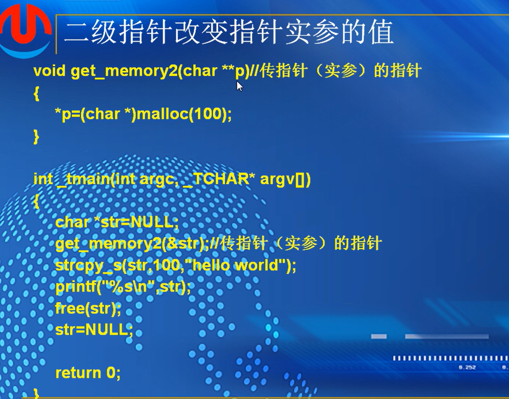
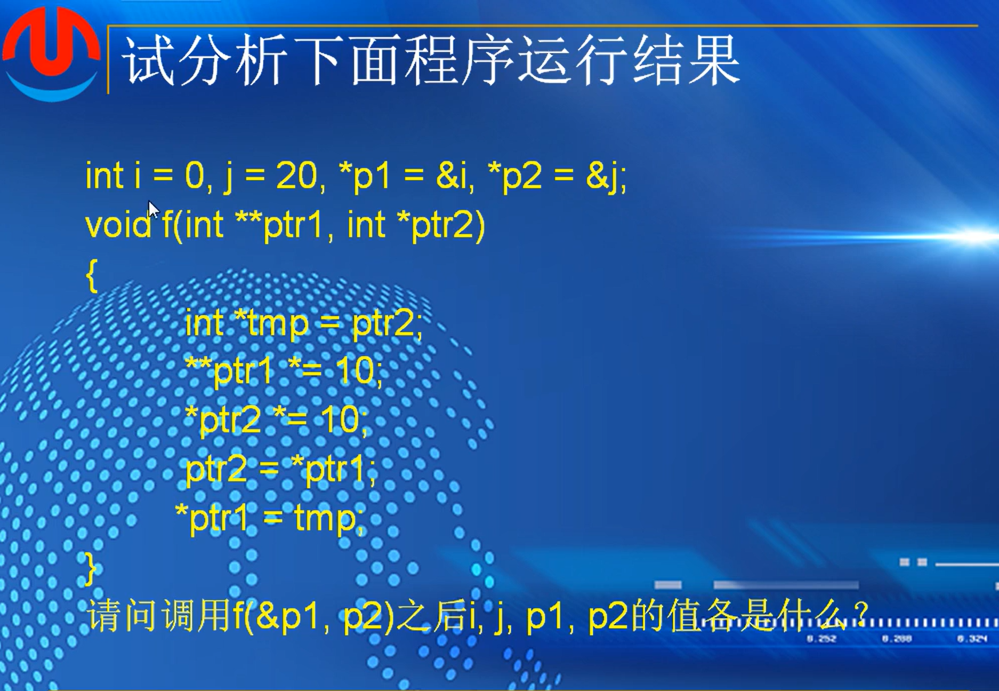
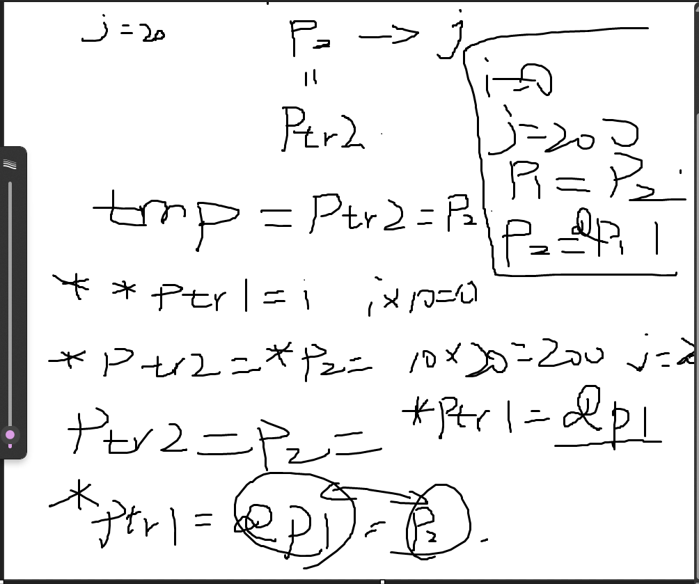
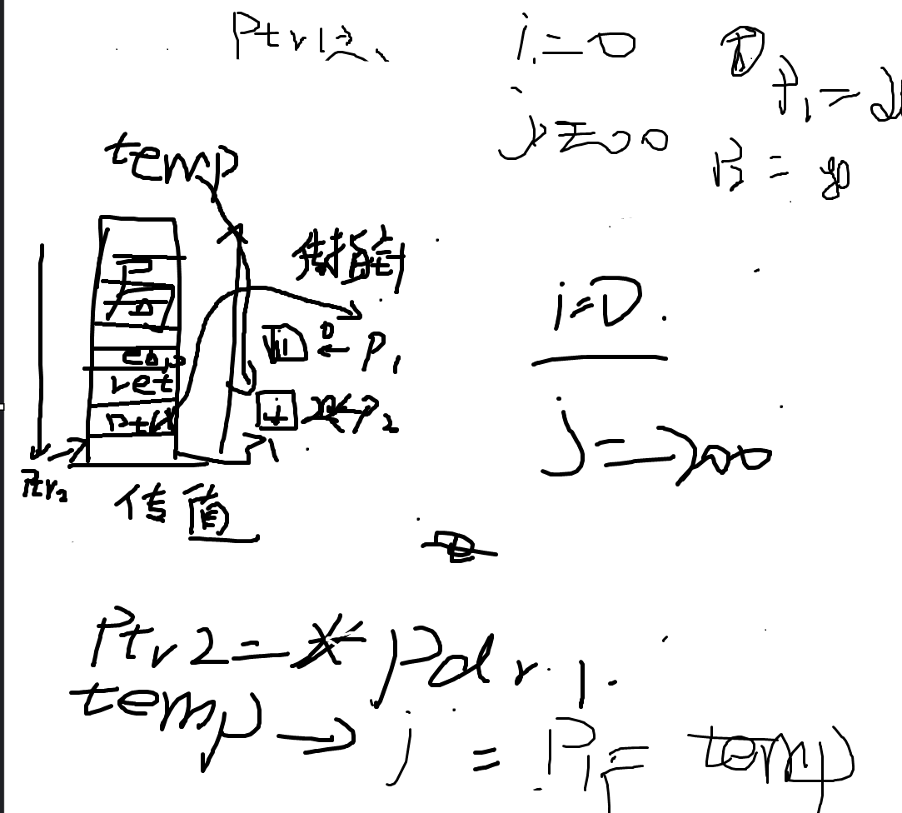

## （6）：二级指针

### 二级指针


 ```
 #include <stdio.h>
 #include <string.h>
 #include <stdlib.h> 
 #include <stdbool.h>
 
 int main(void)
 {
     int a = 10;
 
     int* p = &a;
     int** pp = &p;
 
     printf("a:%d\n", a);//10
     printf("&a:%p\n", &a);//addr of a
     printf("p:%p\n", p);//addr of a
     printf("&p:%p\n", &p);//addr of p
     printf("pp:%p\n",pp);//addr of p
     printf("*p:%d\n",*p);//10
     printf("*pp:%p\n", *pp);//p,addr of a
     printf("**pp:%d\n", **pp);//10
 
     return 0;
 }
 ```

### 二级指针关系图


### 应用


 分析


str是一个指针 ，第一个，我们将str作为一个值传递沟渠，函数拿不到这个值，必须串指针的地址，就是用二级指针来保存参数的地址，即



### 传参的形式


分析运行结果



1.



解答



##### 作业：


```
1.函数f中，两个变量分别是二级指针**ptr1,指针*ptr2。
定义指针p1=i的地址，p2等于j的地址
然后调用f函数
&p1，也就是取指针p1的地址，作为二级指针**Ptr1；p2，就是j变量的地址作为指针变量导入f函数中
然后int 指针tmp=ptr2  也就是 tmp=ptr2=p2=&j
下一个**ptr1，两次解引用ptr1指针，结果为i，i*10=0，i=0
解ptr2指针，结果为j，j*10=200，j=200
ptr2 = *ptr1，解引用ptr1，即二级指针中存放的是p1的地址，解出来p1存放的i的地址，也就是ptr2 = &i
*ptr1 = tmp  就是p1 = p2 = &j
所以，i=0，j=200，p1=p2=&j
```

```
2.问题：调用的getmemory函数中，malloc没有对应的free来清除堆上使用的内存，会造成内存泄漏
void中调用getmemory函数，传值传入的不是地址，定义getmemory的时候设定的指针，也就是需要传入地址，
所以程序会在调用函数的时候崩溃，还可能会造成内存泄露
修改：
void getmemory(char *p)
{
	p=(char*)malloc(100);
	free(p)
}
void test(char *s)
{
	char *str = NULL;
	getmemory(&str);
	strcpy(str,s);
	printf(str);
}
```


