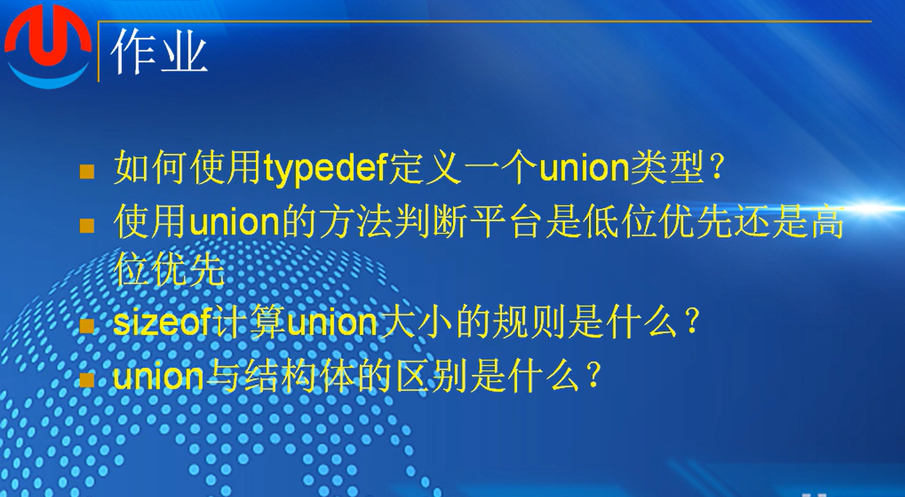
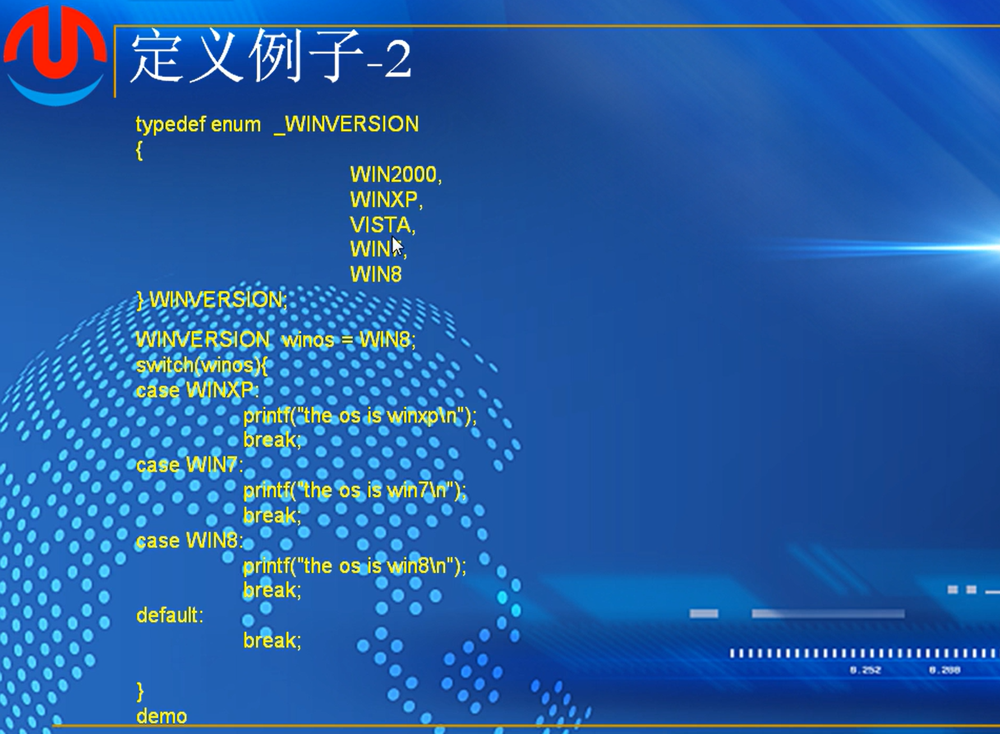
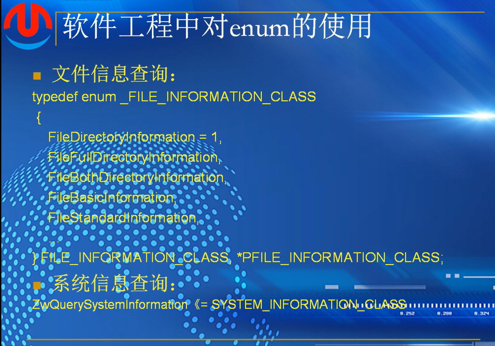

## （6）：联合体

### 联合体（UNION）定义


“同一段内存”，改变其中一个变量，别的变量可能会受影响

### 代码定义形式


 红色是标准的联合体定义方式，而且在应用中非常常见

示例


前面四个字节，i和s重叠，为i赋值的时候，其实就是覆盖

为s赋值的时候，i的值也会被破坏，他们同时存在，但是值是否存在不知道

```
#include <stdio.h>
#include <string.h>

typedef union _foo
{
	char s[20];
	int i;
}foo;

int main()
{
	foo a;
	a.i = 100;
	printf("a.i:%d,a.s:%s\n", a.i, a.s);
	strcpy(a.s, "hello world!");
	printf("a.i:%d,a.s:%s\n", a.i, a.s);
	printf("&a.i:%p,&a.s%p\n", &a.i, &a.s);
	printf("sizeof(a)=%d\n", sizeof(a));
	return 0;
}
```

### UNION的性质


### 结构体和联合体的区别


### 可以互相包含


```
#include <stdio.h>
#include <string.h>

typedef union _demo1
{
	int a;
	struct
	{
		int b;
		char c;
	}s;
	float f;
}demo1,*pdemo1;

typedef struct _demo2
{
	union
	{
		int a;
		char b;
	}c;
	int d;
}demo2,*pdemo2;

int main()
{
	demo1 dm1;
	demo2 dm2;

	dm1.a = 100;
	printf("dm1.s.b:%d\n", dm1.s.b);
	printf("dm1.f:%.2f\n", dm1.f);
	
	dm2.c.a = 0x12;
	dm2.d = 0x64;
	printf("dm2.d:%d,dn2.c.a:%d\n",dm2.d,dm2.c.a);
	dm2.c.b = 'A';
	printf("dm2.d:%d,dn2.c.a:%d\n", dm2.d, dm2.c.a);


	return 0;
}
```

### DEMO


### 用union判断存储顺序


###### 作业：



```
1.
typedef union _b
{
	char a;
	int b;
	float c;
}b,*pb;
```

2.创建一个联合体，存入int整型和char字符指针，整型占四个字节，指针占一个字节，因为两个变量在同一段内存中，并且指针只指向了了一个小部分，然后看指针的输出值来判断是是低位还是高位

3.根据联合体中包含的最大的基本类型计算，为最大基本类型的倍数

4.联合体共享一段内存，修改其中任意一个变量会对其他变量造成影响，一般一次只使用一个变量

结构体可以使用多个变量，变量之间一般不会互相影响


## （6）：枚举类型（enum）

### 定义


是一种基本类型


逗号分隔，第一个值如果不指定，默认是0

中途可以指定，中途不能和前面设定好的值重复

例子


上述定义，都是枚举类型的变量，变量不能超出这个范围

不能再对所定义的枚举常量进行赋值



 ```
 #include <stdio.h>
 #include <tchar.h>
 #include <string.h>
 #include <stdlib.h>
 
 typedef enum _WINVERSION
 {
 	WIN2000,
 	WINXP,
 	VISTA,
 	WIN7,
 	WIN8
 }WINVERSION;
 
 int main()
 {
 	WINVERSION winos = 3;
 
 	switch (winos)
 	{
 	case WINXP:
 		printf("the os is winxp\n");
 		break;
 	case WIN7:
 		printf("the os is win7\n");
 		break;
 	case WIN8:
 		printf("the os is win8\n");
 		break;
 	default:
 		printf("unkonwn windows os")
 		break;
 	}
 	
 	return 0;
 }
 
 ```

#### sizeof 枚举类型


```

	printf("sizeof(WINVERSION):%d,sizeof(WIN8):%d",
		sizeof(WINVERSION), sizeof(WIN8));
		
长度都是一样的，枚举类型的底层应该是int，都是四个字节
```

#### 软工中的使用



###### 作业


```
1.typedef enum _day
{
	monday,
	tuesday,
	wedensday,
	thursday,
	friday,
	saturday,
	sunday
}day,*pday;
```

2.4个字节

3.枚举类型是非构建类型，是基础类型的一种

4.只能取所构建的类型中所定义的值。所构建的值一般是从0开始排列往后依次加1


