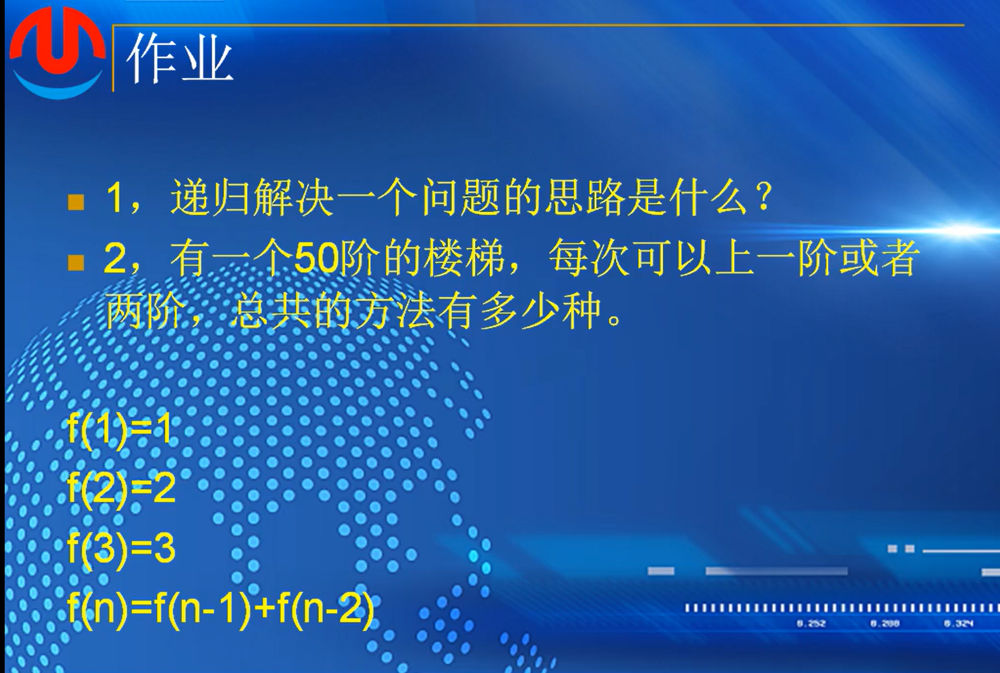
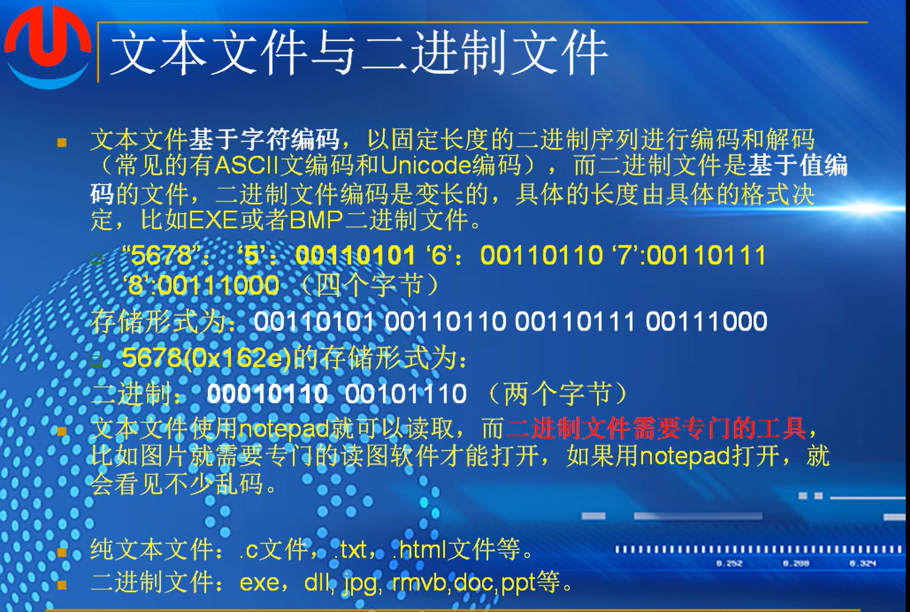

## （2）：递归的应用


问题1

```
int mystrlen(const char* str)
{
	if (str == NULL || *str == '\0')
	{
		return 0;
	}
	return 1 + mystrlen(str + 1);

	//一句话计算出非空字符串的长度
	//(str==NULL || *str=='\0')?0:1+mystelen(str+1)
}
```

 问题2

```
void reverse_print(const char *str)
{
	if(str==NULL || *str=='\0')
	{
		return;
	}
	reverse_print(str+1);
	printf("%c",*str);
}
```

直接定义*指向内存地址是静态区不可更改，需要改成在栈上才可以更改

比如：

char *str=

char buf[] = 

问题3

```
void reverse_str(char *str,int len)
{
	if (str == NULL || *str == '\0' || len==0)
	{
		return 0;
	}

	reverse_str(str + 1,len-2);

	char tmp = *str;
	*str = *(str + len - 1);
	*(str + len -1)=tmp;

	return;
}
```

 ### 运用递归


###### 作业



1. 寻找解决问题的子式，也就是寻找一个式子能让递归一直嵌套下去直到嵌套到递归出口

2. 递归或者循环解决

   

   ```
   int fibonacci(int n) {
       if(n == 0) {
           return 0;
       } else if(n == 1) {
           return 1;
       } else {
           return fibonacci(n-1) + fibonacci(n-2);
       }
   }
   
   int main() {
       int n;
       printf("请输入一个整数：");
       scanf("%d", &n);
       printf("斐波那契数列的第%d项为：%d\n", n, fibonacci(n));
       return 0;
   }
   
   
   #include<stdio.h>
   
   // 斐波那契数列函数
   int fibonacci(int n) {
       if(n <= 1) {
           return n;
       }
       int a = 0, b = 1;
       for(int i = 2; i <= n; i++) {
           int temp = a + b;
           a = b;
           b = temp;
       }
       return b;
   }
   
   int main() {
       int n;
       printf("请输入一个整数：");
       scanf("%d", &n);
       printf("斐波那契数列的第%d项为：%d\n", n, fibonacci(n));
       return 0;
   }
   ```
   
   
   
   # 第二十课-文件

## （1）：文件概念

### 文件分类


 ### 文件系统


### 文本文件与二进制文件



字符编码


基于值编码

###### 作业


1. 文本文件，基于字符编码的方式编写
2. 二进制文件，基于值编码的方式的文件 
3. 文件系统：管理，读写，调用一个文件的数据结构

FAT  ZFS


## （2）：文件创建、打开与读写


```
fopen("newfile.txt","w,ccs=UTF-8");
第一个参数是路径，路径分为相对路径和绝对路径
第二个参数是文件的打开方式，
r 读   w  写    

文本方式打开，存在换行之间的转换

css 用来指定文件打开的编码

默认为ascii编码，可以通过读取文件头的形式来获取文本所用的编码方式
```

*记得关闭文件，否则会一直有程序或者进程占用文件使用*

fopen也是老函数，需要安全的调用，

fopen_s(&pfile)指针的值

~~~
_mkdir 创建文件夹的指令
<direct.h> 包含
~~~

### 代码演示

创建

```
 
#include <stdio.h>
#include <direct.h>

int create_file()
{
	char* path = "d:\\1111111111111\\mallocfree.txt";

	FILE *file = fopen(path, "w");
	if (file == NULL)
	{
		return -1;
	}
	fclose(file);
	return 0;
}

int main()
{
	create_file();

	return 0;
}
```

打开

```
 
int open_file()
{
	char* path = "d:\\111111111111\\mallocfree.txt";

	FILE* file = NULL;
	errno_t err = fopen_s(&file, path,"r");
	if (err != 0 || file == NULL)
	{
		return -1;
	}
	fclose(file);

	return 0;
}
```

创建文件夹

```
int create_dir()
{
	char* dirpath = "d:\\1111111111111\\mf\\";

	int res = _mkdir(dirpath);

	return res;
}
```

### 文件的读写


buffer  数据    size  字节数   ntime  写入多少长度   fp  文件指针

```
#include <stdio.h>
#include <direct.h>
#include <windows.h>

void binaryio_demo()
{
	char* filepath = "d:\\1111111111111\\binary_io.txt";
	
	FILE* file = NULL;
	errno_t err = fopen_s(&file, filepath, "w");
	if (err != 0 || file == NULL)
	{
		return -1;
	}
	fwrite("hello world", strlen("hello world") + 1, 1, file);
	int date = 100;
	fwrite(&date, sizeof(date), 1, file);

	fclose(file);

	err = fopen_s(&file, filepath, "r");
	if (err != 0 || file == NULL)
	{
		return -1;
	}
	char buf[128] = { 0 };
	fread(buf, strlen("hello world") + 1, 1, file);
	

	int value = 0;
	fread(&value, sizeof(value), 1, file);
	printf("buf:%s,value:%d", buf,value);

	fclose(file);
}

int main()
{
	
	binaryio_demo();

	return 0;
}
```

