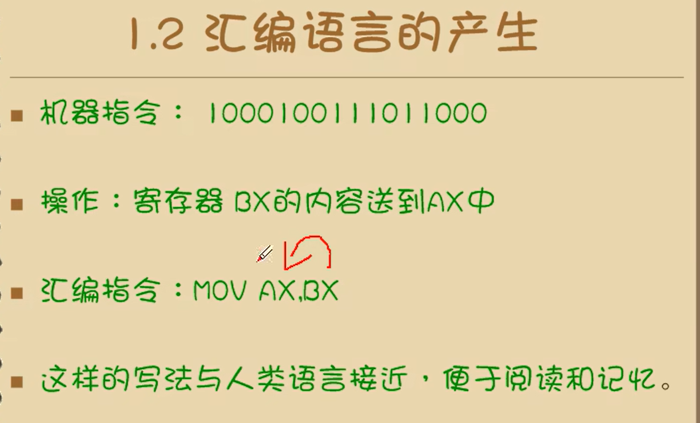

2.

某酒店有若干楼层，每层有若干房间。

请你编写一个程序，使用 **三维指针 `char ***hotel`** 存储所有房间的住客姓名。

要求：

1. 从键盘输入楼层数 `f` 和每层的房间数 `r`。
2. 动态分配三维指针内存，使得每个房间都能存放一个住客姓名字符串。
3. 用户依次输入每个房间的住客姓名（如空房请输入 `"Empty"`）。
4. 程序输出整个酒店的入住情况（按楼层打印）。
5. 最后释放所有分配的内存

输入

```c
2 3
Alice
Bob
Empty
Cindy
David
Eve

```

输出

```c
酒店入住情况：
第 1 层：
  房间 1: Alice
  房间 2: Bob
  房间 3: Empty
第 2 层：
  房间 1: Cindy
  房间 2: David
  房间 3: Eve

```


代码:

```
#include <stdio.h>
#include <stdlib.h>


int main()
{
	int f, r;
	printf("input hotel`s floor and room:");
	scanf("%d %d", &f, &r);

	char*** hotel = (char***)malloc(f * sizeof(char**));
	for (int i = 0; i < f; i++)
	{
		 hotel[i] = (char**)malloc(r * sizeof(char*));
		for (int j = 0; j < r; j++)
		{
			hotel[i][j] = (char*)malloc(20 * sizeof(char));
		}
	}
	
	
	for (int i = 0; i < f; i++)
	{
		for (int j = 0; j < r; j++)
		{
			printf("input human`s name:");
			scanf("%s", hotel[i][j]);
		}
	}

	printf("酒店入住情况:\n");

	for (int i = 0; i < f; i++)
	{
		 
		printf("第%d层:\n", i + 1);
		for (int j = 0; j < r; j++)
		{
			printf("房间%d:%s\n", j + 1, hotel[i][j]);
		}
	}
	
	for (int i = 0; i < f; i++)
	{
		
		for (int j = 0; j < r; j++)
		{
			free(hotel[i][j]);
		}

		free(hotel[i]);
	}
	free(hotel);


	return 0;
}
```


## 逆s盒替换

逆s盒：

初始化s盒

```
    uint8_t i,j;
    uint8_t s_box_ary[16][16] = {0};

   for(i=0;i<0x10;i++)
    {
        for(j=0;j<0x10;j++)
        {
            s_box_ary[i][j] = ((i<<4)&0xF0) + (j&(0xF));
        }
    }
```

使得每行每列按顺序打印

欧几里得算法拓展

```
    printf("\r\n");
    for(i=0;i<0x10;i++)
    {
        for(j=0;j<0x10;j++)
        {
            if(s_box_ary[i][j] != 0)
            {
                s_box_ary[i][j] = extEuclidPolynomial(s_box_ary[i][j],0x11B);
            }
        }
    }

    printf("\r\n\r\n    0  1  2  3  4  5  6  7  8  9  A  B  C  D  E  F");
    for(i=0;i<0x10;i++)
    {
        printf("\r\n%2x",i);
        for(j=0;j<0x10;j++)
        {
            printf(" %2x",s_box_ary[i][j]);
        }
    }

```

这样可以得到一个再GF（2^8）的域里的的逆，0映射到自身

之后还可以对每一个字节进行变换

```
    for(i=0;i<0x10;i++)
    {
        for(j=0;j<0x10;j++)
        {
            s_box_ary[i][j]=byteTransformation(s_box_ary[i][j], 0x63);
        }
    }

    printf("\r\n\r\n    0  1  2  3  4  5  6  7  8  9  A  B  C  D  E  F");
    for(i=0;i<0x10;i++)
    {
        printf("\r\n%2x",i);
        for(j=0;j<0x10;j++)
        {
            printf(" %2x",s_box_ary[i][j]);
        }
    }
}
```


re逆s盒代码题目：

```
#include <stdio.h>
#include <malloc.h>

void Create_Inv_SBOX(unsigned char SBOX_AFTER[256])
{
	unsigned char SBOX[256] = {
0x63, 0x7C, 0x77, 0x7B, 0xF2, 0x6B, 0x6F, 0xC5, 0x30, 0x01, 0x67, 0x2B, 0xFE, 0xD7, 0xAB, 0x76,
0xCA, 0x82, 0xC9, 0x7D, 0xFA, 0x59, 0x47, 0xF0, 0xAD, 0xD4, 0xA2, 0xAF, 0x9C, 0xA4, 0x72, 0xC0,
0xB7, 0xFD, 0x93, 0x26, 0x36, 0x3F, 0xF7, 0xCC, 0x34, 0xA5, 0xE5, 0xF1, 0x71, 0xD8, 0x31, 0x15,
0x04, 0xC7, 0x23, 0xC3, 0x18, 0x96, 0x05, 0x9A, 0x07, 0x12, 0x80, 0xE2, 0xEB, 0x27, 0xB2, 0x75,
0x09, 0x83, 0x2C, 0x1A, 0x1B, 0x6E, 0x5A, 0xA0, 0x52, 0x3B, 0xD6, 0xB3, 0x29, 0xE3, 0x2F, 0x84,
0x53, 0xD1, 0x00, 0xED, 0x20, 0xFC, 0xB1, 0x5B, 0x6A, 0xCB, 0xBE, 0x39, 0x4A, 0x4C, 0x58, 0xCF,
0xD0, 0xEF, 0xAA, 0xFB, 0x43, 0x4D, 0x33, 0x85, 0x45, 0xF9, 0x02, 0x7F, 0x50, 0x3C, 0x9F, 0xA8,
0x51, 0xA3, 0x40, 0x8F, 0x92, 0x9D, 0x38, 0xF5, 0xBC, 0xB6, 0xDA, 0x21, 0x10, 0xFF, 0xF3, 0xD2,
0xCD, 0x0C, 0x13, 0xEC, 0x5F, 0x97, 0x44, 0x17, 0xC4, 0xA7, 0x7E, 0x3D, 0x64, 0x5D, 0x19, 0x73,
0x60, 0x81, 0x4F, 0xDC, 0x22, 0x2A, 0x90, 0x88, 0x46, 0xEE, 0xB8, 0x14, 0xDE, 0x5E, 0x0B, 0xDB,
0xE0, 0x32, 0x3A, 0x0A, 0x49, 0x06, 0x24, 0x5C, 0xC2, 0xD3, 0xAC, 0x62, 0x91, 0x95, 0xE4, 0x79,
0xE7, 0xC8, 0x37, 0x6D, 0x8D, 0xD5, 0x4E, 0xA9, 0x6C, 0x56, 0xF4, 0xEA, 0x65, 0x7A, 0xAE, 0x08,
0xBA, 0x78, 0x25, 0x2E, 0x1C, 0xA6, 0xB4, 0xC6, 0xE8, 0xDD, 0x74, 0x1F, 0x4B, 0xBD, 0x8B, 0x8A,
0x70, 0x3E, 0xB5, 0x66, 0x48, 0x03, 0xF6, 0x0E, 0x61, 0x35, 0x57, 0xB9, 0x86, 0xC1, 0x1D, 0x9E,
0xE1, 0xF8, 0x98, 0x11, 0x69, 0xD9, 0x8E, 0x94, 0x9B, 0x1E, 0x87, 0xE9, 0xCE, 0x55, 0x28, 0xDF,
0x8C, 0xA1, 0x89, 0x0D, 0xBF, 0xE6, 0x42, 0x68, 0x41, 0x99, 0x2D, 0x0F, 0xB0, 0x54, 0xBB, 0x16
	};
	for (int i = 0; i < 256; i++)
	{
		SBOX_AFTER[SBOX[i]] = i ;
	}
}

int Inv_SubBytes()
{
	char* path = "d:\\11\\1.bin";
	char* path1 = "d:\\11\\1.jpg";
	FILE* fp = NULL;
	FILE* fp1 = NULL;
	errno_t err = fopen_s(&fp, path, "rb");
	if (err != 0 || fp == NULL)
	{
		return -1;
	}

	fseek(fp, 0, SEEK_END);
	int SIZE = ftell(fp);

	fseek(fp, 0, SEEK_SET);
	printf("%d\n", SIZE);

	unsigned char* buf = (unsigned char*)malloc(SIZE);
	fread(buf, 1, SIZE, fp);
	fclose(fp);

	unsigned char SBOX_AFTER[256] = { 0 };
	Create_Inv_SBOX(SBOX_AFTER);

	err = fopen_s(&fp1, path1, "wb");
	if (err != 0 || fp == NULL)
	{
		return -1;
	}
    
	unsigned char* p = buf;
	for (int i = 0; i < SIZE; i++)
	{
		p[i] = SBOX_AFTER[p[i]];
	}
	fwrite(p, 1, SIZE, fp1);

	fclose(fp);

	return 0;
}

static int main()
{
	Inv_SubBytes();

	return 0;
}
```

# 1.1 机器语言

引言


课程的目的主要是研究如何让硬件更有效率的工作

# 1.2 汇编语言的产生



寄存器：cpu中可以储存数据的期间，一个cpu可以有多个寄存器

寄存器的代号表示有不同作用的寄存器

