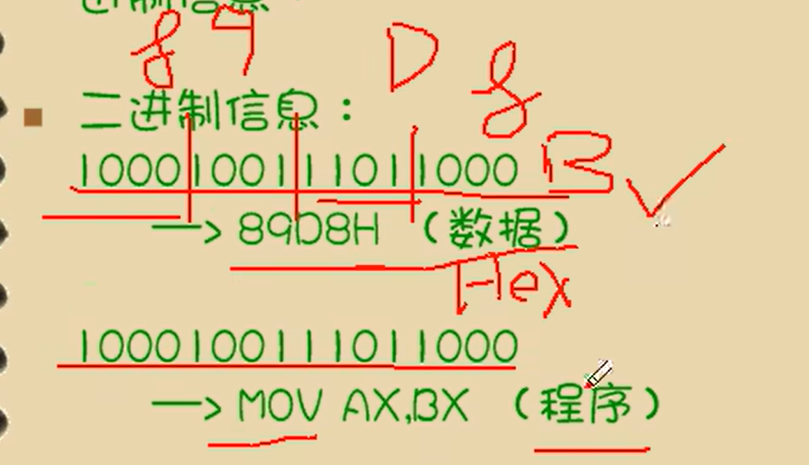
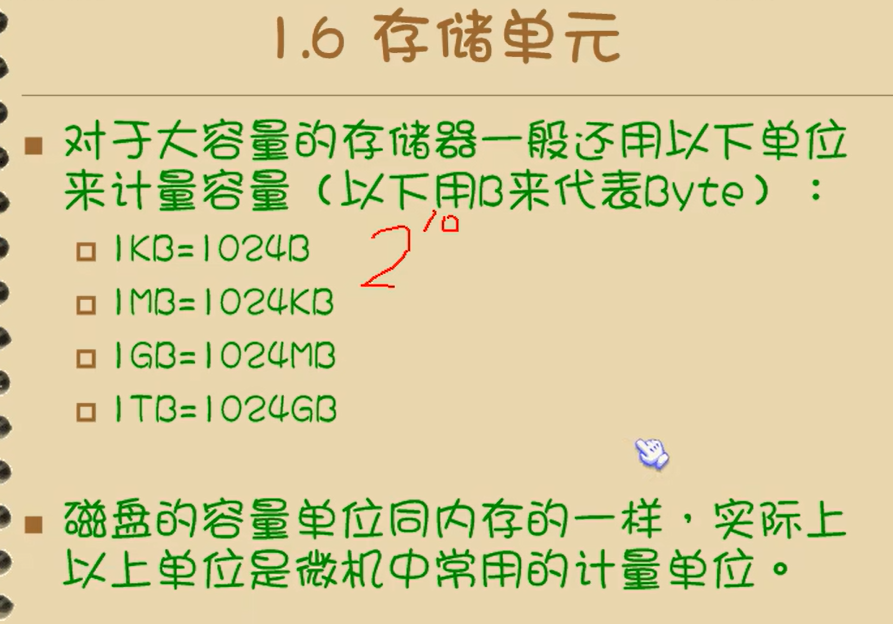
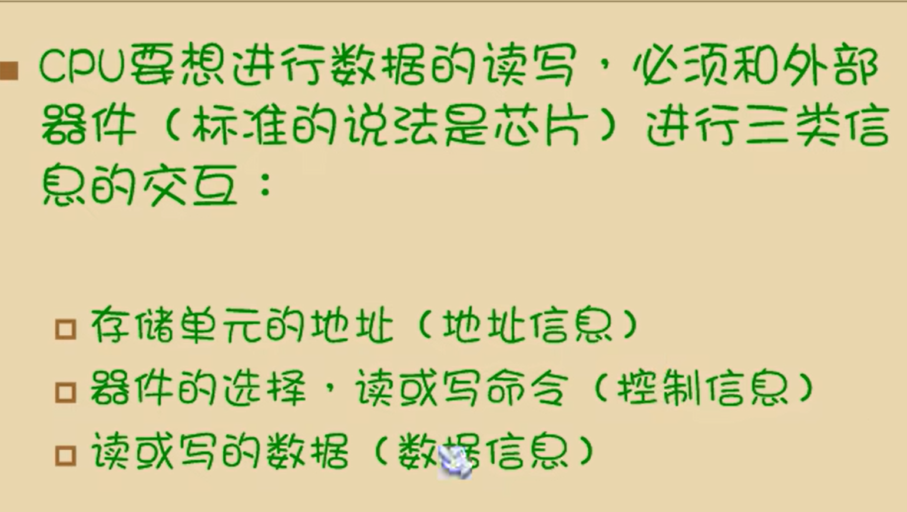
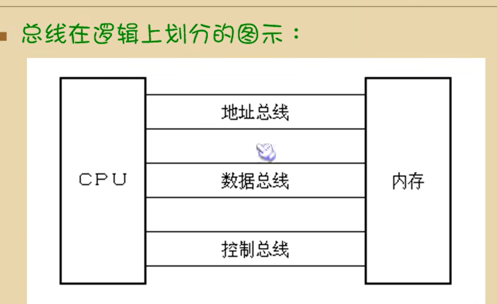
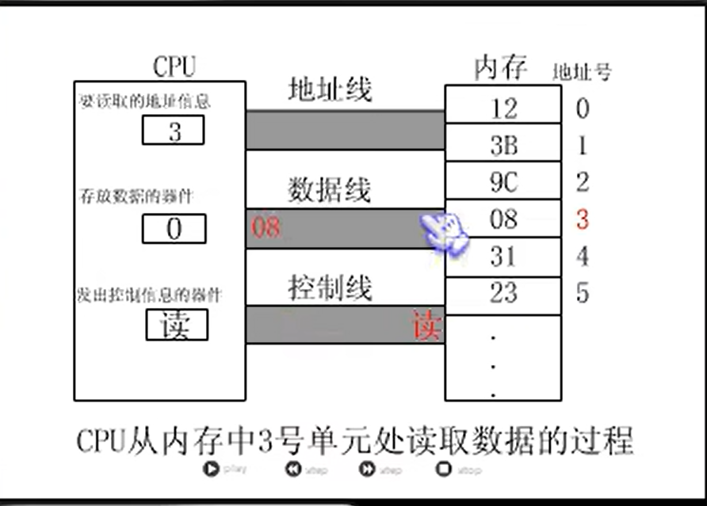
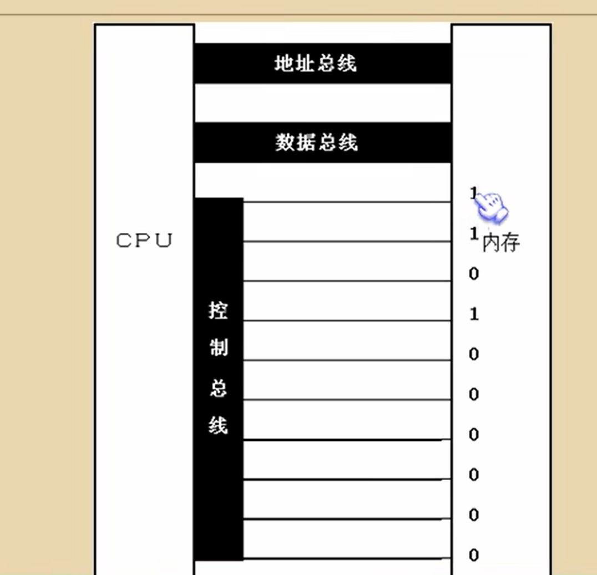
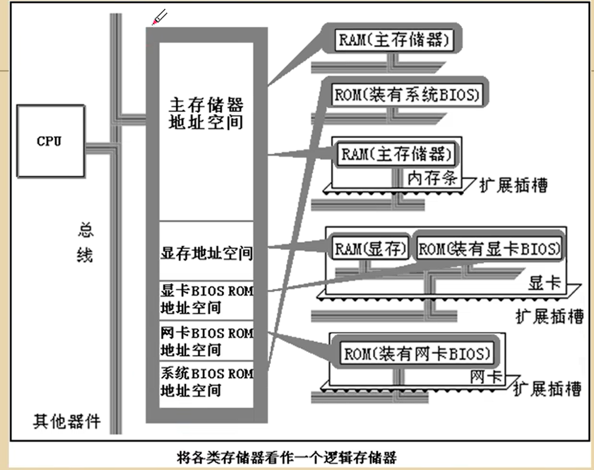

# 1.1 机器语言

引言

课程的目的主要是研究如何让硬件更有效率的工作

## 1.2 汇编语言的产生

寄存器：cpu中可以储存数据的期间，一个cpu可以有多个寄存器

寄存器的代号表示有不同作用的寄存器

## 1.3 汇编语言的组成

1. 汇编指令  （可以直接翻译成机器码）
2. 伪指令   （伪指令，用编译器执行）
3. 其他符号     （由编译器识别）

**核心是汇编指令，它决定了汇编语言的特性**

## 1.4 存储器

cpu是计算机的核心部件，它控制整个计算机的运作并进行运算，想cpu工作，必须提供指令和数据

指令和数据在存储器中存放，也就是内存

内存是其中一种存储器

pc机中内存作用仅次于cpu，离开了内存，cpu无法工作

磁盘不同于内存，磁盘上的数据或程序如果不读到内存中，就无法被cpu使用

## 1.5 指令和数据

指令和数据是应用上的概念，在内存或磁盘上，指令和数据都是二进制信息

## 1.6 存储单元

存储器被划分为若干个存储单元，每个存储单元从0开始顺序编号

比如128个存储单元，编号0~127

## 1.7 cpu对存储器的读写

用什么做，怎么做，做什么

电子计算机处理，传输的信息都是电信号，，电信号要用导线传送

在计算机中专门链接cpu和其他芯片的导线，通常称之为总线

* 物理上：一根根导线集合
* 逻辑上划分：
  * 地址总线
  * 数据总线
  * 控制总线

8086cpu，最基础的cpu

## 1.8 地址总线

cpu是通过地址总线来指定存储单元的

地址总线上能传送多少个不同的信息，cpu就可以对多少个存储单元进行寻址

多少位的cpu，就是描述cpu寻址的能力，

64位的速度需要：64位的cpu，64位的操作系统，64位的软件

最多可以寻找2的n次方个内存单元

一个地址总线，可以索引到一个内存单元，就是一个字节，包含8个位

## 1.9 数据总线

cpu与内存或其他期间之间的数据传送时通过数据总线来进行的

数据总线的宽度决定了cpu和外界的数据传输速度

8088cpu，一次传8位数据，传送89 D8，传两遍

8086cpu传输，16位，比8088cpu快一倍

## 1.10 控制总线

cpu对外部器件的控制是通过控制总线来进行。这里控制总线是一个总称，控制总线是一些不同控制线的集合

有多少根控制总线，就意味着cpu提供了对外部器件的多少钟控制

所以，控制总线的宽度绝对cpu对外部器件的控制的能力

控制总线发送控制信息

内存读写的命令是由几根总控制线综合发出的：其中由一根名为读信号输出控制线负责由cpu向外传送读信号，cpu向该控制线上输出低电平表示将要读取数据；

有一根名为写信号输出控制线负责由cpu向外传送写信号

### 小结：

## 1.11 内存地址空间（概述）

内存地址空间

一个cpu的地址线宽度为10，那么可以寻址到1024个内存单元，这1024个可寻到的内存单元就构成这个cpu的内存地址空间

## 1.12 主板

每一台pc机种，都有一个主板，主板上由核心器件和一些主要器件

器件通过总线相连

## 1.13 接口卡

计算机系统中，所有可用程序控制其工作的设备，都必须受到cpu的控制

cpu对外部设备不能直接控制，如显示器，音响，打印机等。直接控制这些设备进行工作的是插在拓展插槽上的接口卡

接口卡通过总线与cpu相连，cpu可以通过总线向接口卡发送指令，以此来间接控制设备

## 1.14 各类存储器的芯片

* 从读写属性上看分为两类：

  随机存储器（RAM）和*只读存储器*（ROM）

  *内存就是一个大的随机存储器，断了电之后数据将会遗失*

  (主随机存储器一般是由装载主板上的RAM和插在拓展插槽上的RAM组成)

  

  只读存储器，永远只能读，数据只要不把他刷掉，一直都存在那里  

  装有BIOS的ROM      BIOS: Basic Input/Output System 基本输入输出系统

  *BIOS是由主板个各类接i卡（显卡，网卡等）厂商提供的软件系统，可以通过它利用该硬件设备进行最近本的输入输出。子在主板你和某些接口卡上插有存储相应的BIOS的ROM*

  

* 从功能和连接上分类：

  * 随机存储器RAM
  * 装有BIOS的ROM
  * 接口卡上的RAM

  某些接口卡上的RAM需要对大批量输入输出数据进行存储，比如显示卡上的RAM，一般叫显存

* PC机种各类存储器的逻辑链接情况

  **各类储存器的逻辑链接**

## 1.15 内存地址空

上述那些存储器在物理上是独立的器件

以下两点相同

* 都和cpu的总线相连
* cpu对他们进行读或写的时候都通过控制线发出内存读写命令

不同的计算机内存的分配地址是不同的

* 内存地址空间：
  * 最终运行程序的是cpu，我们用汇编编程的时候，必须从cpu角度考虑问题

* 对cpu来将，系统中所有的存储器中的存储单元都处于一个统一的逻辑储存器中，它的容量受cpu寻址能力的限制。这个逻辑存储器即是我们所说的内存地址空间
  * 地址总线宽度，决定了定位的地址单元的数量，地址单元的数量，决定了cpu能够访问到的地址，也是各类设备能够储存的地址空间

### 补充

电平，电信号的电压值，两个不同的电压范围用来表示二进制

管脚，也叫引脚，cpu与外部电路进行连接的接口

存储单元，存储器最小寻址单位，每个单元占一个字节，

1Byte = 1 bit   ->   1KB = 8*1024 bit  = 1024B

