## 2.5 16位结构的cpu

* 1.运算器一次最多可以处理16位的数据
* 2.寄存器的最大宽度为16位
* 3.寄存器和运算器之间的通路是16位的

## 2.6 8086cpu给出物理地址的方法

* 8086有20位地址总线，可传送20位地址，寻址能力为1M （外部）
* 8086内部为16位结构，它只能传送16位的地址，表现出的寻址能力却只有64k

**8086cpu采取一种在内部用两个16位地址合成的方法来形成一个20位的物理地址**

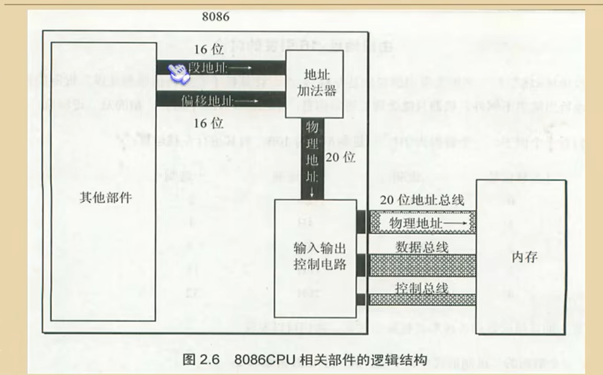

其他部件：计算器之类的

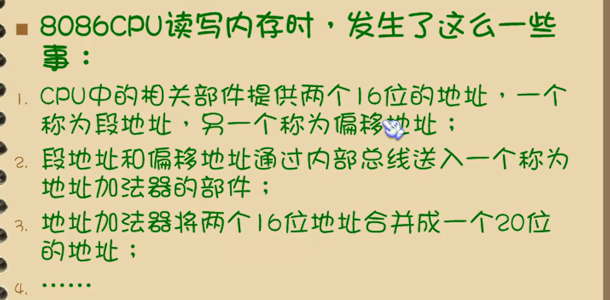

### 地址加法器工作原理

物理地址=段地址*16+偏移地址

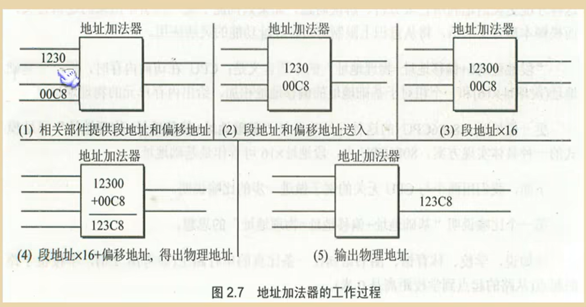

## 2.7 短地址*16+偏移地址=物理地址的本质含义

偏移地址比喻1

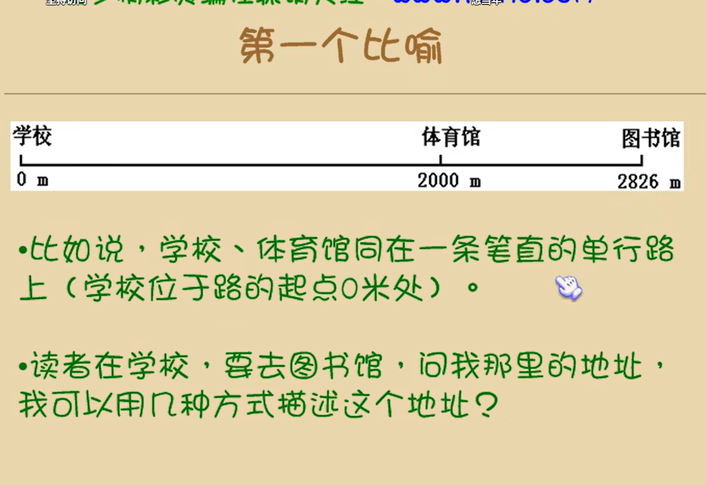

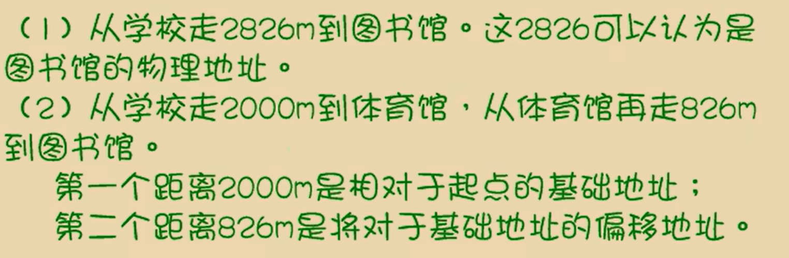

偏移地址比喻2

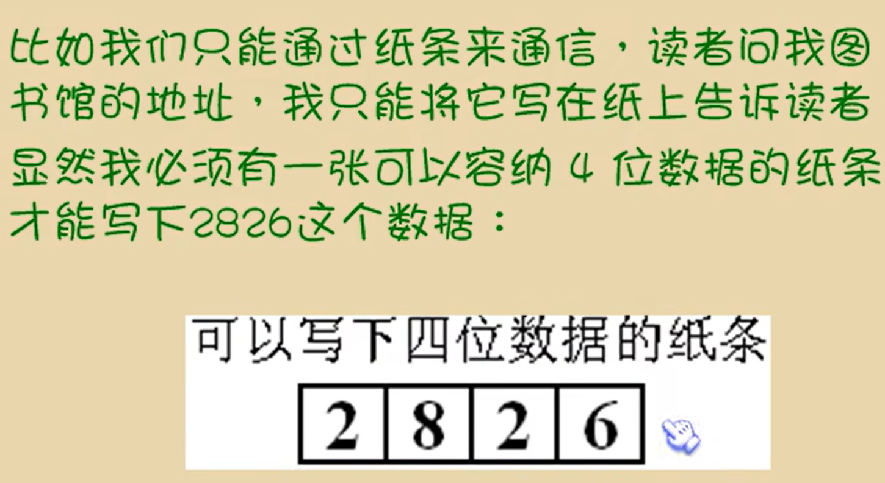

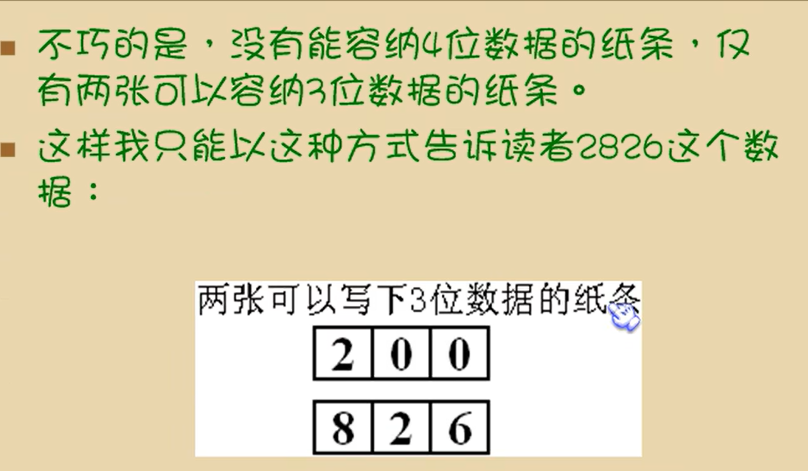

## 2.8 段的概念

在编程时可以根据需要，将若干地址连续的内存单元看作一个段，用 段地址*16 定位段的起始地址（基础地址），用偏移地址定位段中的内存单元

注意：

* 短地址*16必然时 16的倍数，所以一个段的起始地址也一定是16的倍数
* 偏移地址为16位，16位地址的寻址能力为64k，所以一个段的长度最大为64k

## 内存单元地址小结

* cpu访问内存单元是，必须向内存提供内存单元的物理地址
* 8086cpu在内部用短地址和偏移地址移位相加的方式形成最终的物理地址

思考：

1.

 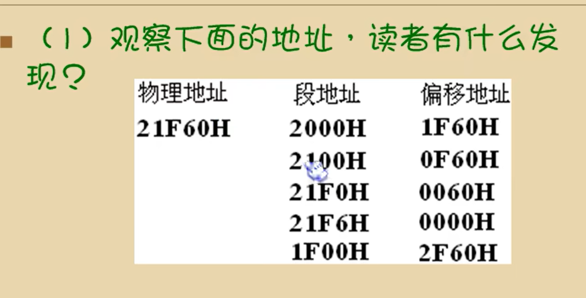

同一个物理地址，可以由多个段地址加偏移地址来得到

2.

小结

###### 检测点2.2

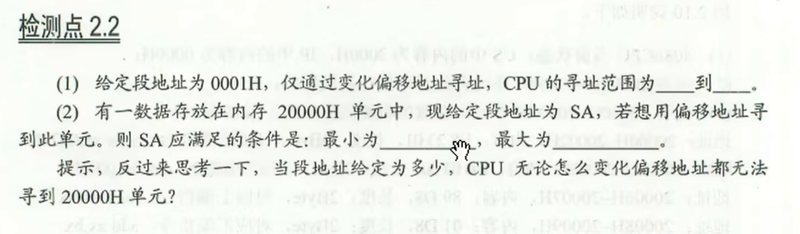

（1）：寻址范围：0001H  -  10000H

（2）：最小为：10001H   最大为：20000H 

给定地址需要乘以16，也就是左移一位

寻址范围应该是 0010H--1000FH

最小 1001H    最大  2000H

## 2.9 段寄存器

已知cpu的物理地址需要短地址加偏移地址来合成

段地址需要有地方来存储，就是段寄存器

cs：代码地址

ds：数据地址

ss：堆上的地址

es：什么都有的地址

## 2.10 cs和ip

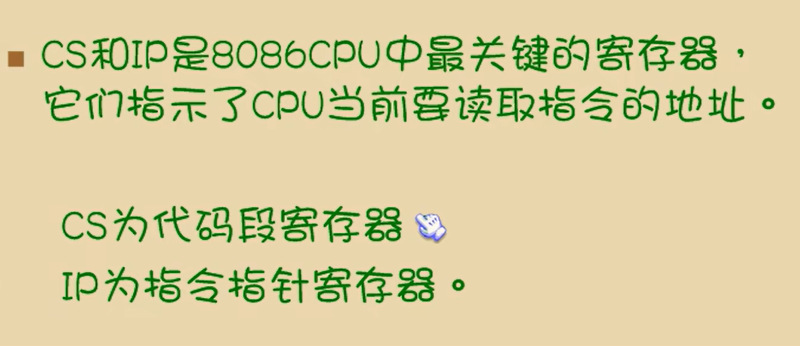

### 8086pc读取和执行指令相关部件

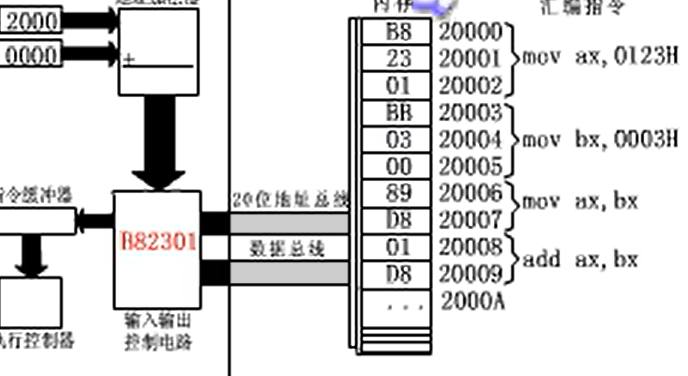

B8 代表 mov ax

0123H 从上到下，低位到高位，低位优先存储

ip+3，ip+2，索引到下一条指令

### cpu工作过程简要描述

想要绕过杀毒软件，就可以将木马植入FFFF0H单元中，指向病毒程序，屏蔽杀毒软件

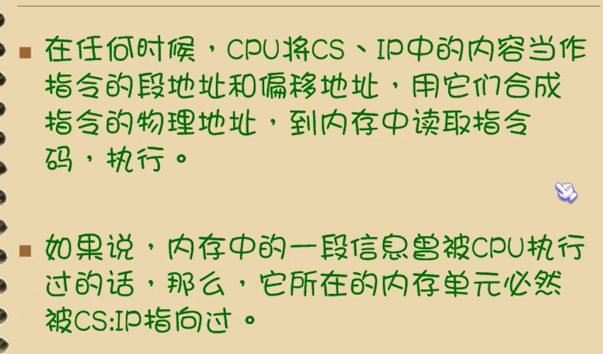

## 2.11 修改cs，ip的指令

###   如何修改AX中的值

不能通过mov来改变cs·ip的值

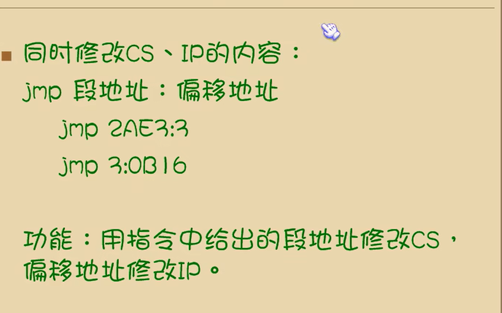

### 仅修改ip

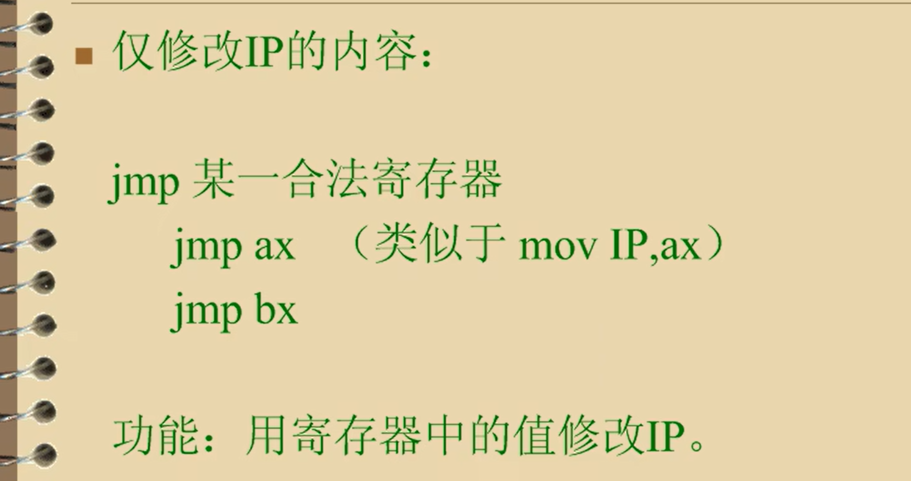

### cpu运行的流程

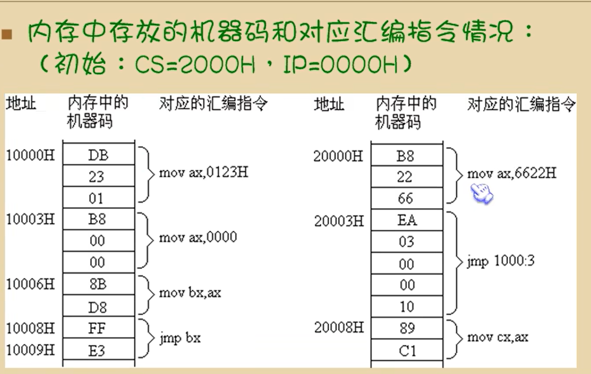

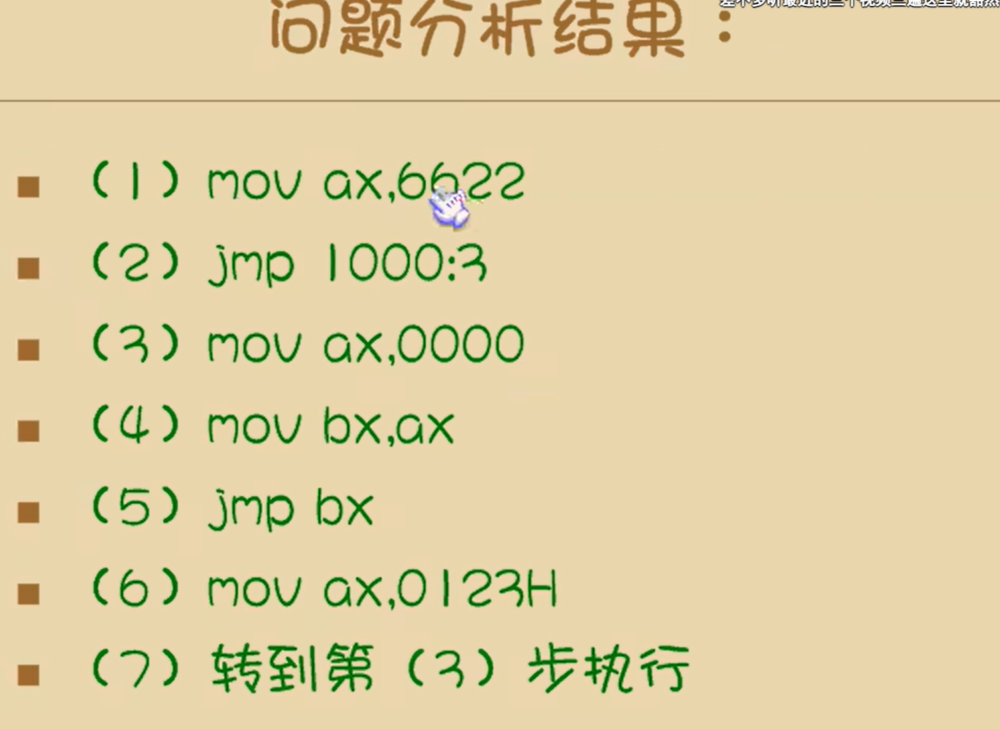

 ## 2.12 代码段

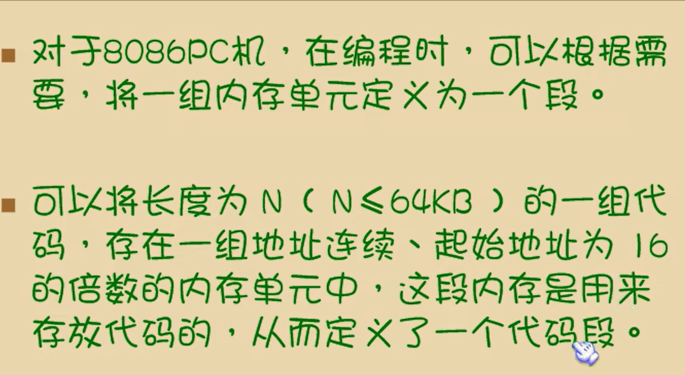

### 执行代码段的指令

## 2.9-2.12 小结

1.段地址在8086CPU的寄存器中存放。当8086CPU要访问内存时，由段寄存器提供内存单元的段地址。8086CPU由4个段寄存器，其中CS用来存放指令的短地址。

2.CS存放指令的段地址，ip存放指令的偏移地址。

8086中，任意时刻，CPU将CS：IP指向的内容当作指令执行

3.8086CPU的工作过程：

* 从CS:IP指向内存单元读取指令，读取的指令进入指令缓冲器
* IP指向下一条指令（IP有一个递加器，根据指令的长度加加，跳转到下一条指令）
* 执行指令

4.8086CPU提供转移指令修改CS·IP的内容

###### 检测点2.3

3次，

第一次读取 mov ax,bx，执行完成后，ip+3，到sub指令首地址开始读取

sub ax,ax，完成后ip+3

jmp ax 完成后 执行jmp指令到0000H的位置 ip=ax

根据cs：ip的工作过程推理，考虑到读取街道ip自动递增，ip修改的次数是四次，而只考虑ip修改指令的执行，那么ip只被修改了三次

~~~
读取 mov ax, bx 后，IP自动增加。
读取 sub ax, ax 后，IP自动增加。
读取 jmp ax 后，IP自动增加。
执行 jmp ax 时，IP被AX的值（0）覆盖。
~~~

## 实验一

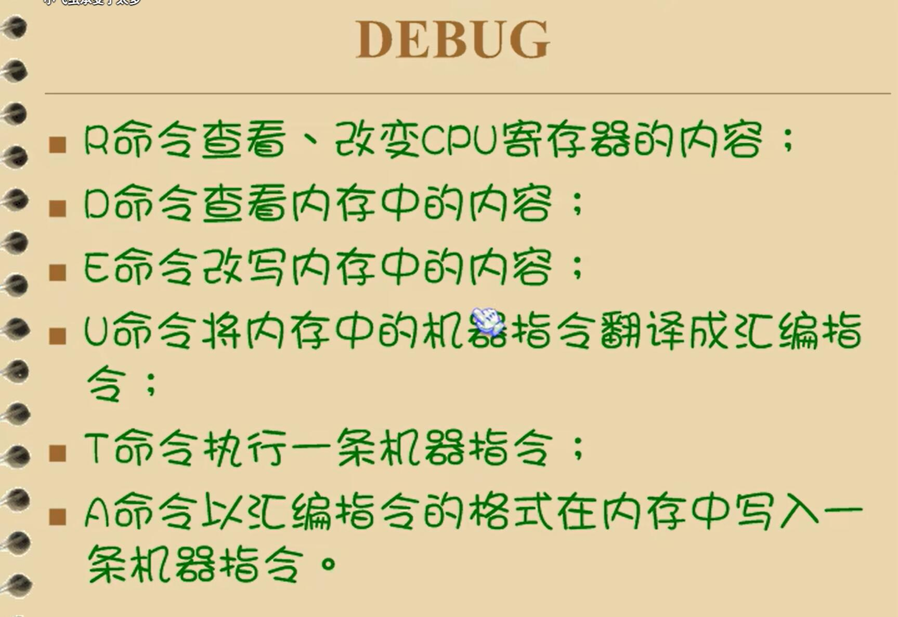
