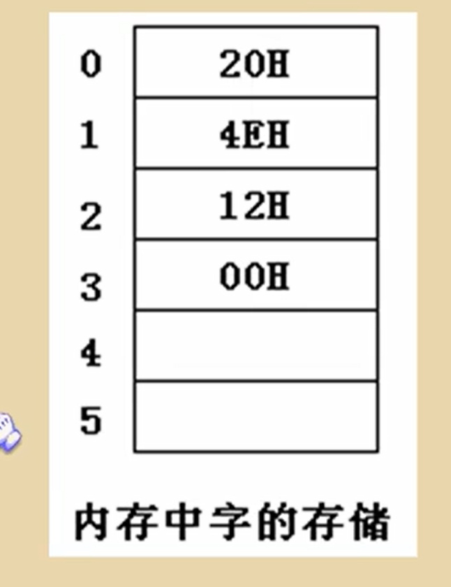
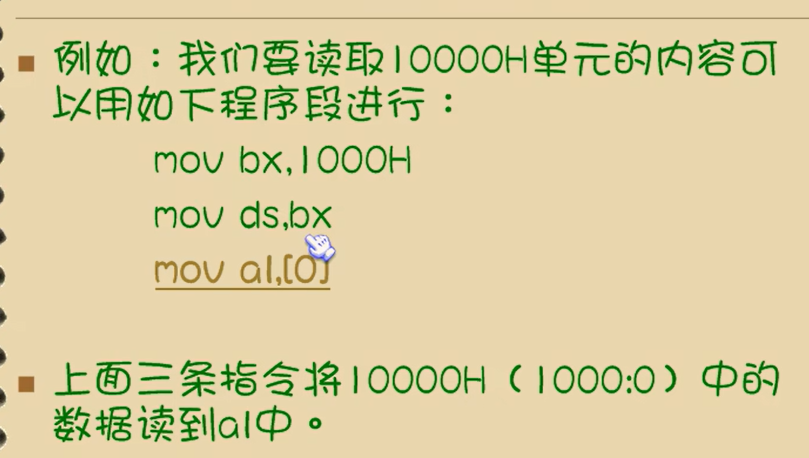
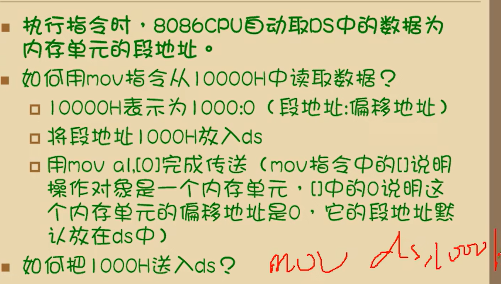
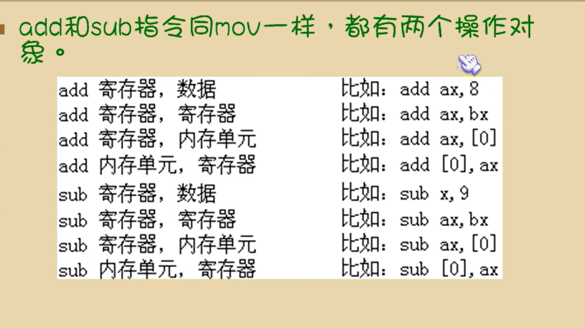
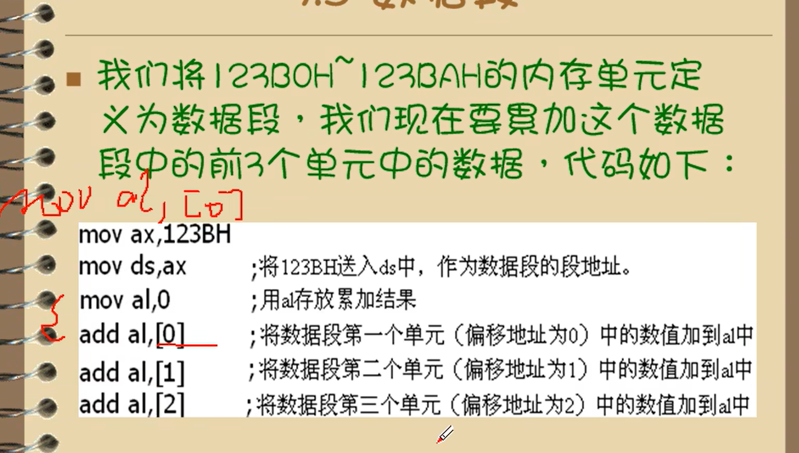

# 第三章：寄存器的内存访问

## 3.1 内存中字的存储

在0地址开始地址，低位存放低地址，高位存放高地址



0地址单元中存放的字节型数据    20

0地址字单元中存放的字型数据是多少   4e20  20000 

2地址字单元中存放的字节型数据是多少     12

2地址单元中存放的字型数据是多少    0012

1地址字单元中存放的自行数据是多少   124EH

## 3.2 DS和【address】

* cpu要读取一个内存单元的时候，必须先给出这个内存单元的地址
* 在8086pc中，内存地址由段地址和偏移地址组成
* 8086cpu中有一个ds寄存器，通常用来存放要访问的 数据的段地址



mov al,[0]

mov指令可以完成的两种传送功能

（1）：将数据直接送入从寄存器

（2）：将一个寄存器中的内容送入另一个寄存器中

 <font size=3 color="red">除此之外，mov 指令还可以将一个内存单元中的内容送入一个寄存器</font>

 【】中的内容为偏移地址，mov al,ds:[0] 

ds 存放段地址，【】存放偏移，上述三条指令，合起来就是将10000H单元中的数据读到al中



不能直接将数据送入ds中，ds是一个段寄存器，需要通过通用寄存器来导入ds


```
mov bl,al
mov ax,1000h
mov ds,ax
mov bl,[0]  --->  mov [0],bl
```


## 3.3 字的传送

8086cpu是16位结构，由16根数据线，所以，可以一次性传送16位的数据，也就是一次性传送一个字


mov的数据，如【0】和ax或者和al，必须一一对应，ax是16位，那么从偏移地址传送的数据默认就是16位的


~~~
ax：23H
bx：22H
cx：11H
bx：33H
cx：33H

ax:1123H
bx:6622H
cx:2211H
bx:8833H
cx:8833H
注意计算的时候，写入寄存器的位数区别，是否当作字节或者字来看，是否需要写入高位或者不写入高位
~~~


~~~
ax：2C34
10000H：2C34
bx：2c34
bx：2c12
10002H:2c12

10000H：34
10001H：2c
bx:2c34
bx:1b12
10003H:12
10004H:1b
~~~


## 3.4 mov，add，sub指令


```
mov ax,1000
mov bx,ax
mov ax,[0]
mov [0],ax
mov ds,ax
```


```
mov 段寄存器，寄存器

mov 寄存器，段寄存器

都可以
```




 <font size=3 color="red">段寄存器不能参与计算</font>

## 3.5 数据段


如何访问数据段中的数据：

将一段内存当作数据段，是我们在编程时的一种安排，我们可以在具体操作的时候，用ds存放数据段的段地址，再根据需要，用相关指令访问数据段中的具体单元

数据段的累加




写几条指令，累加数据段中的前3个自行的数据


## 3.1-3.5小结

（1）：字在内存中存储时，要用两个地址连续的内存单元来存放，字的低位字节存放在低地址单元中，高位字节存放在高地址单元中

（2）：用mov指令要访问内存单元，可以在mov指令中只给出单元的偏移地址，此时，段地址默认在ds寄存器中

（3）：【address】表示一个偏移地址为address的内存单元

mov ax,1000:[0] 会报错

（4）：在内存和寄存器之间传送字型数据时，高地址单元和高8位寄存器，第地质单元和低8位寄存器相对应

（5）：mov，add，sub时具有两个操作对象的指令。jmp是具有一个操作对象的指令

（6）：可以根据自己的推测，在debug中实验指令的新格式


c语言练习

**题目：学生成绩管理系统**

### **要求：**

1. 定义学生**结构体**（学号、姓名、3门成绩）
2. 动态创建学生数组（数量键盘输入）
3. 计算每个学生平均分和总分
4. 按总分**排序**（用指针操作）
5. 将结果保存到文件

### **数据结构：**

```
typedef struct {
    int id;
    char name[20];
    float scores[3];
    float total;
    float average;
} Student;
```

### **需要实现的函数：**

```
// 1. 输入学生信息
void input_students(Student *stu, int n);

// 2. 计算总分和平均分  
void calculate_scores(Student *stu, int n);

// 3. 按总分排序（用指针交换）
void sort_students(Student *stu, int n);

// 4. 打印学生信息
void print_students(Student *stu, int n);

// 5. 保存到文件
void save_to_file(Student *stu, int n, const char *filename);
```

### **示例输入：**

text

```
3
1001 Alice 85 90 78
1002 Bob 92 88 95  
1003 Cindy 76 85 80
```

### **示例输出：**

text

```
学号   姓名   语文 数学 英语 总分 平均分
1003  Cindy  76   85   80   241  80.33
1001  Alice  85   90   78   253  84.33  
1002  Bob    92   88   95   275  91.67
```


  ~~~
  代码：
  #include <stdio.h>
  #include <stdlib.h>
  
  typedef struct Student {
      int id;
      char name[20];
      float scores[3];
      float total;
      float average;
  } Student;
  
  void input_student(Student* stu, int n) {
      for (int i = 0; i < n; i++) {
          scanf("%d %s %f %f %f", &stu[i].id, stu[i].name,
              &stu[i].scores[0], &stu[i].scores[1], &stu[i].scores[2]);
      }
  }
  
  void calculate_total_average(Student* stu, int n) {
      for (int i = 0; i < n; i++) {
          stu[i].total = 0;  
          for (int j = 0; j < 3; j++) {
              stu[i].total += stu[i].scores[j];
          }
          stu[i].average = stu[i].total / 3;
      }
  }
  
  void sort_student(Student* stu, int n) {
      for (int i = 0; i < n - 1; i++) {
          for (int j = i + 1; j < n; j++) {   
              if (stu[i].total < stu[j].total) {
                   
                  Student temp = stu[i];
                  stu[i] = stu[j];
                  stu[j] = temp;
              }
          }
      }
  }
  
  void printf_student(Student* stu, int n) {
      printf("学号\t姓名\t语文\t数学\t英语\t总分\t平均分\n");  
      for (int i = 0; i < n; i++) {
          printf("%d\t%s\t%.1f\t%.1f\t%.1f\t%.1f\t%.2f\n",
              stu[i].id, stu[i].name,
              stu[i].scores[0], stu[i].scores[1], stu[i].scores[2],
              stu[i].total, stu[i].average);
      }
  }
  
  void save_file(Student* stu, int n) {
      char* filename = "d:\\11\\name.bin";
      FILE* fp = NULL;
      errno_t err = fopen_s(&fp, filename, "wb");   
      if (err != 0 || fp == NULL) {
          return;   
      }
      fwrite(stu, sizeof(Student), n, fp);  
      fclose(fp);
  }
  
  int main() {
      int n;
      scanf("%d", &n);
      Student* stu = (Student*)malloc(n * sizeof(Student));
  
      input_student(stu, n);
      calculate_total_average(stu, n);
      sort_student(stu, n);
      printf_student(stu, n);
      save_file(stu, n);
  
      free(stu);   
      return 0;
  }
  ~~~

注意事项：

数组初始化，未初始化的数组可能会导致访问到垃圾值

指针对其内容的直接更改  

