## 3.6 栈

栈是一种具有特殊访问方式的存储空间，特殊性在于：最后进入这个空间的数据，最先出去

* 栈有两个基本的操作：入栈和出栈
  * 入栈：将一个新的元素放到栈顶
  * 出栈：从栈顶取出一个元素
* 栈顶的元素总是最先入栈，需要出栈时，有最先被从栈中取出

对程序而言，需要有一个标记一直指示着最顶上的数据，每次这个数据被pop，然后标记+2从低地址到高地址，底部是不需要标记的

## 3.7 CPU提供的栈机制


8086cpu提供入栈和出栈的指令（最基本）

​		PUSH  （入栈）

​		POP （出栈）

push ax：将寄存器ax中的数据送入栈中

pop ax：从栈顶取出数据送入ax

8086cpu的入栈和出栈操作都是以字为单位进行的 （两个字节）


### *指令执行*


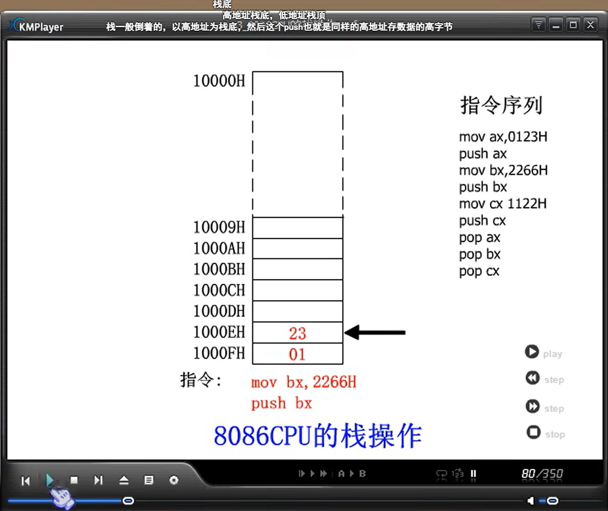


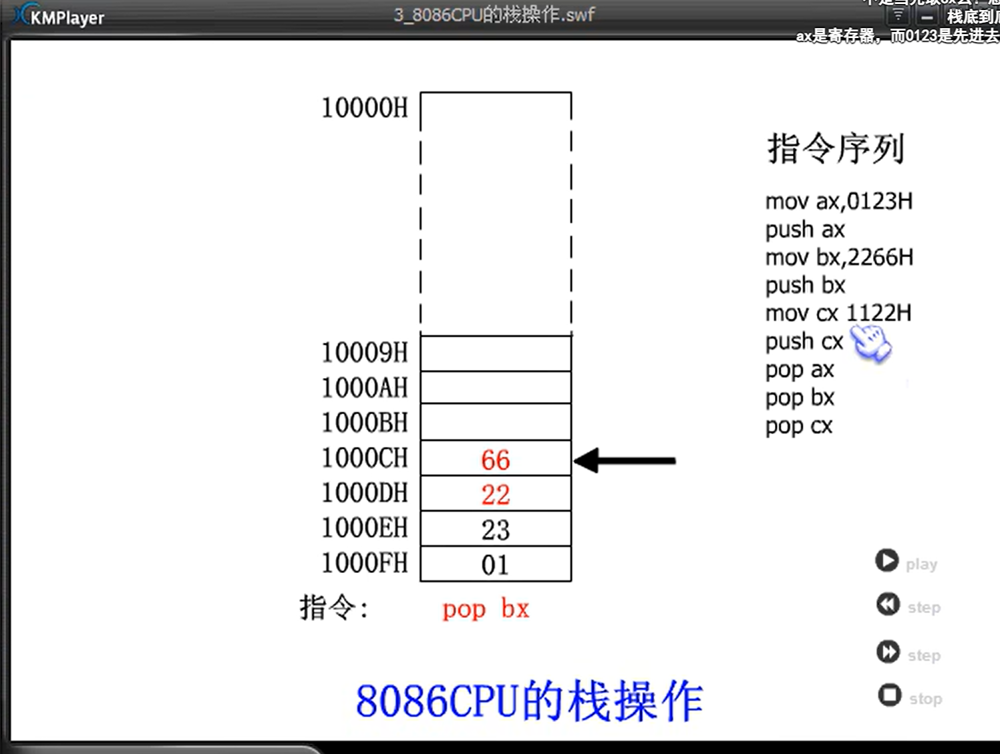

### 两个疑问：

* 1.cpu如何知道一段内存空间被当作栈使用
* 2.执行push和pop的时候，如何知道哪个单元是栈顶单元


### push ax

* SP = SP -2;
* 将ax中的内容送入SS：SP指向的内存单元处，SS：SP此时指向新栈顶


### 问题：

如果我们将1000H~000FH这段空间当作栈，初始状态栈式空的，此时，SS= 1000H，SP=？


栈空，ss：sp指向最高地址单元的下一个单元


如果栈的大小已经到了FFFF最大的时候，那么这时的+2将会导致溢出，不过由于栈为空，所以sp = 0

 ### pop的执行过程

* pop ax
  * 将SS：SP指向的内存单元处的数据送入ax中
  * SP = SP+2，SS：SP指向当前栈顶下面的单元，以当前栈顶下面的单元为新的栈顶

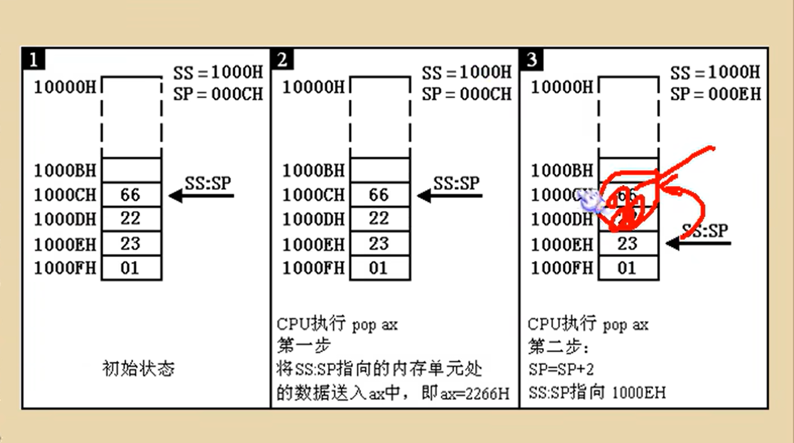

注意：

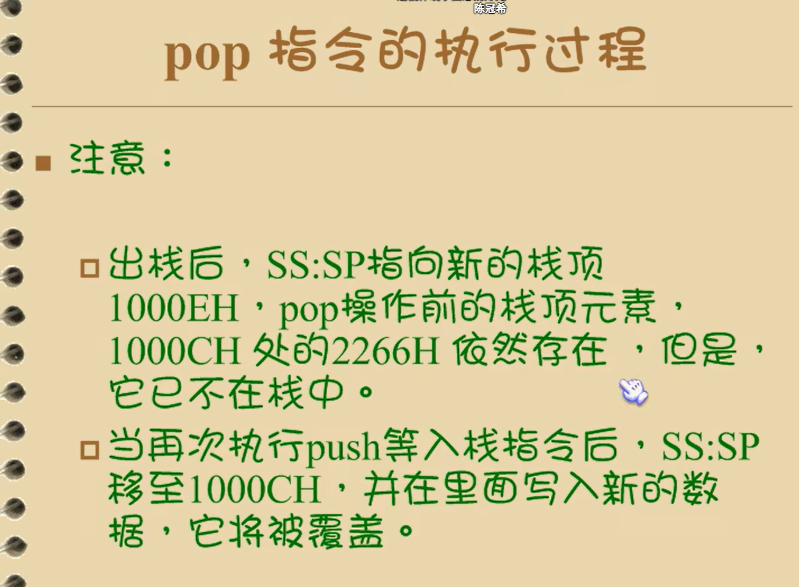

栈中已经存放的数据不会被删除，只能被覆盖

## 3.8 栈顶超界的问题

ss和sp只记录了栈顶的位置，依靠SS和SP可以保证在入栈和出栈时找到栈顶，可是如何能够保证在入栈，出栈时，栈顶不会超出栈空间？

栈溢出


栈越界

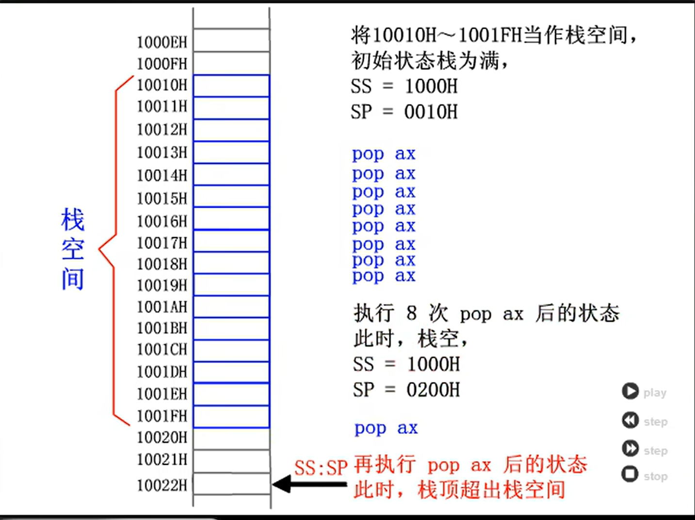

栈顶超界是危险的，我们将一段空间安排为栈，那么在栈空间之外的空间里很可能存放了具有其他用途的数据，代码，这些数据，代码可能是我们自己的程序中的，也可能是别的程序中的。


## 3.9 push,pop指令

push和pop指令是可以在寄存器和内存之间传送数据的

栈与内存

栈空间是内存空间的一部分，它只是一段可以以一种特殊方式进行访问的内存空间


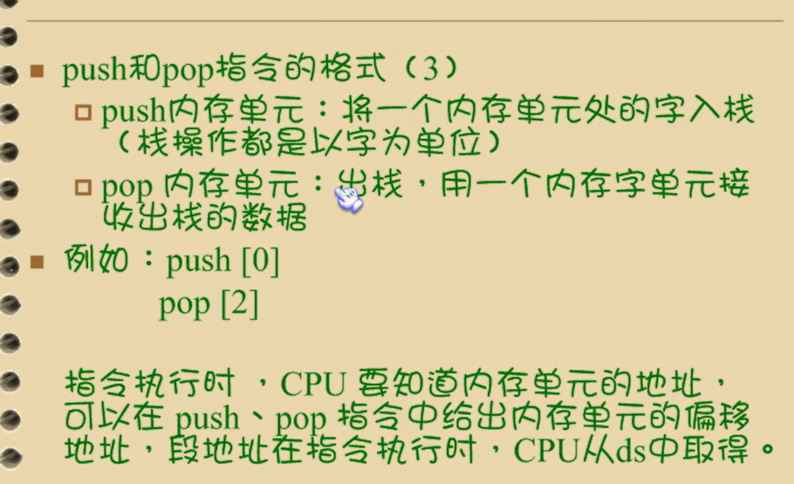

push和pop也可以用于

内存单元，段寄存器，寄存器，的入栈与出栈

### 问题3.7

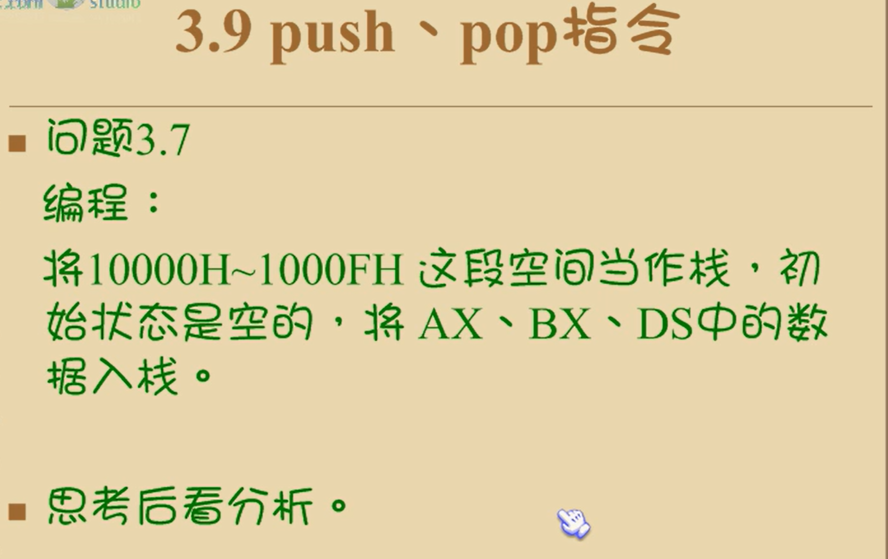

```
ss 1000
push ax,[0]
push bx,[2]
push ds,[4]
```

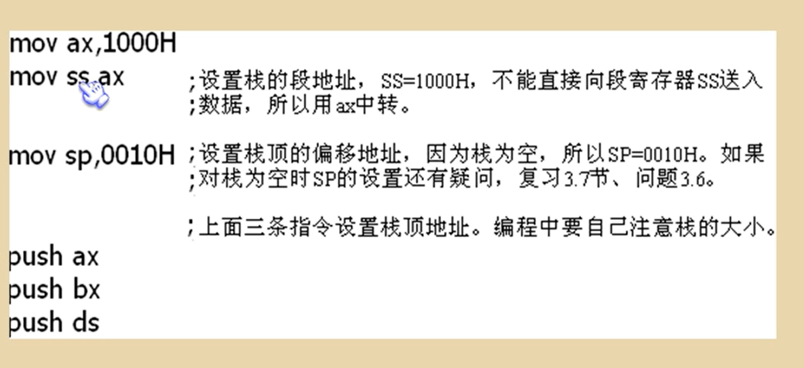

### 问题3.8


```
mov ax,1000h
mov ss,ax
mov sp,0010

mov ax,001A
mov bx,001B
push ax
push bx
mov ax,0
mov bx,0

pop bx
pop ax

```


用栈来暂存以后需要恢复的寄存器中的内容是，出栈的顺序要和入栈的顺序相反，因为最后入栈的寄存器的内容在栈顶，所以在恢复时，要最先出栈


push和pop即是一种内存传送指令，可以在寄存器和内存之间传输数据，与mov指令不同的是，push和pop指令访问的内存单元的地址是由SS:SP指出的，而且push和pop还会在执行指令的过程中，更改SS:IP的内容


## 3.10 栈段


### 问题3.11

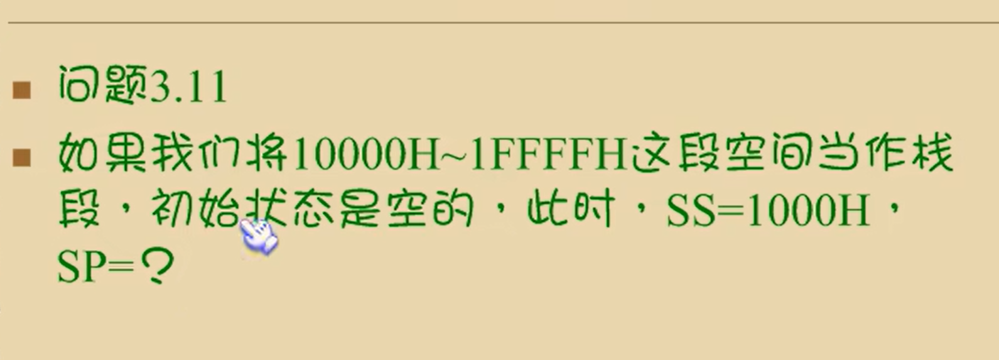

  分析


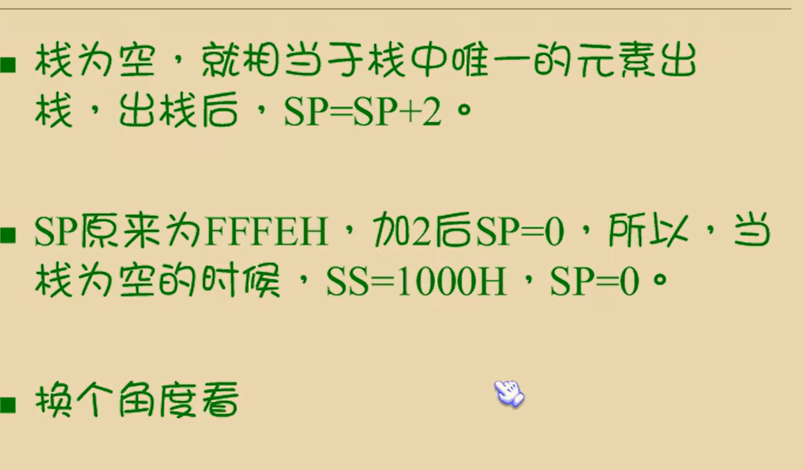

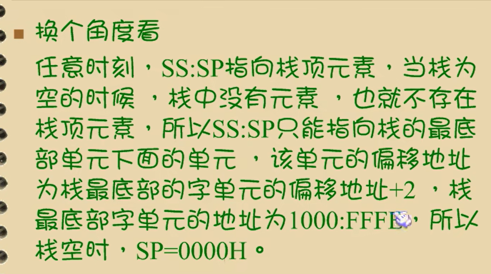

一个cpu能容纳最大的是64kb的栈

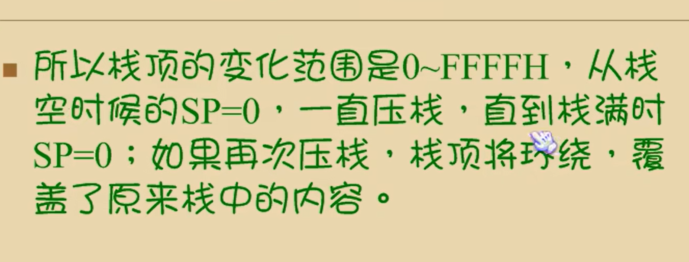

## 总结

我们可以将一段内存定义为一个段，用一个段地址指示段，用偏移地址访问段内的单元，这完全是我们自己的安排

我们可以用一个段存放数据，将它定义为“数据段”

我们可以用一个段存放代码，将它定义为“代码段”

用段来存放栈，即为栈段

**对于代码段**

段地址放在cs中，第一台哦指令的偏移地址放在ip中，这样cpu就将执行我们定义的代码段中的指令

**对于栈段**

将它的地址放在ss中，将栈顶单元的偏移地址放在SP中，这样cpu在需要进行栈操作的时候，比如执行push，pop指令等，就将我们定义的站栈当作栈空间来用

**代码段分析**


这段代码既是代码段，又是栈段，又是数据段

一段内存，可以即是代码的存储空间，也可以是数据的存储空间，还可以是栈空间，也可以什么都不是

**关键在于cpu寄存器的设置**