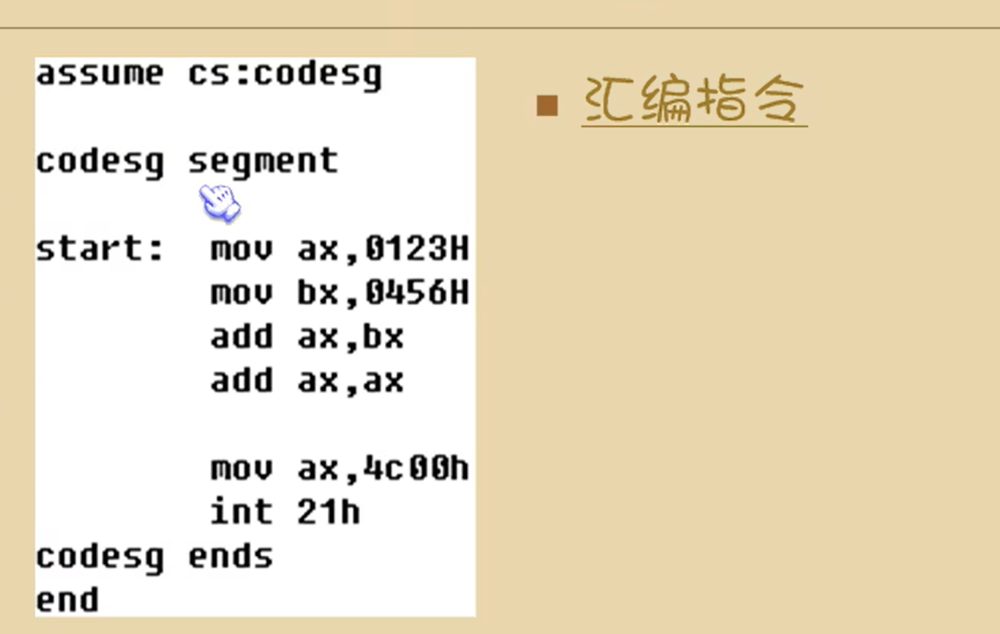
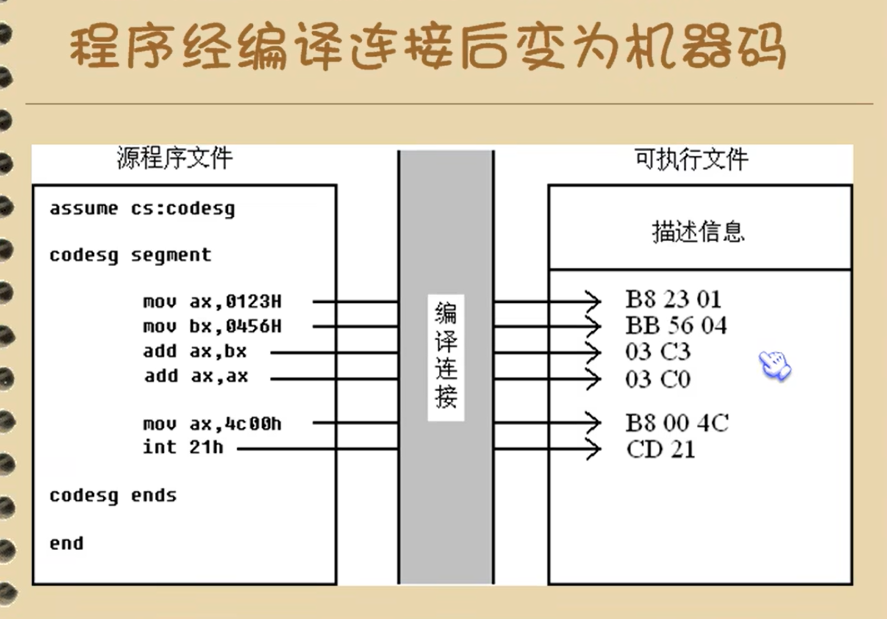

# 第四章 第一个程序

## 4.1 一个源程序从写出到执行的过程

一个汇编语言程序从写出到最终执行的简要过程：

编写  -->   编译和连接   -->    执行

文本编译器，记事本，notepad++


使用汇编语言编译恒旭（MASE.EXE）对源程序文件中的源程序进行编译，产生目标文件，obj

在用连接程序（LINK.EXE）对目标文件进行连接，生成可在操作系统中直接运行的可执行文件


可执行文件中包含两部分内容：

* 程序，（从原程序中的汇编指令翻译过来的机器码）和数据（源程序中定义的数据）
* 相关的描述信息（比如：程序有多大，要占用多少内存空间）


操作系统中执行可执行文件中的程序

* 操作系统依照可执行文件中的秒速信息，将可执行文件中的机器码和数据加载入内存，，并进行相关的初始化（比如：设置CS:IP指向第一条要执行的指令），然后由cpu执行程序


## 4.2 源程序



汇编指令：

有对应的机器码的指令，可以被编译为机器码的指令，最终可以被cpu执行、

伪指令：

没有对应机器码的指令，最终不被cpu所执行

由编译起来执行的指令，编译器根据伪指令来进行相关的编译工作


### 定义一个段

XXX segment  定义一个段

XXX ends

segment和ends是一对成对使用的伪指令，只是在写可被编译器编译的汇编程序时，必须要用的到一对伪指令

功能是用来定义一个段，segment表示段的开始，ends表示一个段的结束


* 一个汇编程序是由多个段组成的，这些段被用来存放代码，数据或者当作栈空间来使用
* 一个由意义的汇编程序中至少要有一个段，这个段用来存放代码


* end是一个汇编程序的结束标记，编译器在编译汇编程序的过程中，如果碰到了伪指令end，就结束对原程序的编译
* 如果程序写完了，也要在结尾处加上伪指令end，否则，编译器在编译程序时，无法知道程序在何处结束

<font size=3 color="red">切记：不要搞混了end和ends</font>

## 寄存器与段的关联假设

assume：含义为”假设“

它假设某一段寄存器和程序中的某一个用segment...ends定义的段相关联

通过assume说明这种关联，在需要的情况下，编译程序可将段寄存器和某一个具体的段相联系


```
assume cs:codesg

codesg segment

start:	mov ax,0123h
    	mov bx,0456h
    	add ax,bx
    	add ax,ax

    	mov ax,4c00h
    	int 21h
codesg ends
end

assume 假设一个代码段，名字为codesg
codesg semgent 
```


### 原程序中的”程序“

汇编源程序：

​	伪指令（编译器处理）

​	汇编指令（编译为机器码）

程序：源程序中最终由计算机执行，处理的指令或者数据

**注意**

我们可以将源程序文件中的所有内容成为源程序，将源程序中最终有由计算机执行处理的指令或数据，成为程序

沉痼最新啊一汇编指令的形式存在源程序中，经编译，连接后转变为机器码，存储在可执行文件中



