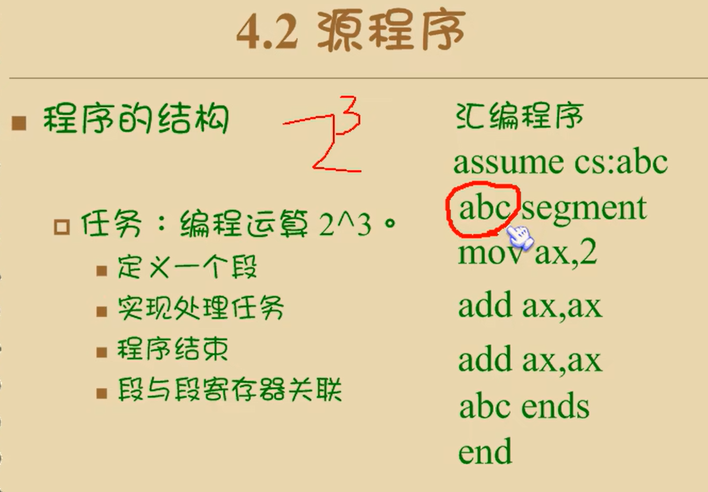
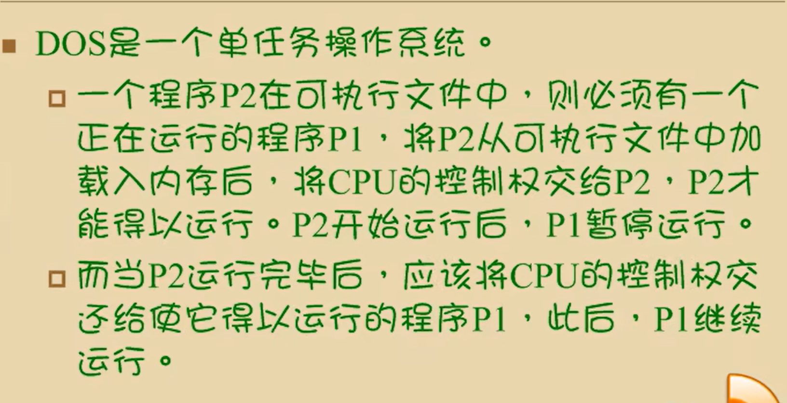
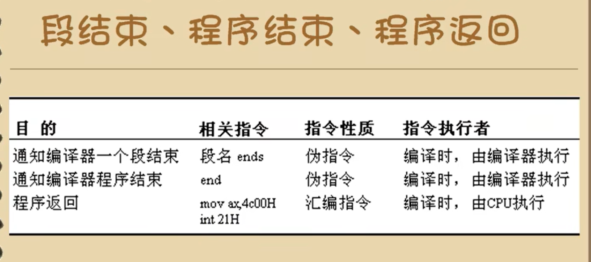
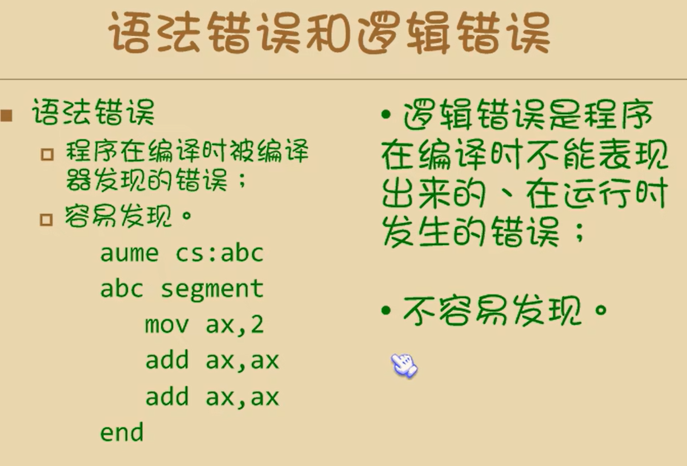
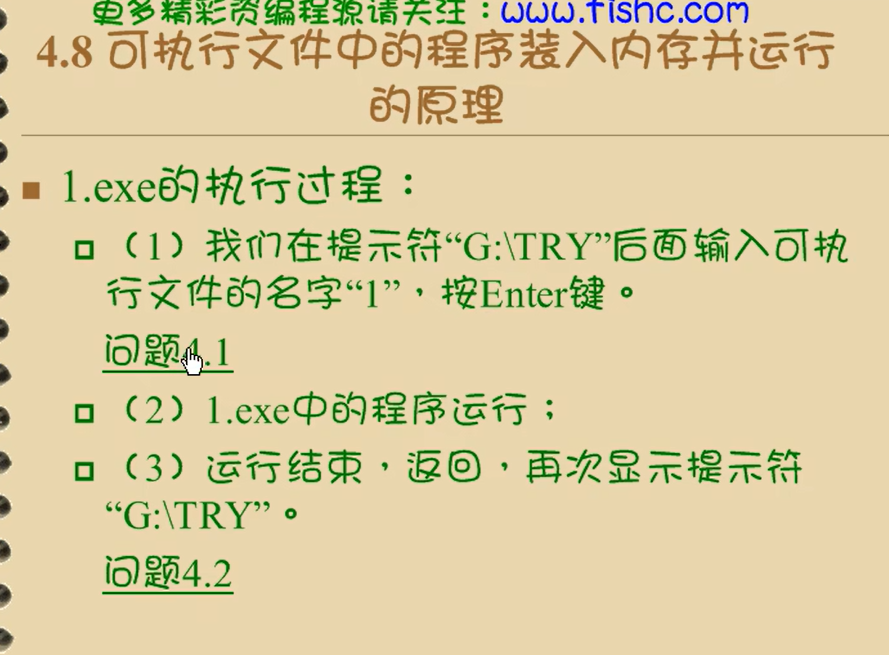
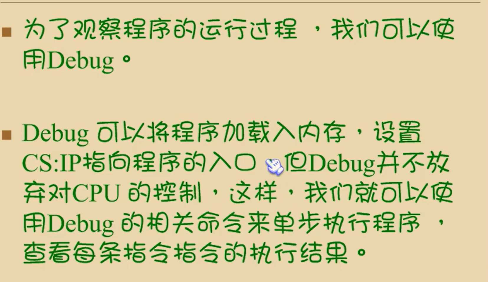
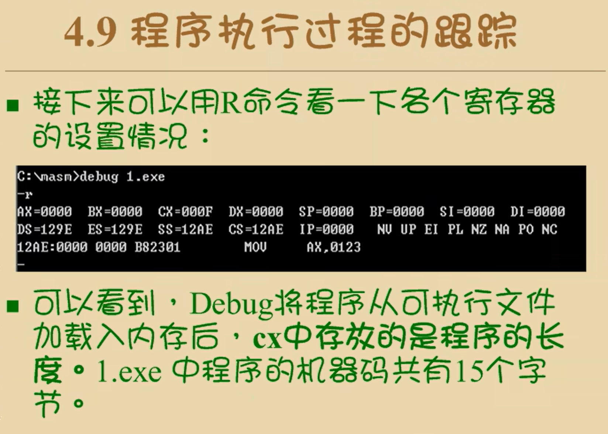
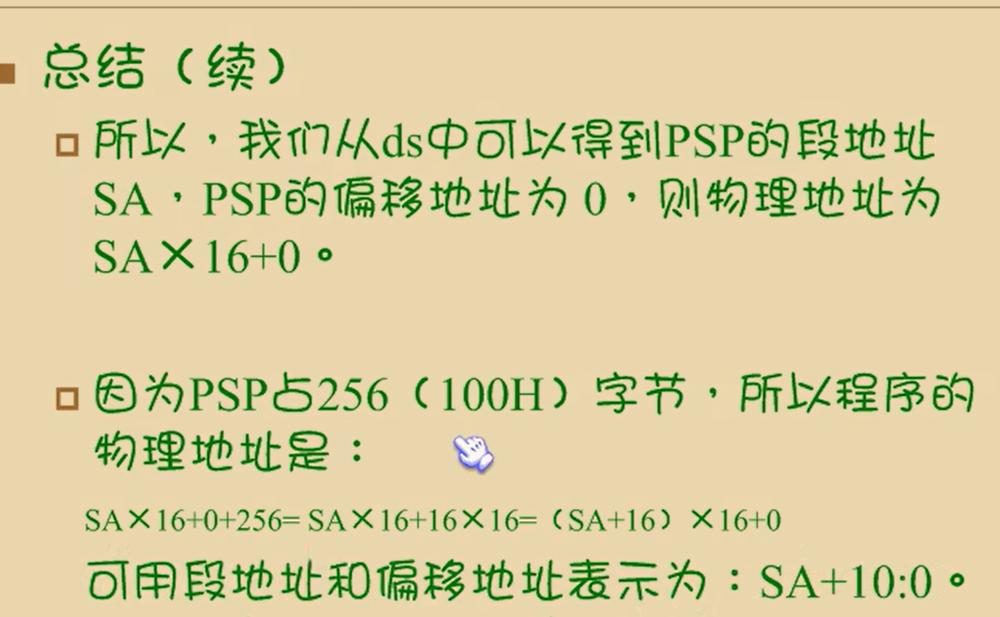
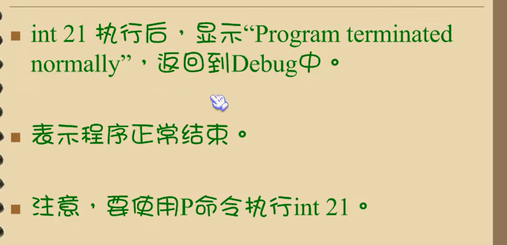

## 4.2 源程序

* 标号
  * 有个标号只带了一个地址
  * codesg：放在segment的前面，作为一个段的名称，这个段的名称最终将被编译，连接程序处理为一个段的段地址

* 程序返回
  * 我们的程序最先以汇编指令的形式存在源程序中，经过编译，连接后转变为机器码，存储在可执行文件中，那么，如何得到运行呢

**dos中的程序运行**

* 
  * 一个程序结束后，将cpu的控制权交还给使它得以运行的程序，我们成这个过程为：程序返回

### 段结束，程序结束，程序返回

### 语法错误和逻辑错误

### 关于编译和链接

编译连和接的作用是什么呢

链接作用有以下几个

* 当源程序很大时，可以将他分为多个源程序文件夹编译，每个源程序编译成为目标文件后，再用链接程序将他们链接到一起，生成一个可执行文件
* 程序中调用了某个库文件中的子程序，需要将这个库文件和该程序生成的目标文件链接到一起，生成一个可执行文件、
* 一个源程序编译后，得到了存有机器码的目标文件，目标文件中的有些内容还不能直接用来生成可执行文件，链接程序将这些内容处理为最终可执行信息

所以，在只有一个源程序文件，而又不需要调用某个库中的子程序的情况下，也必须用链接程序对目标文件进行处理，生成可执行文件

对于连接的过程，可执行文件是我们要得到的最终结果

## 4.8 可执行文件中的程序装入内存并运行的原理

在dos中，可执行文件中的程序P1若要运行，必须有一个正在u运行的程序P2，将P1从可执行文件中加载入内存，将CPU的控制权交给他，P1才能得以运行

 当P1运行完毕后，应该将CPU的控制权交还给使它运行的p1

问题4.1

### 操作系统的外壳

操作系统给是由多个功能模块组成的庞大，复杂的软件系统。任何通用的操作系统，都需要提供一个称为shell（外壳）的程序，用户（操作人员）使用这个程序来操作计算机系统工作

dos中有应该程序command.com ，这个程序在dos中称为命令解释器，也就是dos系统的shell

### 4.8 可执行文件中的程序装入内存并运行的愿意

 

## 4.9 程序执行过程的跟踪 

psp，用来和程序通信

注意：有一部称为重定位的工作我们在上面没有讲解，因为这个问题和操作系统的关系较大，不做讨论

总结：

ds：1000：0         程序 1010：0

如果不使用p命令执行int 21，会导致ip指向乱跳，非正常结束

使用q命令退出debug，将返回到command中，因为debug是由command加载运行的

我们在dos中用“debug 1.exe”运行debug对1.exe进行跟踪时，程序加载的顺序时：command加载debug，debug加载1.exe

返回的顺序是：从1.exe中的程序返回到debug，从debug返回到command

