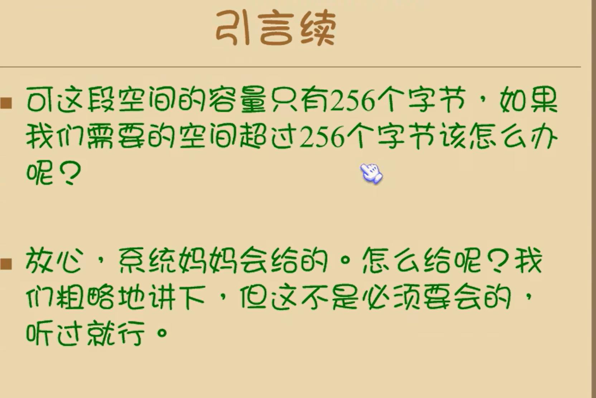
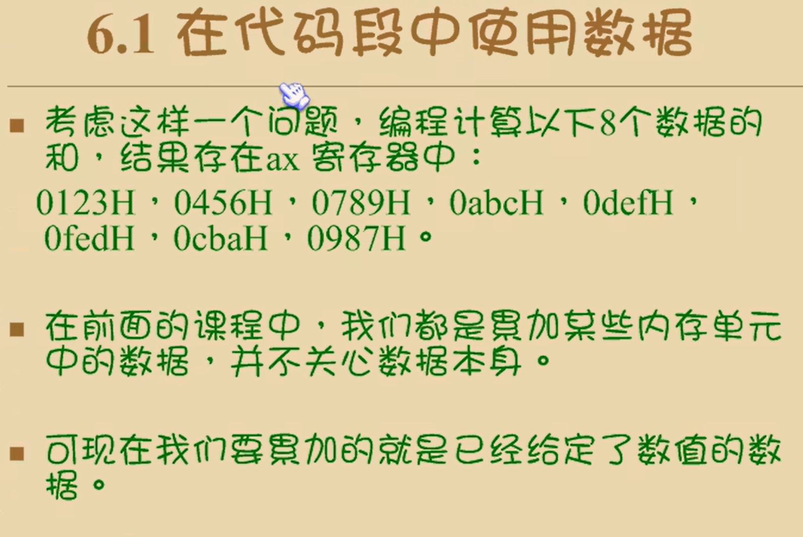
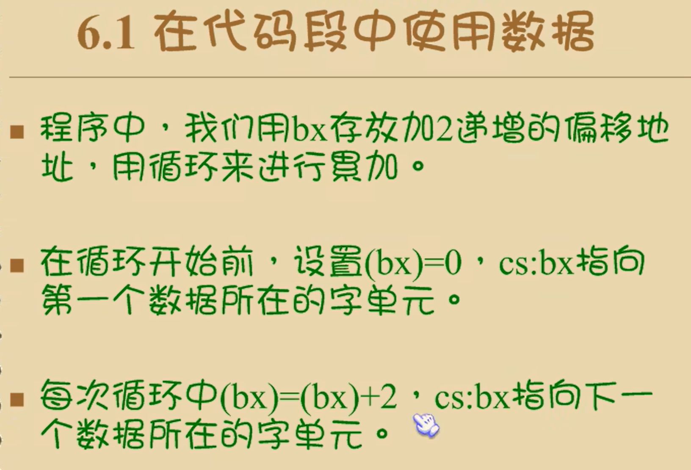
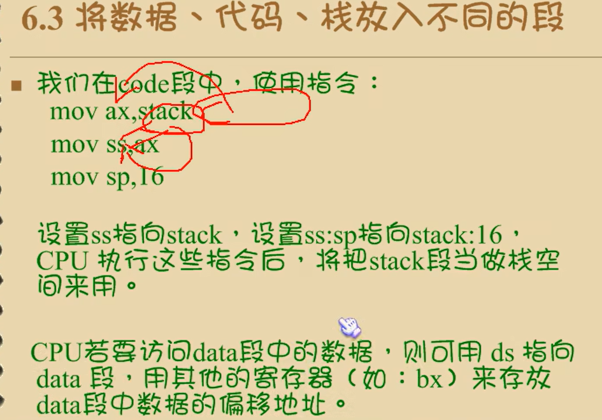
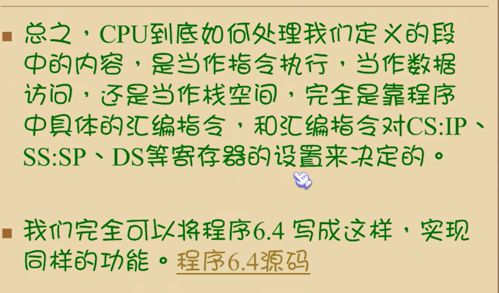

# 第六章 包含多个段的程序





## 6.1 在代码段中使用数据



```
assume cs:codesg
codesg segment
  dw 0123h,0456h,0789h,0abch,0defh,0fedh,0cbah,0987h
  mov bx,0
  mov ax,0
  mov cx,8
s:add ax,cs:[bx]
  add bx,2
  loop s
  mov ax,4c00h
  int 21h
codesg ends
end
```

"dw"是定义字型数据 dw = define word

db 定义字节型数据

字型数据所占的内存空间大小为2个字节

* 程序中的指令要对这8个数据进行累加
* 由于数据在代码段中，程序在运行的时候cs中存放代码段的段地址，所以我们可以从cs中得到它们的段地址




* 如何让这个程序在编译后可以存系统中直接运行呢
* 可以在源程序中指明界序的入口所在


给程序指定一个入口，告诉cpu程序从入口开始，可以避免cpu误读指令导致程序错误执行错误代码

* 注意程序6.2新加入的内容，我们在程序的第一条指令的前面加上了一个标号start，而这个标号在伪指令end的后面出现
* end的作用：end除了通知编译器程序结束外，还可以通知编译器程序的入口在什么地方

## 6.2 在代码段中使用栈


大致思路：

程序运行时，定义的数据存放在cs：0~cs：15单元中，共8个字单元，一次将这8个字单元中的数据入栈，然后再依次出栈到这8个字单元中，从而实现数据的逆序存放

* 首先我们需要有一段可以当作栈的内存空间，如前所述，这段空间应该由系统来分配
* 我们可以在程序中通过定义数据来取得一段空间，然后将这段空间当作栈空间来用

```
assume codesg
codesg segment
	dw 0123h,0456h,0789h,0abch,0defh,0fedh,0cbah,0987h
	de 0,0,0,0,0,0,0,0      ;用dw定义8个字型数据，
	;在程序加载后，将取得8个字的内存空间，存放这8个数据，
	;在后面的程序中将这段空间当作栈来使用
	
start:mov ax,cs
      mov ss,ax
      mov sp,32   ;设置栈顶指向cs:32
      mov bx,0
      mov cx,8
      
    s:push cs:[bx]
      add bx,2
      loop s		;0~16单元中的8个字型数据依次入栈
      
      mov bx,0
      mov cx,8
      
   s0:pop cs:[8]
      add bx,2
      loop s0		;依次出栈
      
      mov ax,4c00h
      int 21h
codesg ends
end start
```


## 6.3 将数据，代码，栈放入不同的段

* 在前面的内容中，我们在程序中用到了数据和栈，我们将数据，栈和代码都放到了一个段里面。我们在编程的时候要注意何处是数据，何处实战，何处是代码

* 问题：
  * 把它们放到一个段中使程序显得混乱
  * 前面程序中处理的数据很少，用到的栈空间也小，加上没有多长的代码，放到一个段里面没有问题

* 但如果数据，栈和代码需要的空间超过64kb，就不饿能放在一个段中（一个段的容量不能大于64kb，是我们在学习中所用的8086模式的限制，并不是所有的处理器都这样）
* 所以我们应该考虑用多个段来存放数据

我们用和定义代码段一样的方法来定义多个段，然后在这些段里面定义需要的数据，或通过定义数据来取得栈空间

```
assume cs:code,ds:data,ss:stack

data segment
  dw 0123h,0456h,0789h,0abch,0defh,0fedh,0cbah,0987h
data ends

stack segment
  dw 0,0,0,0,0,0,0,0
stack ends

code segment
start:mov ax,stack
      mov ss,ax
      mov sp,16     ;设置栈顶ss:sp指向stack:16
      mov ax,data
      mov ds,ax     ;ds指向data段
      mov bx,0      ;ds:bx指向data段中的第一个单元
      mov cx,8
    s:push [bx]
      add bx,2
      loop s      ;以上将data段中的0~16单元中的8个自行数据依次入栈
      
      mov bx,0
      mov cx,8
   s0:pop [bx]
      add bx,2
      loop s0
      
      mov ax,4c00h
      int 21h
code ends
end start
      
```


* 一，我们在源程序中为这个三个段起了具有含义的名称，用来存放数据的段我们将其命名为data，用来存放代码的段我们将其命名为code，用来做栈空间的命名为stack
* 二，我们源程序中用伪指令 ,"assume cs:code,ds:data,ss:stack"将cs，ds，ss分别与code，data，stack段相连
  * 这样做了之后，cpu是否就会将cs指向code，ds指向data，ss指向stack，从而按照我们的意图来处理这些段呢
  * 并不会。
* 三，若要cpu按照我们的安排行事，就要用机器指令控制它，源程序中的汇编指令是cpu要执行的内容

我们在源程序的最后用"end start"说明了程序的入口，这个入口将被写入可执行文件的描述信息，可执行文件中的程序被加载入内存后，cpu的cs:ip被设置指向这个入口，从而开始执行程序中的第一条指令

标号"start"在"code"段中，这样cpu就将code段中的内容当作指令来执行了





## 实验五

### 一

~~~
assume cs:code,ds:data,ss:stack

data segment
  dw 0123h,0456h,0789h,0abch,0defh,0fedh,0cbah,0987h
data ends

stack segment
  dw 0,0,0,0,0,0,0,0
stack ends

code segment

start: mov ax,stack
       mov ss,ax
       mov sp,16
       
       mov ax,data
       mov ds,ax
       
       push ds:[0]
       push ds:[2]
       pop ds:[2]
       pop ds:[0]
       
       mov ax,4c00h
       int 21h
       
 code ends
 
 end start
~~~

### 二

```
assume cs:code,ds:data,ss:stack

data segment
  dw 0123h,0456h
data ends

stack segment
  dw 0,0
stack ends

code segment

start: mov ax,stack
       mov ss,ax
       mov sp,16
       
       mov ax,data
       mov ds,ax
       
       push ds:[0]
       push ds:[2]
       pop ds:[2]
       pop ds:[0]
       
       mov ax,4c00h
       int 21h
       
 code ends
 
 end start
```


### 三

```
assume cs:code,ds:data,ss:stack

code segment

start: mov ax,stack
       mov ss,ax
       mov sp,16
       
       mov ax,data
       mov ds,ax
       
       push ds:[0]
       push ds:[2]
       pop ds:[2]
       pop ds:[0]
       
       mov ax,4c00h
       int 21h
       
 code ends
 
 data segment
  dw 0123h,0456h
data ends

stack segment
  dw 0,0
stack ends
 
 end start
```


### 四

如果将前面三个代码中结尾的 end start 的 start 去掉，那么哪个代码可以正常运行？

第三个可以正常运行

第三个的代码段放在最开始，cpu可以正确的识别并执行

### 五

```
assume cs:code

a segment
	db 1,2,3,4,5,6,7,8

a ends
b segment
	db 1,2,3,4,5,6,7,8
b ends

c segment
	db 0,0,0,0,0,0,0,0
c ends

code segment
start:
	mov bx,0
  mov cx,8
s1:
	mov ax,a
	mov ds,ax
	
 
	mov al,[bx]
	mov ah,0
	
	mov dx,c
	mov ds,dx
	
	mov [bx],al
	
	inc bx
	loop s1

	mov bx,0
  mov cx,8
s2:
  mov ax,b
	mov ds,ax
	
	mov al,[bx]
	mov ah,0
	
	mov dx,c
	mov ds,dx
	
	add [bx],al
	
	inc bx
	loop s2

	mov ax,4c00h
	int 21h

code ends
end start
```


### 六

~~~
assume cs:code
a segment
	dw 1,2,3,4,5,6,7,8,9,0ah,0bh,0ch,0dh,0eh,0fh,0ffh
a ends
b segment
	dw 0,0,0,0,0,0,0
b ends
code segment
start:
      mov ax,a
			mov ds,ax
			mov ax,cs
			mov ss,ax
			mov sp,200

			mov ax,b
			mov es,ax

			mov bx,0
			mov cx,8

s:
			push [bx]
			add bx,2
			loop s

			mov bx,0
			mov cx,8
s1:
			pop es:[bx]
			add bx,2
			loop s1

			mov ax,4c00h
			int 21h

code ends
end start
~~~


