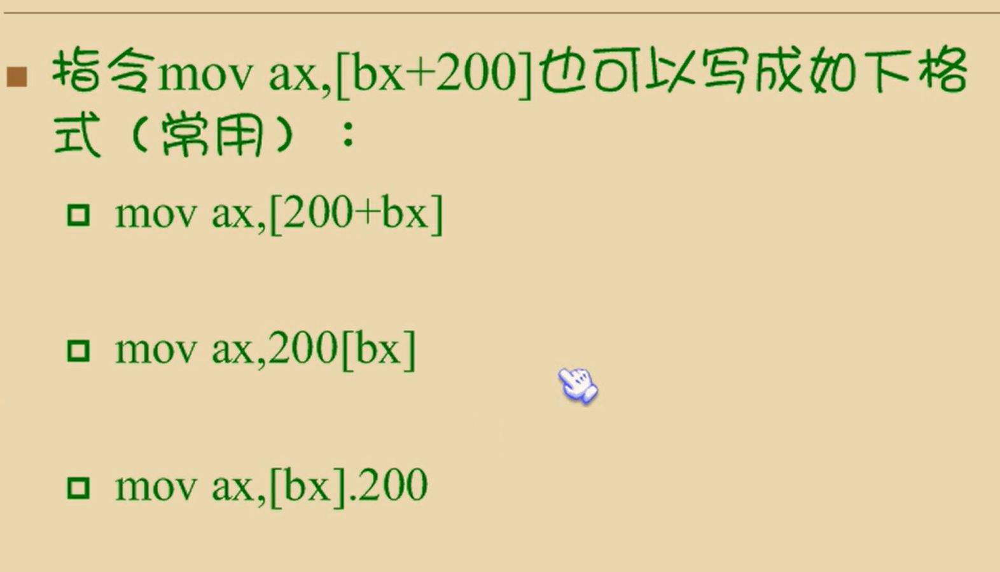
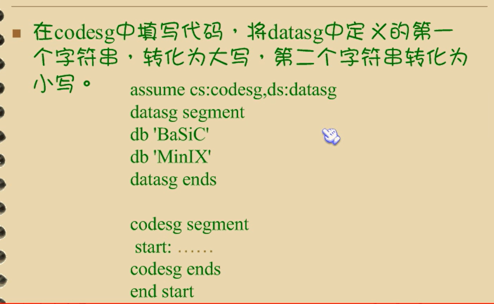
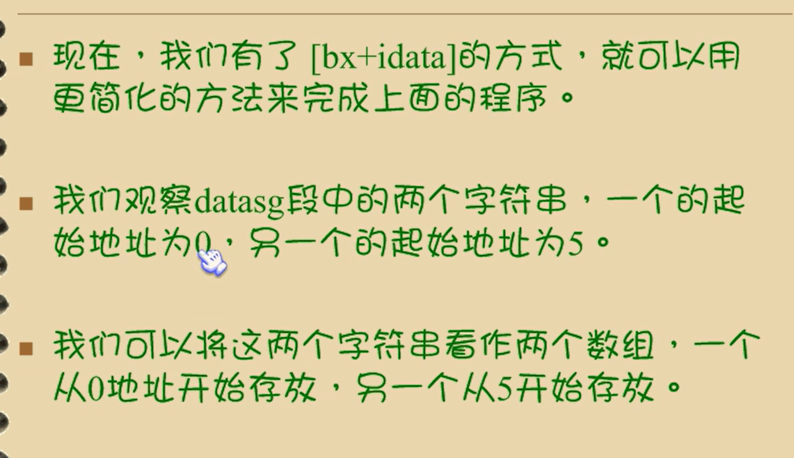
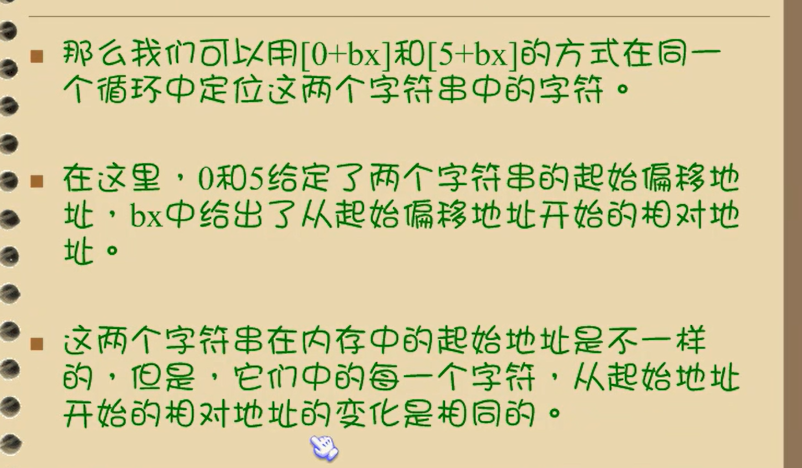
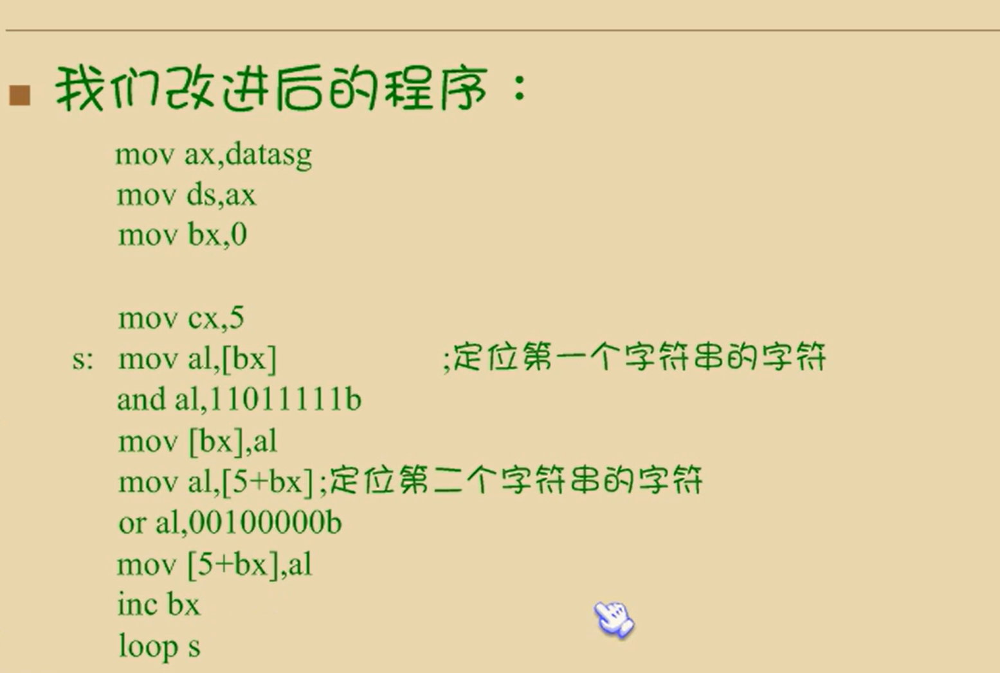
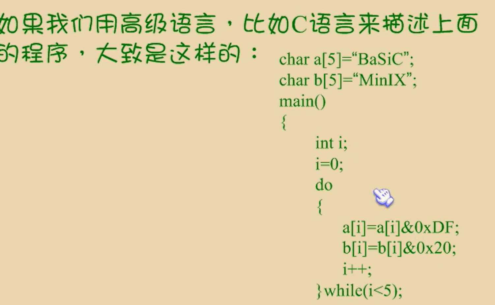
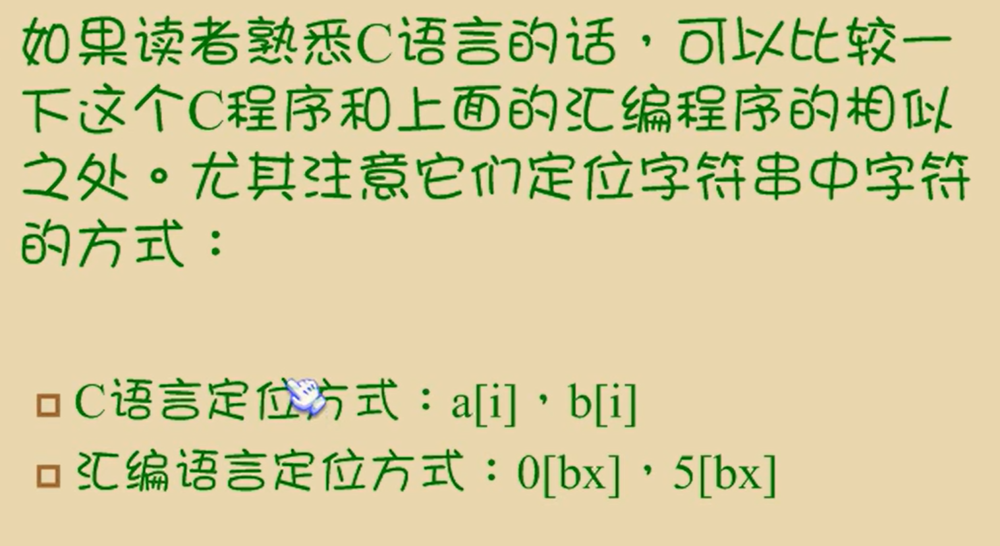

# 第七章 更灵活的定位内存地址的方法

引言：主要讲解一些更灵活的定位内存地址的方法和相关的编程方法

## and和or指令


有0取0

### and指令的一点功能


可以将某一位变为0，其他位保持不变

从右往左，第一个是第0位


图中and打错，应该为or

有1取1，两个0取0

### or指令的一点功能


## 7.2 关于ASCII码

* 世界上有很多编码方案，有种方案叫做ASCII编码，是在计算机系统中通常被采用的

* 简单的说，编码方案，就是一套规则，它约定了用什么样的信息来表示现实对象

* 一个文本编辑过程中，就包含这按照ASCII编码规则进行的编码和阶码

  


## 7.3 以字符型时给出的数据

* 我们可以在汇编程序中，用 '.....' 的方法指明数据是以字符的形式给出的，编辑器将其转化为ASCII码
* 要改变一个字母的大小写，实际上就是改变它所对应的ascii码


## 7.4 大小写转换的问题


* 通过对比，我们可以看出来，小写字母的ASCII码值比大写字母的ASCII码值打20H
* 这样我们可以想到，将小写字母的ASCII码减去20H就能得到大写字母，大写加上20H就能够得到小写


注意：

对于字符串“BaSic”，应该只对其中的小写字母所对应的ASCII码进行减20H操作，将其转化为大写，而对大写字母不改变

而对其中的小写字母不进行改变，这里面就存在这一个前提，程序必须要能够判断一个字母是大写还是小写


判断将用到一些我们目前还未学习到的指令，现在面临的问题是用自己已经学习的指令来解决这个问题，则我们不能对字母的大小写进行任何的判断

但是现实的题目要求流程必须要能够区别对待大小写字母

可以看出，就ASCII码的二进制形式来看，除了第五位（位数从0开始计算）外，大写字母和小写字母的其他各位都一样

大写字母的ASCII码的第五位为0，小写字母的第五位为1


```
assume cs:codesg,ds:datasg
datasg segment
db 'BaSic'
db 'iNfOrMaTiOn'
datasg ends

codesg segment
start:mov ax,datasg   
      mov ds,ax     ;设置ds指向datasg段
      
      mov bx,0     ;设置(bx)=0,ds:bx指向"BaSiC"的第一个字母
      
      mov cx,5    ;设置循环次数5，因为"BaSiC"
    s:mov al,[bx]  ,将ASCII码从ds:bx所指向的单元中取出
    and al,11011111b  ;将al中的ASCII码的第五位置为0，变为大写字母
    mov [bx],al  ;将转变后的ASCII码写回原单元
    
    inc bx  ;(bx)加1，ds:bx指向下一个字母
    loop s
    
    
    mov bx,5  ;设置(bx)=5 ds:bx指向"iNfOrMaTiOn"的第一个字母
    
    mov cx,11  ;设置循环次数11，因为"iNfOrMaTiOn"的有11个字母
 s0:mov al,[bx]
    or al,00100000b ;将al中的ASCII码的第五位置变为0，变为小写字母
    mov [bx],al
    inc bx
    loop s0
    
    mov ax,4c00h
    int 21h
    
codesg ends
end start
```


## 7.5 [bx+idata]

* 在前面，我们可以用[bx]的方式来指明一个内存单元，我们还可以用一种个高位灵活的方式来指明内存单元：

  [bx+idata]表示一个内存单元，他的偏移地址为(bx)+idata （bx中的数值加上idata）

  比如: [10H]  拆成[bx = 8H+2H]

  

  




问题7.1


~~~
mov ax,2000h
mov ds,ax
mov bx,1000h
mov ax,[bx]
mov cx,[bx+1]
add cx,[bx+2]
~~~


## 7.6 用[bx+idata]的方式进行数组的处理

有了[bx+idata]这种表示内存单元的方式，我们就可以用更高级的结构来看待所要处理的数据




更简化的操作









用高级语言来描述






[bx+idata]的方式为高级语言实现数组提供了便利机制