## 7.7 SI和DI

* SI和DI是8086CPU中和bx功能相近的寄存器，但是SI和DI不能够分成两个8位寄存器来使用

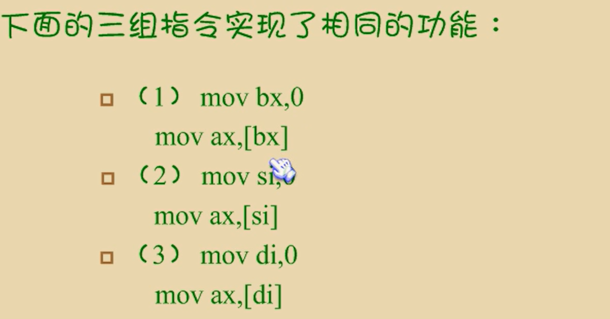


### 问题7.2


```
s:
mov bx,0
mov di,[bx]
mov [bx+16],di
inc di
inc bx
mov cx,16
loop s

```

<font size=3 color="red">不能使用内存-内存的方式</font>

问题7.2分析


* 用ds:si指向要赋值的原始字符串，用ds:di来指向复制的目的空间，然后后用一个循环来完成复制


```
codesg segment
start:mov ax,datasg
mov ds,ax
mov si,0
mov di,16
mov cx,8
s:
mov ax,[si]
mov [di],ax
add si,2
add di,2
loop s

mov ax,4c00h
int 21h
```


利用[bx (si或di) + idata]的方式来简化程序

~~~
codesg segment
start:mov ax,datasg
mov ds,ax
mov si,0
mov cx,8
s:
mov ax,0[si]
mov 16[si],ax
add si,2
loop s
mov ax,4c00h
int 21h
codesg ends
~~~


更更灵活的方式

【bx+si】

【bx+di】

## 7.8 [bx+si]和[bx+di]

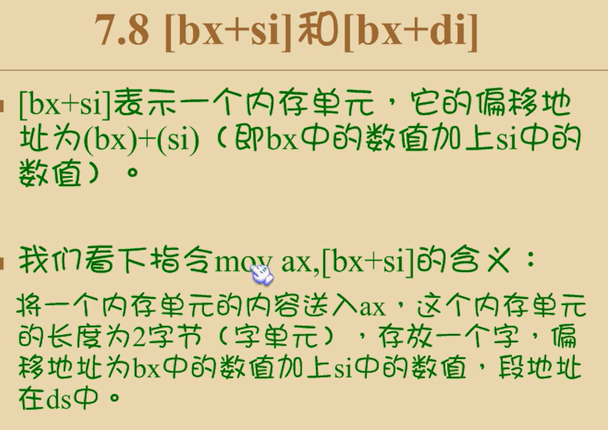


### 问题7.4


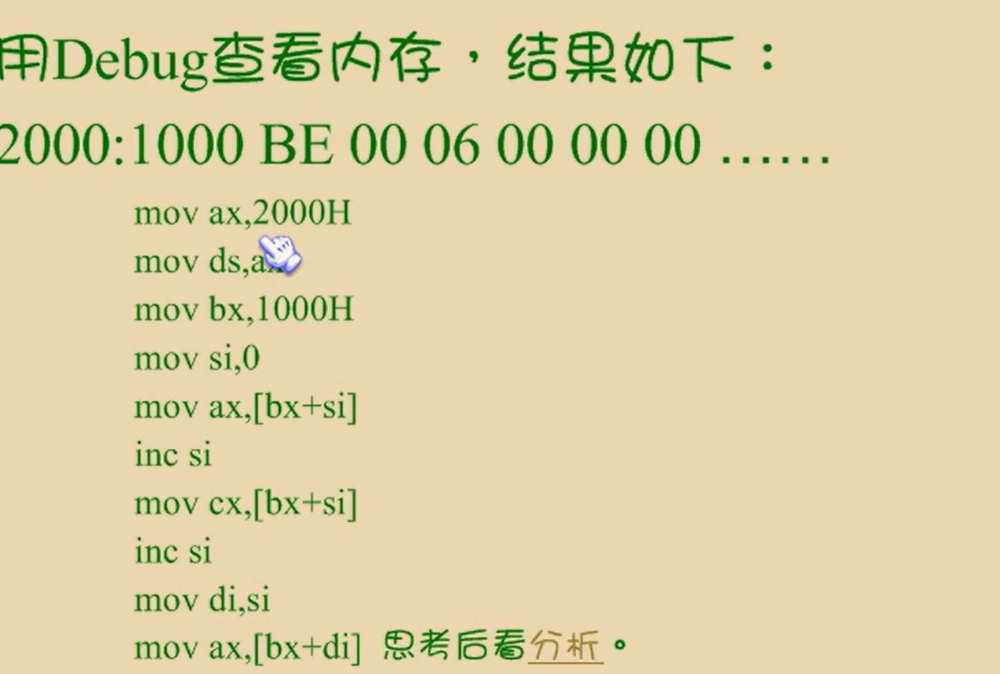

```
ax = 00BE
cx = 0600
ax = 0006
bx = 1000h
```

课本最后一句:  add cx,[bx+di]

cx = 0606


## 7.9 [bx+si+idata] 和  [bx+di+idata]

[bx+si+idata] 表示一个内存单元

偏移地址为：(bx)+(si)+idata

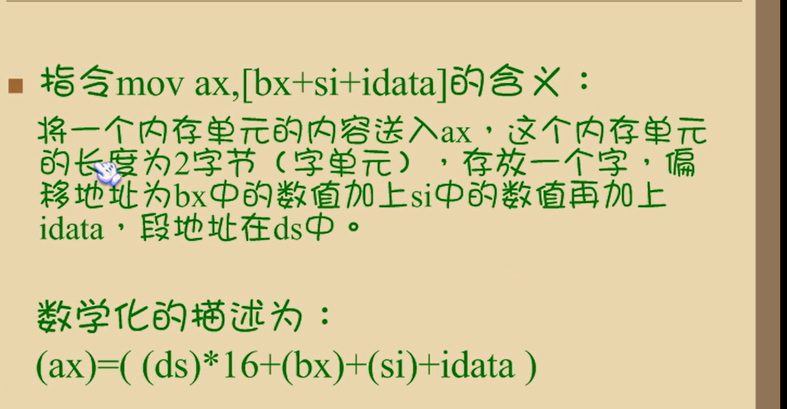

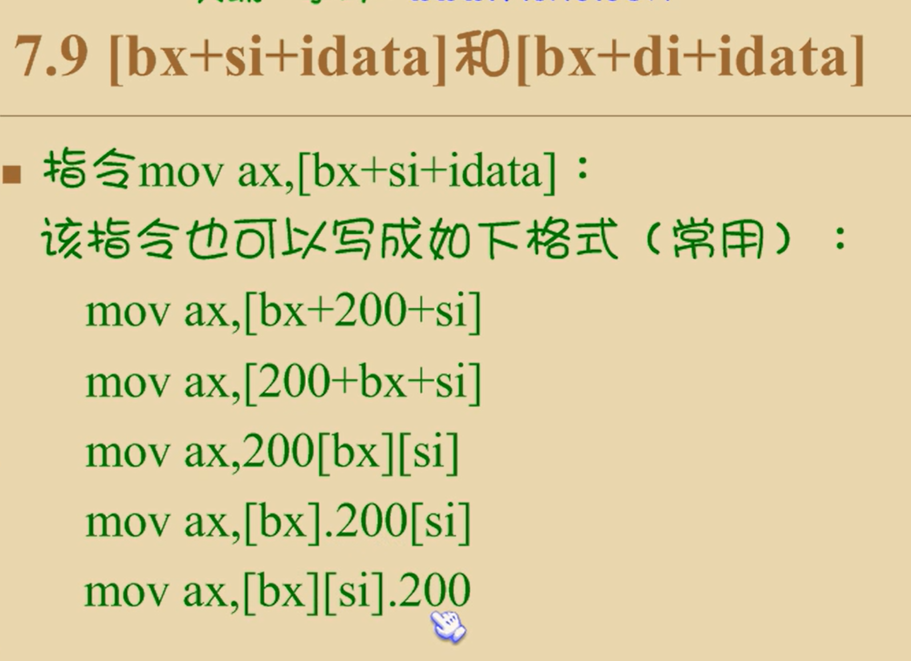

### 问题7.5

查看内存

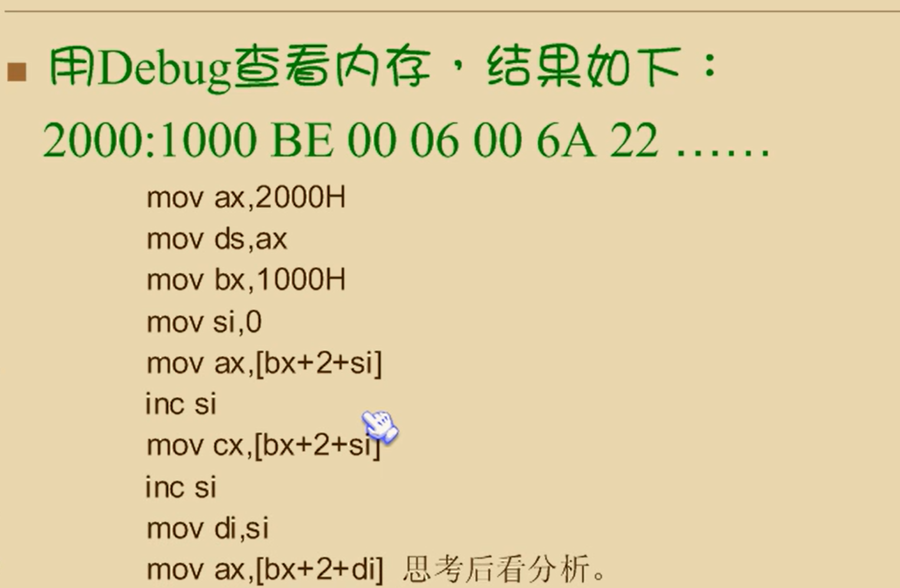

~~~
ax = 0006
cx = 6a00
ax = 226a
~~~


 ## 7.10 不同的寻址方式的灵活应用


### 问题7.6


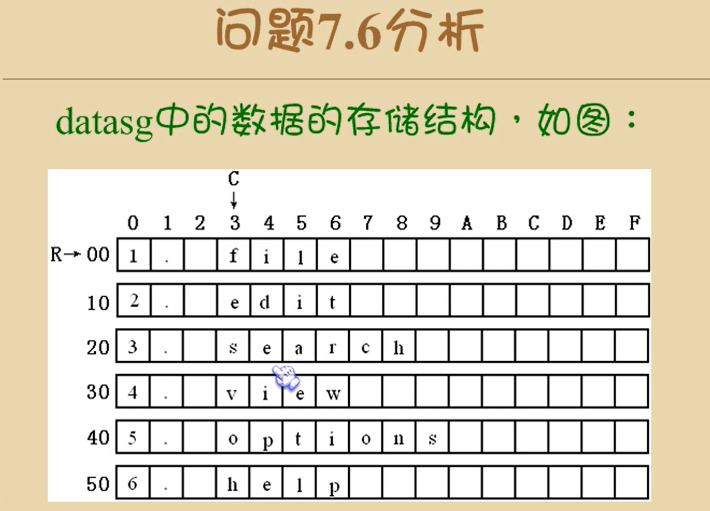

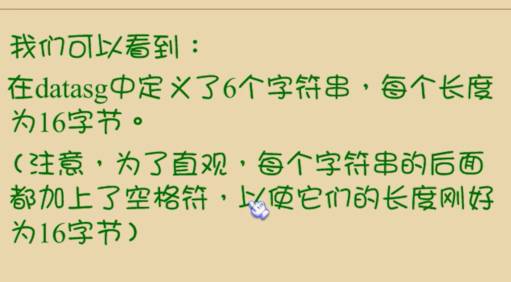

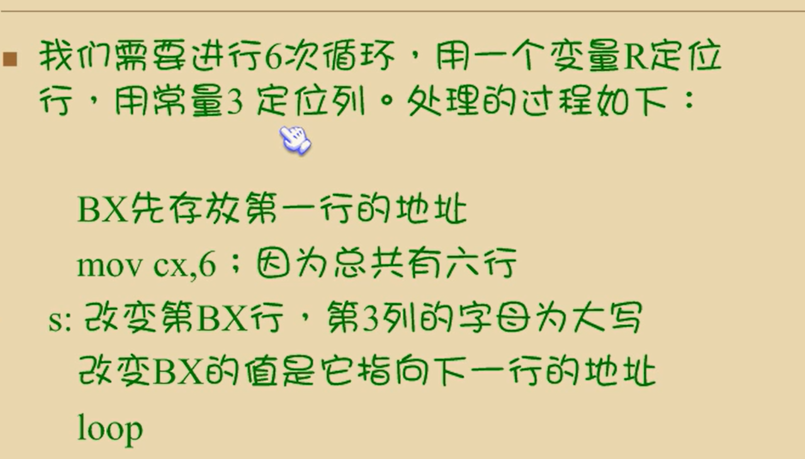


~~~
assume cs:codesg,ds:datasg

datasg segment
	db '1. file         '
	db '2. edit         '
	db '3. search       '
	db '4. view         '  
	db '5. options      '
	db '6. help         '
datasg ends

codesg segment
start: mov ax,datasg
       mov ds,ax
       mov bx,0
       
       mov cx,6
     s:mov al,[bx+3]   ;注意，单位是字节，所以是al
       and al,11011111b
       mov [bx+3],al
       add bx,16
       ;oop s
       
       mov ax,4c00h
       int 21h
       
codesg ends
end start
	
	
~~~


### 问题7.7


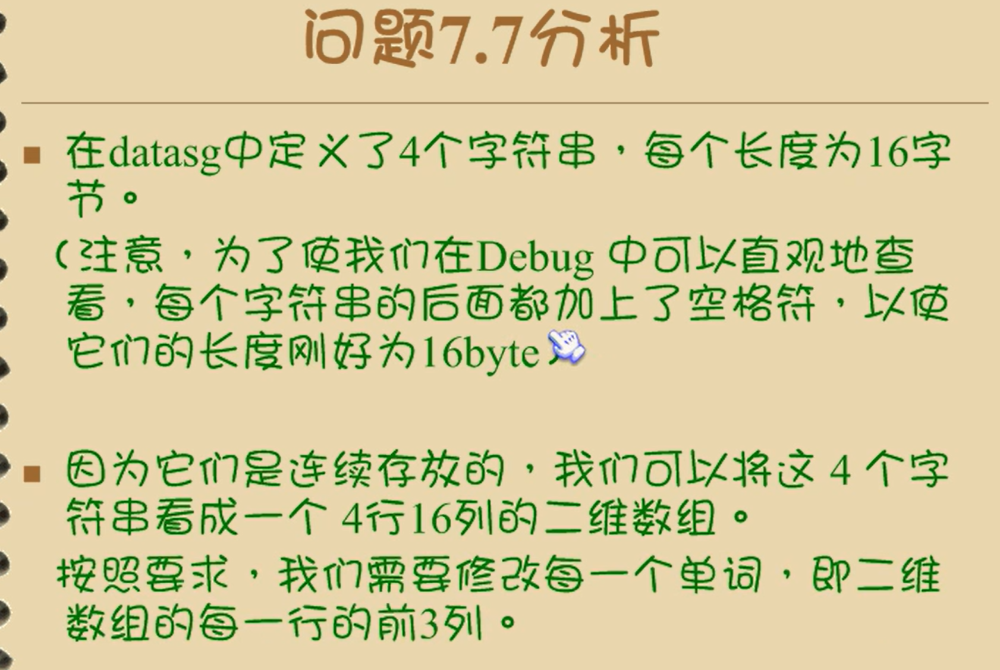


用bx来做变量，定位每行的起始是地址，用si定位要修改的列，用[bx+si]的方式来对目标的单元进行寻址

```
assume cs:codesg,ds:datasg

datasg segment
	db 'ibm             '
	db 'dec             '
	db 'dos             '
	db 'vax             '  
datasg ends

codesg segment
start: mov ax,datasg
       mov ds,ax
       mov bx,0        ;用bx来定位行
       
       mov cx,4
    s0:                ;用si来定位列
       mov si,0
       mov cx,3
     s:mov al,[bx+si]
       and al,11011111b
       mov [bx+si],al
       
       inc si
       
       loop s
       
       add bx,16
       loop s0
       
       mov ax,4c00h
       int 21h
       
codesg ends
end start
```

### 问题7.8


~~~
assume cs:codesg,ds:datasg

datasg segment
	db 'ibm             '
	db 'dec             '
	db 'dos             '
	db 'vax             '  
datasg ends

codesg segment
start: mov ax,datasg
       mov ds,ax
       mov bx,0        ;用bx来定位行
       
       mov cx,4
    s0:                ;用si来定位列
       mov dx,cx       ;用dx寄存器来临时存放外层cs的值
       mov si,0
       mov cx,3
       
     s:mov al,[bx+si]
       and al,11011111b
       mov [bx+si],al
       
       inc si
       
       loop s
       
       add bx,16
       mov cx,dx       ;在进行外层循环时调出cx
       loop s0
       
       mov ax,4c00h
       int 21h
       
codesg ends
end start
~~~

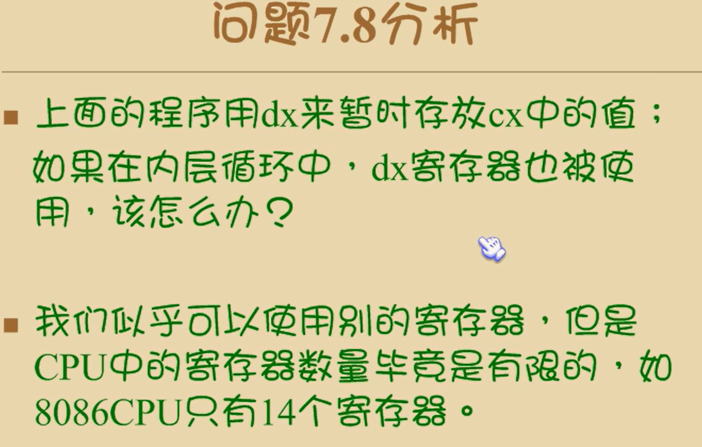


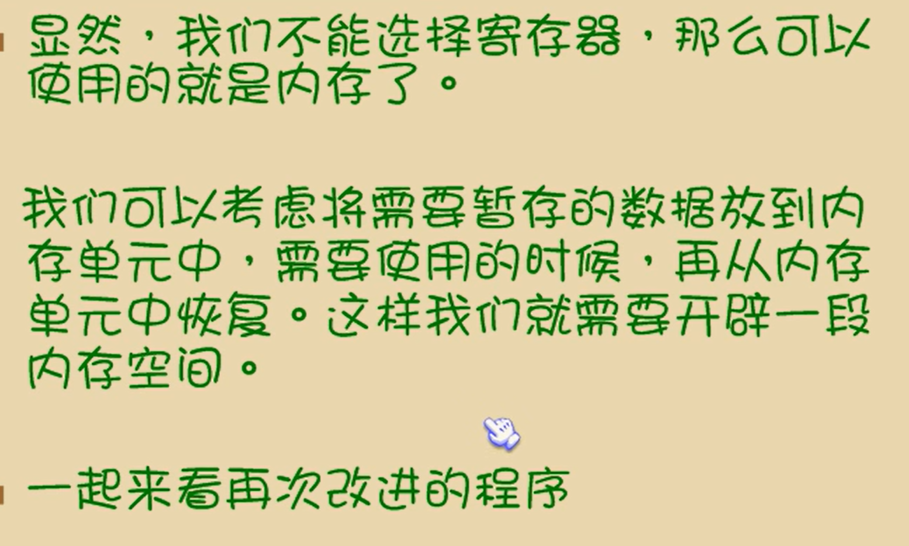

~~~
assume cs:codesg,ds:datasg

datasg segment
	db 'ibm             '
	db 'dec             '
	db 'dos             '
	db 'vax             '  
	dw 0               ;定义一个字用来保存cx
datasg ends

codesg segment
start: mov ax,datasg
       mov ds,ax
       
       mov bx,0        ;用bx来定位行
       
       mov cx,4
    s0:                ;用si来定位列
    mov ds:[40h],cx      ;用dx寄存器来临时存放外层cs的值
       mov si,0
       mov cx,3
       
     s:mov al,[bx+si]
       and al,11011111b
       mov [bx+si],al
       
       inc si
       
       loop s
       
       add bx,16
       mov cx,dx       ;在进行外层循环时调出cx
       loop s0
       
       mov ax,4c00h
       int 21h
       
codesg ends
end start
~~~


可以用堆栈来进行特殊的操作

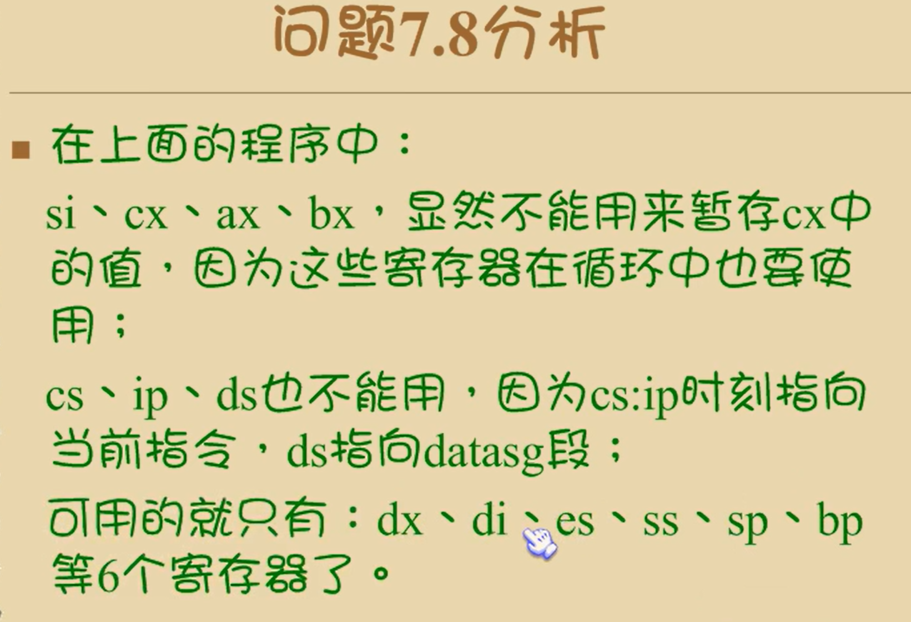

* 一般来说，在需要暂存数据的时候，我们应该使用栈，栈空间在内存中，采用相关的指令，如:push ，pop等，可对其进行特殊的操作

```
assume cs:codesg,ds:datasg,ss:stacksg

datasg segment
	db 'ibm             '
	db 'dec             '
	db 'dos             '
	db 'vax             '  
	dw 0               ;定义一个字用来保存cx
datasg ends

stacksg segment
	dw 0,0,0,0,0,0,0
stacksg ends

codesg segment
start: mov ax,stacksg
       mov ss,ax
       mov sp,16
       mov ax,datasg
       mov ds,ax
       
       mov bx,0      
       
       mov cx,4
s0:                     
       push cx      ;将外层循环的cx值压栈
       mov si,0
       mov cx,3     ;cx设置为内层循环的次数
s:
       mov al,[bx+si]
       and al,11011111b
       mov [bx+si],al
       inc si
       loop s
        
       add bx,16
       pop cx       ;从栈顶弹出原cx的值，恢复cx
       loop s0      ;外层循环的loop指令将cx中的计数值减1
       
       mov ax,4c00h
       int 21h
       
codesg ends
end start
```

### 问题7.9

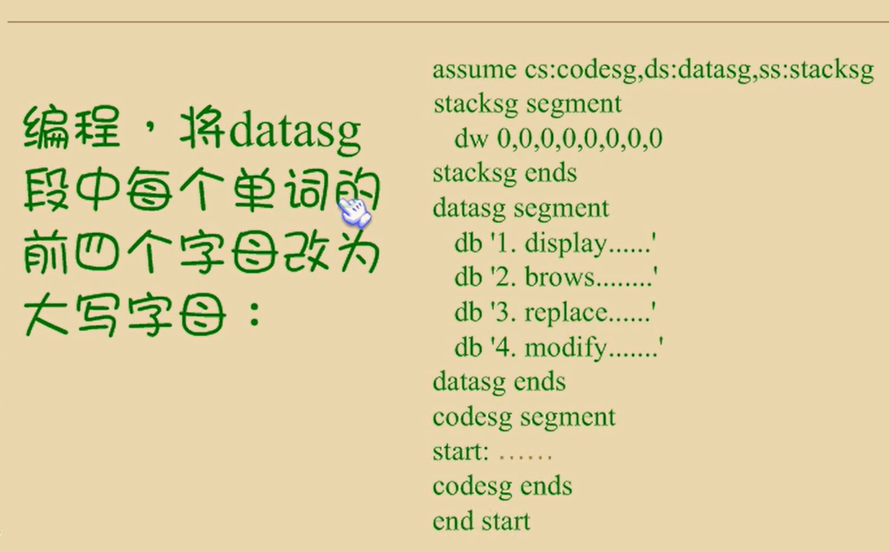

```
assume cs:codesg,ds:datasg,ss:stacksg
stacksg segment
	dw 0,0,0,0,0,0,0
stacksg ends
datasg segment
	db '1. display      '
	db '2. brows        '
	db '3. replace      '
	db '4. modify       '  
datasg ends
codesg segment
start:

codesg ends
end start


```

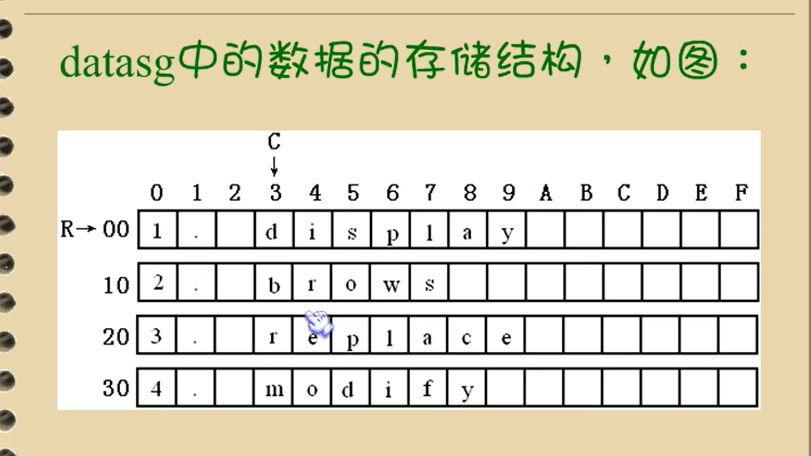

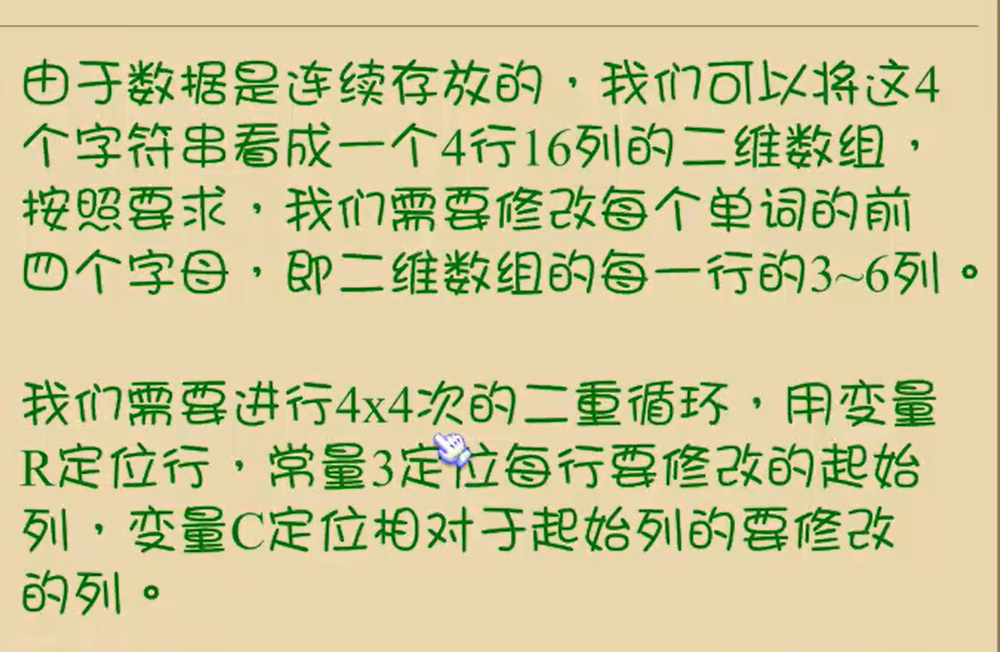

用r定位第一行，循环修改r行的3+c再用r定位到下一行，再次循环修改r行的3+c （c大于等于0小于等于3）

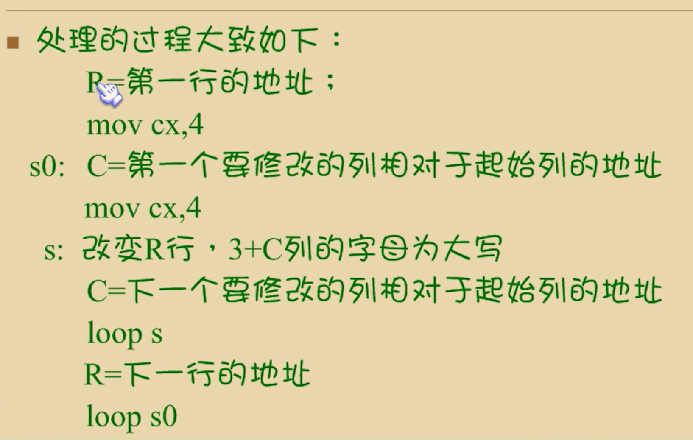

我们用bx来作变量，定位每行的起始地址，用si定位要修改的列，用[bx+3+si]的方式来对目标单元进行寻址

```
start: 
	mov ax,stacksg
	mov ss,ax
	mov sp,16
	mov ax,datasg
	mov ds,ax
	mov bx,0      ;定义行
	
	mov cx,4      
 s0:push cx
    mov si,0        
    mov cx,4        
  s:mov al,[bx+3+si]   ;定位到每个要索引的字母
    and al,11011111b   ;实现变为大写字母
    mov [bx+3+si],al
    inc si             ;使它指向下一个字母
    loop s
    
    add bx,16
    pop cx
    loop s0
    
    mov ax,4c00h
    int 21h
    
```

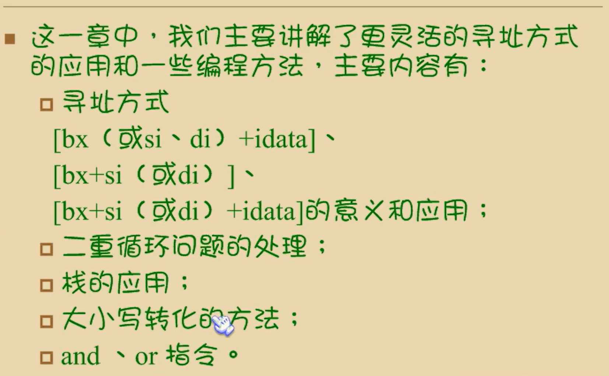
