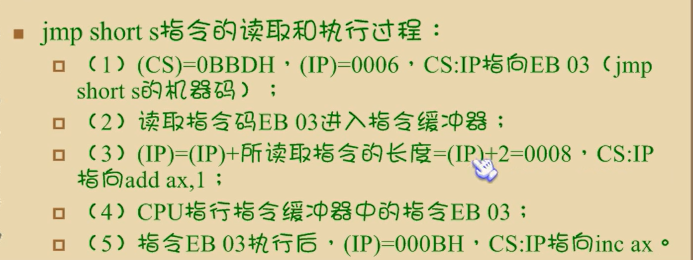

~~~
shl
mov bl, 8FH              ; BL = 10001111b
shi bl, 1        ; CF = 1, BL = 00011110b

CF中寄存最后一次移出的数字
最低位用0填充

shr
mov al, 0D0H       ; aL = 11010000b
shr al, 1		  ; aL = 01101000b, CF = 0

cf中寄存最后一次移出数字，最高位填充0
~~~


~~~
cmp
比较两个无符号数
ZF CF 
cmp a.b

a == b
ZF = 1

a < b 
CF = 1

a > b                  a >= b
CF == ZF == 0          CF == 0  ZF == 1

比较的是两个有符号数，则符号标志位、零标志位和溢出标志位表示的两个操作数之间的关系
a < b
SF != OF

a > b
SF == OF

a == b
ZF = 1

如果因为溢出导致了实际结果为负，那么逻辑上真正的结果必然为正。
如果因为溢出导致了实际结果为正，那么逻辑上真正的结果必然为负。
~~~


~~~
跳转指令
基于无符号数比较的跳转

助记符	说明
JB	小于跳转
JNB	不小于跳转
JNBE	不小于或等于跳转
JA	大于跳转
JNA	不大于跳转
JNAE	不大于或等于跳转
基于相等性的跳转

助记符	说明
JE	相等跳转
JNE	不相等跳转
JCXZ	CX = 0 跳转
JECXZ	ECX = 0 跳转
JRCXZ	RCX = 0 跳转（64模式）
基于有符号数比较的跳转

助记符	说明
JG	大于跳转
JL	小于跳转
JNLE	不小于或等于跳转
JNGE	不大于活等于跳转
JGE	大于或等于跳转
JLE	小于或等于跳转
JNL	不小于跳转
JNG	不大于跳转
基于进位和零标志位的跳转

助记符	说明
JC	进位跳转（进位标志位置1）
JNC	无进位跳转（进位标志位清零）
JZ	为零跳转（零标志位置1）
JNZ	非零跳转（零标志位清零）

~~~


~~~
检测条件	无符号数跳转	有符号数跳转	同义指令	检查的标志位
A == B		JE			JE				JZ			ZF = 1
A != B		JNE			JNE				JNZ			ZF = 0
A < B		JB			JL			JNAE, JNGE	     CF = 1 (无符号)SF != OF (有符号)
A >= B		JAE			JGE	JNB, 	 JNL			CF = 0 (无符号)SF == OF (有符号)
A > B		JA			JG			JNBE, JNLE		CF=0 且 ZF=0 (无符号)ZF=0 且 SF==OF (有符号)
A <= B		JBE			JLE			JNA, JNG		CF=1 或 ZF=1 (无符号)ZF=1 或 SF!=OF (有符号)

~~~


~~~
逻辑指令
AND DST,SRC
OR dst，src
XOR dst，src
NOT orc 指令支持的寻址方式：除立即数寻址方式以外的其余寻址方式

指令支持的寻址方式：两个操作数不能同时为存储器寻址。即为除源操作数为立即数的情况外，原操作数和目的操作数必须有一个寄存器寻址方式。
令执行后CF 和OF 置零，AF无定义。
SF=1 指令执行后的结果为负数(符号位为1)
SF=0 指令执行后的结果为正数(符号位为0)
ZF=1 指令执行后的结果为零
ZF=0 指令执行后的结果不为零
PF=1 结果操作数中1的个数为偶数时置1
PF=0 结果操作数中1的个数为奇数时置0
~~~


~~~
CWD: AX符号位拓展到DX
CDQ: EAX符号位拓展到EDX
CQO: RAX符号位拓展到RDX

CBW: AL符号位拓展到DX
CWDE: AX符号位拓展到EAX
CDQE: EAX符号位拓展到RAX
~~~


# 第九章 转移指令

操作符offset，用来取得标号的偏移地址

```
s:mov ax,bx
  mov si,offset s
  mov di,offset s0
  mov ax,cs:[si]
  mov cs:[di],axs0
s0:nop
   nop
```

用`offset` 可以复制标号地址然后使用

无条件转移

`jmp` 可以只修改IP，也可以同时修改cs和ip

`jmp`转移的目的地址，转移的举例（段间，段内，）

 `jmp short 标号` 转到标号处执行指令，实现段内短转移，对ip的修改范围是-128~127，向后移动127或者向前转移128歌字节

~~~
start:mov ax,0
      jmp short s
      add ax,1
    s:inc ax
codesg ends
~~~

在cpu机器码中，对于`jmp short s`这段代码没有给机器码的详细描述

cpu不需要具体的谜底地址就可以实现对ip的修改



补码进行的计算，计算出地址的偏移再位移

jmp short 标号   为   (ip) = (ip)+ 8位位移

8位位移=标号出的地址  -jmp后的第一个字节的地址

short指明此处的唯一为8位位移

由编译程序在编译时计算出


范围为-128~127

` jmp near ptr 标号`功能为 (ip) = (ip)+ 16位位移

进行段内近转移
