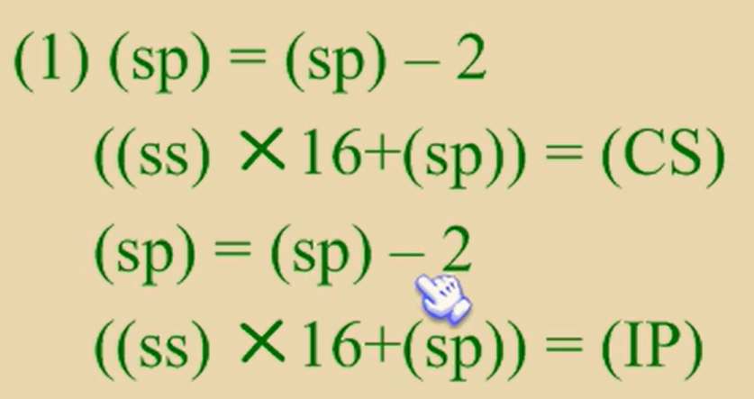

## 无条件跳转

`jmp far ptr 标号` 

实现段间转移，又称为远转移

CS表示标号所在的段地址

IP表示标号坐在段中的偏移地址

far ptr指明了指令用标号的段地址和便宜地址来修改CS和IP

~~~
start:mov ax,0
      mov bx,0
      jmp far ptr s
      db 256 dup (0)
    s:add ax,1
      inc ax
~~~


`jmp 16位寄存器`

ip = 16位寄存器


`jmp word ptr 内存单元地址（段内转移）`

从内存单元地址处开始存放一个字，转移的目的偏移地址

~~~
mov ax,0123H
mov ds:[0],ax
jmp word ptr ds:[0]
~~~


`jmp dword ptr 内存单元地址（段内转移）`

内存单元地址处存放着两个字，高地址处的字是转移的目的段地址

低地址处是转移的目的偏移地址

cs = 内存单元地址+2

ip  = 内存单元地址

~~~
mov ax,0123h
mov ds:[0],ax
mov word ptr ds:[2],0
jmp dword ptr ds:[0]

cs = 0
ip = 0123h
cs:ip = 0000:0123
~~~


## 有条件跳转

jcxz指令为有条件转移指令，所有的有条件转移指令都是短转移

在对应的机器码中包含转移的位移，而不是目的地址

`jcxz 标号`

如果（cx）=0，则转移到标号处执行

(ip) = (ip) + 8位位移

cx != 0 时什么也不做

==约等于 if((cx)\==0)   jmp short  标号==


loop

if( (cx) != 0 )   jmp short 标号

# 第十章 call和ret


ret指令用栈中的数据，修改ip的内容，实现近转移

cpu执行ret指令时，进行下面的操作

1. (ip) = ( (ss)*16 + (sp) )

2. (sp) = (sp) + 2

   pop ip


retf指令用栈中的数据，修改cs和ip的内容，实现远转移

执行retf指令

1.(ip) = ((ss)*16 + (sp))

2.(sp) = (sp) + 2

3.(cs) = ((ss)*16 + (sp))

4.(sp) = (sp) + 2

pop ip

pop cs


call经常与ret配合使用

1.将当前ip或者cs和ip压入栈

2.转移（jmp）

call指令不能实现短转移，call的原理与jmp相同


call 标号:将当前的ip压栈之后转到标号处执行指令

执行时：

1.(sp) = (sp) - 2

   ((ss)*16 + (sp)) = (ip)

2.(ip) = (ip) + 16位位移


`call far ptr 标号`

 

cs = 标号所在段地址，ip = 标号所在偏移地址


call16位寄存器

(sp) = (sp) -2

((ss)*16 + (sp)) = ( ip )

(ip) = (16位寄存器)


call word ptr  内存单元地址

push ip

jmp word ptr

```
mov sp,10h
mov ax,0123h
mov ds:[0],ax
call word ptr ds:[0]

(ip) = 0123h,(sp) = 0eh
```


call dword ptr 内存单元地址

push cs

push ip

jmp dword ptr 内存单元地址

~~~
mov sp,10h
mov ax,0123h
mov ds:[0],ax
mov word ptr ds:[2],0
call dword ptr ds:[0]

(cs) = 0 ,(ip) = 0123h , (sp) = 0CH
H16 = cs   L16 = ip
~~~


call 和 ret 的配合使用

call 将ip传输到栈中，执行完子程序之后，

再利用ret接受栈中的ip，然后再返回call的下一个指令位置


