字符串作业代码

```
1.
#include <stdio.h>
#include <string.h>
#include <stdlib.h> 


int main()
{
char path[50]="c:\\docs\\mallocfree.txt";
char* p = strrchr(path,'m');

if (p != NULL)
{
	printf("found it :%s\n", p);
}
else
{
	printf("found it not :%s\n", p);
}
	return 0;
}
```


2.

```

#include <stdio.h>
#include <string.h>
#include <stdlib.h> 


int main()
{
char path[100]="http://www.mallocfree.com/? x=y&mm_gxb=1_87adefc12d&id=9988";
char* p = strstr(path, "1_8");

if (p != NULL)
{
	printf("found it :%s\n", p);
}
else
{
	printf("found it not :%s\n", p);
}
	return 0;
}
```


3.

```
#include <stdio.h>
#include <string.h>
#include <stdlib.h> 


int main()
{
char path[100]="http://www.mallocfree.com/?x=y&mm_gxb=1_98adefc12e";
char* p = strstr(path, "1_9");

if (p != NULL)
{
	printf("found it :%s\n", p);
}
else
{
	printf("found it not :%s\n", p);
}
	return 0;
}
```


4.

```
#include <stdio.h>
#include <string.h>
#include <stdlib.h> 


int main()
{
	char  ip[] = "192.168.100.1";
	const char* delim = ".";
	char* next = NULL;

	char* p2 = strtok_s(ip, delim, &next);
	while (p2 != NULL)
	{
		int f = atof(p2);
		printf("%d ", f);

		p2 = strtok_s(NULL, delim, &next);
	}
	return 0;

}


ai生成：
#include <stdio.h>
#include <string.h>
#include <stdlib.h> 

int main()
{
    char ip[] = "192.168.100.1";
    const char* delim = ".";
    char* next = NULL;
    
    unsigned int result = 0;  // 32位整数结果
    int shift = 24;           // 从最高位开始

    char* token = strtok_s(ip, delim, &next);
    
    while (token != NULL && shift >= 0)
    {
        int num = atoi(token);
        result |= (num << shift);  // 按位合并
        shift -= 8;                // 每次移动8位
        
        token = strtok_s(NULL, delim, &next);
    }
    
    printf("IP地址: %s\n", "192.168.100.1");
    printf("32位整数: %u\n", result);
    printf("十六进制: 0x%08X\n", result);
    
    return 0;
}

```

## (4):自己实现字符串api

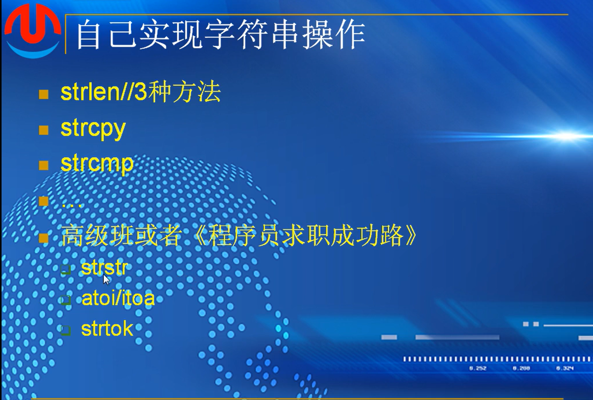

```
#include <stdio.h>
#include <string.h>
#include <assert.h>

size_t mystrlen(const char* str)//const 表示函数内部不会修改str的值
{
    size_t count = 0;

    if (str == NULL)
        return 0;//如果是指针，判断是否为0

    while (*str != '\0')
    {
        count++;
        str++;
    }

    return count;
}

size_t mystrlen2(const char* str)
{
    const char* eos = str;
    while (*eos++);

    return (size_t)(eos - str - 1);//eos末尾，str开头，相减是元素个数包含0字符，-1是非零字符的个数
}

//递归  str==NULL || *str=='\0'   return 0;
//1+mystrlen2(str+1)  递归出口

size_t mystrlen3(const char* str)
{
    if (str == NULL || *str == '\0')
        return 0;
    return 1 + mystrlen3(str + 1);//递归式,子串加一
}

size_t mystrlen4(const char* str)
{
    return str == NULL || *str == '\0' ? 0 : 1 + mystrlen4(str + 1);
}
//字符串拷贝函数
char* mystrcpy(char* dst, const char* src)
{ 
    if (dst == NULL || src==NULL)
    {
        return NULL;
    }

    char* s = dst;

    while (*s++ = *src++);//依然会引起缓存区报错

    //*s = '\0'; 

    return dst;
}

int mystrcmp(const char* s1, const char* s2)
{
 //   if (s1 == NULL || s2 == NULL)
 //  {
 //       return 0;
 //   }
    assert(s1 != NULL && s2 != NULL);//要求括号里面必须为真，如果其中应该为none，那么括号就是假

    while (*s1 && *s2 && (*s1 == *s2))
    {
        s1++;
        s2++;

    }
    return *s1 - *s2;
}

int main()
{
    char str[] = "hello world";
    char buf[128] = { 0 };

    printf("strlen:%lld\n", strlen(str));
    printf("mystrlen:%lld\n", mystrlen(str));
    printf("mystrlen2:%lld\n", mystrlen2(str));
    printf("mystrlen3:%lld\n", mystrlen3(str));
    printf("mystrlen4:%lld\n", mystrlen4(str));

    mystrcpy(buf, str);

    printf("buf: % s\n", mystrcpy(buf, str));

    char* s1 = "hello world";
    char* s2 = "hello world";

    if (mystrcmp(s1, s2) == 0)
    {
        printf("%s==%s\n", s1, s2);
    }
    else
    {
        printf("%s != %s\n",s1,s2);
    }

    return 0;
}

```

循环效率大于递归，递归，函数在自己调用自己的过程中涉及到入栈和出栈

递归嵌套太深可能会导致栈溢出，但是递归代码更加简洁，需要保证防止栈溢出

应用层的栈较大可以使用递归，内核层严禁使用递归

**防止程序崩溃，在定义函数之前应对设定值进行严格的校验**

##### 作业

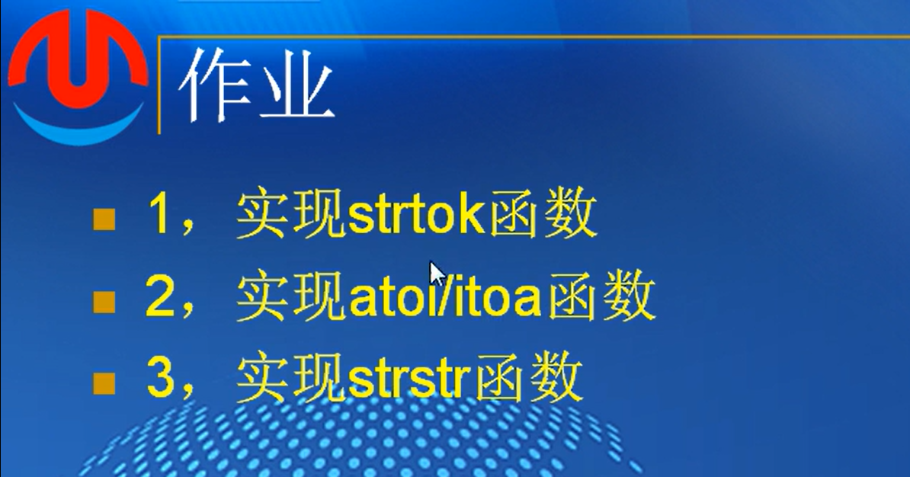

1.

```
char* rav_strtok(char* strToken, const char* strDelimit) {

    //定义局部变量
    static char* text = NULL;
    unsigned char table[32];
    const unsigned char* delimit;
    unsigned char* str;
    char *head;

    //更新静态字符串
    if (strToken) text = strToken;

    //对不合法输入进行特殊判断
    if (text == NULL) return NULL;
    if (strDelimit == NULL) return text;

    //改变 char 为 unsigned char 以便进行位运算
    str = (unsigned char*)text;
    delimit = (const unsigned char*)strDelimit;

    //初始化位表
    for (int i = 0; i < 32; i++) table[i] = 0;
    for (; *delimit; delimit++) {
        table[*delimit >> 3] |= 1 << (*delimit & 7);
    }

    // 跳过分隔符直到起始位置
    while (*str && (table[*str >> 3] & (1 << (*str & 7)))) str++;
    head = (char*)str;

    // 找到第一个分隔符
    for (; *str; str++) {
        if (table[*str >> 3] & (1 << (*str & 7))) {
            *str++ = '\0';
            break;
        }
    }

    // 更新结果
    text = (char*)str;
    if (*text == '\0') text = NULL;
    return head;
}
```

2.

```
atoi:
#include<stdio.h>
#include<stdlib.h>
#include<ctype.h>
int myAtoi(const char * str)
{
	//判断是否是NULL指针或空白字符串
	if (str == NULL)
		return 0;
	if (str == '\0')
		return 0;
	//过滤空白字符
	while (isspace(*str))
	{
		str++;
	}
	//使用标志flag来判断数字正负
	int flag = 1;
	if (*str == '+')
	{
		flag = 1;
		str++;
	}
	else if (*str == '-')
	{
		flag = -1;
		str++;
	}
	//由于字符串里的数字可能大于int类型的最大值，所以使用long long类型变量记录数据
	long long ret = 0;
	while (*str != '\0')
	{
		//如果是10进制数据
		if (isdigit(*str))
		{
			ret = ret * 10 + (*str - '0') * flag;
			str++;
			if (ret > INT_MAX)
				ret = INT_MAX;
			if (ret < INT_MIN)
				ret = INT_MIN;
		}
		//如果不是10进制数据
		else
		{
			//由于atoi函数返回值为int类型，而刚才定义的变量是long long类型，所以要进行转换
			return (int)ret;
		}
	}
	return (int)ret;
}
```

2.

```
char* my_itoa(int value, char* str, int base)
{
	if (base < 2 || base > 32)
	{
		printf("Wrong radix!\n");
		return str;
	}
	char* ret = str;
	if (value == 0)
	{
		*str++ = '0';
		*str = '\0';
		return ret;
	}
	if (base == 10 && value < 0)
	{
		value = -value;
		*str++ = '-';
	}
	char* start = str;
	// 从右到左依次将数字的每一位存储起来
	size_t num = value;
	while (num != 0)
	{
		if (num % base < 10)
		{
			*str++ = '0' + (char)(num % base);
		}
		else
		{
			*str++ = 'a' + (char)(num % base - 10);
		}
		num /= base;
	}
	*str = '\0';
	// 倒置字符串
	for (char* left = start, *right = str - 1; left < right; left++, right--)
	{
		char tmp = *left;
		*left = *right;
		*right = tmp;
	}
	return ret;
}
```

3.

```
#include <stdio.h>
#include <string.h>
#include <assert.h>

char* my_strstr(const char* str1, const char* str2)
{
	const char* cur = str1;  //用cur用来记录当前的位置
	const char* s1 = NULL;   //通过s1 和 s2 比较元素
	const char* s2 = NULL;
	assert(str1 && str2);    //assert断言，如果传入的地址有有一个会空指针，则直接返回str1的地址
	if (str2 == '\0')
		return (char*)str1;
	while (*cur)   //当cur中的值不为'\0'时，进入循环
	{
		s1 = cur;   //s1回到比较时的位置
		s2 = str2;  //s2回到初始位置
		while (*s1 && *s2 && *s1 == *s2) //当s1和s2指向的值相等时，进入循环
		{
			s1++;  //找到下一个元素
			s2++;  //找到下一个元素
			//再次比较
		}
		if (*s2 == '\0')  //当s2中的元素为'\0'时，则说明在str1中找到了str2
			return (char*)cur; //返回当前的位置
		cur++; //第一次没找到，找到下一个元素重新寻找
	}
	return NULL; //如果在循环中没有找到，则返回一个空指针
}

int main()
{
	char arr1[] = "abcadefdef";
	char arr2[] = "def";
	char* ret = my_strstr(arr1, arr2);
	if (ret != NULL)
	{
		printf("%s\n", ret);
	}
	else
	{
		printf("找不到\n");
	}
	return 0;
}
```


# 第十二课-函数

## （1）：函数定义与应用

### 定义

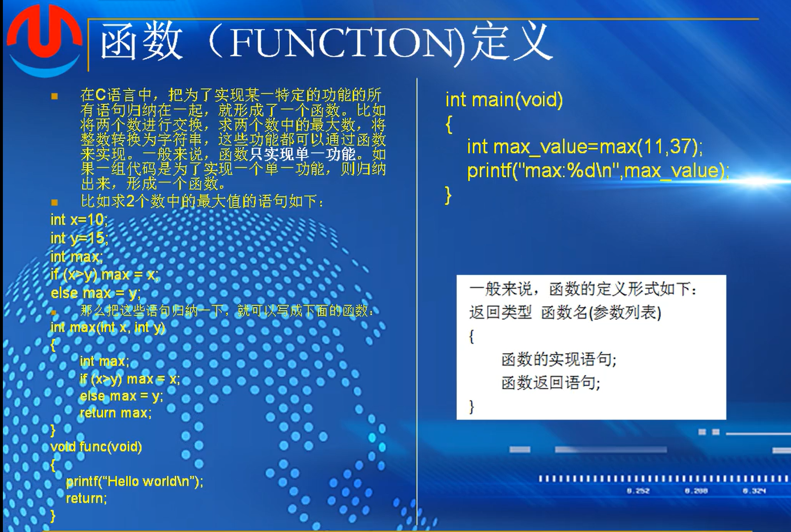

### 定义形式与调用，调试

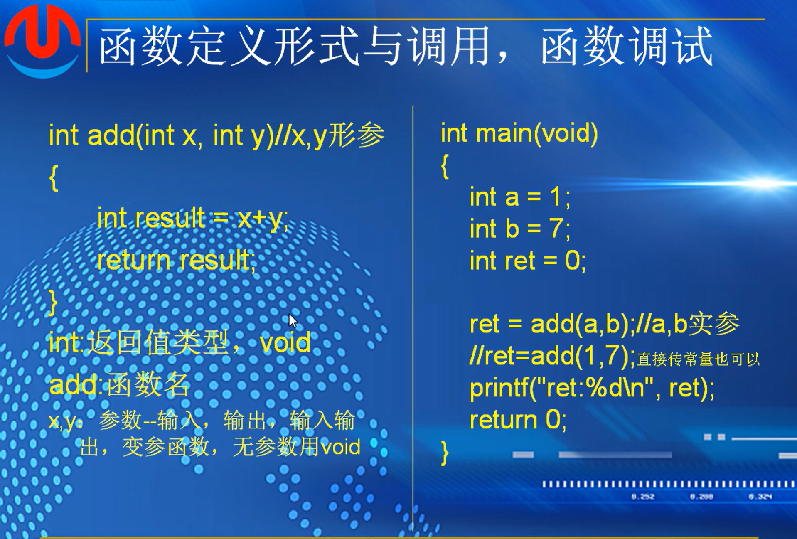

输入参数：外部传递给函数

输出参数：函数计算的结果，可以通过输出方式传递给调用值；也能用return方式返回给调用值

有的函数即做了输出参数也做了输入参数

变参函数：函数的参数个数可以变化，比如printf函数在打印的时候，可以打印多个

### 函数应用，头文件写法（导出函数和变量）

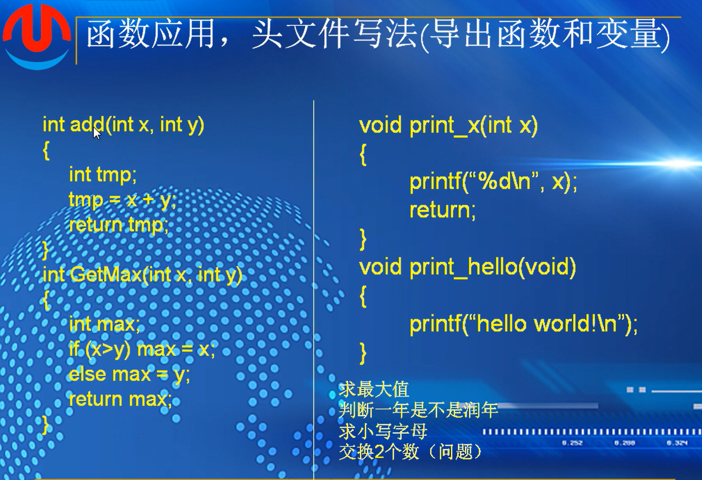

```
#include <stdio.h>
#include <stdbool.h>

int myadd(int x, int y)//声明的时候可以不用形参，只加两个类型也可以
{
	int res;
	res = x + y;
	return x + y;
}

int getmax(int x, int y)
{
	return x > y ? x : y;
}

bool leep_year(int year)
{
	(year % 4 == 0) && (year % 100 || year % 400 == 0);
}

char mytolower(char ch)
{
	if (ch >= 'A' && ch <= 'Z')
	{
		ch += 'a' - 'A';
	}

	return ch;
}

void swap(int x, int y)//整数进行交换就不需要返回值
{
	int tmp = x;
	x = y;
	y = tmp;
}

暂时如此，后续实验出现问题有更改
1.使用bool类型需要包含头文件
这是在myfunc.c里面打的函数，跟main函数不在同一个源文件里
```

#### 写头文件

~~~
#pragma once
#include <stdbool.h>

int myadd(int x, int y);        //保证头文件项目在编译的时候只被包含一次
int getmax(int x, int y);       //然后将刚刚写的函数全部放在里面声明
bool leep_year(int year);       //再到源文件里写包含
char mytolower(char ch);        //自己写的源文件用""。引号是从当前目录开始查找
void swap(int x, int y);        //而<>是从系统目录开始查找
~~~

预编译

```
#ifndef _MYFUNC_H_
#define _MYFUNC_H_

int myadd(int x, int y);        
int getmax(int x, int y);      
bool leep_year(int year);       
char mytolower(char ch);       
void swap(int x, int y);        

#endif
```

swap运行之后函数的值没有发生交换

**形参和实参的区别**

在函数内部完成了形参的交换，但实际上设定的函数实参没有发生改变

采用的传参方法叫传值，传值是不能改变实参的，传值是将实参的值拷贝到了形参的位置，改变形参并不会改变实参，上述定义的函数都是采用传值的方法运行的

### main函数参数的使用

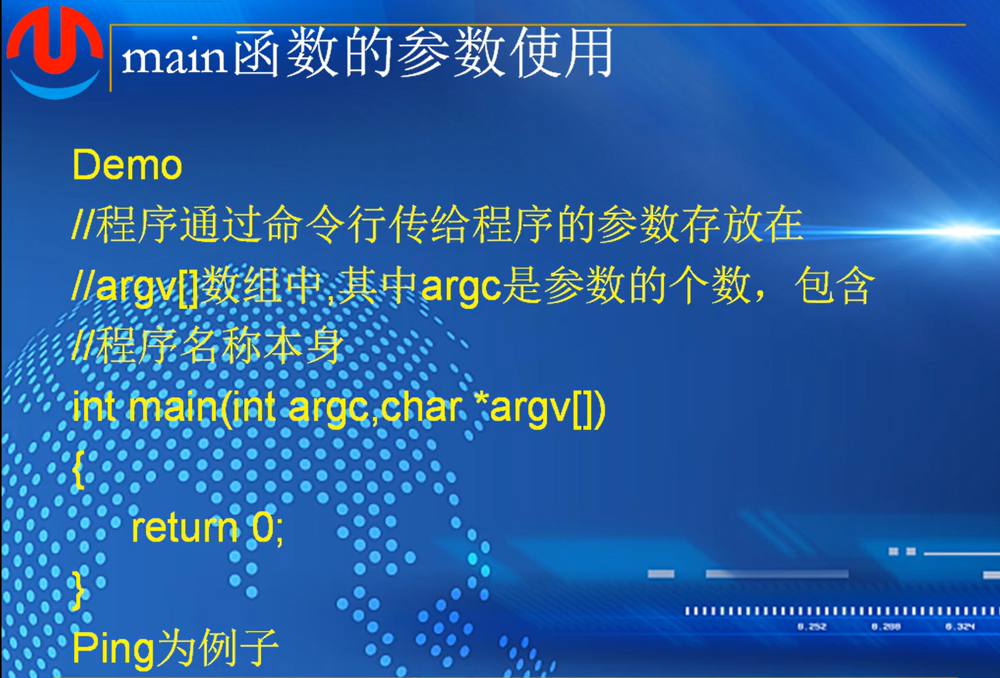

例子:

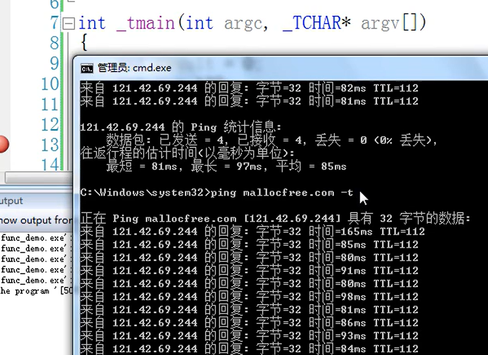

```
#include <stdio.h>
#include <string.h>
#include <tchar.h>

int _tmain(int argc, _TCHAR* argv[])
{

	if (argc != 2)
	{
		printf("Invalid parameters\n");
		return 0;
	}
	
	for (int i = 0; i < argc; i++)
	{
		_tprintf(_T("%s\n"), argv[i]);
	}
	
	return 0;
}

exe中-->属性-->调试-->命令参数
```

argv中，argv[0]永远是我们程序自身，此程序中拿两个参数，即自身和在调试中输入的命令行参数，两个

### 函数定义注意事项

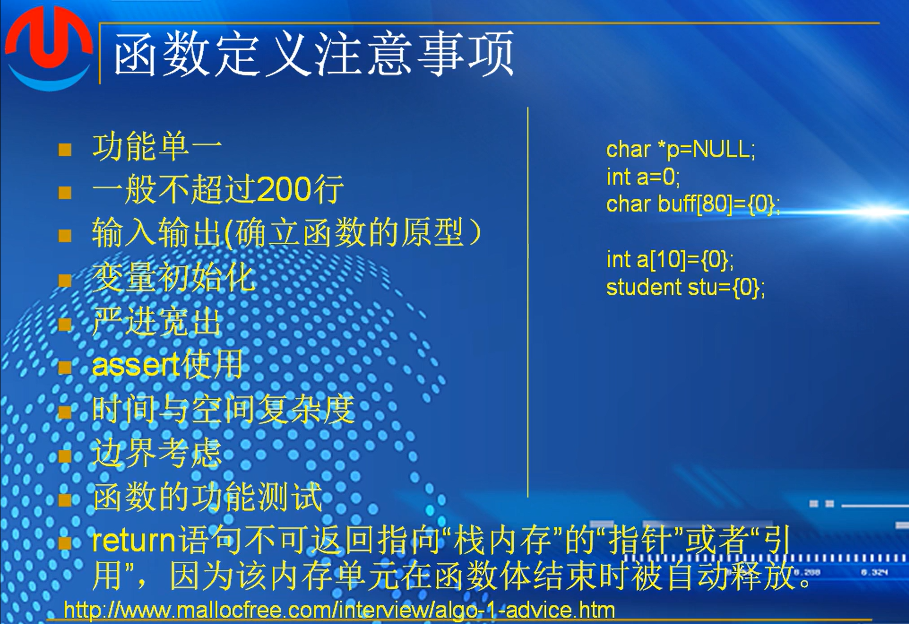

*功能单一*   方便维护，可模块化

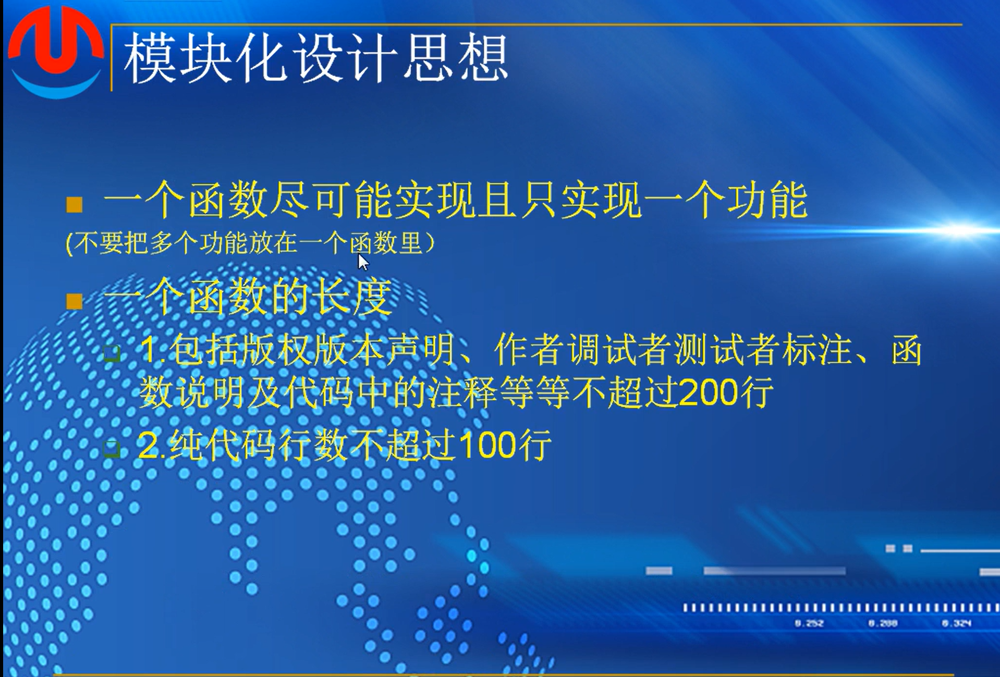

输入输出，设计函数的接口

局部变量要进行初始化

严进宽出：严格判断是否合法，长度是否合理，类型是否匹配

assert  断严

复杂度  时间短  尽量不分配内存

边界考虑：特殊情况，考虑所有的情况，大于小于，多了少了，内存是否重叠

功能测试：调用，测试，不同的测试用语

return不可以返回指向栈内存，栈内存在结束时会被释放

#### 逆置字符串

定义了函数

~~~
#include <stdio.h>
#include <string.h>
#include <tchar.h>

void reverse_str(char* str)
{

	int len = 0;
	char* s = str;
	while (*s != '\0')
	{
		s++;
		len++;
	}

	for (int i=0; i < len / 2; i++)
	{
		char ch = str[i];
		str[i] = str[len - 1 - i];
		str[len - 1 - i] = ch;
	}

	return str;
}

int main()
{
	char* str = "hello world";

	printf("str before:%s\n", str);
	reverse_str(str);
	printf("str after:%s\n", str);
	return 0;
}


改为char str[] = "hello world";
就不会崩溃，这样是在栈上分配的地址，栈上的地址是可读可写的
~~~

在进行逆置字符串的操作，这一段内存必须是可读可写的，上述代码会崩溃

用指针指向的 “hello world”  是存储在静态常量区是不能读写的

该函数设计上问题：

1.没有模块化

也就是需要把计算字符串长度这一段代码单独弄出来形成一个函数

```
#include <stdio.h>
#include <string.h>
#include <tchar.h>

int mystrlen(const char* str)
{
	int len = 0;
	char* s =(char *) str;
	while (*s != '\0')
	{
		s++;
		len++;
	}

	return len;
}


void reverse_str(char* str)
{
	int len = mystrlen(str);

	for (int i=0; i < len / 2; i++)
	{
		char ch = str[i];
		str[i] = str[len - 1 - i];
		str[len - 1 - i] = ch;
	}

	return str;
}

int main()
{
	char str[] = "hello world";

	printf("str before:%s\n", str);
	reverse_str(str);
	printf("str after:%s\n", str);
	return 0;
}

```

### 库函数

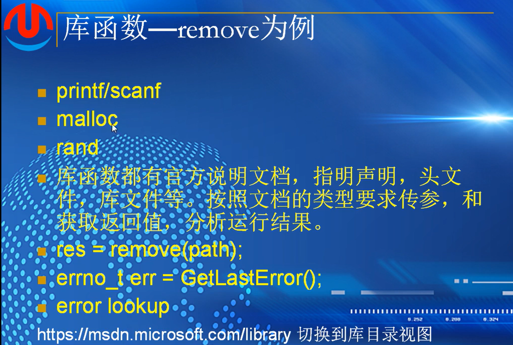


```
#include <stdio.h>
#include <Windows.h>

int main()
{
	char *filename="d:\\docs\\1.doc";   //1.txt 可行，改成1.doc不行，所以打错误代码
	int res =remove(filename);
	if(res==0)
	{
		printf("delted!\n");
	}
	else
	{
		printf("failed\n");
	}
	
	errno_t err=GetLastError();
	printf("err:%d\n",err)
	//通过错误码32，tool中搜索得知是因为文件正在运行
	
	
	return 0;
}
```

### 面向对象和面向过程

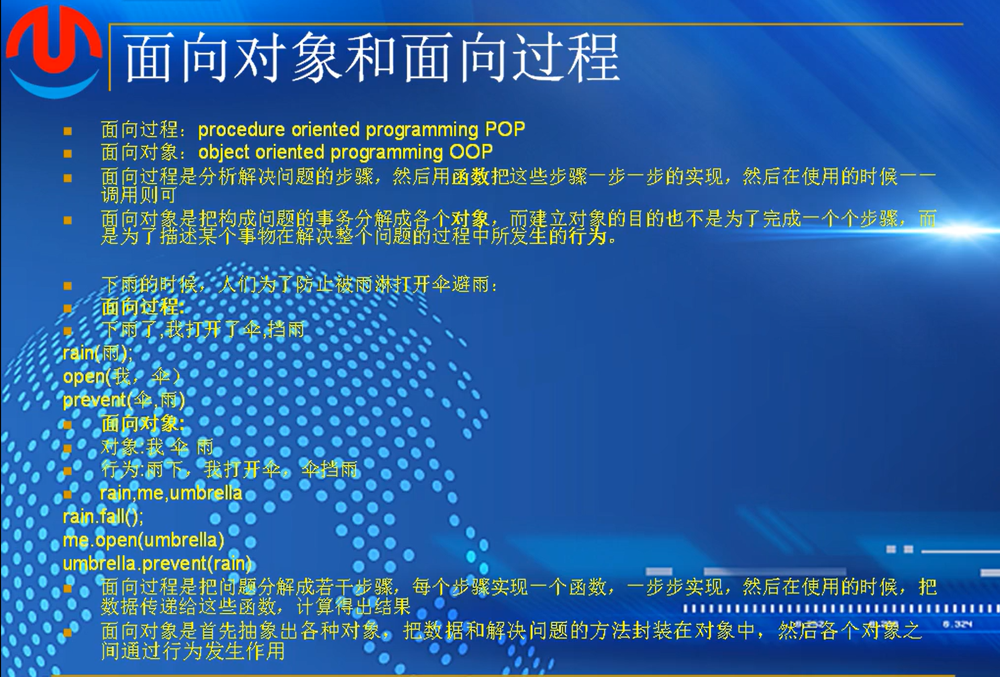

面向过程：抽象出解决问题的步骤，然后用函数表达步骤，解决的时候一一调用

面向对象：抽象出问题里面的对象，然后分析对象的行为，解决问题是对象发生了什么样的行为，调用对象的行为

##### 作业

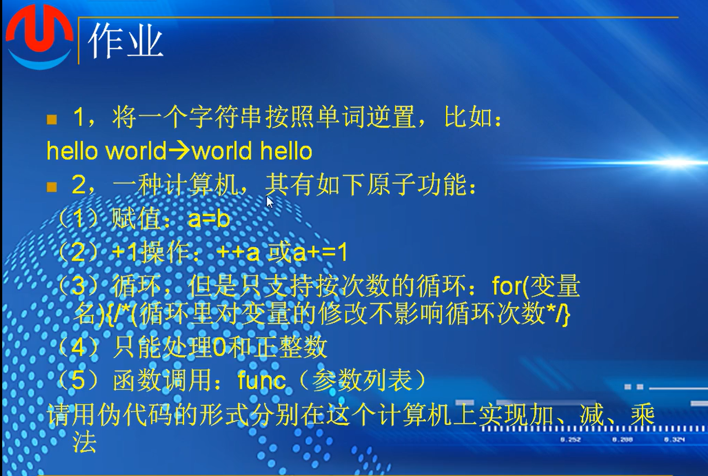

1.

```
#include <stdio.h>
#include <string.h>
#include <stdlib.h> 

int main()
{
	char str[] = "hello world";
	int len = sizeof(str) / 2 - 1;
	char* p1 = str[0];
	char* p2 = str[len];

	for (int i = 0; i <len; )
	{
		for (int j = len+1 ; j < strlen(str); )
		{
			char tep = str[i];
			str[i] = str[j];
			str[j] = tep;
			++i;
			++j;

		}
	}

	for (int i = 0; i < sizeof(str); i++)
	{
		printf("%c", str[i]);
	}
	return 0;
}

```

2.

```
```


## （2）：函数传参

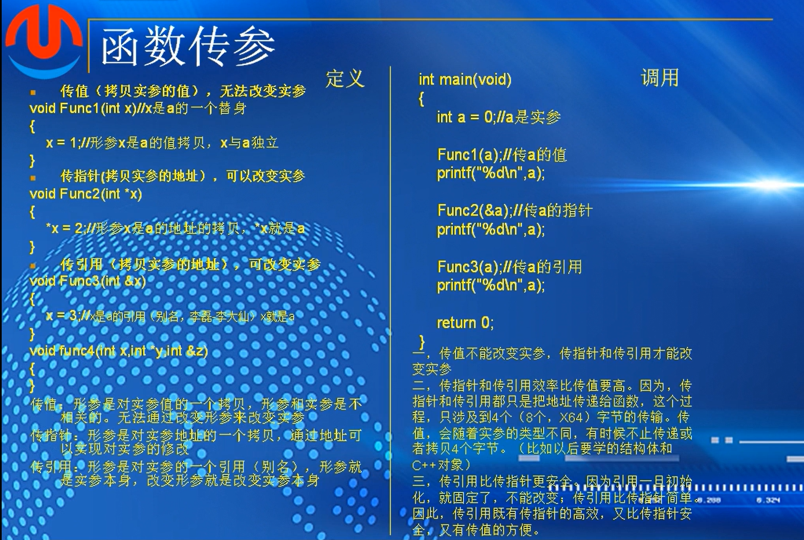

传引用是c++里面的

c语言里面有两种，函数里面传参有三种

#### 传值

拷贝实参的值，无法改变实参

func1  形参x是a的值的拷贝，x与a独立

#### 传指针

拷贝实参的地址，可以改变实参

func2 形参*x是a的地址的拷贝，x就是a     引用中取用了a的地址

#### 传引用

void func3(int &x)

传过来引用的地址，可以改变实参，x就是a 

如果一个函数有多个参数，每一个参数可以有不同的传值方法

**指针可能会指向错误的内存的地址，难以驾驭，可能破坏程序**

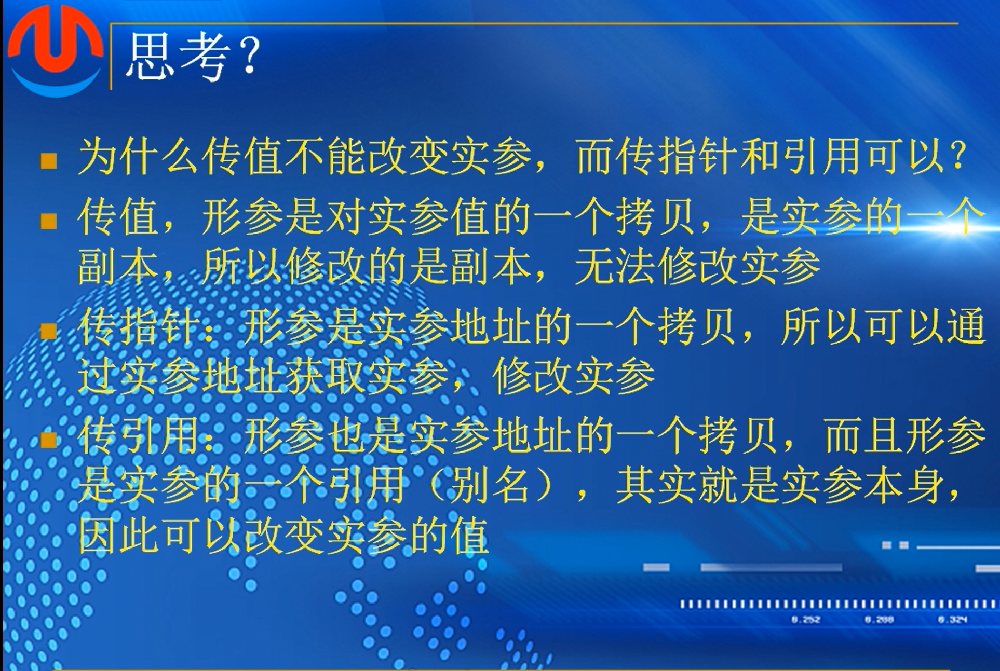

在传引用的情况下，形参就是实参的别名，代表的就是实参

### 传值还是传指针

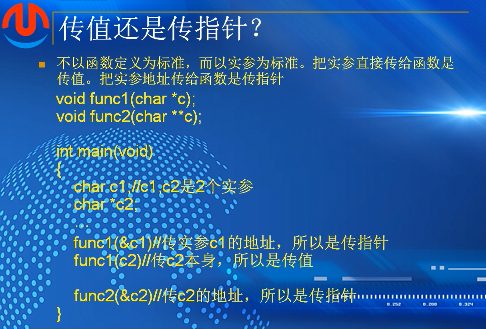

并非函数设定的指针，在传参的时候就是在传指针，而是看传的实参，是否是传的指针

func2(&c2)  //传c2的地址，是传指针，传指针的指针，二级指针

~~~
void func1(char *c);
void func2(char **c);

int main(void)
{
	char c1;
	char *c2;

	func1(&c1);
	func1(c2);
	
	//func1(&c2)错误,func1本身是一级指针，&c2取地址就二级指针了，就是语法错误
	
	func(&c2);
	return 0;
	
	
	
}
~~~

 #### swap-交换

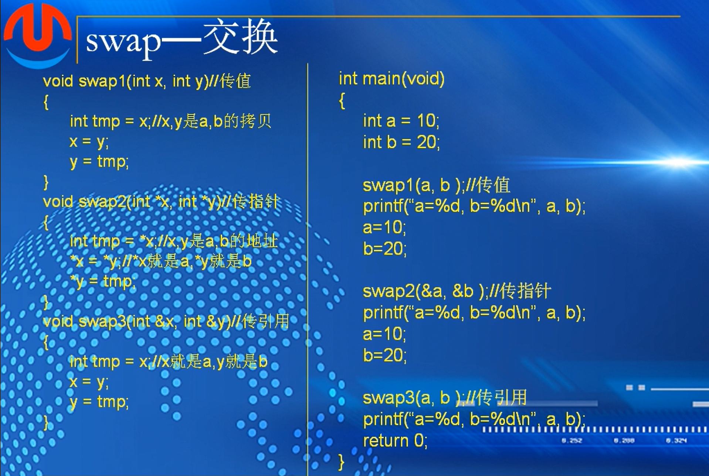

 ```
 #include <stdio.h>
 #include <string.h>
 #include <tchar.h>
 
 void swap1(int x,int y)
 {
 	int tep = x;
 	x = y;
 	y = tep;
 }
 
 void swap2(int *x, int *y)
 {
 	int tep = *x;
 	*x = *y;
 	*y = tep;
 }
 
 void swap3(int &x, int &y)
 {
 	int tep = x;
 	x = y;
 	y = tep;
 }
 int main()
 {
 	int x = 10;
 	int y = 20;
 
 
 	swap1(x,y);
 	printf("x:%d,y:%d\n", x,y);
 
 	swap2(&x,&y);
 	printf("x:%d,y:%d\n", x, y);
 
 	x = 10;
 	y = 20;
 
 
 	swap3(x,y);
 	printf("x:%d,y:%d\n", x, y);
 
 
 	return 0;
 }
 
 ```

### 函数用参数作为返回值


做输出参数的时候，必须使用传指针或者传引用，因为传值无法改变实参

```
#include <stdio.h>
#include <string.h>

int add1(int x, int y)
{
	return x + y;
}

void add2(int x, int y, int* sum)
{
	if (sum == NULL)
		return;
	*sum = x + y;
}

void add3(int x, int y, int& sum)
{
	sum = x + y;
}

void add4(int* x, int y)
{
	*x = *x + y;
}

void add5(int &x, int y)
{
	x = x + y;
}


int main()
{
	int a = 10;
	int b = 20;
	int sum = 0;

	sum = add1(a, b);
	printf("sum:%d\n", sum);

	add2(a, b,&sum);
	printf("sum:%d\n", sum);

	add3(a, b,sum);
	printf("sum:%d\n", sum);

	add4(&a, b);
	printf("sum:%d\n", sum);
	
	a= 10;
		add5(a,b);
	printf("sum:%d\n", sum);
	return 0;
}
```


### 数组做函数参数 ，防溢出

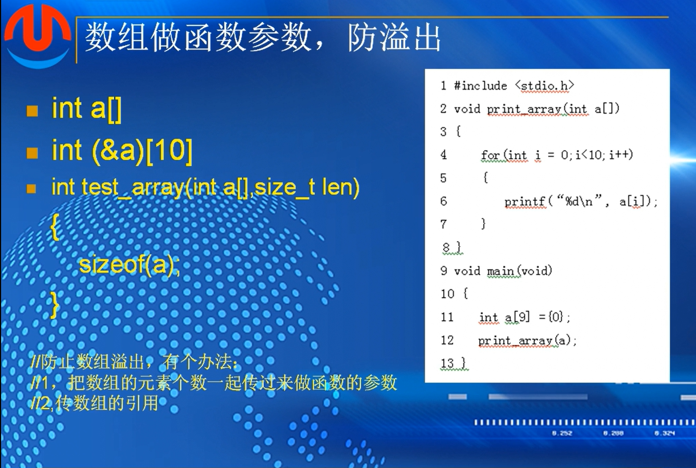

右边程序，函数设定中<10，但是main函数引用函数时设定了9个元素也就是0-8的数组，会导致内存溢出

```
第一种，多设置一个参数
#include <stdio.h>
#include <string.h>

void print_array(int a[],size_t len)
{
	for (int i = 0; i < len; i++)
	{
		printf("%d ", a[i]);
	}
	printf("\n");
}

int main()
{
	int a[9] = { 3,7,2,3,4,5,1,5,6};

	print_array(a,9);


	return 0;
}
```

~~~
第二种
#include <stdio.h>
#include <string.h>

void print_array(int (&a)[10])
{
	for (int i = 0; i <10; i++)
	{
		printf("%d ", a[i]);
	}
	printf("\n");
}

int main()
{
	int a[9] = { 3,7,2,3,4,5,1,5,6};

	print_array(a);


	return 0;
}

取值10个元素的一维数组，在编译阶段就无法将九个元素的数组传参过去。
只接收十个数组的函数
~~~

分析问题

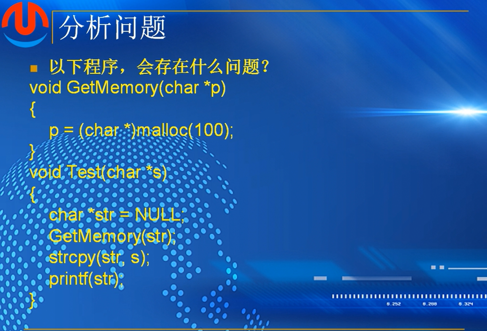

```
#include <stdio.h>
#include <string.h>
#include <stdlib.h> 

void GetMemory(char **p)
{
	*p = (char*)malloc(100);
}
void Test(char* s)
{
	char* str = NULL;
	GetMemory(&str);
	strcpy_s(str,100,s);
	printf(str);

}

malloc 需要头文件
```

##### 作业

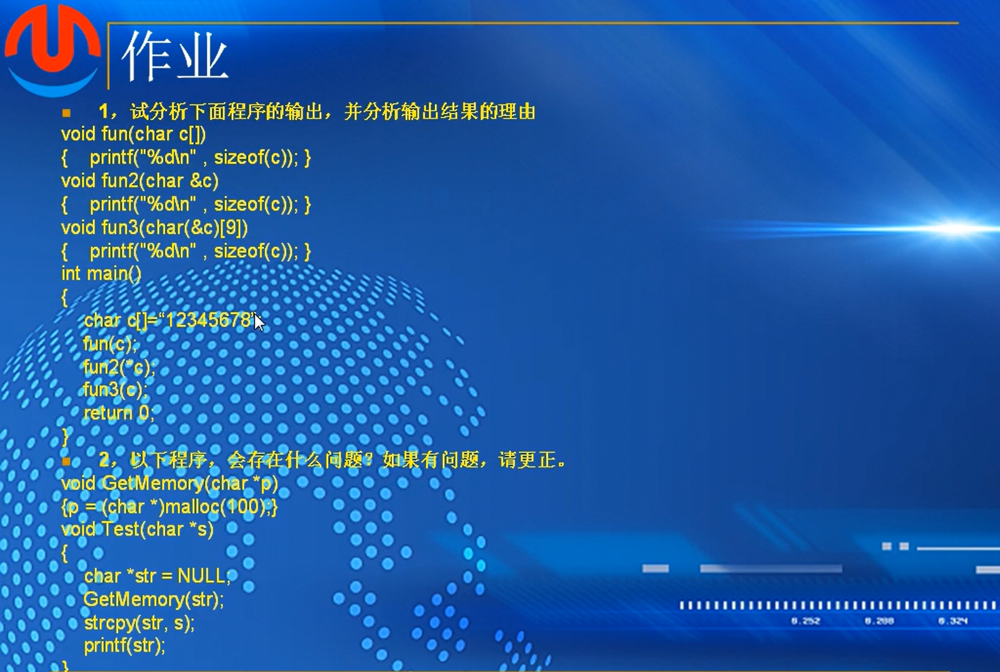

1.

```
fun(c)   输出  9   fun函数设定c[]，忽略了函数长度的影响，但是此题没有涉及函数长度的语句，结果不变
fun2(c)  输出  9   fun2函数设定&c，也就是传递指针，c数组指针传递过去，计算元素个数为9
fun3(c)  输出  报错  fun3中，（&c）[9]限制了输入数组的长度必须为9，但是原数组是1-8八个元素，所以报错

解析： 8 1 9
第一个，数组参数退化为指针，char c[]在函数参数中等价于char *c 即sizeof(char*)，与数组内容无关，只与指针类型有关
第二个，
第三个，(&c)[9]限定的九个元素里是包含了'\0'这个元素的，所以实际上对于a[8]来说元素个数是符合条件的
```

2.

~~~
1.传递空指针，会导致程序崩溃
2.手动分配内存，可能会出现导入字节数大于100的情况

ai解答：
getmemory函数定义指针值，test传递值应该二级指针
或者get函数定义数组，返回指针

1.
void GetMemory(char** p)  // 传指针的地址
{
    *p = (char*)malloc(100);
}

void Test(char* s)
{
    char* str = NULL;
    GetMemory(&str);  // 传str的地址
    if(str != NULL) {
        strcpy(str, s);
        printf("%s", str);
        free(str);
    }
}

2.
char* GetMemory()
{
    return (char*)malloc(100);
}

void Test(char* s)
{
    char* str = GetMemory();
    if(str != NULL) {
        strcpy(str, s);
        printf("%s", str);
        free(str);
    }
}
~~~

