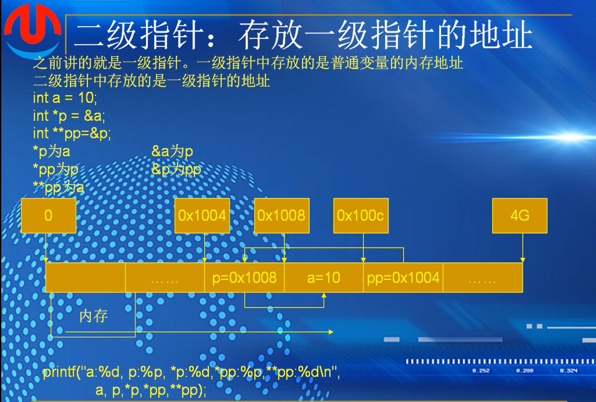
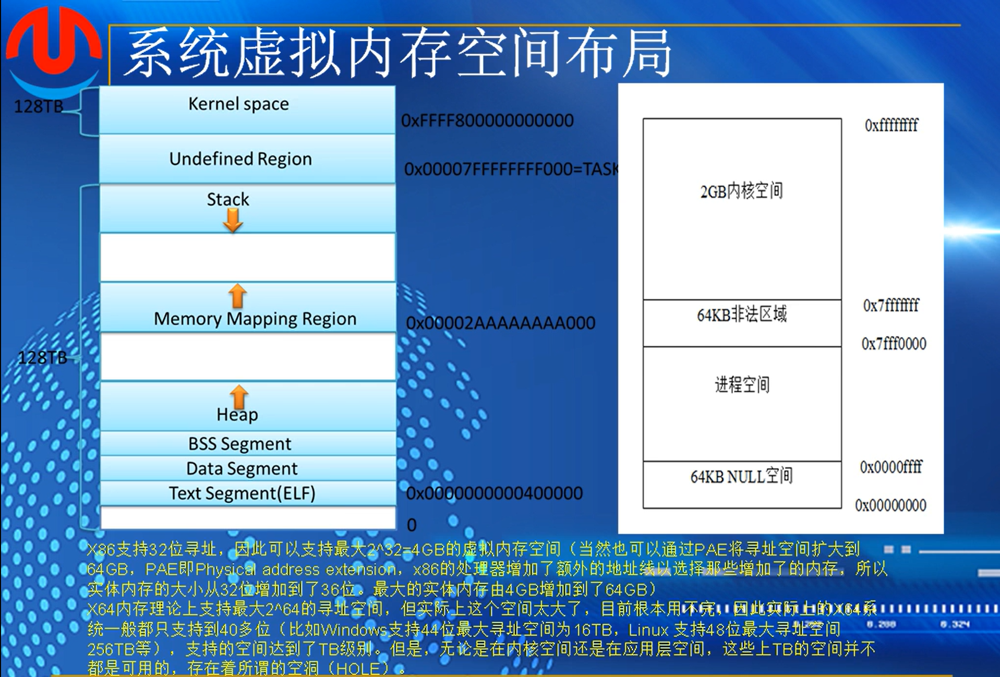
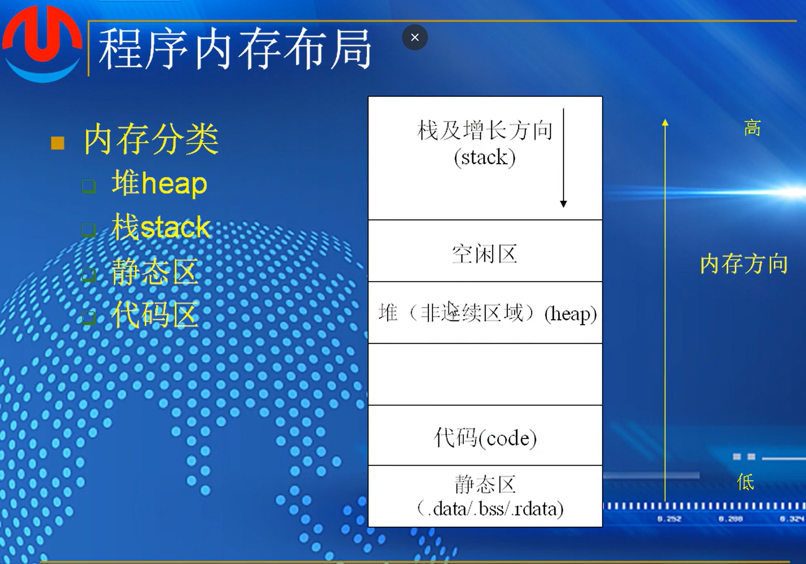
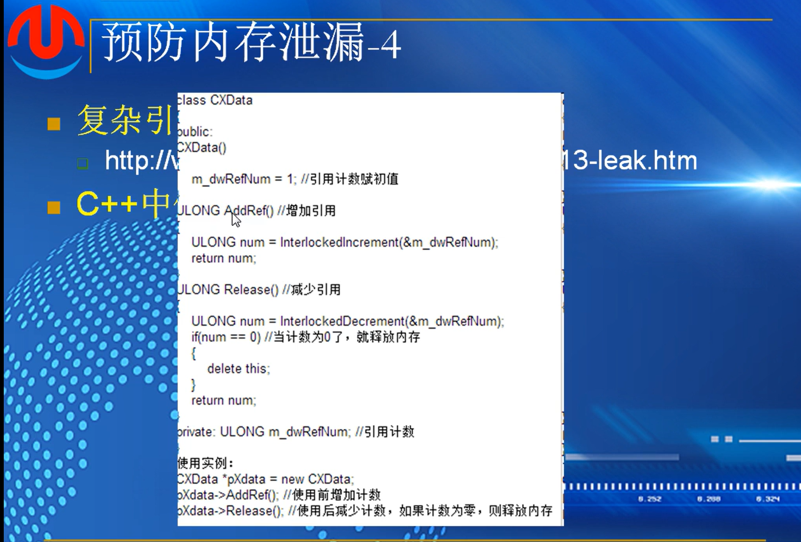

## （6）：二级指针

### 二级指针



 ```
 #include <stdio.h>
 #include <string.h>
 #include <stdlib.h> 
 #include <stdbool.h>
 
 int main(void)
 {
     int a = 10;
 
     int* p = &a;
     int** pp = &p;
 
     printf("a:%d\n", a);//10
     printf("&a:%p\n", &a);//addr of a
     printf("p:%p\n", p);//addr of a
     printf("&p:%p\n", &p);//addr of p
     printf("pp:%p\n",pp);//addr of p
     printf("*p:%d\n",*p);//10
     printf("*pp:%p\n", *pp);//p,addr of a
     printf("**pp:%d\n", **pp);//10
 
     return 0;
 }
 ```

### 二级指针关系图


### 应用


 分析


str是一个指针 ，第一个，我们将str作为一个值传递沟渠，函数拿不到这个值，必须串指针的地址，就是用二级指针来保存参数的地址，即


### 传参的形式


分析运行结果


1.


解答


##### 作业：


```
1.函数f中，两个变量分别是二级指针**ptr1,指针*ptr2。
定义指针p1=i的地址，p2等于j的地址
然后调用f函数
&p1，也就是取指针p1的地址，作为二级指针**Ptr1；p2，就是j变量的地址作为指针变量导入f函数中
然后int 指针tmp=ptr2  也就是 tmp=ptr2=p2=&j
下一个**ptr1，两次解引用ptr1指针，结果为i，i*10=0，i=0
解ptr2指针，结果为j，j*10=200，j=200
ptr2 = *ptr1，解引用ptr1，即二级指针中存放的是p1的地址，解出来p1存放的i的地址，也就是ptr2 = &i
*ptr1 = tmp  就是p1 = p2 = &j
所以，i=0，j=200，p1=p2=&j
```

```
2.问题：调用的getmemory函数中，malloc没有对应的free来清除堆上使用的内存，会造成内存泄漏
void中调用getmemory函数，传值传入的不是地址，定义getmemory的时候设定的指针，也就是需要传入地址，
所以程序会在调用函数的时候崩溃，还可能会造成内存泄露
修改：
void getmemory(char *p)
{
	p=(char*)malloc(100);
	free(p)
}
void test(char *s)
{
	char *str = NULL;
	getmemory(&str);
	strcpy(str,s);
	printf(str);
}
```


# 第十四课-内存管理

物理内存，cpu根据物理地址在物理内存中存储数据

## （1）：内存分类与寻址



R0，内核空间，最高权限。R3，进程空间

加载程序，就是把数据加载到程序的进程空间中部署运行

### 程序内存布局



data 初始化的全局变量，静态变量

rdata 常量

### 堆和栈的区别


堆上的内存需要释放，否则会造成内存些泄露

栈：自动分配内存，内存大小相对较小且固定，后进先出

堆：手动分配内存，可以动态调整大小，大小受限于计算机

指针函数不能返回栈上的地址，函数执行完了之后源地址已经销毁了

内存碎片：存在着内存，但是无法分配到空闲的内存


进程的地址空间是私有的，可能拥有相同的，类似的逻辑地址

### 寻址模式


#### 分段：用起始地址加偏移地址来表示位置

段的起始地址，低4位设置成零用来让16位寄存器表示段地址

两个寄存器，一个寄存器中拿到起始地址，然后左移四位，加上段的偏移

左移四位，低四位是0，未存放，也就是存放时右移四位

cs 代码段起始地址， ds 数据段起始地址

#### 扁平模型

不需要设置起始地址，能够直接用一个寄存器寻址整个地址空间


实模式，段寄存器中的地址加偏移能得到物理地址

保护模式，地址使用虚拟地址，通过页表段表来映射得到物理地址


保护模式中无需参与计算


段选择符加段表和偏移量得到线性地址

CR3寄存器，获得页目录，确定页表项，通过偏移找到物理地址

##### 作业


1.底层是静态区，存放了变量，数据，常量；往上是代码区，存放源代码；再往上是堆，一个手动管理的内存池；然后最后是栈，调用函数时存放变量的区域

2.程序内存分为四个区域，内核区，两个非法区，进程区。内核区和进程区占4GB，内核区的权限最高，进程区R3的权限，非法区域用来隔绝两个区域的相互影响，只占64kb

3.栈是函数调用时的临时存储区，由系统自动分配，后进先出，效率较高

堆是由程序员手动分配的内存池，大小由计算机硬件决定，调用灵活，但是效率稍低

4.分段模型是在计算机寄存器只有16位用来寻址的方法，计算机地址总线有20位，寄存器无法完全存储，于是采用分段模型的方式来存储，将20位总内存大小1m的内存分为16个64kb的段，然后规定最后四位都为0的方式，省略四位零，然后用两个寄存器，一个用来表示起始地址，另一个用来表示偏移量，这样用来将逻辑地址转换为物理地址

  平坦模型，则是计算机发展之后，一个寄存器能够完成将逻辑地址转换为物理地址之后发展出来的方式，能用一个寄存器去遍历所有的地址线

5.实模式，没有保护，用分段模型构建的物理地址，可以读写任何内存位置

保护模式，需要页表将虚拟地址转换为物理地址

```
直接物理内存访问：程序看到的地址就是真实的物理内存地址。一个程序可以读写任何内存位置，包括操作系统的核心代码。

无权限分级：没有“内核态”和“用户态”之分。所有代码都以最高权限运行。

内存空间小：由于16位架构和寻址方式限制，最多只能访问 1MB 内存。


虚拟内存：程序运行在独立的“虚拟地址空间”中，由CPU和操作系统负责映射到真实的物理内存。程序A无法直接访问程序B的内存。

权限分级：通常有4个特权级（Ring 0 ~ Ring 3）。操作系统内核运行在最高特权级（Ring 0），应用程序运行在最低特权级（Ring 3）。应用程序想执行特权指令（如操作硬件）会被CPU拒绝。

内存分段与分页：通过复杂的描述符表和页表来管理内存访问，提供了隔离和保护机制。

支持大内存：可以访问远超过1MB的物理和虚拟内存（如4GB甚至更多）。
```


## （2）：内存分配

静态区，代码区，栈，堆，如何编译一个10m的程序

 全局数组，全局变量， 必然存放在静态区

```
#include <stdio.h>
#include <string.h>
#include <stdlib.h> 
#include <stdbool.h>
#include <malloc.h>

int g_iNum = 10;
char g_Aarrat[] = "hello worlf";


int main(void)
{
    int a = 123;
    int b = 127;

    char buf[128] = { 0 };//栈


    char* p = (char*)malloc(256);//堆上，需要内存分配函数，nalloc是一个函数名，返回的变量名是一个void类型*指针
    free(p == NULL);

    if (p == NULL)
    {
        return -1;
    }

    memset(p, 0, 256);//内存初始化为0
    strcpy_s(p, 256, "hello world");
    printf("%s\n", p);

    free(p);//释放，把值重新放入到内存去，但是指针指向未必其余的
    
    p = NULL;

    return 0;
}

```

如果一个数组里面全是0，编译器不会打开数组将值存放在内存，可以压缩成一个存放

比如  g_data区有10\*1024\*1024的数组，全是0即被压缩，如果有存放字符，就会开辟一个区域存放

### malloc/calloc/realloc


##### 作业


1.静态区存放全局变量，静态变量，从静态区分配内存只能从最开始的声明变量，内存由声明类型决定，不由程序员决定

2.栈的内存是在函数调用时由机器分配使用，根据所写函数的声明类型定义来决定，不受程序员控制

3.从堆上分配内存需要使用特定的函数，比如malloc，calloc，用来在堆上划取一部分内存来使用

4.栈是函数调用时的临时存储区，由系统自动分配，后进先出，效率较高

堆是由程序员手动分配的内存池，大小由计算机硬件决定，调用灵活，但是效率稍低

##  


## （3）：内存泄漏预防与检测

### 内存泄漏


忘记了将调用的堆的内存释放，即内存泄漏

系统内存耗尽后，系统会将磁盘的一部分用来存储内存的数据，导致系统性能大幅下降

图中传参的代码，传的是值，而函数中定义的是指针，调用时并没有真正传入，但是堆上的内存会分配，导致程序崩溃，释放内存也没有用

### API不正确调用造成内存泄漏


### 预防内存泄漏 -1


### 预防内存泄漏-2


集中处理内存泄漏

### 预防内存泄漏-3


### 预防内存泄漏-4



### 内存泄漏之后的检测


realloc会检查原来内存的容量，不够会开辟新的内存地址

##### 作业


1.写代码的时候，声明函数之后跟上释放，让划取和释放成对出现

或者用goto集中处理所有的堆

用内存使用计数，使用时+1，释放时-1，最后看是否还有+1

2.用容器封存指向所划取堆的首地址的指针，在调用完成后检查是否有未释放的指针留存