## （3）：结构体浅拷贝深拷贝

#### 结构体赋值时的拷贝

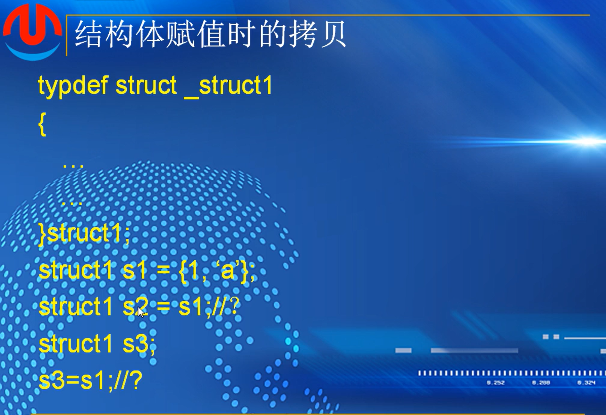

是否能像图中一样，s1赋值之后，直接用s1来拷贝到其他结构体

##### 浅拷贝和深拷贝


左，如果结构体中不包含指针变量，那么s2=s1是正确的

右，结构体中的拷贝默认是浅拷贝，在赋值的同时也把指针所指向的的地址一起拷贝过去，而且s2中还未给指针分配内存，会导致s1和s2共享分配的100个字节的内存

如果free(s1.p)，那么s2.p就变成了野指针，指向了一个无效的内存地址


```
#include <stdio.h>
#include <string.h>
#include <malloc.h>

typedef struct _struct1
{
	int a;
	char c;

}struct1,*pstruct1;
 
typedef struct _struct2
{
	int a;
	char *p;

}struct2, *pstruct2;

int main()
{
	struct1 s1 = { 100,'A' };
	struct1 s2=s1;

	printf("s1:a:%d,c:%c\n", s1.a, s1.c);
	printf("s2:a:%d,c:%c\n", s2.a, s2.c);

	struct2 s3;
	s3.a = 100;
	s3.p = (char*)malloc(16);
	if(s3.p == NULL)
	{
		return -1;
	}

	memset(s3.p, 0, 16);
	strcpy_s(s3.p, 16, "hello world");
	struct2 s4=s3;

	printf("s3:a:%d,p:%s\n", s3.a, s3.p);
	printf("s4:a:%d,p:%s\n", s4.a, s4.p);

	free(s3.p);

	printf("s4:a:%d,p:%s\n", s4.a, s4.p);

	return 0;
}

```

debug


##### 深拷贝的实现


需要程序员手动去分配内存

##### 图解


互有瑕疵

#### copy-on-writr


###### 作业


1.浅拷贝，将对应的值和内存地址直接拷贝到对应的变量当中，也就是，两个指针指向同一个内存地址，共享这一个内存地址

深拷贝，在拷贝指针中分配新的内存，然后将被拷贝指针中的值拷贝到新地址，原指针的改动对拷贝后的指针无影响

2.浅拷贝对指针来说是两个指针指向同一个内存地址，如果原指针所在结构体运行完成后释放自己在堆上分配的内存，会导致拷贝后的指针变成野指针

3.c语言中默认是浅拷贝

4.拷贝时，先给拷贝指针分配一个内存，然后再对齐进行拷贝

5.


## （4）：结构体应用

#### 结构体数组

结构体数组的初始化与遍历

结构体指针数组

 ##### 结构体做函数参数

传指针

传值

判断两个同学成绩

###### 作业


##  （5）：sizeof计算结构体长度

计算类型或者变量的长度，计算的是所占字节的长度

### 基本类型


utf16编码，utf32编码

long ：win 都站4个字节，linux x64占8个字节

### 结构体对齐-自然对齐


成员一样，位置不太一样

如果是基本成员，存放地点就必须是成员类型的整数倍

char，可以存放在任何地址，地址都是1的整数倍

short，0 2 4 6 8  

结构体中包含结构体，按照结构体中子成员中最大的基本类型的整数倍

最终结果成都必须为sizeof基本类型的整数倍，比如第一个a结构体，计算出来的结果如果是20，需要往后填充4个字节来满足必须要是基本类型double=8的整数倍，也就是24个字节


一般从零地址开始存，这样计算存完即是结构体所占内存大小

作用，保证cpu在一个时钟周期内把这些数据拿到，提高存取效率

### pragma pack(n)

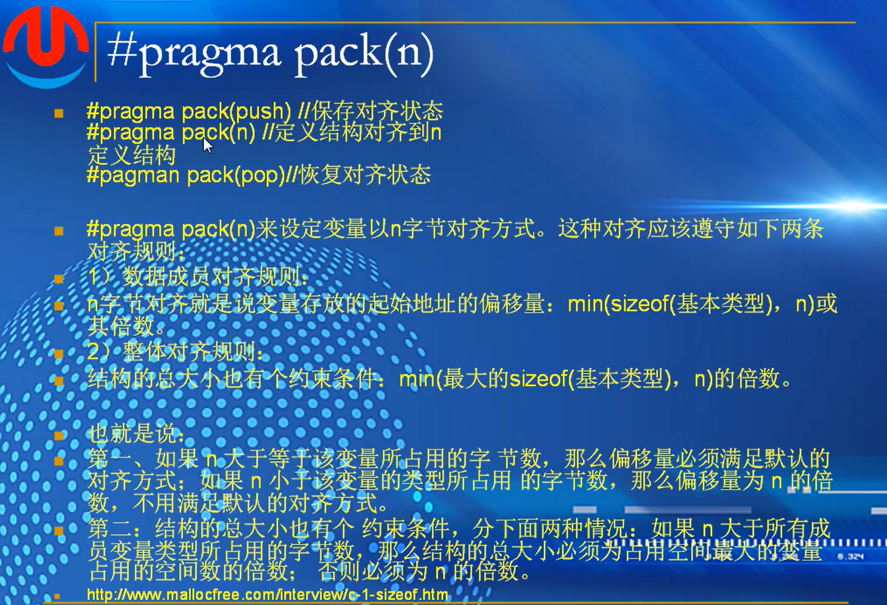

pragma示例


定义结构对齐

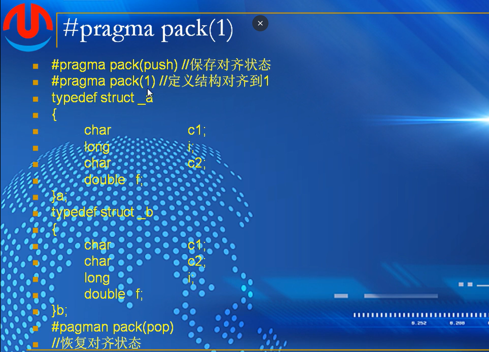

如果按照1字节对齐，那就不用空格，全部加起来即是字节大小 

### 栈空间对齐


直接按4字节对齐

在print函数中float会扩充成double字节。


x64平台填充

float有专门的寄存器，前四个参数存入寄存器，在栈上还会给这四个参数预留空间


###### 作业

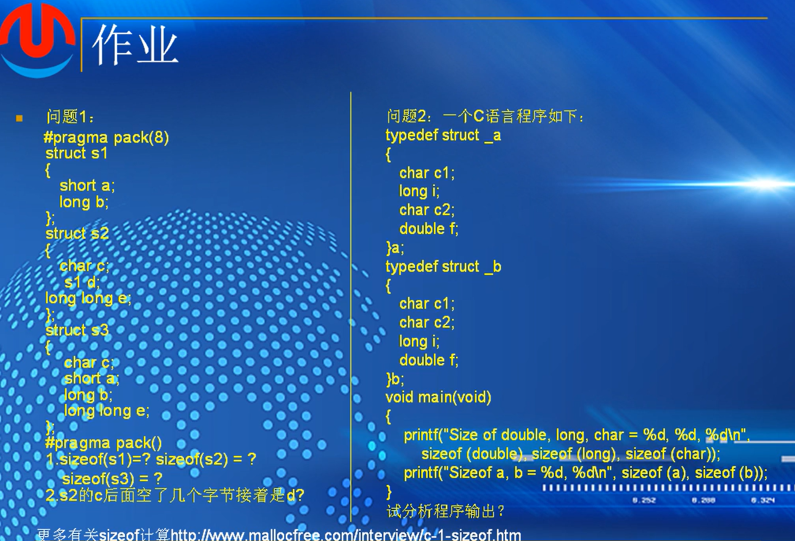

## （6）：联合体

### 联合体（UNION）定义

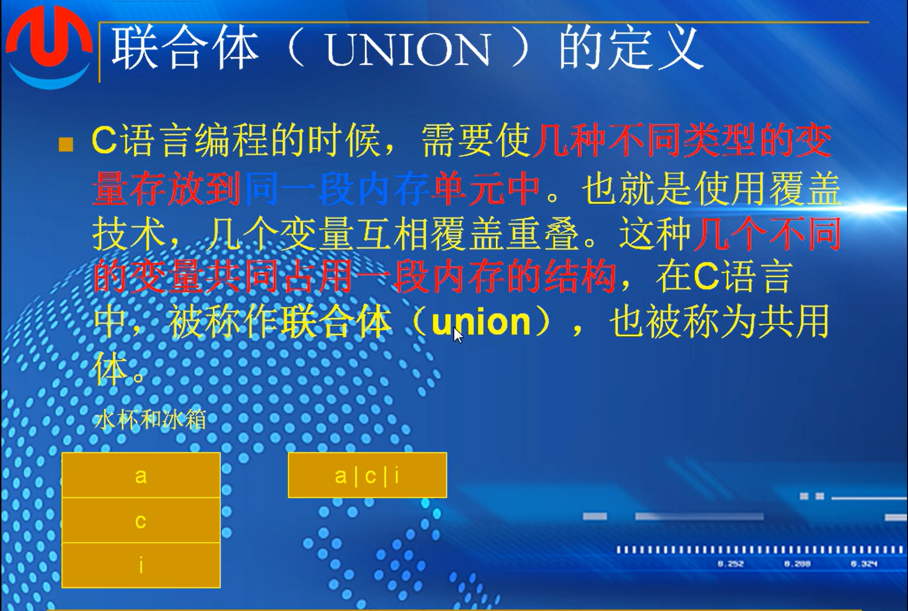

“同一段内存”，改变其中一个变量，别的变量可能会受影响

### 代码定义形式


 红色是标准的联合体定义方式，而且在应用中非常常见

示例


前面四个字节，i和s重叠，为i赋值的时候，其实就是覆盖

为s赋值的时候，i的值也会被破坏，他们同时存在，但是值是否存在不知道

```
#include <stdio.h>
#include <string.h>

typedef union _foo
{
	char s[20];
	int i;
}foo;

int main()
{
	foo a;
	a.i = 100;
	printf("a.i:%d,a.s:%s\n", a.i, a.s);
	strcpy(a.s, "hello world!");
	printf("a.i:%d,a.s:%s\n", a.i, a.s);
	printf("&a.i:%p,&a.s%p\n", &a.i, &a.s);
	printf("sizeof(a)=%d\n", sizeof(a));
	return 0;
}
```

### UNION的性质


### 结构体和联合体的区别


### 可以互相包含


```
#include <stdio.h>
#include <string.h>

typedef union _demo1
{
	int a;
	struct
	{
		int b;
		char c;
	}s;
	float f;
}demo1,*pdemo1;

typedef struct _demo2
{
	union
	{
		int a;
		char b;
	}c;
	int d;
}demo2,*pdemo2;

int main()
{
	demo1 dm1;
	demo2 dm2;

	dm1.a = 100;
	printf("dm1.s.b:%d\n", dm1.s.b);
	printf("dm1.f:%.2f\n", dm1.f);
	
	dm2.c.a = 0x12;
	dm2.d = 0x64;
	printf("dm2.d:%d,dn2.c.a:%d\n",dm2.d,dm2.c.a);
	dm2.c.b = 'A';
	printf("dm2.d:%d,dn2.c.a:%d\n", dm2.d, dm2.c.a);


	return 0;
}
```

### DEMO


### 用union判断存储顺序


 作业：


## （6）：枚举类型（enum）

### 定义

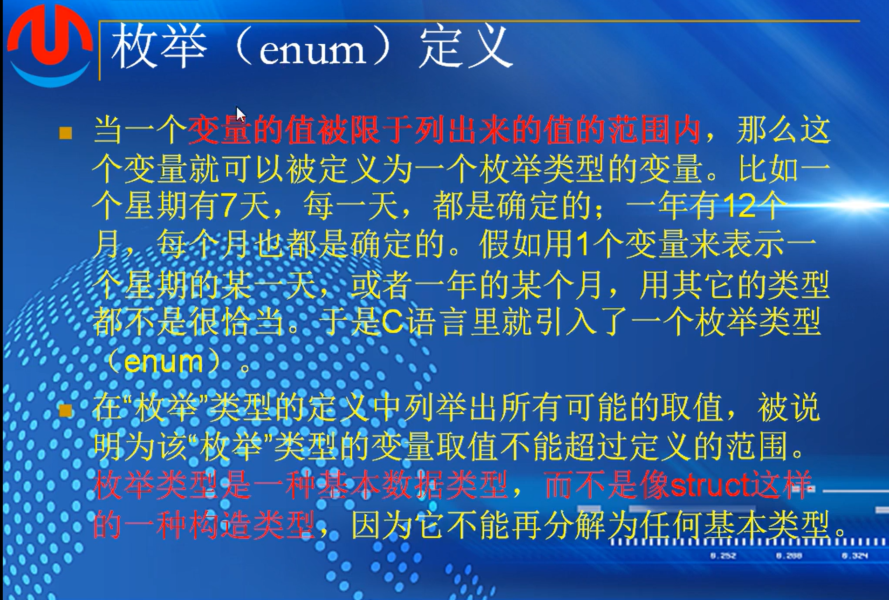

是一种基本类型


逗号分隔，第一个值如果不指定，默认是0

中途可以指定，中途不能和前面设定好的值重复

例子


上述定义，都是枚举类型的变量，变量不能超出这个范围

不能再对所定义的枚举常量进行赋值


 ```
 #include <stdio.h>
 #include <tchar.h>
 #include <string.h>
 #include <stdlib.h>
 
 typedef enum _WINVERSION
 {
 	WIN2000,
 	WINXP,
 	VISTA,
 	WIN7,
 	WIN8
 }WINVERSION;
 
 int main()
 {
 	WINVERSION winos = 3;
 
 	switch (winos)
 	{
 	case WINXP:
 		printf("the os is winxp\n");
 		break;
 	case WIN7:
 		printf("the os is win7\n");
 		break;
 	case WIN8:
 		printf("the os is win8\n");
 		break;
 	default:
 		printf("unkonwn windows os")
 		break;
 	}
 	
 	return 0;
 }
 
 ```

#### sizeof 枚举类型


```

	printf("sizeof(WINVERSION):%d,sizeof(WIN8):%d",
		sizeof(WINVERSION), sizeof(WIN8));
		
长度都是一样的，枚举类型的底层应该是int，都是四个字节
```

#### 软工中的使用


###### 作业

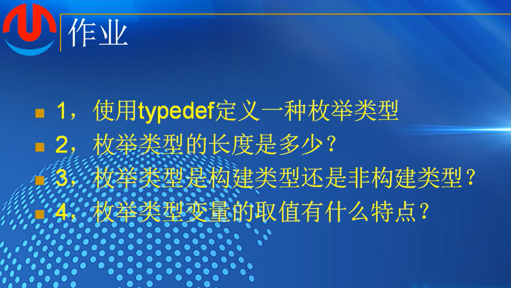

# 第十六课-位运算

## （1）：位运算概述

### 复习二进制位


*扩展位数的时候，用符号为去填充多出来的位数*

### 位运算定义


| &    | \|   | ~    | ^    | <<   | >>   |
| ---- | ---- | ---- | ---- | ---- | ---- |
| and  | or   | not  | xor  | shl  | shr  |
| 与   | 或   | 取反 | 异或 | 左移 | 右移 |


### 运算符


###### 作业


## （2）：与运算 &


### 程序表示


7，的二进制表示为0111，一个数与7进行与运算，得到的数，就是其末尾3位

16，0xF

子网掩码 255.255.255.0 -> 0xFFFFFF00

ip:192.168.1.100  

前三个字节是网络号。最后一个字节是主机号

子网掩码，进行与运算获取网络号

### 清除整数a二进制中最右边的1


### 各种性质

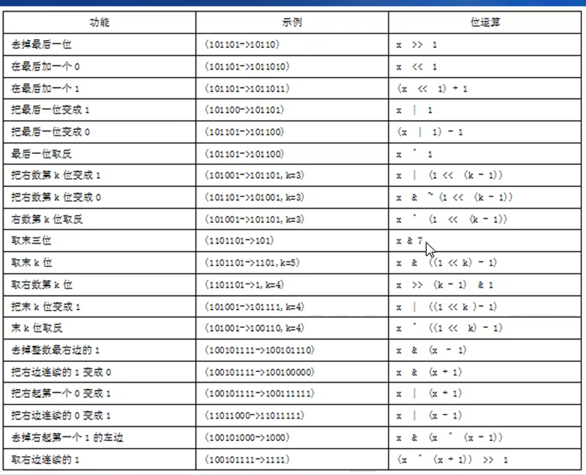

###### 作业


## （3）：或运算  |


### 或运算程序 


###### 作业


## （4）：异或运算


异或运算，相同为0，不同为1、

### 异或的程序表达


###  异或运算的性质


xor eax eax  自己与自己异或，结果为0

两个数的交换


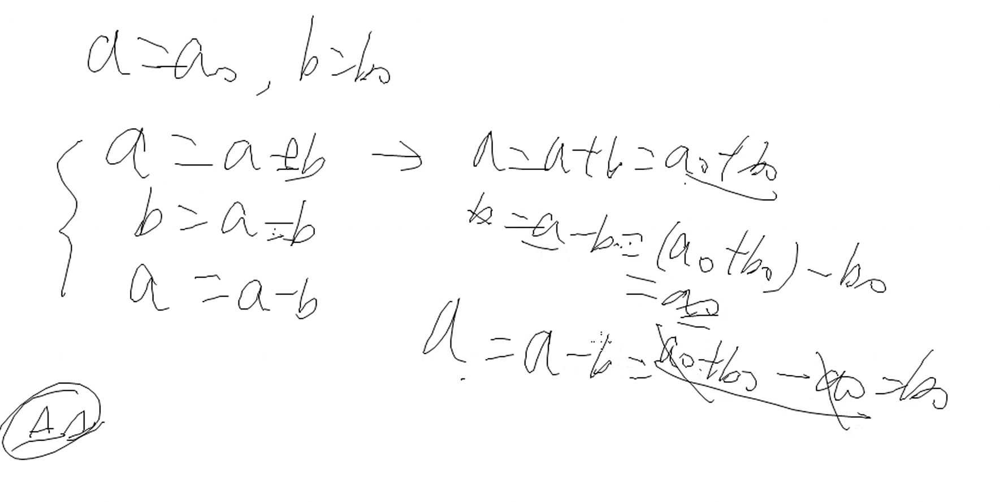

### 单指针实现双链表


###### 作业


## （5）：取反运算


必须是1个字节，2个或者4个

### 程序表示


*不存在复合运算*

###### 作业


## （6）：移位运算   <<  >>

### 左移运算符 ：<<

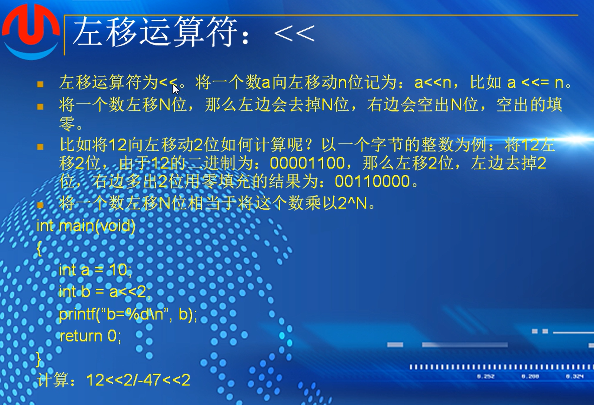

举例


### 右移运算符


分为逻辑右移和算数右移

c语言中右移运算符为算数右移

java   >>>逻辑   >>算数

###### 作业


## （7）：位运算综合运用

### 将第N位置0或者置1


### 对称加密

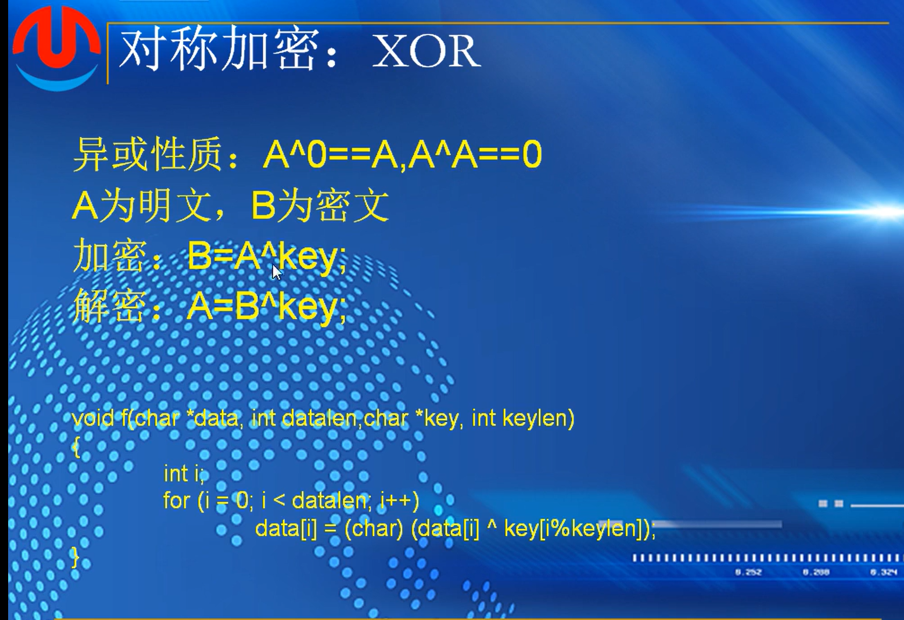

### 实际项目运用


###### 作业


# 第十八课 - 宏

## （1）：宏的定义


