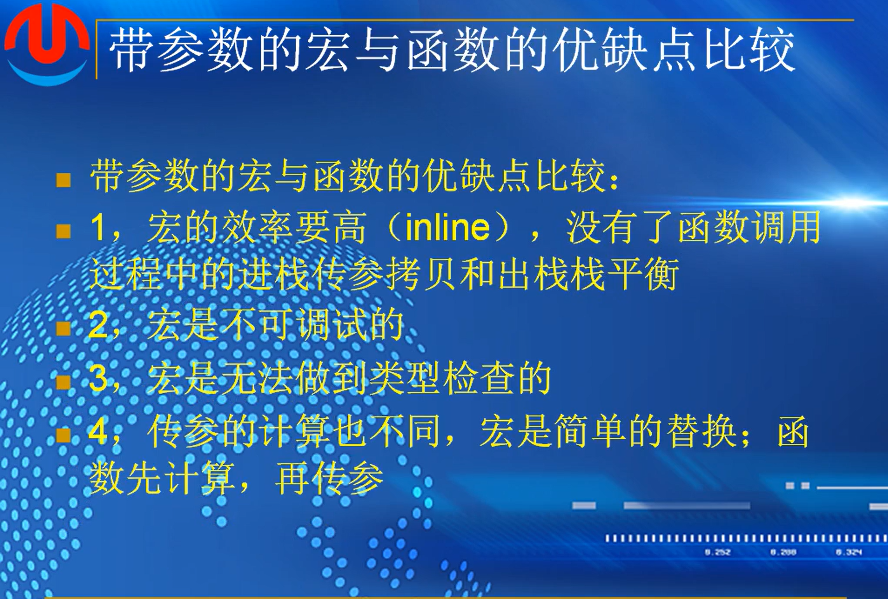
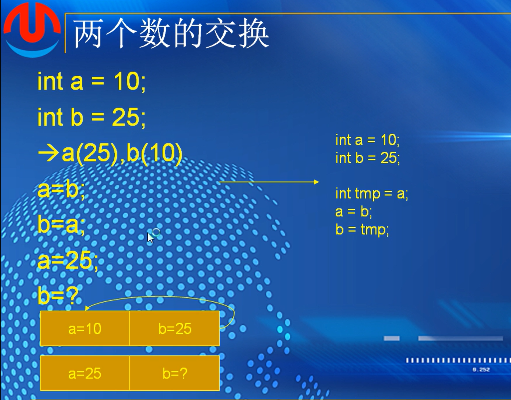
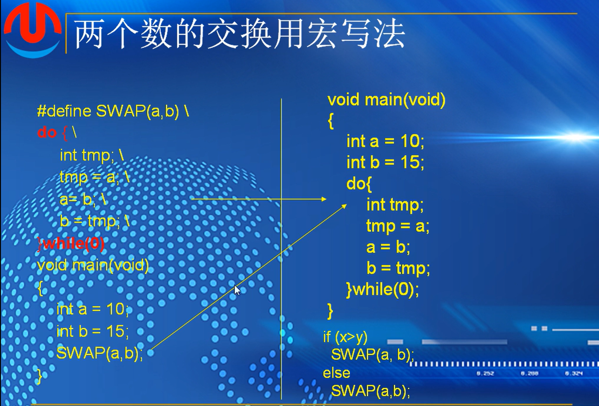
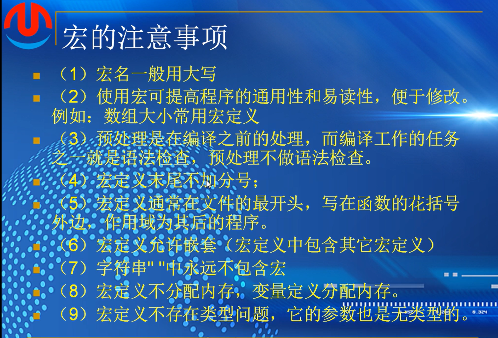
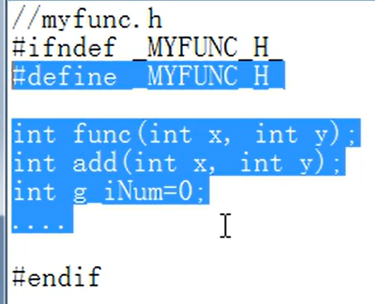
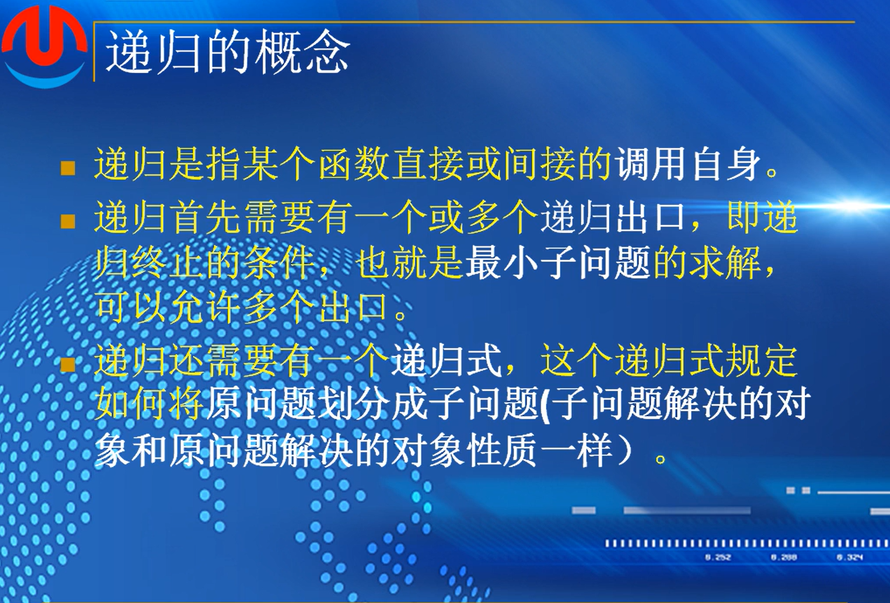

# 第十八课-宏

## （1）：宏的定义


### 例子


```
#include <stdio.h>
#include <tchar.h>
#include <string.h>
#include <stdlib.h>

#define PI 3.14
float calc_circle_area(float r)
{
	return PI * r * r;
}
int main()
{

	printf("s:%.2lf", calc_circle_area(1.1f));
	return 0;
}
```

**宏定义不带分号**

### 宏定义优缺点


c++ 中可以设置常变量 

### 带参数的宏定义-MAX


理解宏展开：

```
#include <stdio.h>
#include <tchar.h>
#include <string.h>
#include <stdlib.h>

#define MAX(X,Y) X>Y?X:Y

int main()
{
	printf("max:%d\n", MAX(7, 2));

	printf("max:%d\n", MAX(1&7, 5-2));
	return 0;
}

原封不动的打包替换
第二个
1&7>5-2?1&7:5-1

先算减法，然后比较运算，然后与运算，然后三目运算
1&1?1&7:4
1?1:4

修改的话，可以给x y整个变量打上括号，这样替换位置的时候先算括号里的

如果使用
int getmax(int x , int y)
{
	return x>y?x:y;
}
不加括号也可以使用
宏定义会直接替换，函数的话会计算之后再传参
```

### 带参数的宏与函数优缺点比较



函数有出栈和入栈的调用过程，效率低于宏

函数还有参数的安全检测，比如参数的类型，如果穿的参数不匹配对应的类型，则无法匹配

###### 作业


## （2）：宏的应用与注意事项

### 两个数的交换



宏写法



```
#include <stdio.h>
#include <tchar.h>
#include <string.h>
#include <stdlib.h>

#define SWAP(a,b) \
	int tmp; \
	tmp = a; \
	a = b; \
	b = tmp; 


int main()
{
	int a = 10;
	int b = 25;
	printf("a is not less than b\n");
	printf("a:%d,b:%d\n", a, b);
	SWAP(a, b);
	printf("a:%d,b:%d\n", a, b);
	return 0;
}

```

会有一个问题

即，如果在if条件下，原宏定义为使用括号，如果条件下未用括号，会导致宏展开的语句也没有括号，使得程序报错

```
即
if(a>b)
	SWAP(a,b);
else
	printf()

两种办法解决
第一种是语句加上括号
第二种是在原宏定义加上do while 

#define SWAP(a,b) \
do{  \	
	int tmp; \
	tmp = a; \
	a = b; \
	b = tmp; \
   }while(0)

```

### 软件生产宏定义


### 宏应用


偏移语句中未对0进行解引用，不会引起报错

```
#include <stdio.h>
#include <tchar.h>
#include <string.h>
#include <stdlib.h>

typedef struct _S
{
	int i;
	char ch;

}S,*PS;

#define OFFSETOF(s,m)  (size_t)(&(((s *)0)->m))

int main()
{
	printf("offset of i:%d,   ch:%d\n",
		OFFSETOF(S, i), OFFSETOF(S, ch));

	return 0;
}
```

**常用**   链表中某一个数据的偏移

```
#include <stdio.h>
#include <tchar.h>
#include <string.h>
#include <stdlib.h>

#define ARRAYSIZE(a) sizeof(a)/sizeof(a[0])

int main()
{
	char ch[] = "hello world";

	printf("items of ch is :%d\n", ARRAYSIZE(ch));

	return 0;
}

```

计算数组中元素个数

```
abs(a-b)   -> a-b的绝对值  abs是math文件里的函数

#define MAX(A,B) ((a)+(b)+abs((a)-(b)))/2
```

不用比较 if 来计算a和b的最大值

### 宏的注意事项



字符串中属于字符串的一部分，不会宏展开


2.宏名的标识符不能用数字开头

3.双引号必须完整

4.标识符必须完整

###  #和##


### 定义一个宏来计算一个数的平方

```
#define power(x)   ((x)*(x))
```

### 宏的二义性


###### 作业


## （3）：条件编译


### 条件编译形式1


```
#include <stdio.h>
#include <tchar.h>
#include <string.h>
#include <stdlib.h>

#define WINVER 6.1
int main()
{
#ifdef WINVER
	printf("WINVER is defined\n");
#else
	printf("WINVER is not defined\n");
#endif
	return 0;
}

```

 ###  条件编译方式3


```
#include <stdio.h>
#include <tchar.h>
#include <string.h>
#include <stdlib.h>

#define DEBUG 1

int main()
{
	int a = 10;
	int b = 15;
	int c = a + b;
#if DEBUG
	printf("c:%d\n",c);

#endif

	return 0;
}
判断真假
```

### 条件编译方式4


### 条件编译实际工程例子


### 头文件的预编译




避免同一个头文件被多次编译


###### 作业


# 第十九课-递归

## （1）：递归定义



函数内部，直接或者间接的调用自身

递归首先需要有至少一个递归出口，即终止条件，不能无限调用自己

递归式，原问题划分成子问题，子问题解决性质一样，这样子问题解决之后原问题也会被解决

### 阶乘


定义fact无符号数

满足n==0或==1，即一个递归出口

```
int fact(unsigned int n)
{
	if(n==0 || n==1)
	{
		return 1;
	}
	return n * fact(n-1);
}
```

### 斐波那契数列


```
unsigned int feibo(unsigned int n)
{
	if(n==1 || n==2)
	{
		return 1;
	}
	return feibo(n-1)+feibo(n-2);
}

printf("feibo(6)=%d\n",feibo(6))
```

### 递归的优缺点


###### 作业

