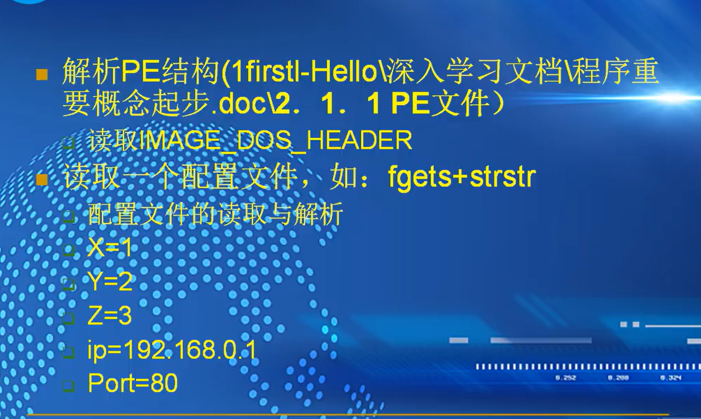
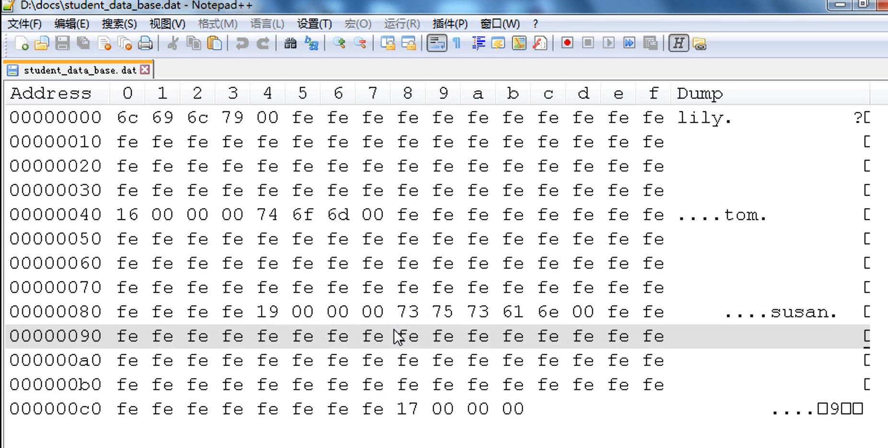

### 文件的读写

#### 格式化输入输出

```
#include <stdio.h>
#include <direct.h>
#include <windows.h>

int format_io()
{
	char* filepath = "d:\\1111111111111\\format_io.txt";
	FILE *fp = NULL;
	errno_t err = fopen_s(&fp, filepath, "w");
	if (err != 0||fp == NULL)
	{
		return -1;
	}

	// int data = 100; 可以传入变量

	fprintf(fp,"%s %d","hello-world",100);
	fclose(fp);

	 err = fopen_s(&fp, filepath, "r");
	if (err != 0||fp == NULL)
	{
		return -1;
	}

	char buf[128] = { 0 };
	int value = 0;

	fscanf_s(fp, "%s%d", buf,128, &value);
	printf("format io:buf:%s,value:%d\n", buf, value);
	fclose(fp);
	return 0;
}
int main()
{
	format_io();
	return 0;
}

```

#### 字符输入输出

```
#include <stdio.h>
#include <direct.h>
#include <windows.h>

int char_io()
{
	char* str = "hello world";
	char* filepath = "d:\\11\\char_io.txt";

	FILE* fp = NULL;
	errno_t err = fopen_s(&fp, filepath, "w");
	if (err != 0 || fp == NULL)
	{
		return -1;
	}

	while (*str != '\0')
	{
		fputc(*str, fp);
		str++;
	}
	fputc('\0', fp);
	fclose(fp);

	err = fopen_s(&fp, filepath, "r");
	if (err != 0 || fp == NULL)
	{
		return -1;
	}
	while (!feof(fp))//判断是否到达文件末尾
	{
	char ch = fgetc(fp);
	printf("%c", ch);
	}
	printf("\n");
	fclose(fp);

	return 0;
}
int main()
{
	char_io();
	return 0;
}
```

#### 字符串输入输出

```
#include <stdio.h>
#include <direct.h>
#include <windows.h>

int str_io()
{
	char* data[4] =
	{
		"hello world\n",
		"hello beijing\n",
		"hello china\n",
		"hello dlrow\n"
	};

	char* filepath = "d:\\11\\str_io.txt";

	FILE* fp = NULL;
	errno_t err = fopen_s(&fp, filepath, "w");
	if (err != 0 || fp == NULL)
	{
		return -1;
	}

	for (int i = 0; i < 4; i++)
	{
		fputs(data[i], fp);
	}
	fclose(fp);

	err = fopen_s(&fp, filepath, "r");
	if (err != 0 || fp == NULL)
	{
		return -1;
	}

	while (!feof(fp))
	{
		char buf[128] = { 0 };
		fgets(buf, 128, fp);
		printf("str io:buf:%s", buf);
	}
	fclose(fp);

	return 0;
}
int main()
{
	str_io();

	return 0;
}
```

### fopen popen  fwrite write


读写缓存：调用io来写入磁盘非常消耗性能，而缓存就是将写入字节累计，到一定程度在写入磁盘

###### 作业




## （3）：文件其他相关操作

### 读写指针控制


读写指针，有一个指针在文件中移动，

从文件头开始移动，表示读和写的相应位置

rewind 移动到文件头

fseek  第二个参数是相对位置的偏移，第三个参数是某某位置

```
#include <stdio.h>
#include <direct.h>
#include <windows.h>
#include <string.h>

int seek_demo()
{

	char* filepath = "d:\\11\\see_demo.txt";

	FILE* fp = NULL;
	errno_t err = fopen_s(&fp, filepath, "w");
	if (err != 0 || fp == NULL)
	{
		return -1;
	}

	fwrite("hello world", strlen("hello world") + 1, 1, fp);
	
	fseek(fp, -6, SEEK_CUR);

	fwrite("china", strlen("china") + 1, 1, fp);

	fclose(fp);
	
	err = fopen_s(&fp, filepath, "r");
	if (err != 0 || fp == NULL)
	{
		return -1;
	}

	fseek(fp, 6, SEEK_SET);

	char buf[123] = { 0 };

	fread(buf, strlen("china") + 1, 1, fp);

	printf("buf:%s\n", buf);

	//fwrite("welcome world", strlen("welcome world") + 1, 1, fp);
	fclose(fp);

	return 0;
}
int main()
{
	seek_demo();

	return 0;
}
```


fseek 定位末尾

flen=ftell(fp) 读写偏移，返回值就是文件大小

```
#include <stdio.h>
#include <direct.h>
#include <windows.h>
#include <string.h>

int seek_demo()
{

	char* filepath = "d:\\11\\see_demo.txt";

	FILE* fp = NULL;
	errno_t err = fopen_s(&fp, filepath, "w");
	if (err != 0 || fp == NULL)
	{
		return -1;
	}

	fwrite("hello world", strlen("hello world") + 1, 1, fp);
	
	fseek(fp, -6, SEEK_CUR);

	fwrite("china", strlen("china") + 1, 1, fp);

	fclose(fp);
	
	err = fopen_s(&fp, filepath, "r");
	if (err != 0 || fp == NULL)
	{
		return -1;
	}

	fseek(fp, 6, SEEK_SET);

	char buf[123] = { 0 };

	fread(buf, strlen("china") + 1, 1, fp);

	printf("buf:%s\n", buf);

	//fwrite("welcome world", strlen("welcome world") + 1, 1, fp);
	fclose(fp);

	return 0;
}

long get_filesize(const char* filepath)
{
	if (filepath == NULL)
	{
		return 0;
	}
	FILE *fp = NULL;
	errno_t err = fopen_s(&fp, filepath, "r");

	if (err != 0 || fp == NULL)
	{
		return 0;
	}

	fseek(fp, 0, SEEK_END);

	long size = ftell(fp);

	fclose(fp);
}

int main()
{
	seek_demo();

	long size = get_filesize("d:\\11\\see_demo.txt");
	printf("size:%d", size);

	return 0;
}


```

### 文件重命名

```
int rename_demo()
{
	char* file1 = "d:\\11\\see_demo.txt";
	char* file2 = "d:\\11\\seek1_demo.txt";

	rename(file1, file2);

	return 0;
}


还可以重命名到其他目录里面去
不可以跨盘符重命名
```

### 文件删除

```

int remove_demo()
{
	char* filepath = "d:\\11\\see_demo.txt";
	int res = remove(filepath);
	return res;

}


```

删除不掉可能是因为进程被占用

###### 作业


## （4）：结构体IO与优化


```
#include <stdio.h>
#include <direct.h>
#include <windows.h>
#include <string.h>

#define FILENAME "d:\\11\\student_data_base.dat"
#define MAXLEN 64

typedef struct _record
{
	char name[MAXLEN];
	int age;
}record,*precord;

int write_record(FILE* fp)
{


	while (1) 
	{
		record r = { 0 };

		printf("Please input the age:\n");
		scanf_s("%d", &r.age);
		if (r.age == 0)
		{
			break;
		}

		printf("Please input the name:\n");
		scanf_s("%s",r.name, MAXLEN);

		fwrite(&r, sizeof(r), 1, fp);
	}

	return 0;
}

int read_record(FILE* fp)
{
	while (!feof(fp))
	{
		record r = { 0 };
		int count = fread(&r, sizeof(r), 1, fp);
		if (count == 0)
		{
			break;
		}
		printf("age:%d,name:%s\n", r.age, r.name);
	}
	return 0;
}

int main()
{
	FILE* fp = NULL;
	errno_t err = fopen_s(&fp, FILENAME, "w");
	if (err != 0 || fp == NULL)
	{
		return -1;

	}

	write_record(fp);

	fclose(fp);

	err = fopen_s(&fp, FILENAME, "r");
	if (err != 0 || fp == NULL)
	{
		return -1;
	}
	
	read_record(fp);

	fclose(fp);

	return 0;
}

```



如图，存放年龄和名字之后，还有大量的空间被无意义的数据占用


优化：

在名字前面存放每一个名字的字节数

```
#include <stdio.h>
#include <direct.h>
#include <windows.h>
#include <string.h>

#define FILENAME "d:\\11\\student_data_base.dat"
#define MAXLEN 64

typedef struct _record
{
	char name[MAXLEN];
	int age;
}record,*precord;


int optwrite_record(FILE* fp)
{
	while (1)
	{
		record r = { 0 };
		printf("Please input rhe age:\n");
		scanf_s("%d", &r.age);
		if (r.age == 0)
		{
			break;
		}

		printf("Please input the name:\n");
		scanf_s("%s", r.name, MAXLEN);

		int len = strlen(r.name);
		fwrite(&len, sizeof(len), 1, fp);
		fwrite(r.name, len, 1, fp);
		fwrite(&r.age, sizeof(r.age), 1, fp);

	}

	return 0;
}

int optread_record(FILE *fp)
{
	while (!feof(fp))
	{
		record r = { 0 };
		int len = 0;

		int count = fread(&len, sizeof(len), 1, fp);
		if (count == 0)
		{
			break;
		}
		fread(r.name, len, 1, fp);
		fread(&r.age, sizeof(r.age), 1, fp);
		printf("age:%d,name:%s\n", r.age, r.name);
	}


	return 0;
}


int main()
{
	FILE* fp = NULL;
	errno_t err = fopen_s(&fp, FILENAME, "w");
	if (err != 0 || fp == NULL)
	{
		return -1;

	}

	optwrite_record(fp);

	fclose(fp);

	err = fopen_s(&fp, FILENAME, "r");
	if (err != 0 || fp == NULL)
	{
		return -1;
	}
	
	optread_record(fp);

	fclose(fp);

	return 0;
}
```


查询在数据库里人名

```
int optquery_record(FILE* fp)
{
	char name[MAXLEN] = { 0 };
	printf("Please input the name :\n");
	scanf_s("%s", name, MAXLEN);

	bool bFind = false;

	while (!feof(fp))
	{
		record r = { 0 };
		int len = 0;

		int count = fread(&len, sizeof(len), 1, fp);
		if (count == 0)
		{
			break;
		}
		fread(r.name, len, 1, fp);
		fread(&r.age, sizeof(r.age), 1, fp);
		
		if(strcmp(r.name,name)==0)
		{
			printf("found it,age:%d,name:%s\n", r.age, r.name);

			bFind = true;
			break;

		}

	}
	if (!bFind)
	{
		printf("nor found\n");
	}

}

```

此处报错，可能是进行比较时没有清零，未匹配上

问题：在第一次record时文件指针移动到文件末尾，而后续指针调用实际上无法再进行遍历

修改后代码:

```
#include <stdio.h>
#include <direct.h>
#include <windows.h>
#include <string.h>
#include <stdbool.h>

#define FILENAME "d:\\11\\student_data_base.dat"
#define MAXLEN 64

typedef struct _record
{
	char name[MAXLEN];
	int age;
}record,*precord;


int optwrite_record(FILE* fp)
{
	while (1)
	{
		record r = { 0 };
		printf("Please input rhe age:\n");
		scanf_s("%d", &r.age);
		if (r.age == 0)
		{
			break;
		}

		printf("Please input the name:\n");
		scanf_s("%s", r.name, MAXLEN);

		int len = strlen(r.name);
		fwrite(&len, sizeof(len), 1, fp);
		fwrite(r.name, len, 1, fp);
		fwrite(&r.age, sizeof(r.age), 1, fp);

	}

	return 0;
}

int optread_record(FILE *fp)
{
	while (!feof(fp))
	{
		record r = { 0 };
		int len = 0;

		int count = fread(&len, sizeof(len), 1, fp);
		if (count == 0)
		{
			break;
		}
		fread(r.name, len, 1, fp);
		fread(&r.age, sizeof(r.age), 1, fp);
		printf("age:%d,name:%s\n", r.age, r.name);
	}


	return 0;
}

int optquery_record(FILE* fp)
{
	char name[MAXLEN] = { 0 };
	printf("Please input the name :\n");
	scanf_s("%s", name, MAXLEN);

	bool bFind = false;

	rewind(fp);

	while (!feof(fp))
	{
		record r = { 0 };
		int len = 0;

		memset(&r, 0, sizeof(r));

		int count = fread(&len, sizeof(len), 1, fp);
		if (count == 0)
		{
			break;
		}
		fread(r.name, len, 1, fp);
		fread(&r.age, sizeof(r.age), 1, fp);
		
		if(strcmp(r.name,name)==0)
		{
			printf("found it,age:%d,name:%s\n", r.age, r.name);

			bFind = true;
			break;

		}

	}
	if (!bFind)
	{
		printf("nor found\n");
	}

	return 0;
}


int main()
{
	FILE* fp = NULL;
	errno_t err = fopen_s(&fp, FILENAME, "w");
	if (err != 0 || fp == NULL)
	{
		return -1;

	}

	optwrite_record(fp);

	fclose(fp);

	err = fopen_s(&fp, FILENAME, "r");
	if (err != 0 || fp == NULL)
	{
		return -1;
	}
	
	optread_record(fp);

	optquery_record(fp);

	fclose(fp);

	return 0;
}


```

删除：

找到这一条记录，将后面的记录重新覆盖前一条数据

更新：

1.更新年龄，更改覆盖

2.更改名字，名字长度更改，会破坏储存数据。只能够使用临时文件，拷贝之前的文件，然后写入，再拷贝之后的文件，在删除源文件

###### 作业

