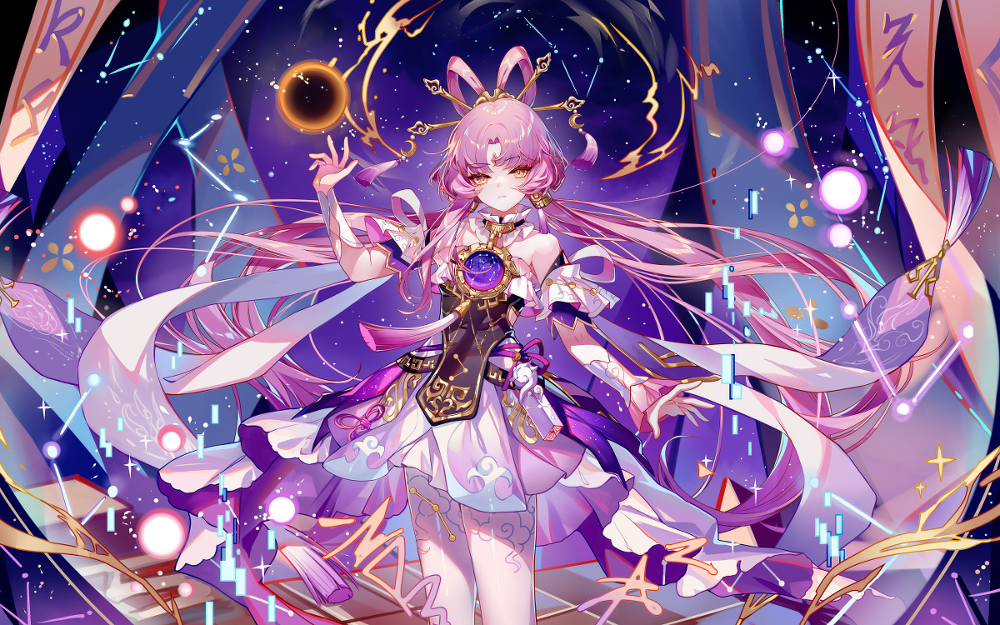
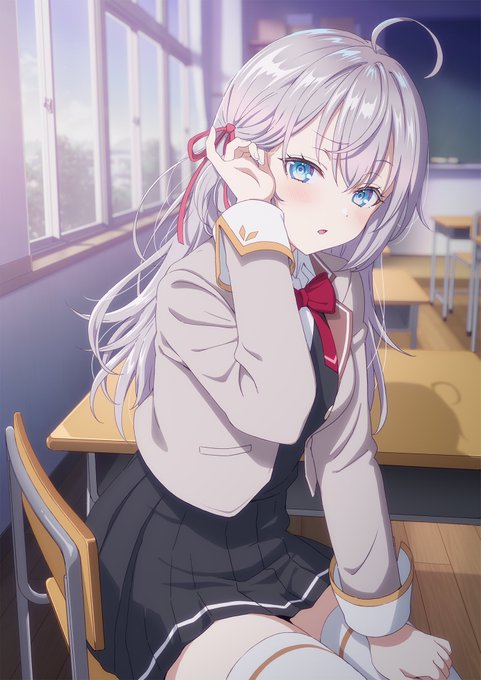

# 第一篇文章

## 介绍
我已出仓，感觉良好。  
刚看啥也不是，点开一看更是啥也不是  
在第一篇文章里面做一些尝试  

## 引用

>我曾经爱过你，爱情，也许；  
>在我的心灵里还没有完全消亡；  
>但愿它不会再打扰你；  
>我也不想再使你难过悲伤；  
>我曾经默默无语，毫无指望地爱过你；  
>我既忍受着羞怯，又忍受着嫉妒的折磨；  
>我曾经那样真诚，那样温柔地爱过你；  
>但愿上帝保佑你，它会比我更爱你。  
>                             ---普希金  
  
  
  
  
莫言在《晚熟的人》里这样写道：  
“烟火人间，各有遗憾。  
想过安稳日子的女人，却嫁给了挣不来qian的男人；  
想过安稳日子的男人，却娶了爱败家的女人；  
做得一手好菜的女人，等不到回家吃饭的男人；  
经常回家吃饭的男人，偏偏娶了不会做饭的女人。  
山山而川，不过尔尔。在喜欢你的人那里去热爱生活，在不喜欢你的人那里去看清世界，就这么简单。”  
  
活着活着你就会明白，这个世界是守恒的。  
很多婚姻好的人，事业不行；  
事业好的人，婚姻不行；  
事业婚姻都好的人，可能身体不好。  
大部分有成就的人，大多是六亲无靠，六亲无靠大概就是他们用来交换成功的代价，所以对于很多事不必太执着。  
枕边人成不了心上人，心上人也成不了枕边人。枕边人给不了爱，心上人给不了家；  
最终，枕边人守着过了一辈子，心上人待在心里一辈子。  
我们本不善言辞，为了生活，却不得不忙于交际；  
我们本喜欢独处，为了生活，却不得不四处奔波。  
在无人问津的地方，拿尊严换qian；  
在人声鼎沸的地方，拿qian换取尊严。  
有工作的地方没有家，有家的地方没有工作。  
他乡容不下灵魂，故乡安不了肉身。  
上苍不会让所有幸福集中到某个人身上。  
得到了爱情未必拥有金qian，拥有金qian未必得到快乐；  
得到快乐未必拥有健康，拥有健康未必一切都会如愿以偿。  
你得到了这个，还想要那个，但不可能所有的好处你都能得到。你不可能同时拥有春花和秋月，也不可能同时拥有硕果和繁花。  
人生最忌讳的就是过于圆满，不信你看看身边的人。  
有人婚姻不好，但子女很优秀；  
有人婚姻很好，但身体不太好；  
有人事业很顺，但家庭不和睦；  
有人家庭和睦，日子却过得很清贫。  
人生哪能都如意，万事只能半称心。美满的婚姻是由瞎子女人和聋子男人缔成，我们都是和对方的优点谈恋爱，却和他们的缺点生活在一起，天下没有十全十美的男女。婚姻不是争输赢，半睁眼半闭眼过生活，少用放大镜看对方，否则连上帝身上都能挑出毛病。  
时光煮雨，岁月缝花。这烟火人间，事事遗憾，但事事也值得！  

## 图片
 

## 注意
+++       ---
+++   和  --- 是两种语法