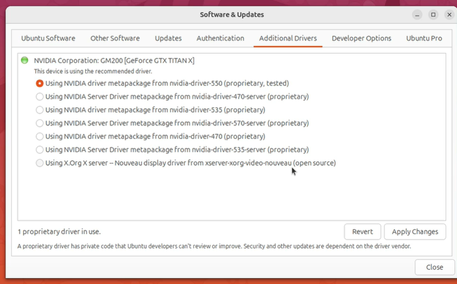
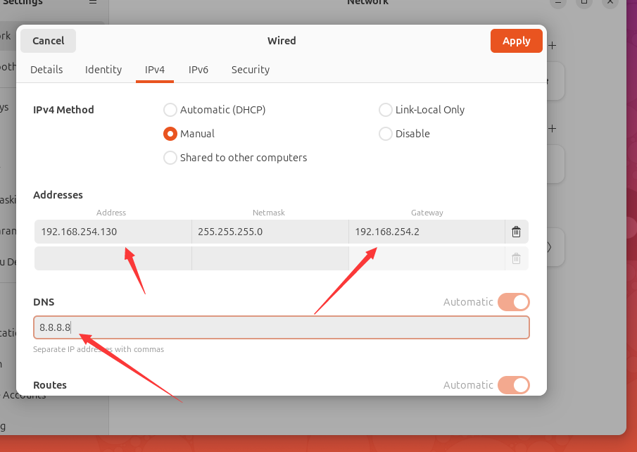

创建虚拟机：unbuntu 24.04.3

新建虚拟机 `自定义，典型` 都可以

自定义 --> 稍后安装操作系统 --> 系统加版本 

 -->  名称加位置 --> 磁盘大小（直接创建一个磁盘会限制虚拟机总大小，最好选择拆分多个文件）内存小于自己电脑内存，满足使用即可，网络选择`NAT`即可


然后启动,安装桌面版

1.尽量英文环境，中文环境可能会有bug

2.一些组件

3.>不连接互联网，减少联网更新组件，后续需要升级自己用升级程序升级

4.更新，>不更新

5.>交互式安装和自动安装

6.软件包，defalut 基础包 ，extended 拓展包

7.专有软件

8.磁盘的分区使用


9.设置用户名，计算机的名字，密码


10.时区

11.总结


第一次启动之后的快速配置

skip for now  --> not share   而后finish

完成操作系统安装


**实现虚拟机与宿主机之间文本内容，文件的快速复制和粘贴**

两个组件，开源实现

```
sudo apt install pen-vm-tools
sudo apt install pen-vm-tools-desktop 
```

命令行输入 `sudo apt install pen-vm-tools-desktop `


VM中 --> 虚拟机 --> 安装vmtools 也可以实现


**优化系统设置**

1.更新系统，选择镜像

sofaware&updates 软件与更新

download中可以测试最快的源，增加下载速度

`sudo apt update && sudo apt upgrade -y`

检查更新并安装最新的软件包

2.正确的驱动，选择了显卡驱动的会自动安装，额外驱动程序



3.安装必备app

应用中心

```
sudo apt install vlc gimp gparted synaptic
安装vlc媒体播放器

chrome 中心下载，然后包处运行
sudo dpkg -i ...
```

4.preload 提升应用启动速度（不能从app里安装）

5.个性化仪表板（dash），自定义删除，添加，排列。键盘可以快捷启动应用

6.系统备份，timeshift, 创建系统快照。

`sudo apt install timeshift`

7.切换主题，暗色主题

settings --> appearance

8.优化dns提升网络速度，配置谷歌dns提升网络访问速度(8.8.8.8, 8.8.4.4)




9.优化火狐浏览器性能：在 about:config 中启用硬件加速和渲染优化

10.Ubuntu Restricted Extras编解码支持

`sudo apt install ubuntu-restricted-extras`

11.夜间模式  settings ->display -> night light 影响色温

12.安装 GNOME Tweaks：安装系统调整工具，注意避免修改光标主题。

`gnone-browser-connector`

13.图标包主题，个性化桌面

14.自定义桌面搜索功能

15.个性化设置，图标大小等

16.分数缩放，显示设置
