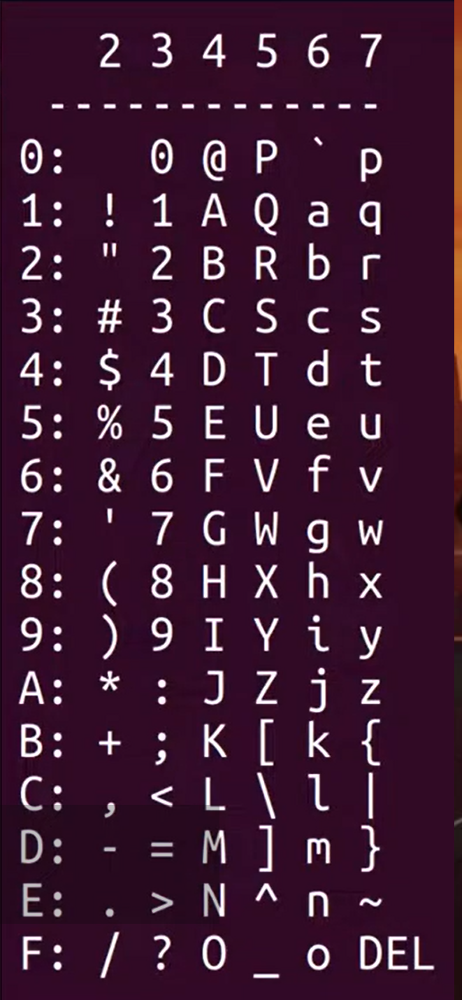

汇编语言中的数据

Binary 二进制

二进制构建的逻辑门简单易懂，便于组合

每个十进制位可以表示3.2个二进制位，8进制表示三个，16进制表示四个

通常用十六进制来表示数便于人类阅读

ASCII UTF-8

上面表示十六进制的第一个进制位数，左边表示第二个进制位数

大写字母通常是 `0x40 + 一些数字`，小写字母是 `0x60 +` , 数字是 `0x30 + `

UTF-8 非常重要，来源于ASCII，可以表示多国语言，表情符号