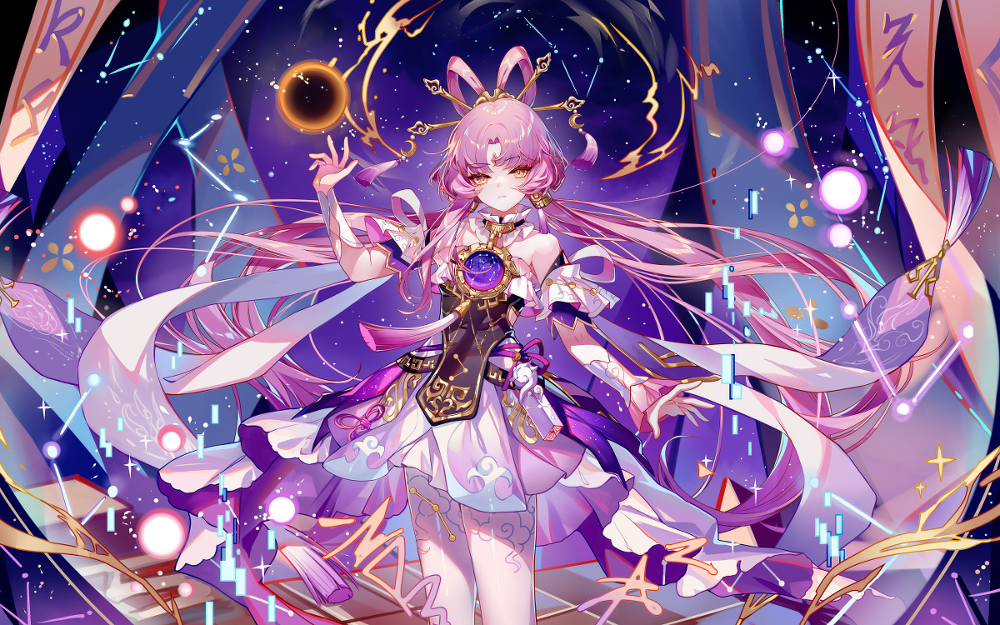

# 第一篇文章

## 介绍
我已出仓，感觉良好。  
刚看啥也不是，点开一看更是啥也不是  
在第一篇文章里面做一些尝试  

## 引用

>我曾经爱过你，爱情，也许；  
>在我的心灵里还没有完全消亡；  
>但愿它不会再打扰你；  
>我也不想再使你难过悲伤；  
>我曾经默默无语，毫无指望地爱过你；  
>我既忍受着羞怯，又忍受着嫉妒的折磨；  
>我曾经那样真诚，那样温柔地爱过你；  
>但愿上帝保佑你，它会比我更爱你。  
>                             ---普希金  

## 图片
 

## 注意
+++       ---
+++   和  --- 是两种语法