# 第一周学习总结（未完）
首先是在ctfplus做的题  
做了一部分misc和一部分re的题  
先说re  
有两道sign题  
sign1 在ida中反编译在代码中直接能看到flag  
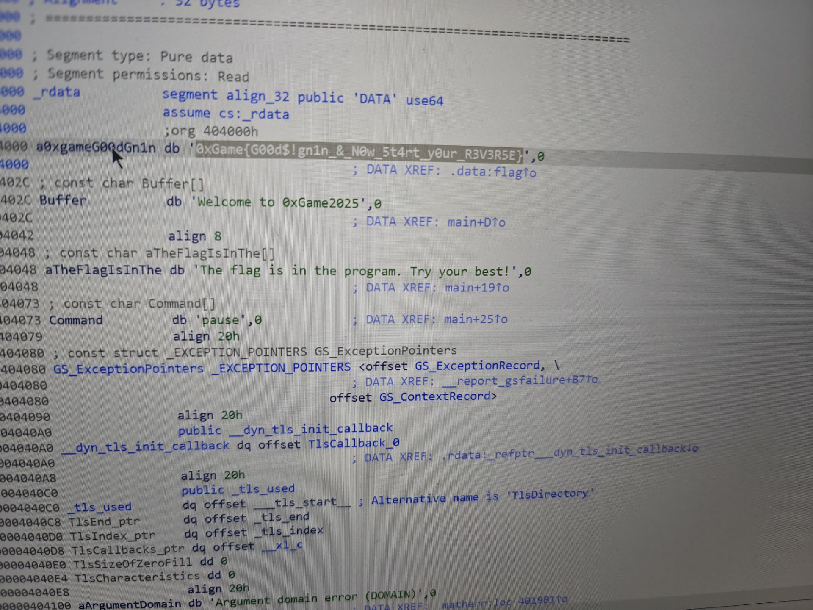  
sign2 根据运行提示和代码分析，flag应该是通过ROT47方式加密的  
ROT47：凯撒加密变种，通过映射ASCII 字符集进行移位加密。可以将数字，字母，符号全部混合互换  
加密解密算法完全相同  
此题已知flag开头为"0xGame",将问题喂给ai，通过python代码暴力破解可以得到答案  
不过此题中还进行了一个变换  
其中decrypt是一个解密函数，并不是常规rot47解密，此题是一个rot47的变种  
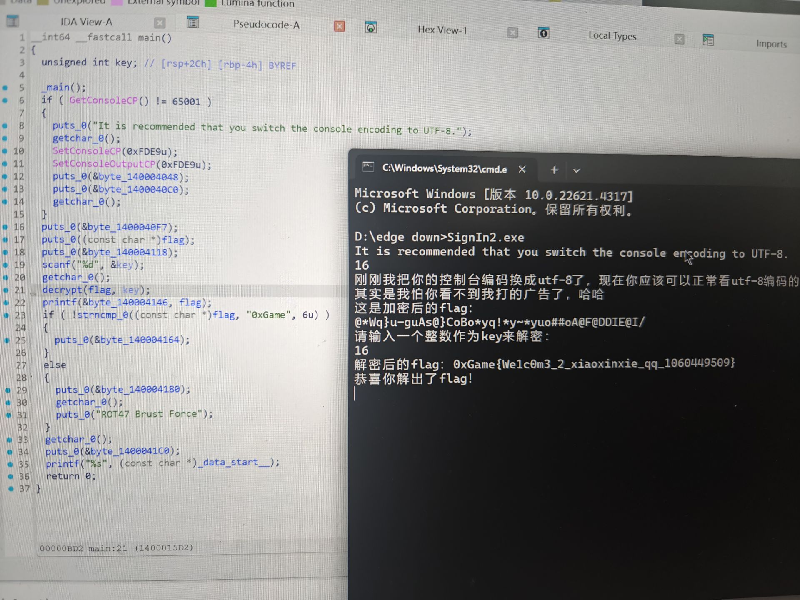  
  
一道BaseUPX的题  
用软件检查exe发现是UPX壳，然后脱壳之后再查看反编译代码  
根据代码中base64_encode的提示，找到base64的编码，再利用ai解码  
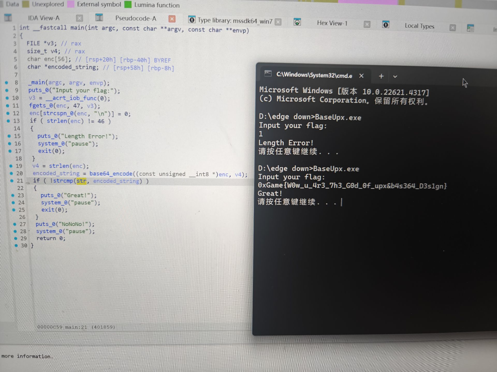
  
一道睡觉zzz的题  
此题的核心是sha-256，ASCII字符，长度验证，%8x格式说明符  
根据代码提示，format error和wrong的区别，先检查格式问题，再排查其他  
然后是sscanf(s1, "0xGame{%8x%8x%8x%8x}", &x1, &x2, &x3, &x4)这一段说明是4个8位十六进制数  
SHA=256哈希无法反推出原始数据  
最后就是编写代码使得4个十六进制数满足代码中所给出的方程，导入ai可得  
但本题还有一个问题，已在程序中获得正确提示的答案提交不对  
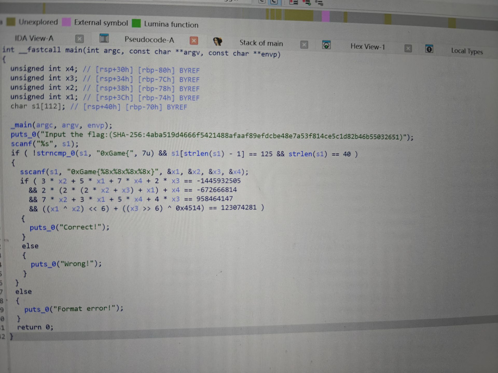 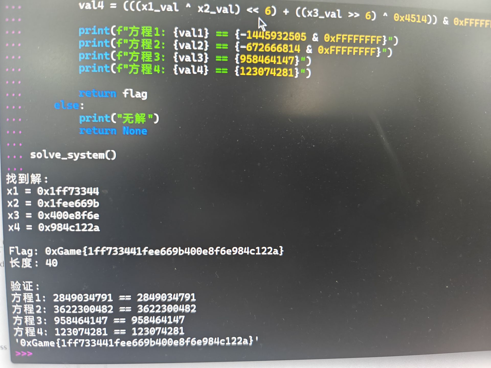  
  
一道简单异或题  
找到str函数对应代码，导入ai进行编译可得  
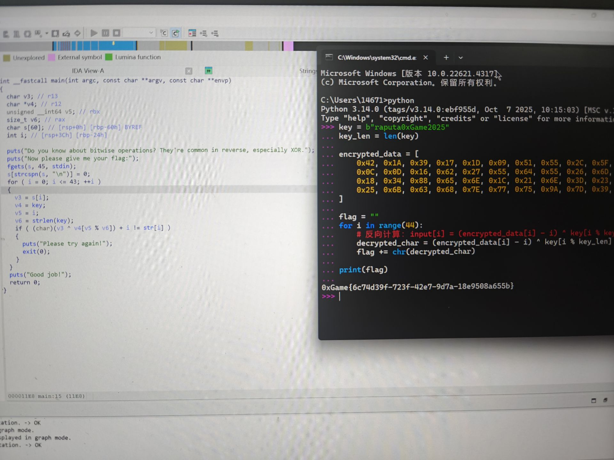  
  
一道dydebug复杂加密问题，四种加密方式，也是利用ai解出，具体图片未保存  
  
然后是misc方向的题目  
一道base64编码和凯撒加密的题目  
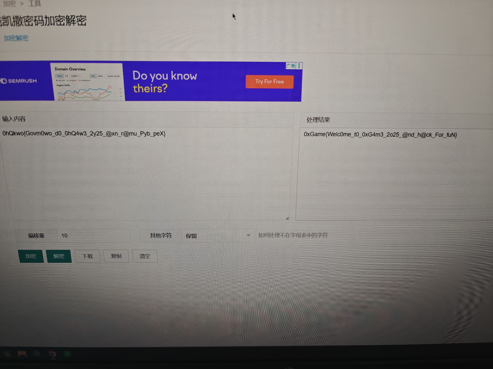  

一道图片lsb隐写题，利用stegsolve看RGB编码解出  
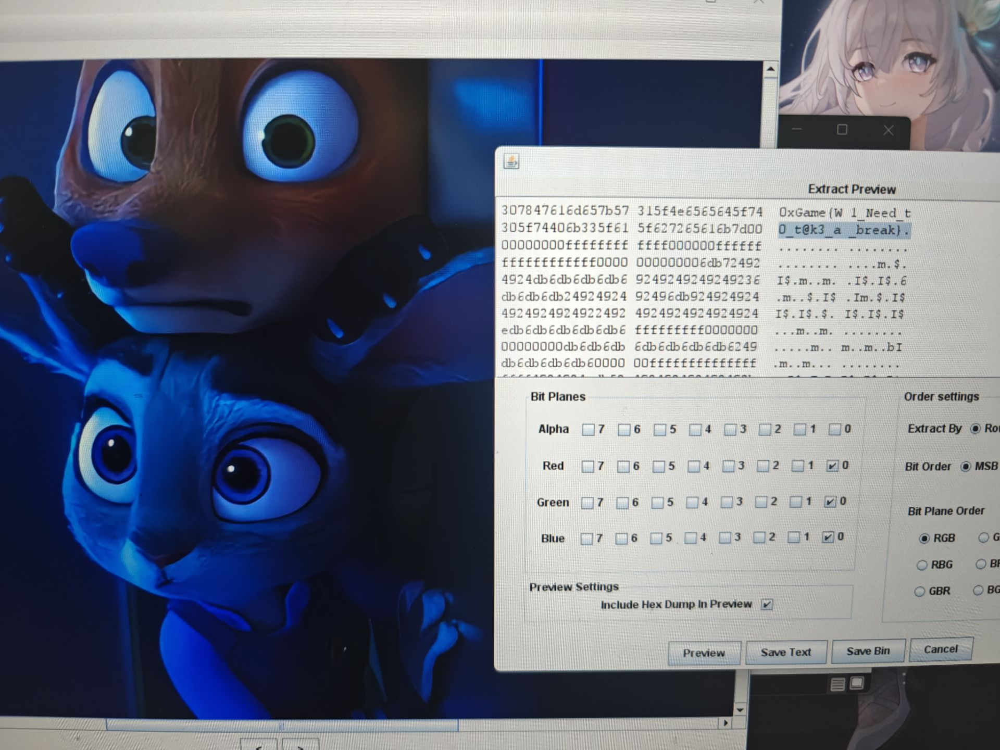  
  
最后一道是docx，利用010查询编码发现是504b0304，改格式解压得出  
  
  

接着是学习的linux基本命令，询问ai之后在系统中试过抄写命令  
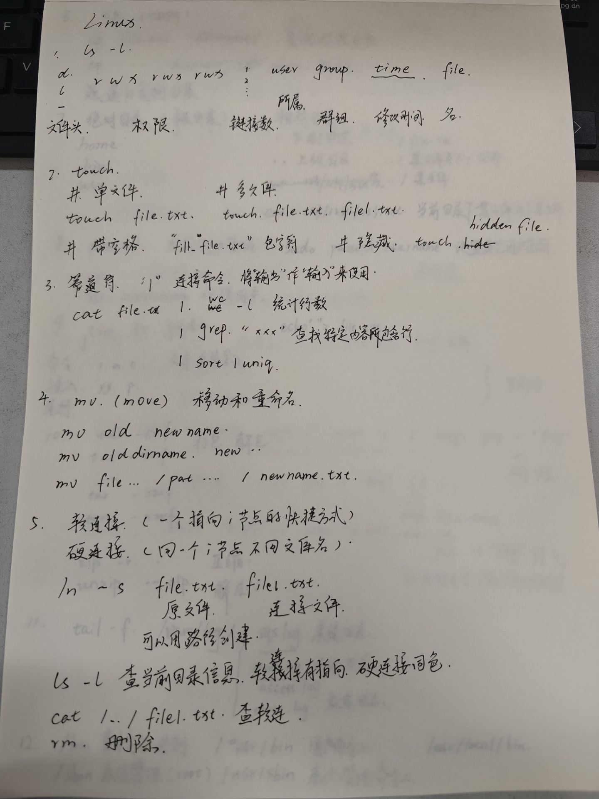  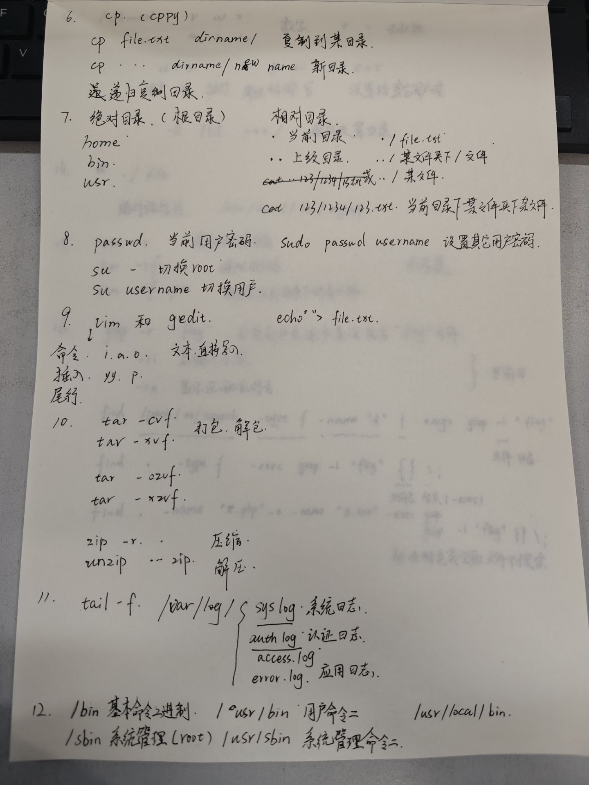  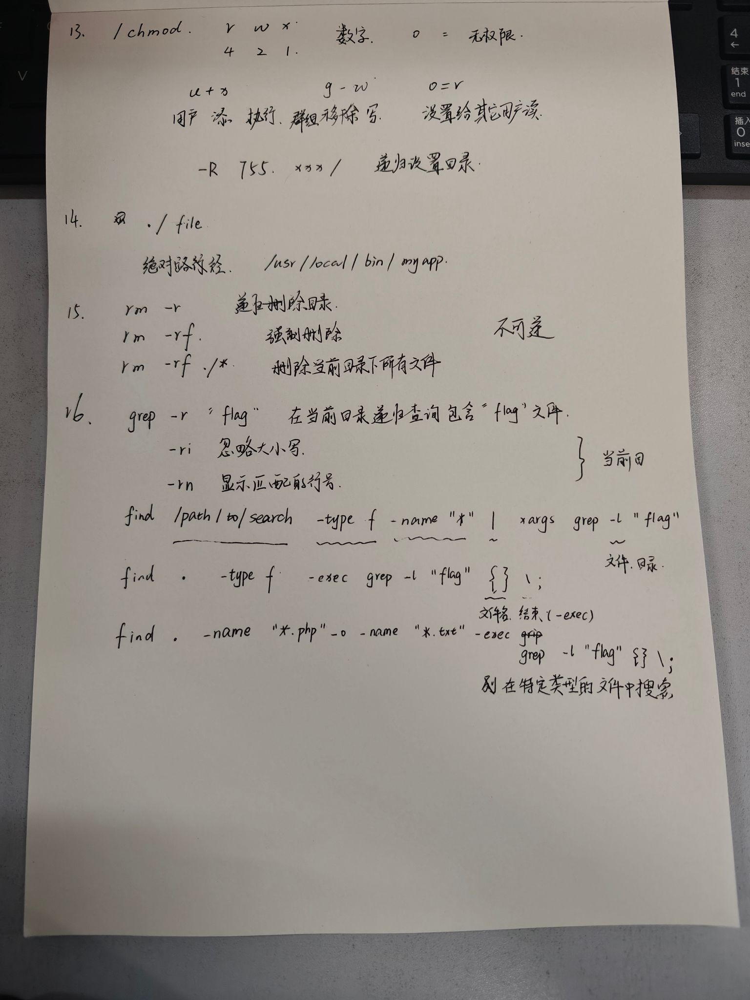  

